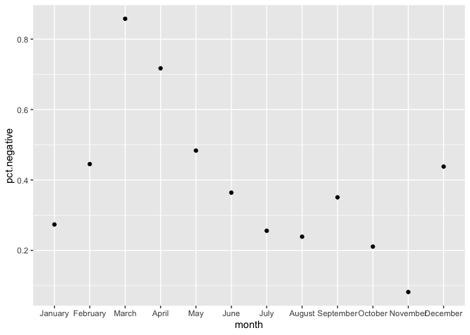
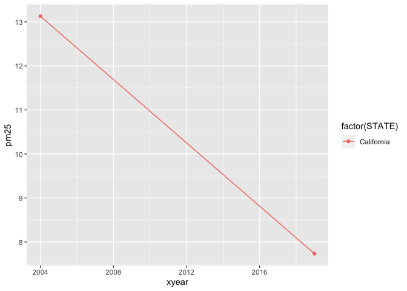
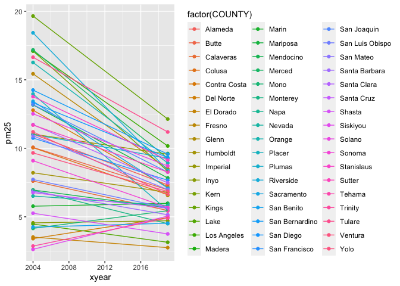
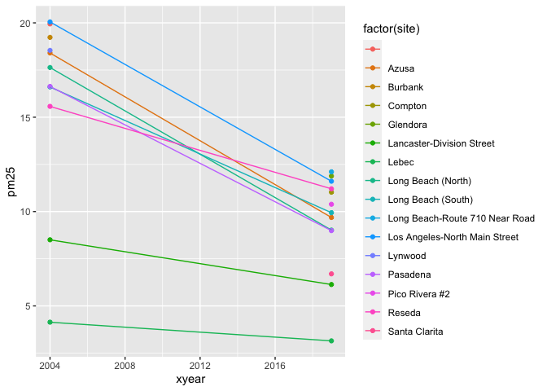

HW1
================

## step1: Conduct EDA chechlist

### 1.Question: Whether daily concentration of PM2.5 have decreased in California over the past 15 years?

### 2. Read in the data

``` r
library(data.table)
data_2004 <- data.table::fread("/Users/websterj/Desktop/2004.csv")
data_2019 <- data.table::fread("/Users/websterj/Desktop/2019.csv")
```

### 3.Check the data

``` r
#check the dimension of the dataset
dim(data_2004)
```

    ## [1] 19233    20

``` r
nrow(data_2004)
```

    ## [1] 19233

``` r
ncol(data_2004)
```

    ## [1] 20

``` r
dim(data_2019)
```

    ## [1] 53086    20

``` r
nrow(data_2019)
```

    ## [1] 53086

``` r
ncol(data_2019)
```

    ## [1] 20

``` r
# Check the head and bottom of the dataset
head(data_2004)
```

    ##          Date Source  Site ID POC Daily Mean PM2.5 Concentration    UNITS
    ## 1: 01/01/2004    AQS 60010007   1                           11.0 ug/m3 LC
    ## 2: 01/02/2004    AQS 60010007   1                           12.2 ug/m3 LC
    ## 3: 01/03/2004    AQS 60010007   1                           16.5 ug/m3 LC
    ## 4: 01/04/2004    AQS 60010007   1                           18.1 ug/m3 LC
    ## 5: 01/05/2004    AQS 60010007   1                           11.5 ug/m3 LC
    ## 6: 01/06/2004    AQS 60010007   1                           32.5 ug/m3 LC
    ##    DAILY_AQI_VALUE Site Name DAILY_OBS_COUNT PERCENT_COMPLETE
    ## 1:              46 Livermore               1              100
    ## 2:              51 Livermore               1              100
    ## 3:              60 Livermore               1              100
    ## 4:              64 Livermore               1              100
    ## 5:              48 Livermore               1              100
    ## 6:              94 Livermore               1              100
    ##    AQS_PARAMETER_CODE                     AQS_PARAMETER_DESC CBSA_CODE
    ## 1:              88502 Acceptable PM2.5 AQI & Speciation Mass     41860
    ## 2:              88502 Acceptable PM2.5 AQI & Speciation Mass     41860
    ## 3:              88502 Acceptable PM2.5 AQI & Speciation Mass     41860
    ## 4:              88101               PM2.5 - Local Conditions     41860
    ## 5:              88502 Acceptable PM2.5 AQI & Speciation Mass     41860
    ## 6:              88502 Acceptable PM2.5 AQI & Speciation Mass     41860
    ##                            CBSA_NAME STATE_CODE      STATE COUNTY_CODE  COUNTY
    ## 1: San Francisco-Oakland-Hayward, CA          6 California           1 Alameda
    ## 2: San Francisco-Oakland-Hayward, CA          6 California           1 Alameda
    ## 3: San Francisco-Oakland-Hayward, CA          6 California           1 Alameda
    ## 4: San Francisco-Oakland-Hayward, CA          6 California           1 Alameda
    ## 5: San Francisco-Oakland-Hayward, CA          6 California           1 Alameda
    ## 6: San Francisco-Oakland-Hayward, CA          6 California           1 Alameda
    ##    SITE_LATITUDE SITE_LONGITUDE
    ## 1:      37.68753      -121.7842
    ## 2:      37.68753      -121.7842
    ## 3:      37.68753      -121.7842
    ## 4:      37.68753      -121.7842
    ## 5:      37.68753      -121.7842
    ## 6:      37.68753      -121.7842

``` r
tail(data_2004)
```

    ##          Date Source  Site ID POC Daily Mean PM2.5 Concentration    UNITS
    ## 1: 12/14/2004    AQS 61131003   1                             11 ug/m3 LC
    ## 2: 12/17/2004    AQS 61131003   1                             16 ug/m3 LC
    ## 3: 12/20/2004    AQS 61131003   1                             17 ug/m3 LC
    ## 4: 12/23/2004    AQS 61131003   1                              9 ug/m3 LC
    ## 5: 12/26/2004    AQS 61131003   1                             24 ug/m3 LC
    ## 6: 12/29/2004    AQS 61131003   1                              9 ug/m3 LC
    ##    DAILY_AQI_VALUE            Site Name DAILY_OBS_COUNT PERCENT_COMPLETE
    ## 1:              46 Woodland-Gibson Road               1              100
    ## 2:              59 Woodland-Gibson Road               1              100
    ## 3:              61 Woodland-Gibson Road               1              100
    ## 4:              38 Woodland-Gibson Road               1              100
    ## 5:              76 Woodland-Gibson Road               1              100
    ## 6:              38 Woodland-Gibson Road               1              100
    ##    AQS_PARAMETER_CODE       AQS_PARAMETER_DESC CBSA_CODE
    ## 1:              88101 PM2.5 - Local Conditions     40900
    ## 2:              88101 PM2.5 - Local Conditions     40900
    ## 3:              88101 PM2.5 - Local Conditions     40900
    ## 4:              88101 PM2.5 - Local Conditions     40900
    ## 5:              88101 PM2.5 - Local Conditions     40900
    ## 6:              88101 PM2.5 - Local Conditions     40900
    ##                                  CBSA_NAME STATE_CODE      STATE COUNTY_CODE
    ## 1: Sacramento--Roseville--Arden-Arcade, CA          6 California         113
    ## 2: Sacramento--Roseville--Arden-Arcade, CA          6 California         113
    ## 3: Sacramento--Roseville--Arden-Arcade, CA          6 California         113
    ## 4: Sacramento--Roseville--Arden-Arcade, CA          6 California         113
    ## 5: Sacramento--Roseville--Arden-Arcade, CA          6 California         113
    ## 6: Sacramento--Roseville--Arden-Arcade, CA          6 California         113
    ##    COUNTY SITE_LATITUDE SITE_LONGITUDE
    ## 1:   Yolo      38.66121      -121.7327
    ## 2:   Yolo      38.66121      -121.7327
    ## 3:   Yolo      38.66121      -121.7327
    ## 4:   Yolo      38.66121      -121.7327
    ## 5:   Yolo      38.66121      -121.7327
    ## 6:   Yolo      38.66121      -121.7327

``` r
head(data_2019)
```

    ##        Date Source  Site ID POC Daily Mean PM2.5 Concentration    UNITS
    ## 1: 1/1/2019    AQS 60010007   3                            5.7 ug/m3 LC
    ## 2: 1/2/2019    AQS 60010007   3                           11.9 ug/m3 LC
    ## 3: 1/3/2019    AQS 60010007   3                           20.1 ug/m3 LC
    ## 4: 1/4/2019    AQS 60010007   3                           28.8 ug/m3 LC
    ## 5: 1/5/2019    AQS 60010007   3                           11.2 ug/m3 LC
    ## 6: 1/6/2019    AQS 60010007   3                            2.7 ug/m3 LC
    ##    DAILY_AQI_VALUE Site Name DAILY_OBS_COUNT PERCENT_COMPLETE
    ## 1:              24 Livermore               1              100
    ## 2:              50 Livermore               1              100
    ## 3:              68 Livermore               1              100
    ## 4:              86 Livermore               1              100
    ## 5:              47 Livermore               1              100
    ## 6:              11 Livermore               1              100
    ##    AQS_PARAMETER_CODE       AQS_PARAMETER_DESC CBSA_CODE
    ## 1:              88101 PM2.5 - Local Conditions     41860
    ## 2:              88101 PM2.5 - Local Conditions     41860
    ## 3:              88101 PM2.5 - Local Conditions     41860
    ## 4:              88101 PM2.5 - Local Conditions     41860
    ## 5:              88101 PM2.5 - Local Conditions     41860
    ## 6:              88101 PM2.5 - Local Conditions     41860
    ##                            CBSA_NAME STATE_CODE      STATE COUNTY_CODE  COUNTY
    ## 1: San Francisco-Oakland-Hayward, CA          6 California           1 Alameda
    ## 2: San Francisco-Oakland-Hayward, CA          6 California           1 Alameda
    ## 3: San Francisco-Oakland-Hayward, CA          6 California           1 Alameda
    ## 4: San Francisco-Oakland-Hayward, CA          6 California           1 Alameda
    ## 5: San Francisco-Oakland-Hayward, CA          6 California           1 Alameda
    ## 6: San Francisco-Oakland-Hayward, CA          6 California           1 Alameda
    ##    SITE_LATITUDE SITE_LONGITUDE
    ## 1:      37.68753      -121.7842
    ## 2:      37.68753      -121.7842
    ## 3:      37.68753      -121.7842
    ## 4:      37.68753      -121.7842
    ## 5:      37.68753      -121.7842
    ## 6:      37.68753      -121.7842

``` r
tail(data_2019)
```

    ##          Date Source  Site ID POC Daily Mean PM2.5 Concentration    UNITS
    ## 1: 11/11/2019    AQS 61131003   1                           13.5 ug/m3 LC
    ## 2: 11/17/2019    AQS 61131003   1                           18.1 ug/m3 LC
    ## 3: 11/29/2019    AQS 61131003   1                           12.5 ug/m3 LC
    ## 4: 12/17/2019    AQS 61131003   1                           23.8 ug/m3 LC
    ## 5: 12/23/2019    AQS 61131003   1                            1.0 ug/m3 LC
    ## 6: 12/29/2019    AQS 61131003   1                            9.1 ug/m3 LC
    ##    DAILY_AQI_VALUE            Site Name DAILY_OBS_COUNT PERCENT_COMPLETE
    ## 1:              54 Woodland-Gibson Road               1              100
    ## 2:              64 Woodland-Gibson Road               1              100
    ## 3:              52 Woodland-Gibson Road               1              100
    ## 4:              76 Woodland-Gibson Road               1              100
    ## 5:               4 Woodland-Gibson Road               1              100
    ## 6:              38 Woodland-Gibson Road               1              100
    ##    AQS_PARAMETER_CODE       AQS_PARAMETER_DESC CBSA_CODE
    ## 1:              88101 PM2.5 - Local Conditions     40900
    ## 2:              88101 PM2.5 - Local Conditions     40900
    ## 3:              88101 PM2.5 - Local Conditions     40900
    ## 4:              88101 PM2.5 - Local Conditions     40900
    ## 5:              88101 PM2.5 - Local Conditions     40900
    ## 6:              88101 PM2.5 - Local Conditions     40900
    ##                                  CBSA_NAME STATE_CODE      STATE COUNTY_CODE
    ## 1: Sacramento--Roseville--Arden-Arcade, CA          6 California         113
    ## 2: Sacramento--Roseville--Arden-Arcade, CA          6 California         113
    ## 3: Sacramento--Roseville--Arden-Arcade, CA          6 California         113
    ## 4: Sacramento--Roseville--Arden-Arcade, CA          6 California         113
    ## 5: Sacramento--Roseville--Arden-Arcade, CA          6 California         113
    ## 6: Sacramento--Roseville--Arden-Arcade, CA          6 California         113
    ##    COUNTY SITE_LATITUDE SITE_LONGITUDE
    ## 1:   Yolo      38.66121      -121.7327
    ## 2:   Yolo      38.66121      -121.7327
    ## 3:   Yolo      38.66121      -121.7327
    ## 4:   Yolo      38.66121      -121.7327
    ## 5:   Yolo      38.66121      -121.7327
    ## 6:   Yolo      38.66121      -121.7327

``` r
# To know the contents of data
str(data_2004)
```

    ## Classes 'data.table' and 'data.frame':   19233 obs. of  20 variables:
    ##  $ Date                          : chr  "01/01/2004" "01/02/2004" "01/03/2004" "01/04/2004" ...
    ##  $ Source                        : chr  "AQS" "AQS" "AQS" "AQS" ...
    ##  $ Site ID                       : int  60010007 60010007 60010007 60010007 60010007 60010007 60010007 60010007 60010007 60010007 ...
    ##  $ POC                           : int  1 1 1 1 1 1 1 1 1 1 ...
    ##  $ Daily Mean PM2.5 Concentration: num  11 12.2 16.5 18.1 11.5 32.5 14 29.9 21 15.7 ...
    ##  $ UNITS                         : chr  "ug/m3 LC" "ug/m3 LC" "ug/m3 LC" "ug/m3 LC" ...
    ##  $ DAILY_AQI_VALUE               : int  46 51 60 64 48 94 55 88 70 59 ...
    ##  $ Site Name                     : chr  "Livermore" "Livermore" "Livermore" "Livermore" ...
    ##  $ DAILY_OBS_COUNT               : int  1 1 1 1 1 1 1 1 1 1 ...
    ##  $ PERCENT_COMPLETE              : num  100 100 100 100 100 100 100 100 100 100 ...
    ##  $ AQS_PARAMETER_CODE            : int  88502 88502 88502 88101 88502 88502 88101 88502 88502 88101 ...
    ##  $ AQS_PARAMETER_DESC            : chr  "Acceptable PM2.5 AQI & Speciation Mass" "Acceptable PM2.5 AQI & Speciation Mass" "Acceptable PM2.5 AQI & Speciation Mass" "PM2.5 - Local Conditions" ...
    ##  $ CBSA_CODE                     : int  41860 41860 41860 41860 41860 41860 41860 41860 41860 41860 ...
    ##  $ CBSA_NAME                     : chr  "San Francisco-Oakland-Hayward, CA" "San Francisco-Oakland-Hayward, CA" "San Francisco-Oakland-Hayward, CA" "San Francisco-Oakland-Hayward, CA" ...
    ##  $ STATE_CODE                    : int  6 6 6 6 6 6 6 6 6 6 ...
    ##  $ STATE                         : chr  "California" "California" "California" "California" ...
    ##  $ COUNTY_CODE                   : int  1 1 1 1 1 1 1 1 1 1 ...
    ##  $ COUNTY                        : chr  "Alameda" "Alameda" "Alameda" "Alameda" ...
    ##  $ SITE_LATITUDE                 : num  37.7 37.7 37.7 37.7 37.7 ...
    ##  $ SITE_LONGITUDE                : num  -122 -122 -122 -122 -122 ...
    ##  - attr(*, ".internal.selfref")=<externalptr>

``` r
str(data_2019)
```

    ## Classes 'data.table' and 'data.frame':   53086 obs. of  20 variables:
    ##  $ Date                          : chr  "1/1/2019" "1/2/2019" "1/3/2019" "1/4/2019" ...
    ##  $ Source                        : chr  "AQS" "AQS" "AQS" "AQS" ...
    ##  $ Site ID                       : int  60010007 60010007 60010007 60010007 60010007 60010007 60010007 60010007 60010007 60010007 ...
    ##  $ POC                           : int  3 3 3 3 3 3 3 3 3 3 ...
    ##  $ Daily Mean PM2.5 Concentration: num  5.7 11.9 20.1 28.8 11.2 2.7 2.8 7 3.1 7.1 ...
    ##  $ UNITS                         : chr  "ug/m3 LC" "ug/m3 LC" "ug/m3 LC" "ug/m3 LC" ...
    ##  $ DAILY_AQI_VALUE               : int  24 50 68 86 47 11 12 29 13 30 ...
    ##  $ Site Name                     : chr  "Livermore" "Livermore" "Livermore" "Livermore" ...
    ##  $ DAILY_OBS_COUNT               : int  1 1 1 1 1 1 1 1 1 1 ...
    ##  $ PERCENT_COMPLETE              : int  100 100 100 100 100 100 100 100 100 100 ...
    ##  $ AQS_PARAMETER_CODE            : int  88101 88101 88101 88101 88101 88101 88101 88101 88101 88101 ...
    ##  $ AQS_PARAMETER_DESC            : chr  "PM2.5 - Local Conditions" "PM2.5 - Local Conditions" "PM2.5 - Local Conditions" "PM2.5 - Local Conditions" ...
    ##  $ CBSA_CODE                     : int  41860 41860 41860 41860 41860 41860 41860 41860 41860 41860 ...
    ##  $ CBSA_NAME                     : chr  "San Francisco-Oakland-Hayward, CA" "San Francisco-Oakland-Hayward, CA" "San Francisco-Oakland-Hayward, CA" "San Francisco-Oakland-Hayward, CA" ...
    ##  $ STATE_CODE                    : int  6 6 6 6 6 6 6 6 6 6 ...
    ##  $ STATE                         : chr  "California" "California" "California" "California" ...
    ##  $ COUNTY_CODE                   : int  1 1 1 1 1 1 1 1 1 1 ...
    ##  $ COUNTY                        : chr  "Alameda" "Alameda" "Alameda" "Alameda" ...
    ##  $ SITE_LATITUDE                 : num  37.7 37.7 37.7 37.7 37.7 ...
    ##  $ SITE_LONGITUDE                : num  -122 -122 -122 -122 -122 ...
    ##  - attr(*, ".internal.selfref")=<externalptr>

``` r
# Check variables
# 2004 data
table(data_2004$`Daily Mean PM2.5 Concentration`)
```

    ## 
    ##  -0.1     0   0.1   0.2   0.3   0.4   0.5   0.6   0.7   0.8   0.9     1   1.1 
    ##     1    11    15    20    27    32    35    41    43    40    31    94    40 
    ##   1.2   1.3   1.4   1.5   1.6   1.7   1.8   1.9     2   2.1   2.2   2.3   2.4 
    ##    40    37    32    29    44    35    37    35   113    58    44    41    47 
    ##   2.5   2.6   2.7   2.8   2.9     3   3.1   3.2   3.3   3.4   3.5   3.6   3.7 
    ##    52    59    48    57    65   197    61    64    87    54    74    77    74 
    ##   3.8   3.9     4   4.1   4.2   4.3   4.4   4.5   4.6   4.7   4.8   4.9     5 
    ##    70    63   364    70    75    73    80    92    64    76    88    80   430 
    ##   5.1   5.2   5.3   5.4   5.5   5.6   5.7   5.8   5.9     6   6.1   6.2   6.3 
    ##    82    93    97    84    98    74    93    87   105   431    86    91    97 
    ##   6.4   6.5   6.6   6.7   6.8   6.9     7   7.1   7.2   7.3   7.4   7.5   7.6 
    ##    88   104    67    94    81    88   410    89   100    85    89   104    67 
    ##   7.7   7.8   7.9     8   8.1   8.2   8.3   8.4   8.5   8.6   8.7   8.8   8.9 
    ##   121   103    83   401    73   116    90    98   109    84    97    93    90 
    ##     9   9.1   9.2   9.3   9.4   9.5   9.6   9.7   9.8   9.9    10  10.1  10.2 
    ##   360    80   108    80    84    98    68   106    89    75   275    99    99 
    ##  10.3  10.4  10.5  10.6  10.7  10.8  10.9    11  11.1  11.2  11.3  11.4  11.5 
    ##    85    68   108    77    97    86    91   269    67    91    94    71    84 
    ##  11.6  11.7  11.8  11.9    12  12.1  12.2  12.3  12.4  12.5  12.6  12.7  12.8 
    ##    74    75    72    59   227    76    72    71    77    75    79    66    71 
    ##  12.9    13  13.1  13.2  13.3  13.4  13.5  13.6  13.7  13.8  13.9    14  14.1 
    ##    56   168    66    75    63    54    71    64    58    60    47   137    64 
    ##  14.2  14.3  14.4  14.5  14.6  14.7  14.8  14.9    15  15.1  15.2  15.3  15.4 
    ##    63    56    54    46    52    70    50    57   133    52    61    57    50 
    ##  15.5  15.6  15.7  15.8  15.9    16  16.1  16.2  16.3  16.4  16.5  16.6  16.7 
    ##    53    47    50    44    53   126    37    49    51    50    50    41    40 
    ##  16.8  16.9    17  17.1  17.2  17.3  17.4  17.5  17.6  17.7  17.8  17.9    18 
    ##    47    31    95    37    37    31    47    41    34    39    39    26    86 
    ##  18.1  18.2  18.3  18.4  18.5  18.6  18.7  18.8  18.9    19  19.1  19.2  19.3 
    ##    36    38    24    15    35    43    32    22    28    69    29    18    30 
    ##  19.4  19.5  19.6  19.7  19.8  19.9    20  20.1  20.2  20.3  20.4  20.5  20.6 
    ##    20    43    39    20    18    29    84    26    29    29    20    26    25 
    ##  20.7  20.8  20.9    21  21.1  21.2  21.3  21.4  21.5  21.6  21.7  21.8  21.9 
    ##    24    20    19    65    22    16    16    15    22    18    19    15    11 
    ##    22  22.1  22.2  22.3  22.4  22.5  22.6  22.7  22.8  22.9    23  23.1  23.2 
    ##    39    27    16    18    15    22    18    20    18    15    57    22    13 
    ##  23.3  23.4  23.5  23.6  23.7  23.8  23.9    24  24.1  24.2  24.3  24.4  24.5 
    ##    22    19    15    17    17    20    12    47    18    20    14     6    17 
    ##  24.6  24.7  24.8  24.9    25  25.1  25.2  25.3  25.4  25.5  25.6  25.7  25.8 
    ##    14    14    12    14    54    17    13    14    12    15    12    18     7 
    ##  25.9    26  26.1  26.2  26.3  26.4  26.5  26.6  26.7  26.8  26.9    27  27.1 
    ##    12    50    16     8    14    12    13    16    10     9    11    43    14 
    ##  27.2  27.3  27.4  27.5  27.6  27.7  27.8  27.9    28  28.1  28.2  28.3  28.4 
    ##    24     8     3    14     7     6    11    10    37    21    20    15    10 
    ##  28.5  28.6  28.7  28.8  28.9    29  29.1  29.2  29.3  29.4  29.5  29.6  29.7 
    ##     9    11    10     7    17    30    12    10    12     6    15    20    12 
    ##  29.8  29.9    30  30.1  30.2  30.3  30.4  30.5  30.6  30.7  30.8  30.9    31 
    ##    12    10    38    14    15    12     9    12    11    12     9     5    28 
    ##  31.1  31.2  31.3  31.4  31.5  31.7  31.8  31.9    32  32.1  32.2  32.3  32.4 
    ##     6    15     4    10     8     8    16     9    26     7    13    12     9 
    ##  32.5  32.6  32.7  32.8  32.9    33  33.1  33.2  33.3  33.4  33.5  33.6  33.7 
    ##    10     8     8    10    10    31     4     4    10    12    12     6    12 
    ##  33.8  33.9    34  34.1  34.2  34.3  34.4  34.5  34.6  34.7  34.8  34.9    35 
    ##     7     4    36     3     7     3    11     7     7     4     5    10    23 
    ##  35.1  35.2  35.3  35.4  35.5  35.6  35.7  35.8  35.9    36  36.1  36.2  36.3 
    ##     7    14     6     5     8     6     4     3     2    23     6     9     3 
    ##  36.4  36.5  36.6  36.7  36.8  36.9    37  37.1  37.2  37.3  37.4  37.5  37.6 
    ##     5     9     6     8     7     4    19     5     5     8    10     4     5 
    ##  37.7  37.8  37.9    38  38.1  38.2  38.3  38.4  38.5  38.6  38.7  38.8  38.9 
    ##     4     7     3    24     4     8     4     7     8     4     6     5     3 
    ##    39  39.1  39.2  39.3  39.4  39.5  39.6  39.7  39.8  39.9    40  40.1  40.2 
    ##    16     7     7     3     6     3     6     6     4     4     7     9     6 
    ##  40.3  40.4  40.5  40.6  40.7  40.8  40.9    41  41.1  41.2  41.3  41.4  41.5 
    ##     4     8    11     1     3     8     3    12     5     7     5     2     9 
    ##  41.6  41.7  41.8  41.9    42  42.1  42.2  42.3  42.4  42.5  42.6  42.7  42.9 
    ##     3     5     4     5     9     5     6     6     5     4     5     5     7 
    ##    43  43.1  43.2  43.3  43.4  43.5  43.6  43.7  43.8  43.9    44  44.1  44.2 
    ##    12     5     6     6     6     3     2     5     1     2    12     4     3 
    ##  44.3  44.4  44.5  44.6  44.7  44.8  44.9    45  45.1  45.2  45.3  45.4  45.5 
    ##     4     2     2     6     4     3     6     6     1     1     1     4     4 
    ##  45.7  45.8  45.9    46  46.1  46.2  46.3  46.4  46.5  46.6  46.7  46.8  46.9 
    ##     7     4     3     3     3     2     1     3     7     1     4     1     5 
    ##    47  47.1  47.2  47.3  47.5  47.6  47.7  47.8  47.9    48  48.1  48.2  48.3 
    ##     7     2     5     2     2     3     3     4     2     3     1     2     2 
    ##  48.4  48.5  48.6  48.7  48.9    49  49.2  49.3  49.4  49.5  49.6  49.7  49.9 
    ##     1     3     1     4     2     5     1     3     5     1     2     5     1 
    ##    50  50.1  50.2  50.4  50.5  50.6  50.8  50.9    51  51.2  51.4  51.5  51.7 
    ##     4     4     1     2     1     3     1     2     5     4     1     3     2 
    ##  51.8  51.9    52  52.1  52.2  52.4  52.5  52.7  52.8  52.9    53  53.1  53.2 
    ##     1     1     4     2     1     2     3     1     1     3     5     1     2 
    ##  53.3  53.5  53.7  53.8  53.9    54  54.2  54.3  54.4  54.6  54.8  54.9    55 
    ##     1     1     1     3     1     2     2     2     1     2     2     1     3 
    ##  55.1  55.2  55.3  55.5  55.6  55.7  55.8    56  56.1  56.2  56.3  56.4  56.8 
    ##     1     1     1     2     1     1     3     1     1     2     1     3     1 
    ##    57  57.2  57.3  57.4  57.9  58.1  58.4  58.7  58.9  59.1  59.2  59.3  59.4 
    ##     4     1     3     1     1     1     2     1     2     1     2     1     1 
    ##  59.5  59.7  59.9    60  60.1  60.3  60.4  60.5  60.7  60.8  60.9    61  61.2 
    ##     2     2     2     2     1     1     1     1     1     2     1     3     1 
    ##  61.5  61.7  61.8  62.5  62.6  62.7  63.1  63.4  63.9    64  64.9    65  65.3 
    ##     1     1     2     2     1     1     1     1     1     1     1     2     1 
    ##  65.4  66.1  66.3  66.6  67.1  67.3  67.4  68.2  68.6  68.7  68.9    69  69.3 
    ##     2     3     2     2     1     1     3     1     1     1     1     2     1 
    ##    70  70.6    71  71.4  72.4  72.8  73.6  73.7  74.2  74.5    75  75.6  76.8 
    ##     1     2     1     2     1     2     2     1     1     1     1     1     1 
    ##  77.1  77.5  79.8  80.9    81  81.4  81.6  81.9  82.3    83  86.1  90.2  90.7 
    ##     1     1     1     1     1     1     2     1     1     2     1     1     1 
    ##  90.9  91.7  93.4  93.8  95.7 100.4 102.1 110.4 122.5 148.4 170.4   251 
    ##     1     1     1     1     1     1     1     1     1     1     1     1

``` r
table(data_2004$Date)
```

    ## 
    ## 01/01/2004 01/02/2004 01/03/2004 01/04/2004 01/05/2004 01/06/2004 01/07/2004 
    ##         80         23         22        108         19         22         89 
    ## 01/08/2004 01/09/2004 01/10/2004 01/11/2004 01/12/2004 01/13/2004 01/14/2004 
    ##         26         25        128         25         24         96         23 
    ## 01/15/2004 01/16/2004 01/17/2004 01/18/2004 01/19/2004 01/20/2004 01/21/2004 
    ##         23        116         25         26         80         20         22 
    ## 01/22/2004 01/23/2004 01/24/2004 01/25/2004 01/26/2004 01/27/2004 01/28/2004 
    ##        123         23         24         88         23         24        122 
    ## 01/29/2004 01/30/2004 01/31/2004 02/01/2004 02/02/2004 02/03/2004 02/04/2004 
    ##         28         26         90         24         23        121         20 
    ## 02/05/2004 02/06/2004 02/07/2004 02/08/2004 02/09/2004 02/10/2004 02/11/2004 
    ##         23         82         25         24        120         21         25 
    ## 02/12/2004 02/13/2004 02/14/2004 02/15/2004 02/16/2004 02/17/2004 02/18/2004 
    ##         86         23         25        120         22         21         83 
    ## 02/19/2004 02/20/2004 02/21/2004 02/22/2004 02/23/2004 02/24/2004 02/25/2004 
    ##         21         23        122         24         23         91         22 
    ## 02/26/2004 02/27/2004 02/28/2004 02/29/2004 03/01/2004 03/02/2004 03/03/2004 
    ##         24        115         26         25         81         23         24 
    ## 03/04/2004 03/05/2004 03/06/2004 03/07/2004 03/08/2004 03/09/2004 03/10/2004 
    ##        128         25         26         91         24         24        117 
    ## 03/11/2004 03/12/2004 03/13/2004 03/14/2004 03/15/2004 03/16/2004 03/17/2004 
    ##         21         21         86         24         22        122         21 
    ## 03/18/2004 03/19/2004 03/20/2004 03/21/2004 03/22/2004 03/23/2004 03/24/2004 
    ##         25         92         25         25        124         23         24 
    ## 03/25/2004 03/26/2004 03/27/2004 03/28/2004 03/29/2004 03/30/2004 03/31/2004 
    ##         91         24         23        127         23         22         86 
    ## 04/01/2004 04/02/2004 04/03/2004 04/04/2004 04/05/2004 04/06/2004 04/07/2004 
    ##         19         20        123         18         16         84         19 
    ## 04/08/2004 04/09/2004 04/10/2004 04/11/2004 04/12/2004 04/13/2004 04/14/2004 
    ##         21        117         21         21         71         18         17 
    ## 04/15/2004 04/16/2004 04/17/2004 04/18/2004 04/19/2004 04/20/2004 04/21/2004 
    ##        123         17         18         79         17         19        125 
    ## 04/22/2004 04/23/2004 04/24/2004 04/25/2004 04/26/2004 04/27/2004 04/28/2004 
    ##         20         19         82         20         20        126         21 
    ## 04/29/2004 04/30/2004 05/01/2004 05/02/2004 05/03/2004 05/04/2004 05/05/2004 
    ##         20         83         19         20        123         17         18 
    ## 05/06/2004 05/07/2004 05/08/2004 05/09/2004 05/10/2004 05/11/2004 05/12/2004 
    ##         82         19         19        126         18         19         85 
    ## 05/13/2004 05/14/2004 05/15/2004 05/16/2004 05/17/2004 05/18/2004 05/19/2004 
    ##         21         20        125         20         18         86         18 
    ## 05/20/2004 05/21/2004 05/22/2004 05/23/2004 05/24/2004 05/25/2004 05/26/2004 
    ##         17        120         22         20         74         20         23 
    ## 05/27/2004 05/28/2004 05/29/2004 05/30/2004 05/31/2004 06/01/2004 06/02/2004 
    ##        125         20         22         82         22         21        130 
    ## 06/03/2004 06/04/2004 06/05/2004 06/06/2004 06/07/2004 06/08/2004 06/09/2004 
    ##         22         21         88         22         21        127         22 
    ## 06/10/2004 06/11/2004 06/12/2004 06/13/2004 06/14/2004 06/15/2004 06/16/2004 
    ##         21         82         22         22        113         20         26 
    ## 06/17/2004 06/18/2004 06/19/2004 06/20/2004 06/21/2004 06/22/2004 06/23/2004 
    ##         91         25         28        133         26         26         92 
    ## 06/24/2004 06/25/2004 06/26/2004 06/27/2004 06/28/2004 06/29/2004 06/30/2004 
    ##         31         27        138         28         28         95         31 
    ## 07/01/2004 07/02/2004 07/03/2004 07/04/2004 07/05/2004 07/06/2004 07/07/2004 
    ##         27        124         29         27         87         26         28 
    ## 07/08/2004 07/09/2004 07/10/2004 07/11/2004 07/12/2004 07/13/2004 07/14/2004 
    ##        130         25         26         93         23         26        130 
    ## 07/15/2004 07/16/2004 07/17/2004 07/18/2004 07/19/2004 07/20/2004 07/21/2004 
    ##         29         26         91         25         25        129         28 
    ## 07/22/2004 07/23/2004 07/24/2004 07/25/2004 07/26/2004 07/27/2004 07/28/2004 
    ##         26         85         29         27        128         23         24 
    ## 07/29/2004 07/30/2004 07/31/2004 08/01/2004 08/02/2004 08/03/2004 08/04/2004 
    ##         80         22         23        121         22         26         87 
    ## 08/05/2004 08/06/2004 08/07/2004 08/08/2004 08/09/2004 08/10/2004 08/11/2004 
    ##         25         25        128         24         24         89         25 
    ## 08/12/2004 08/13/2004 08/14/2004 08/15/2004 08/16/2004 08/17/2004 08/18/2004 
    ##         23        114         24         25         83         24         25 
    ## 08/19/2004 08/20/2004 08/21/2004 08/22/2004 08/23/2004 08/24/2004 08/25/2004 
    ##        124         26         27         86         24         26        131 
    ## 08/26/2004 08/27/2004 08/28/2004 08/29/2004 08/30/2004 08/31/2004 09/01/2004 
    ##         24         27         87         28         28        122         27 
    ## 09/02/2004 09/03/2004 09/04/2004 09/05/2004 09/06/2004 09/07/2004 09/08/2004 
    ##         26         89         27         27        128         25         27 
    ## 09/09/2004 09/10/2004 09/11/2004 09/12/2004 09/13/2004 09/14/2004 09/15/2004 
    ##         84         25         27        134         28         27         89 
    ## 09/16/2004 09/17/2004 09/18/2004 09/19/2004 09/20/2004 09/21/2004 09/22/2004 
    ##         28         26        136         27         26         93         26 
    ## 09/23/2004 09/24/2004 09/25/2004 09/26/2004 09/27/2004 09/28/2004 09/29/2004 
    ##         27        126         26         27         86         25         30 
    ## 09/30/2004 10/01/2004 10/02/2004 10/03/2004 10/04/2004 10/05/2004 10/06/2004 
    ##        126         29         29         98         31         30        129 
    ## 10/07/2004 10/08/2004 10/09/2004 10/10/2004 10/11/2004 10/12/2004 10/13/2004 
    ##         34         33        100         32         31        129         32 
    ## 10/14/2004 10/15/2004 10/16/2004 10/17/2004 10/18/2004 10/19/2004 10/20/2004 
    ##         33         99         34         32        124         32         31 
    ## 10/21/2004 10/22/2004 10/23/2004 10/24/2004 10/25/2004 10/26/2004 10/27/2004 
    ##         95         29         30        127         29         31         90 
    ## 10/28/2004 10/29/2004 10/30/2004 10/31/2004 11/01/2004 11/02/2004 11/03/2004 
    ##         32         30        133         31         28         91         33 
    ## 11/04/2004 11/05/2004 11/06/2004 11/07/2004 11/08/2004 11/09/2004 11/10/2004 
    ##         30        117         34         30         95         31         31 
    ## 11/11/2004 11/12/2004 11/13/2004 11/14/2004 11/15/2004 11/16/2004 11/17/2004 
    ##        136         31         31         99         31         33        127 
    ## 11/18/2004 11/19/2004 11/20/2004 11/21/2004 11/22/2004 11/23/2004 11/24/2004 
    ##         32         33        102         32         32        129         31 
    ## 11/25/2004 11/26/2004 11/27/2004 11/28/2004 11/29/2004 11/30/2004 12/01/2004 
    ##         33         99         31         30        121         30         31 
    ## 12/02/2004 12/03/2004 12/04/2004 12/05/2004 12/06/2004 12/07/2004 12/08/2004 
    ##         92         29         34        125         31         33         91 
    ## 12/09/2004 12/10/2004 12/11/2004 12/12/2004 12/13/2004 12/14/2004 12/15/2004 
    ##         34         32        131         30         30        106         31 
    ## 12/16/2004 12/17/2004 12/18/2004 12/19/2004 12/20/2004 12/21/2004 12/22/2004 
    ##         30        115         33         31         95         32         29 
    ## 12/23/2004 12/24/2004 12/25/2004 12/26/2004 12/27/2004 12/28/2004 12/29/2004 
    ##        130         30         33         90         31         32        129 
    ## 12/30/2004 12/31/2004 
    ##         32         35

``` r
table(data_2004$`Site ID`)
```

    ## 
    ## 60010007 60011001 60070002 60074001 60090001 60111002 60130002 60150002 
    ##      364       94      122      322       61      201      259      117 
    ## 60170011 60179000 60190008 60195001 60195025 60199000 60231002 60250005 
    ##        9      119      521       90       90      110       58      162 
    ## 60250007 60251003 60270101 60271003 60290010 60290011 60290014 60290015 
    ##       99      105      119      128       88       63      850       96 
    ## 60290016 60299002 60310004 60333001 60370002 60371002 60371103 60371201 
    ##      100      107       84       60      279      109      535      106 
    ## 60371301 60371601 60372005 60374002 60374004 60379033 60379034 60410002 
    ##      115      108      113      325      327      111      115      120 
    ## 60430003 60431001 60450006 60472510 60510001 60519000 60531003 60570005 
    ##      110      210       61       90       59      122       60       56 
    ## 60571001 60590007 60592022 60610006 60631006 60631009 60651003 60652002 
    ##      176      418      111      246       77      181      110      161 
    ## 60655001 60658001 60659000 60670006 60670010 60674001 60690003 60710025 
    ##      112      711      109      414      806      233      122      112 
    ## 60710306 60712002 60718001 60719002 60719004 60719010 60730001 60730003 
    ##      182      199       52      121      106      121      113      438 
    ## 60730006 60731002 60731007 60731011 60750005 60750006 60771002 60792002 
    ##      108      412      337       23      363      197      122       59 
    ## 60798001 60811001 60830011 60831008 60839000 60850005 60852003 60870007 
    ##      117      354       55       58      112      447      213       56 
    ## 60890004 60893003 60893004 60893005 60930005 60950004 60970003 60990005 
    ##       58      110        6        7      117      361       92      183 
    ## 61010003 61059000 61071001 61072002 61110007 61110009 61112002 61113001 
    ##      309      115      112      515      180      111      172      117 
    ## 61130004 61131003 
    ##      359      116

``` r
table(data_2004$`Site Name`)
```

    ## 
    ##                                                   
    ##                                               229 
    ##                           3425 N FIRST ST, FRESNO 
    ##                                               521 
    ##                                           Anaheim 
    ##                                               418 
    ##                             Aqua Tibia Wilderness 
    ##                                               109 
    ##                        Atascadero (original site) 
    ##                                               117 
    ##                                             Azusa 
    ##                                               279 
    ##                       Bakersfield-Airport (Planz) 
    ##                                               100 
    ##                            Bakersfield-California 
    ##                                               850 
    ##                         Bakersfield-Golden / M St 
    ##                                                88 
    ##                                          Big Bear 
    ##                                                52 
    ##                                          Bliss SP 
    ##                                               119 
    ##                           Brawley-220 Main Street 
    ##                                                99 
    ##                                           Burbank 
    ##                                               109 
    ##                             Calexico-Ethel Street 
    ##                                               162 
    ##                              Chico-Manzanita Ave. 
    ##                                               122 
    ##                                       Chula Vista 
    ##                                               113 
    ##                                      Clovis-Villa 
    ##                                                90 
    ##                               Colusa-Sunrise Blvd 
    ##                                               201 
    ##                                           Concord 
    ##                                               259 
    ##                                Corcoran-Patterson 
    ##                                                84 
    ##                                  Davis-UCD Campus 
    ##                                               359 
    ##                    Death Valley NP - Park Village 
    ##                                               119 
    ##                                          El Cajon 
    ##                                               438 
    ##                              El Centro-9th Street 
    ##                                               105 
    ##                         El Rio-Rio Mesa School #2 
    ##                                               117 
    ##                                         Escondido 
    ##                                               412 
    ##                                   Eureka I Street 
    ##                                                58 
    ##                                           Fontana 
    ##                                               199 
    ##                              Fremont - Chapel Way 
    ##                                                94 
    ##                                    Fresno-Pacific 
    ##                                                90 
    ##                      Grass Valley-Litton Building 
    ##                                                56 
    ##                                 Hoover Wilderness 
    ##                                               122 
    ##                                             Indio 
    ##                                               161 
    ##                       Joshua Tree NP - Black Rock 
    ##                                               121 
    ##                                 Kaiser Wilderness 
    ##                                               110 
    ##                                       Kearny Mesa 
    ##                                               108 
    ##                                            Keeler 
    ##                                               128 
    ##                              La Posta Reservation 
    ##                                                23 
    ##                           Lakeport-Lakeport Blvd. 
    ##                                                60 
    ##                         Lancaster-Division Street 
    ##                                               111 
    ##  Lassen Volcanic NP - Manzanita Lake Fire Station 
    ##                                               110 
    ##                       Lava Beds National Monument 
    ##                                               117 
    ##                                             Lebec 
    ##                                               115 
    ##                           Lebec-Peace Valley Road 
    ##                                               107 
    ##                                         Livermore 
    ##                                               364 
    ##                                Long Beach (North) 
    ##                                               325 
    ##                                Long Beach (South) 
    ##                                               327 
    ##                     Los Angeles-North Main Street 
    ##                                               535 
    ##                                           Lynwood 
    ##                                               115 
    ##                                           Mammoth 
    ##                                                59 
    ##                                       Merced-M St 
    ##                                                90 
    ##                                     Mission Viejo 
    ##                                               111 
    ##                               Modesto-14th Street 
    ##                                               183 
    ##                                            Mojave 
    ##                                                63 
    ##                              Ontario Fire Station 
    ##                                               112 
    ##                                      Palm Springs 
    ##                                               112 
    ##                                          Pasadena 
    ##                                               113 
    ## Pinnacles NP - Southwest of East Entrance Station 
    ##                                               122 
    ##                                    Piru - Pacific 
    ##                                               111 
    ##                     Point Reyes NS Ranger Station 
    ##                                               120 
    ##                         Portola-161 Nevada Street 
    ##                                               181 
    ##                            Quincy-N Church Street 
    ##                                                77 
    ##                                 Redding - Buckeye 
    ##                                                 6 
    ##                       Redding - Health Department 
    ##                                                58 
    ##                                   Redding - Toyon 
    ##                                                 7 
    ##                                      Redwood City 
    ##                                               354 
    ##                                        Redwood NP 
    ##                                               117 
    ##                                            Reseda 
    ##                                               106 
    ##                         Ridgecrest-California Ave 
    ##                                                96 
    ##                              Riverside (Magnolia) 
    ##                                               110 
    ##                           Roseville-N Sunrise Ave 
    ##                                               246 
    ##                                          Rubidoux 
    ##                                               711 
    ##       Sacramento Health Department-Stockton Blvd. 
    ##                                               233 
    ##                          Sacramento-1309 T Street 
    ##                                               806 
    ##                         Sacramento-Del Paso Manor 
    ##                                               414 
    ##                                         Salinas 3 
    ##                                                60 
    ##                      San Andreas-Gold Strike Road 
    ##                                                61 
    ##                                    San Bernardino 
    ##                                               106 
    ##                                San Diego-12th Ave 
    ##                                               337 
    ##                                     San Francisco 
    ##                                               363 
    ##             San Francisco - Bayview Hunters Point 
    ##                                               197 
    ##                                          San Jose 
    ##                                               213 
    ##                                San Jose - Jackson 
    ##                                               447 
    ##                         San Luis Obispo-Marsh St. 
    ##                                                59 
    ##                             San Rafael Wilderness 
    ##                                               112 
    ##                                     Santa Barbara 
    ##                                                55 
    ##                                        Santa Cruz 
    ##                                                56 
    ##                                       Santa Maria 
    ##                                                58 
    ##                               Santa Rosa - 5th St 
    ##                                                92 
    ##                           Sequoia NP-Ash Mountain 
    ##                                               112 
    ##                        Simi Valley-Cochran Street 
    ##                                               172 
    ##                        South Lake Tahoe-Sandy Way 
    ##                                                 9 
    ##                                 Stockton-Hazelton 
    ##                                               122 
    ##                                     Thousand Oaks 
    ##                                               180 
    ##                         TRAFFIC, RURAL PAVED ROAD 
    ##                                               322 
    ##                                           Trinity 
    ##                                               115 
    ##                              Truckee-Fire Station 
    ##                                               176 
    ##                                     Ukiah-Library 
    ##                                                61 
    ##                                           Vallejo 
    ##                                               361 
    ##                           Victorville-Park Avenue 
    ##                                               182 
    ##                                    Visalia-Church 
    ##                                               515 
    ##                              Woodland-Gibson Road 
    ##                                               116 
    ##                     Yosemite NP - Turtleback Dome 
    ##                                               110 
    ##        Yosemite NP-Yosemite Village Vistor Center 
    ##                                               210 
    ##                                         Yuba City 
    ##                                               309

``` r
table(data_2004$STATE)
```

    ## 
    ## California 
    ##      19233

``` r
table(data_2004$COUNTY)
```

    ## 
    ##         Alameda           Butte       Calaveras          Colusa    Contra Costa 
    ##             458             444              61             201             259 
    ##       Del Norte       El Dorado          Fresno        Humboldt        Imperial 
    ##             117             128             811              58             366 
    ##            Inyo            Kern           Kings            Lake     Los Angeles 
    ##             247            1304              84              60            2243 
    ##           Marin        Mariposa       Mendocino          Merced            Mono 
    ##             120             320              61              90             181 
    ##        Monterey          Nevada          Orange          Placer          Plumas 
    ##              60             232             529             246             258 
    ##       Riverside      Sacramento      San Benito  San Bernardino       San Diego 
    ##            1203            1453             122             893            1431 
    ##   San Francisco     San Joaquin San Luis Obispo       San Mateo   Santa Barbara 
    ##             560             122             176             354             225 
    ##     Santa Clara      Santa Cruz          Shasta        Siskiyou          Solano 
    ##             660              56             181             117             361 
    ##          Sonoma      Stanislaus          Sutter         Trinity          Tulare 
    ##              92             183             309             115             627 
    ##         Ventura            Yolo 
    ##             580             475

``` r
table(data_2004$SITE_LATITUDE)
```

    ## 
    ## 32.6312420008573         32.67618     32.709223612 32.7252260005939 
    ##              113              162              337               23 
    ## 32.7911940008595         32.79222 32.8364610008601         32.97833 
    ##              438              105              108               99 
    ##  33.127769000864 33.4636438345227         33.63003         33.70853 
    ##              412              109              111              161 
    ##         33.79236         33.82376         33.83062         33.85275 
    ##              327              325              418              112 
    ##         33.92899         33.94603 33.9995800008751         34.01407 
    ##              115              110              711              108 
    ##      34.03723364 34.0665900008759         34.06957         34.10002 
    ##              112              535              121              199 
    ## 34.1066780008763          34.1326          34.1365         34.17605 
    ##              106              113              279              109 
    ## 34.1939253249244         34.19925        34.210169         34.25239 
    ##              121              106              180              117 
    ## 34.2646400008783        34.276316        34.404281 34.4277749961254 
    ##               52              172              111               55 
    ## 34.5109611108812 34.6697390008831  34.733888868675     34.813034257 
    ##              182              111              112              115 
    ##     34.828839434        34.942872 35.0505513494936      35.28386358 
    ##              107               58               63               59 
    ##        35.324636        35.356615        35.385574         35.49158 
    ##              100              850               88              117 
    ##         35.62109        36.102244 36.3321793109462         36.48324 
    ##               96               84              515              122 
    ##        36.487823     36.498834948        36.508611 36.6942610009043 
    ##              128              112              119               60 
    ##         36.72639 36.7813328518401        36.819449  36.983320000907 
    ##               90              521               90               56 
    ## 37.2206398607598          37.3062         37.30832        37.348497 
    ##              110              213               90              447 
    ##        37.482934        37.535833        37.642165         37.64571 
    ##              354               94              183               59 
    ##        37.687526         37.71325          37.7338        37.748707 
    ##              364              110              197              210 
    ##        37.765946        37.936013 37.9507408985318 38.0880230383045 
    ##              363              259              122              122 
    ##        38.102507     38.122978522         38.20185        38.443503 
    ##              361              120               61               92 
    ##         38.53445        38.556326         38.56844 38.6137790009202 
    ##              359              233              806              414 
    ##         38.66121         38.74643        38.944979 38.9759996246692 
    ##              116              246                9              119 
    ##          39.0327 39.1387725442464         39.15047         39.18919 
    ##               60              309               61              201 
    ## 39.2334770009245        39.327563 39.3278300009251  39.757371488392 
    ##               56              322              176              122 
    ##        39.808333 39.9395670009288         40.53999  40.550130000932 
    ##              181               77              110               58 
    ##          40.6304         40.69184 40.7862473556073         40.80178 
    ##                6                7              115               58 
    ##     41.560952388     41.711824509 
    ##              117              117

``` r
table(data_2004$SITE_LONGITUDE)
```

    ## 
    ##         -124.1621    -124.083964246        -123.20655        -122.92229 
    ##                58               117                61                60 
    ##    -122.909439692 -122.805706652049       -122.710169         -122.4031 
    ##               120               115                92                 6 
    ##        -122.40179       -122.399044         -122.3824        -122.38092 
    ##                 7               363               197                58 
    ##       -122.237976        -122.20337       -122.026154        -121.99887 
    ##               361               354               259               201 
    ##        -121.98822       -121.961823       -121.894898        -121.84885 
    ##                56                94               447               213 
    ## -121.843286344899       -121.784217         -121.7734        -121.73269 
    ##               122               364               359               116 
    ##       -121.668811       -121.623271 -121.618548986224        -121.57646 
    ##               322                60               309               110 
    ##     -121.50999312        -121.49311       -121.458499       -121.368014 
    ##               117               806               233               414 
    ## -121.268522670981        -121.26498        -121.15688       -121.055608 
    ##               122               246               122                56 
    ##       -120.994212       -120.944376       -120.680277        -120.66804 
    ##               183                77                61               117 
    ##    -120.655171313       -120.480456       -120.471667       -120.435611 
    ##                59                90               181                58 
    ##       -120.184592 -120.103505924399  -120.00834936928       -119.970609 
    ##               176               119               112                 9 
    ##  -119.77318981409          -119.733       -119.716433         -119.7062 
    ##               521                90                90               110 
    ## -119.691217778642       -119.587094        -119.56565 -119.291227556039 
    ##                55               210                84               515 
    ## -119.178068761591 -119.155556956851       -119.143182       -119.062613 
    ##               122               110               117               850 
    ##       -119.015009       -118.997627        -118.96652    -118.884819458 
    ##                88               100                59               115 
    ##    -118.880056442       -118.870509    -118.824821113        -118.80998 
    ##               107               180               112               111 
    ##       -118.683685        -118.53276        -118.31712        -118.22688 
    ##               172               106               109               535 
    ##        -118.21071        -118.18921        -118.17533 -118.147293620967 
    ##               115               325               327                63 
    ##       -118.130511         -118.1272        -118.06056        -117.93845 
    ##               111               113               108               418 
    ##        -117.92391       -117.871036    -117.690888554        -117.67593 
    ##               279               128               112               111 
    ##        -117.67296        -117.49201        -117.41601        -117.40063 
    ##                96               199               711               110 
    ##        -117.32554       -117.274063    -117.154841053       -117.128752 
    ##               182               106               337               108 
    ##       -117.075086       -117.059088 -116.971457297006       -116.942092 
    ##               412               113               109               438 
    ## -116.914063106369        -116.86147       -116.847778        -116.54101 
    ##               121                52               119               112 
    ##        -116.38893 -116.365203426694        -116.21537        -115.56306 
    ##               121                23               161               105 
    ##        -115.53917        -115.48307 
    ##                99               162

``` r
summary(data_2004$`Daily Mean PM2.5 Concentration`)
```

    ##    Min. 1st Qu.  Median    Mean 3rd Qu.    Max. 
    ##   -0.10    6.00   10.10   13.13   16.30  251.00

``` r
summary(data_2004$Date)
```

    ##    Length     Class      Mode 
    ##     19233 character character

``` r
summary(data_2004$`Site ID`)
```

    ##     Min.  1st Qu.   Median     Mean  3rd Qu.     Max. 
    ## 60010007 60370002 60658001 60588026 60750006 61131003

``` r
summary(data_2004$`Site Name`)
```

    ##    Length     Class      Mode 
    ##     19233 character character

``` r
summary(data_2004$STATE)
```

    ##    Length     Class      Mode 
    ##     19233 character character

``` r
summary(data_2004$COUNTY)
```

    ##    Length     Class      Mode 
    ##     19233 character character

``` r
summary(data_2004$SITE_LATITUDE)
```

    ##    Min. 1st Qu.  Median    Mean 3rd Qu.    Max. 
    ##   32.63   34.07   36.48   36.23   38.10   41.71

``` r
summary(data_2004$SITE_LONGITUDE)
```

    ##    Min. 1st Qu.  Median    Mean 3rd Qu.    Max. 
    ##  -124.2  -121.6  -119.3  -119.7  -117.9  -115.5

``` r
# 2019 data
table(data_2019$`Daily Mean PM2.5 Concentration`)
```

    ## 
    ##  -2.2    -2  -1.9  -1.8  -1.7  -1.6  -1.5  -1.4  -1.3  -1.2  -1.1    -1  -0.9 
    ##     1    12    16    11    12    12     8    11    10    16     9    12    10 
    ##  -0.8  -0.7  -0.6  -0.5  -0.4  -0.3  -0.2  -0.1     0   0.1   0.2   0.3   0.4 
    ##    11    15     9    15    13    24    29    26    70    39    69    84    82 
    ##   0.5   0.6   0.7   0.8   0.9     1   1.1   1.2   1.3   1.4   1.5   1.6   1.7 
    ##   126   136   160   143   162   357   185   215   206   226   294   236   332 
    ##   1.8   1.9     2   2.1   2.2   2.3   2.4   2.5   2.6   2.7   2.8   2.9     3 
    ##   273   286   449   271   414   363   307   479   383   470   396   400   560 
    ##   3.1   3.2   3.3   3.4   3.5   3.6   3.7   3.8   3.9     4   4.1   4.2   4.3 
    ##   404   525   459   401   588   461   590   451   471   720   468   603   507 
    ##   4.4   4.5   4.6   4.7   4.8   4.9     5   5.1   5.2   5.3   5.4   5.5   5.6 
    ##   489   619   524   616   504   481   724   470   601   506   491   595   486 
    ##   5.7   5.8   5.9     6   6.1   6.2   6.3   6.4   6.5   6.6   6.7   6.8   6.9 
    ##   595   494   451   583   444   536   459   449   576   396   547   427   426 
    ##     7   7.1   7.2   7.3   7.4   7.5   7.6   7.7   7.8   7.9     8   8.1   8.2 
    ##   543   377   448   410   417   486   400   491   388   367   483   333   405 
    ##   8.3   8.4   8.5   8.6   8.7   8.8   8.9     9   9.1   9.2   9.3   9.4   9.5 
    ##   373   305   454   319   391   328   308   429   289   388   313   304   391 
    ##   9.6   9.7   9.8   9.9    10  10.1  10.2  10.3  10.4  10.5  10.6  10.7  10.8 
    ##   254   340   297   250   339   224   316   269   253   306   228   253   247 
    ##  10.9    11  11.1  11.2  11.3  11.4  11.5  11.6  11.7  11.8  11.9    12  12.1 
    ##   205   251   224   259   188   199   233   195   227   153   141   231   140 
    ##  12.2  12.3  12.4  12.5  12.6  12.7  12.8  12.9    13  13.1  13.2  13.3  13.4 
    ##   179   153   173   180   142   169   121   136   168   132   150   138   110 
    ##  13.5  13.6  13.7  13.8  13.9    14  14.1  14.2  14.3  14.4  14.5  14.6  14.7 
    ##   156   125   142   102   117   132    84   128    83   111   105    86   107 
    ##  14.8  14.9    15  15.1  15.2  15.3  15.4  15.5  15.6  15.7  15.8  15.9    16 
    ##    89    82   124    86   113    64    91    88    72    86    73    67    70 
    ##  16.1  16.2  16.3  16.4  16.5  16.6  16.7  16.8  16.9    17  17.1  17.2  17.3 
    ##    73    75    50    55    68    60    60    52    38    74    52    54    36 
    ##  17.4  17.5  17.6  17.7  17.8  17.9    18  18.1  18.2  18.3  18.4  18.5  18.6 
    ##    40    54    40    51    42    43    33    42    46    38    31    52    41 
    ##  18.7  18.8  18.9    19  19.1  19.2  19.3  19.4  19.5  19.6  19.7  19.8  19.9 
    ##    35    36    34    36    30    34    33    40    43    33    28    27    31 
    ##    20  20.1  20.2  20.3  20.4  20.5  20.6  20.7  20.8  20.9    21  21.1  21.2 
    ##    40    30    28    18    26    24    21    38    29    20    40    20    26 
    ##  21.3  21.4  21.5  21.6  21.7  21.8  21.9    22  22.1  22.2  22.3  22.4  22.5 
    ##    16    22    21    11    14    17    10    33    21    20    14    16    24 
    ##  22.6  22.7  22.8  22.9    23  23.1  23.2  23.3  23.4  23.5  23.6  23.7  23.8 
    ##    20    12    16    11    20    14    18    17    19    21    11     5    12 
    ##  23.9    24  24.1  24.2  24.3  24.4  24.5  24.6  24.7  24.8  24.9    25  25.1 
    ##    16    12    12    12    10     9    11    15    18    11    10    11    10 
    ##  25.2  25.3  25.4  25.5  25.6  25.7  25.8  25.9    26  26.1  26.2  26.3  26.4 
    ##     6     5    11    15     3    10    10     6    12     8     8    10     9 
    ##  26.5  26.6  26.7  26.8  26.9    27  27.1  27.2  27.3  27.4  27.5  27.6  27.7 
    ##    11    10    10     9     5    12     6    11     8    14     4     8     6 
    ##  27.8  27.9    28  28.1  28.2  28.3  28.4  28.5  28.6  28.7  28.8  28.9    29 
    ##     9     2    15     9    10     8     3     9     6    10     5     5     6 
    ##  29.1  29.2  29.3  29.4  29.5  29.6  29.7  29.8  29.9    30  30.1  30.2  30.3 
    ##     6     6     7     6     8    10    11     7     7    11     2     4     3 
    ##  30.4  30.5  30.6  30.7  30.8  30.9    31  31.1  31.2  31.3  31.4  31.5  31.6 
    ##     4    12    12     8     7    10     7     9    10     4     6     8     5 
    ##  31.7  31.8  31.9    32  32.1  32.2  32.3  32.4  32.5  32.6  32.7  32.8  32.9 
    ##     7     2     4     3     3     4     4     3     4     3     7     7     5 
    ##    33  33.1  33.2  33.3  33.4  33.5  33.6  33.7  33.8  33.9    34  34.1  34.2 
    ##     3     8     8     2     4     6     2     4     5     4     2     3     5 
    ##  34.3  34.4  34.5  34.6  34.7  34.8  34.9    35  35.1  35.2  35.3  35.4  35.5 
    ##     1     4     4     4     3     5     2     1     4     1     3     3     4 
    ##  35.6  35.7  35.8  35.9    36  36.1  36.2  36.3  36.4  36.7  36.8  36.9    37 
    ##     3     2     2     3     3     2     5     6     7     2     2     3     1 
    ##  37.1  37.2  37.3  37.4  37.5  37.6  37.7  37.8  37.9    38  38.1  38.3  38.4 
    ##     7     3     1     1     3     1     1     3     3     1     2     1     2 
    ##  38.5  38.6  38.7  38.9    39  39.1  39.2  39.3  39.4  39.5  39.6  39.7  39.8 
    ##     2     3     1     2     4     2     3     1     1     5     2     3     1 
    ##  39.9    40  40.1  40.2  40.3  40.4  40.5  40.6  40.7  40.9    41  41.1  41.2 
    ##     2     2     3     2     4     1     1     1     3     5     1     4     2 
    ##  41.3  41.4  41.5  41.6  41.7  41.8  41.9  42.2  42.3  42.8  43.1  43.3  43.4 
    ##     2     3     1     2     1     1     1     1     1     1     2     1     3 
    ##  43.5  43.6    44  44.2  44.3  44.4  44.5  44.7  44.8  45.1  45.3  45.4  45.5 
    ##     1     1     1     2     2     1     1     1     1     1     1     1     1 
    ##  45.7  45.8    46  46.3  46.4  46.5  46.7  47.1  47.2  47.4  47.5  47.9    48 
    ##     1     1     1     1     4     1     3     3     1     1     1     1     1 
    ##  48.1  48.2  48.8    49  49.3  49.4  49.6  50.1  50.2  50.6  50.7  50.9  51.3 
    ##     1     1     1     1     1     2     1     1     1     2     2     2     1 
    ##  52.3  52.4    53  53.1  54.7  55.7    57  57.6  57.7  58.2  58.8  59.1  60.4 
    ##     1     1     2     2     1     1     1     2     1     1     1     1     1 
    ##  60.5  62.2  62.6  63.4  66.1  68.4  68.5  70.1  70.3  71.2  73.9  75.1  77.3 
    ##     1     1     1     1     1     1     1     1     1     1     1     1     1 
    ##  77.4  81.3  83.7  91.1  97.3  98.9 103.5 104.5 120.9 
    ##     1     1     1     1     1     1     1     1     1

``` r
table(data_2019$Date)
```

    ## 
    ##   1/1/2019  1/10/2019  1/11/2019  1/12/2019  1/13/2019  1/14/2019  1/15/2019 
    ##        124        120        116        156        121        121        183 
    ##  1/16/2019  1/17/2019  1/18/2019  1/19/2019   1/2/2019  1/20/2019  1/21/2019 
    ##        124        124        155        124        116        121        187 
    ##  1/22/2019  1/23/2019  1/24/2019  1/25/2019  1/26/2019  1/27/2019  1/28/2019 
    ##        118        120        158        123        123        187        121 
    ##  1/29/2019   1/3/2019  1/30/2019  1/31/2019   1/4/2019   1/5/2019   1/6/2019 
    ##        123        180        166        123        124        123        152 
    ##   1/7/2019   1/8/2019   1/9/2019  10/1/2019 10/10/2019 10/11/2019 10/12/2019 
    ##        121        119        185        126        117        122        201 
    ## 10/13/2019 10/14/2019 10/15/2019 10/16/2019 10/17/2019 10/18/2019 10/19/2019 
    ##        124        123        175        128        125        189        124 
    ##  10/2/2019 10/20/2019 10/21/2019 10/22/2019 10/23/2019 10/24/2019 10/25/2019 
    ##        126        126        169        124        124        200        127 
    ## 10/26/2019 10/27/2019 10/28/2019 10/29/2019  10/3/2019 10/30/2019 10/31/2019 
    ##        125        153        112        118        171        177        123 
    ##  10/4/2019  10/5/2019  10/6/2019  10/7/2019  10/8/2019  10/9/2019  11/1/2019 
    ##        128        126        196        125        126        164        128 
    ## 11/10/2019 11/11/2019 11/12/2019 11/13/2019 11/14/2019 11/15/2019 11/16/2019 
    ##        129        196        127        126        177        124        124 
    ## 11/17/2019 11/18/2019 11/19/2019  11/2/2019 11/20/2019 11/21/2019 11/22/2019 
    ##        202        123        125        176        165        126        128 
    ## 11/23/2019 11/24/2019 11/25/2019 11/26/2019 11/27/2019 11/28/2019 11/29/2019 
    ##        193        127        126        168        128        126        199 
    ##  11/3/2019 11/30/2019  11/4/2019  11/5/2019  11/6/2019  11/7/2019  11/8/2019 
    ##        129        127        127        201        128        127        174 
    ##  11/9/2019  12/1/2019 12/10/2019 12/11/2019 12/12/2019 12/13/2019 12/14/2019 
    ##        128        123        119        196        122        117        169 
    ## 12/15/2019 12/16/2019 12/17/2019 12/18/2019 12/19/2019  12/2/2019 12/20/2019 
    ##        121        120        186        125        129        168        174 
    ## 12/21/2019 12/22/2019 12/23/2019 12/24/2019 12/25/2019 12/26/2019 12/27/2019 
    ##        129        128        203        129        129        165        123 
    ## 12/28/2019 12/29/2019  12/3/2019 12/30/2019 12/31/2019  12/4/2019  12/5/2019 
    ##        123        191        126        120        126        126        187 
    ##  12/6/2019  12/7/2019  12/8/2019  12/9/2019   2/1/2019  2/10/2019  2/11/2019 
    ##        120        120        167        117        125        124        166 
    ##  2/12/2019  2/13/2019  2/14/2019  2/15/2019  2/16/2019  2/17/2019  2/18/2019 
    ##        125        126        198        126        128        168        125 
    ##  2/19/2019   2/2/2019  2/20/2019  2/21/2019  2/22/2019  2/23/2019  2/24/2019 
    ##        127        197        185        123        124        170        124 
    ##  2/25/2019  2/26/2019  2/27/2019  2/28/2019   2/3/2019   2/4/2019   2/5/2019 
    ##        123        197        123        120        122        122        164 
    ##   2/6/2019   2/7/2019   2/8/2019   2/9/2019   3/1/2019  3/10/2019  3/11/2019 
    ##        122        123        185        127        168        203        127 
    ##  3/12/2019  3/13/2019  3/14/2019  3/15/2019  3/16/2019  3/17/2019  3/18/2019 
    ##        131        174        125        123        192        124        122 
    ##  3/19/2019   3/2/2019  3/20/2019  3/21/2019  3/22/2019  3/23/2019  3/24/2019 
    ##        176        127        126        125        204        130        128 
    ##  3/25/2019  3/26/2019  3/27/2019  3/28/2019  3/29/2019   3/3/2019  3/30/2019 
    ##        172        130        130        197        129        129        129 
    ##  3/31/2019   3/4/2019   3/5/2019   3/6/2019   3/7/2019   3/8/2019   3/9/2019 
    ##        177        198        125        126        165        126        127 
    ##   4/1/2019  4/10/2019  4/11/2019  4/12/2019  4/13/2019  4/14/2019  4/15/2019 
    ##        130        127        123        170        130        130        205 
    ##  4/16/2019  4/17/2019  4/18/2019  4/19/2019   4/2/2019  4/20/2019  4/21/2019 
    ##        130        130        175        131        126        130        202 
    ##  4/22/2019  4/23/2019  4/24/2019  4/25/2019  4/26/2019  4/27/2019  4/28/2019 
    ##        133        133        174        130        127        208        125 
    ##  4/29/2019   4/3/2019  4/30/2019   4/4/2019   4/5/2019   4/6/2019   4/7/2019 
    ##        125        205        172        132        130        176        131 
    ##   4/8/2019   4/9/2019   5/1/2019  5/10/2019  5/11/2019  5/12/2019  5/13/2019 
    ##        128        195        128        126        127        174        122 
    ##  5/14/2019  5/15/2019  5/16/2019  5/17/2019  5/18/2019  5/19/2019   5/2/2019 
    ##        125        198        128        125        176        127        127 
    ##  5/20/2019  5/21/2019  5/22/2019  5/23/2019  5/24/2019  5/25/2019  5/26/2019 
    ##        127        208        128        129        178        131        130 
    ##  5/27/2019  5/28/2019  5/29/2019   5/3/2019  5/30/2019  5/31/2019   5/4/2019 
    ##        203        128        129        193        174        127        127 
    ##   5/5/2019   5/6/2019   5/7/2019   5/8/2019   5/9/2019   6/1/2019  6/10/2019 
    ##        127        176        128        127        206        129        124 
    ##  6/11/2019  6/12/2019  6/13/2019  6/14/2019  6/15/2019  6/16/2019  6/17/2019 
    ##        176        131        129        205        136        131        174 
    ##  6/18/2019  6/19/2019   6/2/2019  6/20/2019  6/21/2019  6/22/2019  6/23/2019 
    ##        131        129        209        195        125        128        172 
    ##  6/24/2019  6/25/2019  6/26/2019  6/27/2019  6/28/2019  6/29/2019   6/3/2019 
    ##        128        130        206        130        131        177        127 
    ##  6/30/2019   6/4/2019   6/5/2019   6/6/2019   6/7/2019   6/8/2019   6/9/2019 
    ##        131        127        175        127        129        198        127 
    ##   7/1/2019  7/10/2019  7/11/2019  7/12/2019  7/13/2019  7/14/2019  7/15/2019 
    ##        131        131        178        130        131        205        127 
    ##  7/16/2019  7/17/2019  7/18/2019  7/19/2019   7/2/2019  7/20/2019  7/21/2019 
    ##        131        178        129        129        202        213        130 
    ##  7/22/2019  7/23/2019  7/24/2019  7/25/2019  7/26/2019  7/27/2019  7/28/2019 
    ##        125        174        126        127        198        130        130 
    ##  7/29/2019   7/3/2019  7/30/2019  7/31/2019   7/4/2019   7/5/2019   7/6/2019 
    ##        172        132        133        129        132        181        133 
    ##   7/7/2019   7/8/2019   7/9/2019   8/1/2019  8/10/2019  8/11/2019  8/12/2019 
    ##        132        207        131        205        173        129        127 
    ##  8/13/2019  8/14/2019  8/15/2019  8/16/2019  8/17/2019  8/18/2019  8/19/2019 
    ##        207        128        130        171        128        127        199 
    ##   8/2/2019  8/20/2019  8/21/2019  8/22/2019  8/23/2019  8/24/2019  8/25/2019 
    ##        128        127        130        167        130        126        204 
    ##  8/26/2019  8/27/2019  8/28/2019  8/29/2019   8/3/2019  8/30/2019  8/31/2019 
    ##        122        127        170        124        129        128        193 
    ##   8/4/2019   8/5/2019   8/6/2019   8/7/2019   8/8/2019   8/9/2019   9/1/2019 
    ##        177        124        128        197        125        128        129 
    ##  9/10/2019  9/11/2019  9/12/2019  9/13/2019  9/14/2019  9/15/2019  9/16/2019 
    ##        125        123        198        129        126        174        120 
    ##  9/17/2019  9/18/2019  9/19/2019   9/2/2019  9/20/2019  9/21/2019  9/22/2019 
    ##        121        203        123        127        119        172        123 
    ##  9/23/2019  9/24/2019  9/25/2019  9/26/2019  9/27/2019  9/28/2019  9/29/2019 
    ##        124        195        124        127        177        128        127 
    ##   9/3/2019  9/30/2019   9/4/2019   9/5/2019   9/6/2019   9/7/2019   9/8/2019 
    ##        166        205        123        126        207        128        125 
    ##   9/9/2019 
    ##        170

``` r
table(data_2019$`Site ID`)
```

    ## 
    ## 60010007 60010009 60010011 60010012 60010013 60010015 60070008 60072002 
    ##      354      361      357      361      352      352      555      339 
    ## 60074001 60090001 60110007 60111002 60130002 60131004 60150002 60150007 
    ##      360      338      305      423      460      351      114      195 
    ## 60179000 60179001 60190011 60190500 60192008 60192009 60195001 60195025 
    ##       61      116     1118      358      354      341      278      114 
    ## 60199000 60210003 60231004 60250005 60250007 60251003 60270002 60271003 
    ##      108      356      107      773      117      116      416      486 
    ## 60290010 60290011 60290014 60290016 60290018 60292009 60299001 60310004 
    ##      121      365      748      115      360      264      111      456 
    ## 60311004 60333002 60370002 60370016 60371103 60371201 60371302 60371602 
    ##      349       60      121      360      866      480      303      178 
    ## 60372005 60374002 60374004 60374008 60376012 60379033 60379034 60392010 
    ##      175      159      716      711      358      360      104      357 
    ## 60410001 60410002 60430003 60431001 60450006 60452002 60470003 60472510 
    ##      353      104      216      320      359      354      359      120 
    ## 60510001 60510005 60519000 60530002 60530008 60531003 60550004 60570005 
    ##      450      339      101      358      360      408      355      414 
    ## 60571001 60590007 60592022 60610003 60610004 60610006 60611004 60612003 
    ##      112      758      111      353      294      433      301      304 
    ## 60631006 60631010 60650009 60650010 60650012 60650016 60650500 60651016 
    ##      331      199      388      275      365      363      300      392 
    ## 60652002 60655001 60658001 60658005 60659000 60659001 60670006 60670010 
    ##      118      119      818      778       86      351      721      542 
    ## 60670012 60670015 60675003 60690002 60690003 60710005 60710027 60710306 
    ##      399      114      358      356      110      344      710      700 
    ## 60711004 60712002 60718001 60719002 60719004 60719010 60730001 60731006 
    ##      334      161       46      108       98      102      116      350 
    ## 60731008 60731014 60731016 60731017 60731022 60731026 60731201 60750005 
    ##      280      327      174       70      364      121      353      359 
    ## 60771002 60772010 60773005 60792004 60792006 60792007 60798002 60811001 
    ##      682      269      356      361      343      356      359      344 
    ## 60830011 60831008 60832004 60832011 60839000 60850002 60850005 60850006 
    ##      338      359      354      361      106      360      482      358 
    ## 60870007 60871005 60890004 60893003 60930005 60932001 60950004 60970004 
    ##      353      344       53       93      100      358      716      343 
    ## 60990005 60990006 61010003 61030007 61050002 61059000 61071001 61072002 
    ##      438      360      708      353      227      118      110      527 
    ## 61072010 61110007 61110009 61111004 61112002 61113001 61130004 61131003 
    ##      338      358      347      361      715      344      352       53

``` r
table(data_2019$`Site Name`)
```

    ## 
    ##                                                   
    ##                                               102 
    ##                                          29 Palms 
    ##                                               300 
    ##                                            Alpine 
    ##                                               350 
    ##                                           Anaheim 
    ##                                               758 
    ##                             Aqua Tibia Wilderness 
    ##                                                86 
    ##                                 Arroyo Grande CDF 
    ##                                               356 
    ##                                        Atascadero 
    ##                                               359 
    ##                                     Auburn-Atwood 
    ##                                               353 
    ##                                             Azusa 
    ##                                               121 
    ##                       Bakersfield-Airport (Planz) 
    ##                                               115 
    ##                            Bakersfield-California 
    ##                                               748 
    ##                         Bakersfield-Golden / M St 
    ##                                               121 
    ##                                   Banning Airport 
    ##                                               365 
    ##                             Berkeley Aquatic Park 
    ##                                               352 
    ##                                          Big Bear 
    ##                                                46 
    ##                                          Bliss SP 
    ##                                                61 
    ##                           Brawley-220 Main Street 
    ##                                               117 
    ##                             Calexico-Ethel Street 
    ##                                               773 
    ##                                    Camp Pendleton 
    ##                                               280 
    ##                                     Carmel Valley 
    ##                                               358 
    ##                                 Chico-East Avenue 
    ##                                               555 
    ##                                       Chula Vista 
    ##                                               116 
    ##                                      Clovis-Villa 
    ##                                               278 
    ##                                  Colfax-City Hall 
    ##                                               294 
    ##                               Colusa-Sunrise Blvd 
    ##                                               423 
    ##                                           Compton 
    ##                                               303 
    ##                                           Concord 
    ##                                               460 
    ##                                Corcoran-Patterson 
    ##                                               456 
    ##                          Cortina Indian Rancheria 
    ##                                               305 
    ##                 Crescent City-Crescent Elk School 
    ##                                               195 
    ##                                         Crestline 
    ##                                               344 
    ##                                  Davis-UCD Campus 
    ##                                               352 
    ##                                           Donovan 
    ##                                               327 
    ##            El Cajon - Lexington Elementary School 
    ##                                               364 
    ##                              El Centro-9th Street 
    ##                                               116 
    ##                         El Rio-Rio Mesa School #2 
    ##                                               344 
    ##                                 Folsom-Natoma St. 
    ##                                               399 
    ##                                           Fontana 
    ##                                               161 
    ##                                  Fresno - Garland 
    ##                                              1118 
    ##                                    Fresno-Pacific 
    ##                                               114 
    ##                                            Gilroy 
    ##                                               360 
    ##                                          Glendora 
    ##                                               360 
    ##                                            Goleta 
    ##                                               361 
    ##                      Grass Valley-Litton Building 
    ##                                               414 
    ##                                     Hanford-Irwin 
    ##                                               349 
    ##                                         Hollister 
    ##                                               356 
    ##                                 Hoover Wilderness 
    ##                                               101 
    ##                                             Huron 
    ##                                               354 
    ##                                             Indio 
    ##                                               118 
    ##                                            Jacobs 
    ##                                               107 
    ##                       Joshua Tree NP - Black Rock 
    ##                                               108 
    ##        Joshua Tree NP - Cottonwood Visitor Center 
    ##                                               275 
    ##                                 Kaiser Wilderness 
    ##                                               108 
    ##                                  Kearny Villa Rd. 
    ##                                               174 
    ##                                            Keeler 
    ##                                               486 
    ##                                       King City 2 
    ##                                               360 
    ##                                     Lake Elsinore 
    ##                                               351 
    ##                      Lake Tahoe Community College 
    ##                                               116 
    ##                           Lakeport-S. Main Street 
    ##                                                60 
    ##                         Lancaster-Division Street 
    ##                                               360 
    ##                                     Laney College 
    ##                                               361 
    ##  Lassen Volcanic NP - Manzanita Lake Fire Station 
    ##                                                93 
    ##                       Lava Beds National Monument 
    ##                                               100 
    ##                                             Lebec 
    ##                                               368 
    ##             Lebec-Peace Valley/Frazier Park Roads 
    ##                                               111 
    ##                                        Lee Vining 
    ##                                               339 
    ##                           Lincoln-2885 Moore Road 
    ##                                               304 
    ##                                         Livermore 
    ##                                               354 
    ##                                   Lompoc H Street 
    ##                                               354 
    ##                                Long Beach (North) 
    ##                                               159 
    ##                                Long Beach (South) 
    ##                                               716 
    ##                    Long Beach-Route 710 Near Road 
    ##                                               711 
    ##                     Los Angeles-North Main Street 
    ##                                               866 
    ##                                       Madera-City 
    ##                                               357 
    ##                                           Mammoth 
    ##                                               450 
    ##                                           Manteca 
    ##                                               269 
    ##                                     Merced-Coffee 
    ##                                               359 
    ##                                       Merced-M St 
    ##                                               120 
    ##                                             Mesa2 
    ##                                               361 
    ##                             Mira Loma (Van Buren) 
    ##                                               778 
    ##                                     Mission Viejo 
    ##                                               111 
    ##                               Modesto-14th Street 
    ##                                               438 
    ##                                            Mojave 
    ##                                               365 
    ##                    Morongo Air Monitoring Station 
    ##                                               392 
    ##                               Napa Valley College 
    ##                                               355 
    ##                                           Oakland 
    ##                                               361 
    ##                                      Oakland West 
    ##                                               357 
    ##                              Ojai - East Ojai Ave 
    ##                                               361 
    ##                        Ontario-Route 60 Near Road 
    ##                                               710 
    ##                                       Pala Airpad 
    ##                                               353 
    ##                                      Palm Springs 
    ##                                               119 
    ##                                Paradise - Theater 
    ##                                               339 
    ##                                          Pasadena 
    ##                                               175 
    ##                                          Pechanga 
    ##                                               388 
    ##                                    Pico Rivera #2 
    ##                                               178 
    ## Pinnacles NP - Southwest of East Entrance Station 
    ##                                               110 
    ##                                    Piru - Pacific 
    ##                                               347 
    ##                             Pleasanton - Owens Ct 
    ##                                               352 
    ##                     Point Reyes NS Ranger Station 
    ##                                               104 
    ##                                       Porterville 
    ##                                               338 
    ##                                           Portola 
    ##                                               199 
    ##                            Quincy-N Church Street 
    ##                                               331 
    ##              Red Bluff-Walnut St. District Office 
    ##                                               353 
    ##                       Redding - Health Department 
    ##                                                53 
    ##                                      Redwood City 
    ##                                               344 
    ##                                        Redwood NP 
    ##                                               114 
    ##                                            Reseda 
    ##                                               480 
    ##                                   Ridgecrest-Ward 
    ##                                               360 
    ##                           Roseville-N Sunrise Ave 
    ##                                               433 
    ##                                          Rubidoux 
    ##                                               818 
    ##                          Sacramento-1309 T Street 
    ##                                               542 
    ##                           Sacramento-Bercut Drive 
    ##                                               114 
    ##                         Sacramento-Del Paso Manor 
    ##                                               721 
    ##                                         Salinas 3 
    ##                                               408 
    ##                      San Andreas-Gold Strike Road 
    ##                                               338 
    ##                                    San Bernardino 
    ##                                                98 
    ##             San Diego - Sherman Elementary School 
    ##                                               121 
    ##                    San Diego -Rancho Carmel Drive 
    ##                                                70 
    ##                                     San Francisco 
    ##                                               359 
    ##                                San Jose - Jackson 
    ##                                               482 
    ##                            San Jose - Knox Avenue 
    ##                                               358 
    ##                  San Lorenzo Valley Middle School 
    ##                                               344 
    ##                                   San Luis Obispo 
    ##                                               343 
    ##                                         San Pablo 
    ##                                               351 
    ##                                        San Rafael 
    ##                                               353 
    ##                             San Rafael Wilderness 
    ##                                               106 
    ##                                     Santa Barbara 
    ##                                               338 
    ##                                     Santa Clarita 
    ##                                               358 
    ##                                        Santa Cruz 
    ##                                               353 
    ##                                       Santa Maria 
    ##                                               359 
    ##                                        Sebastopol 
    ##                                               343 
    ##                           Sequoia NP-Ash Mountain 
    ##                                               110 
    ##                        Simi Valley-Cochran Street 
    ##                                               715 
    ##                                       Sloughhouse 
    ##                                               358 
    ##                                 Stockton-Hazelton 
    ##                                               682 
    ##                Table Mountain Air Monitoring Site 
    ##                                               358 
    ##                          Tahoe City-Fairway Drive 
    ##                                               301 
    ##                                          Temecula 
    ##                                               363 
    ##                                     Thousand Oaks 
    ##                                               358 
    ##                                     Tracy-Airport 
    ##                                               356 
    ##                         TRAFFIC, RURAL PAVED ROAD 
    ##                                               360 
    ##                                      Tranquillity 
    ##                                               341 
    ##                                           Trinity 
    ##                                               118 
    ##                              Truckee-Fire Station 
    ##                                               112 
    ##                                           Turlock 
    ##                                               360 
    ##                                     Ukiah-Library 
    ##                                               359 
    ##                                            Upland 
    ##                                               334 
    ##                                           Vallejo 
    ##                                               716 
    ##                           Victorville-Park Avenue 
    ##                                               700 
    ##                                    Visalia-Church 
    ##                                               527 
    ##                            Weaverville-Courthouse 
    ##                                               227 
    ## White Mountain Research Center - Owens Valley Lab 
    ##                                               416 
    ##                Willits-125 East Commercial Street 
    ##                                               354 
    ##                             Willows-Colusa Street 
    ##                                               356 
    ##                              Woodland-Gibson Road 
    ##                                                53 
    ##                     Yosemite NP - Turtleback Dome 
    ##                                               216 
    ##        Yosemite NP-Yosemite Village Vistor Center 
    ##                                               320 
    ##                                             Yreka 
    ##                                               358 
    ##                                         Yuba City 
    ##                                               708

``` r
table(data_2019$STATE)
```

    ## 
    ## California 
    ##      53086

``` r
table(data_2019$COUNTY)
```

    ## 
    ##         Alameda           Butte       Calaveras          Colusa    Contra Costa 
    ##            2137            1254             338             728             811 
    ##       Del Norte       El Dorado          Fresno           Glenn        Humboldt 
    ##             309             177            2671             356             107 
    ##        Imperial            Inyo            Kern           Kings            Lake 
    ##            1006             902            2084             805              60 
    ##     Los Angeles          Madera           Marin        Mariposa       Mendocino 
    ##            4891             357             457             536             713 
    ##          Merced            Mono        Monterey            Napa          Nevada 
    ##             479             890            1126             355             526 
    ##          Orange          Placer          Plumas       Riverside      Sacramento 
    ##             869            1685             530            4353            2134 
    ##      San Benito  San Bernardino       San Diego   San Francisco     San Joaquin 
    ##             466            2603            2155             359            1307 
    ## San Luis Obispo       San Mateo   Santa Barbara     Santa Clara      Santa Cruz 
    ##            1419             344            1518            1200             697 
    ##          Shasta        Siskiyou          Solano          Sonoma      Stanislaus 
    ##             146             458             716             343             798 
    ##          Sutter          Tehama         Trinity          Tulare         Ventura 
    ##             708             353             345             975            2125 
    ##            Yolo 
    ##             405

``` r
table(data_2019$SITE_LATITUDE)
```

    ## 
    ##    32.57816   32.631242    32.67618   32.710177   32.789565    32.79222 
    ##         327         116         773         121         364         116 
    ##   32.842318   32.845709    32.97833   32.985442   33.217055 33.36259283 
    ##         350         174         117          70         280         353 
    ##   33.447867 33.46364383   33.583018    33.63003    33.67649    33.70853 
    ##         388          86         363         111         351         118 
    ##    33.71969   33.747236    33.79236    33.82376    33.83062    33.85275 
    ##         300         275         716         159         758         119 
    ##   33.859662   33.901389    33.92086  33.9447129    33.99636    33.99958 
    ##         711         303         365         392         778         818 
    ##    34.01029   34.030833    34.06659    34.06957    34.10002    34.10374 
    ##         178         710         866         108         161         334 
    ##   34.106678     34.1326     34.1365    34.14435 34.19392532    34.19925 
    ##          98         175         121         360         102         480 
    ##   34.210169     34.2431    34.25239    34.26464   34.276316    34.38344 
    ##         358         344         344          46         715         358 
    ##   34.404281   34.427775    34.44551    34.44806 34.51096111    34.63782 
    ##         347         338         361         361         700         354 
    ##   34.669739 34.73388887 34.81303426  34.8219218   34.841567   34.942872 
    ##         360         106         104         111         264         359 
    ##    35.02083    35.04673 35.05055135    35.25651   35.324636   35.356615 
    ##         361         356         365         343         115         748 
    ##   35.385574    35.49453  35.6429431   36.031831   36.102244   36.198672 
    ##         121         359         360         338         456         354 
    ##   36.209286    36.31567 36.33217931    36.48187    36.48324   36.487823 
    ##         360         349         527         358         110         486 
    ## 36.49883495   36.634225   36.694261    36.72639    36.78538   36.819449 
    ##         110         341         408         114        1118         278 
    ##   36.843425   36.953256    36.98332 36.98511856   36.999571    37.06315 
    ##         356         357         353         358         360         344 
    ## 37.22063986   37.281853    37.30832   37.338135   37.348497   37.360684 
    ##         108         359         120         358         482         416 
    ##   37.482934   37.488317   37.642165    37.64571   37.682635   37.687526 
    ##         344         360         438         450         356         354 
    ##   37.701222    37.71325   37.743065   37.748707   37.765946   37.793392 
    ##         352         216         361         320         359         269 
    ##   37.793624   37.814781   37.864767   37.936013  37.9507409     37.9604 
    ##         361         357         352         460         682         351 
    ##   37.962069    37.97231 38.08802304   38.102507 38.12297852    38.20185 
    ##         339         353         101         716         104         338 
    ##   38.278849   38.403765   38.494475    38.53445    38.56844   38.593322 
    ##         355         343         358         352         542         114 
    ##   38.613779    38.66121   38.683304    38.74643   38.867937     38.9248 
    ##         721          53         399         433         304         116 
    ##    38.93568 38.97599962    39.01893   39.021221  39.1001745 39.13877254 
    ##         353          61          60         305         294         708 
    ##    39.15047 39.16601667    39.18919   39.233477   39.327563    39.32783 
    ##         359         301         423         414         360         112 
    ##    39.41174    39.53387    39.76168    39.77919    39.81336   39.939567 
    ##         354         356         555         339         199         331 
    ##    40.17093    40.53999    40.55013    40.73475    40.77678 40.78624736 
    ##         353          93          53         227         107         118 
    ## 41.56095239 41.71182451   41.726892    41.75613 
    ##         114         100         358         195

``` r
table(data_2019$SITE_LONGITUDE)
```

    ## 
    ##   -124.20347   -124.17949 -124.0839642   -123.35264   -123.20655    -122.9412 
    ##          195          107          114          354          359          227 
    ##   -122.91333 -122.9094397  -122.818294 -122.8057067  -122.633579  -122.520004 
    ##           60          104          343          118          358          353 
    ##  -122.399044   -122.38092  -122.356811  -122.302741  -122.282347  -122.281803 
    ##          359           53          351          352          357          305 
    ##  -122.275024  -122.263376   -122.25556  -122.237976   -122.20337  -122.190834 
    ##          355          361          353          716          344          356 
    ##  -122.169935  -122.083092  -122.026154   -121.99887   -121.98822  -121.903019 
    ##          361          344          460          423          353          352 
    ##  -121.894898  -121.849783   -121.84047  -121.784217    -121.7734   -121.73333 
    ##          482          358          555          354          352          358 
    ##   -121.73269  -121.668811  -121.623271  -121.618549   -121.59135   -121.57646 
    ##           53          360          408          708          339           93 
    ##  -121.574684 -121.5099931  -121.503795   -121.49311  -121.442495  -121.368014 
    ##          360          100          114          542          356          721 
    ##    -121.3621  -121.338353 -121.2685227   -121.26498  -121.247874  -121.211131 
    ##          356          304          682          433          269          358 
    ##  -121.164457   -121.15688  -121.126371   -121.09959  -121.055608  -120.994212 
    ##          399          110          360          353          414          438 
    ## -120.9538317  -120.944376  -120.836008  -120.680277    -120.6693   -120.66617 
    ##          294          331          360          338          343          359 
    ##   -120.58777   -120.56388  -120.480456   -120.47069    -120.4575  -120.435611 
    ##          356          361          120          199          354          359 
    ##  -120.433671  -120.382331  -120.184592 -120.1488333 -120.1035059  -120.101096 
    ##          359          341          112          301           61          354 
    ##  -120.034203 -120.0083494      -119.97    -119.8284   -119.77321     -119.733 
    ##          357          106          116          361         1118          114 
    ##  -119.716433    -119.7062 -119.6912178 -119.6583393  -119.643447  -119.587094 
    ##          278          216          338          358          349          320 
    ##   -119.56565 -119.2912276    -119.2313 -119.1780688  -119.155557  -119.143182 
    ##          456          527          361          101          108          344 
    ##  -119.120278  -119.062613  -119.055018  -119.015009  -118.997627   -118.96652 
    ##          339          748          338          121          115          450 
    ## -118.8875977 -118.8848195  -118.870509  -118.860588 -118.8248211   -118.80998 
    ##          111          104          358          264          110          347 
    ##  -118.683685   -118.53276    -118.5284  -118.330783   -118.22688     -118.205 
    ##          715          480          358          416          866          303 
    ##  -118.200707   -118.18921   -118.17533 -118.1472936  -118.130511    -118.1272 
    ##          711          159          716          365          360          175 
    ##    -118.0685   -117.93845   -117.92391  -117.871036   -117.85036 -117.7150665 
    ##          178          758          121          486          360          360 
    ##   -117.67593   -117.62914   -117.61722    -117.4924   -117.49201   -117.41601 
    ##          111          334          710          778          161          818 
    ##  -117.396177   -117.33098   -117.32554  -117.274063   -117.27235  -117.142665 
    ##          280          351          700           98          344          121 
    ##  -117.123964   -117.09023  -117.088649   -117.08218  -117.072202  -117.059088 
    ##          174          353          388           70          363          116 
    ## -116.9714573  -116.944308   -116.92135 -116.9140631   -116.86147   -116.85841 
    ##           86          364          327          102           46          365 
    ##  -116.830074  -116.768293   -116.54101   -116.38893   -116.21537    -116.1897 
    ##          392          350          119          108          118          300 
    ##  -115.820124   -115.56306   -115.53917   -115.48307 
    ##          275          116          117          773

``` r
summary(data_2019$`Daily Mean PM2.5 Concentration`)
```

    ##    Min. 1st Qu.  Median    Mean 3rd Qu.    Max. 
    ##  -2.200   4.000   6.500   7.733   9.900 120.900

``` r
summary(data_2019$Date)
```

    ##    Length     Class      Mode 
    ##     53086 character character

``` r
summary(data_2019$`Site ID`)
```

    ##     Min.  1st Qu.   Median     Mean  3rd Qu.     Max. 
    ## 60010007 60310004 60612003 60565291 60771002 61131003

``` r
summary(data_2019$`Site Name`)
```

    ##    Length     Class      Mode 
    ##     53086 character character

``` r
summary(data_2019$STATE)
```

    ##    Length     Class      Mode 
    ##     53086 character character

``` r
summary(data_2019$COUNTY)
```

    ##    Length     Class      Mode 
    ##     53086 character character

``` r
summary(data_2019$SITE_LATITUDE)
```

    ##    Min. 1st Qu.  Median    Mean 3rd Qu.    Max. 
    ##   32.58   34.14   36.63   36.35   37.97   41.76

``` r
summary(data_2019$SITE_LONGITUDE)
```

    ##    Min. 1st Qu.  Median    Mean 3rd Qu.    Max. 
    ##  -124.2  -121.6  -119.8  -119.8  -118.1  -115.5

``` r
# Check missing value
mean(is.na(data_2004$`Daily Mean PM2.5 Concentration`))
```

    ## [1] 0

``` r
mean(is.na(data_2019$`Daily Mean PM2.5 Concentration`))
```

    ## [1] 0

``` r
# There is no missing value for our datasets!
```

### For the dataset from 2004, there are 20 variables and 19233 total observations. For the dataset from 2019, there are 20 variables and 53086 total observations. The mean PM2.5 equals to 13.13 ug/m3 in 2004 and equals to 7.73 ug/m3 in 2019 which decreased a lot. Also, there is no missing value for the key variable “Daily Mean PM2.5 Concentration” which is a good news.

## Step2:

``` r
library(dplyr)
```

    ## 
    ## Attaching package: 'dplyr'

    ## The following objects are masked from 'package:data.table':
    ## 
    ##     between, first, last

    ## The following objects are masked from 'package:stats':
    ## 
    ##     filter, lag

    ## The following objects are masked from 'package:base':
    ## 
    ##     intersect, setdiff, setequal, union

``` r
pm2.5 <- rbind(data_2004, data_2019) 
pm2.5$Date <-as.Date(pm2.5$Date,'%m/%d/%Y')
pm2.5 <- mutate(pm2.5, year = as.POSIXlt(Date)$year+1900)
# rename
pm2.5 <- rename(pm2.5, lon='SITE_LONGITUDE', lat='SITE_LATITUDE',pm25='Daily Mean PM2.5 Concentration')
data_2004 <- rename(data_2004, lon='SITE_LONGITUDE', lat='SITE_LATITUDE',pm25='Daily Mean PM2.5 Concentration')
data_2019 <- rename(data_2019, lon='SITE_LONGITUDE', lat='SITE_LATITUDE',pm25='Daily Mean PM2.5 Concentration')
```

## Step3:

``` r
if (knitr:: is_html_output()){
library(leaflet)
leaflet() %>% 
  addProviderTiles('CartoDB.Positron') %>% 
  addCircles(
    data = data_2004,
    lat = ~lat, lng = ~lon, popup = "2004 pm2.5",
    opacity = 1, fillOpacity = 1, radius = 400, color = "blue"
    ) %>%
  addCircles(
    data = data_2019,
    lat = ~lat, lng = ~lon, popup = "2019 pm2.5",
    opacity=1, fillOpacity=1, radius = 400, color = "red"
    )

# 2004 only
leaflet() %>% 
  addProviderTiles('CartoDB.Positron') %>% 
  addCircles(
    data = data_2004,
    lat = ~lat, lng = ~lon, popup = "2004 pm2.5",
    opacity = 1, fillOpacity = 1, radius = 400, color = "blue"
    )
} else {
  message("Sorry! No HTML")
}
```

<div id="htmlwidget-eb82f3db0227226f6901" style="width:672px;height:480px;" class="leaflet html-widget"></div>
<script type="application/json" data-for="htmlwidget-eb82f3db0227226f6901">{"x":{"options":{"crs":{"crsClass":"L.CRS.EPSG3857","code":null,"proj4def":null,"projectedBounds":null,"options":{}}},"calls":[{"method":"addProviderTiles","args":["CartoDB.Positron",null,null,{"errorTileUrl":"","noWrap":false,"detectRetina":false}]},{"method":"addCircles","args":[[37.687526,37.687526,37.687526,37.687526,37.687526,37.687526,37.687526,37.687526,37.687526,37.687526,37.687526,37.687526,37.687526,37.687526,37.687526,37.687526,37.687526,37.687526,37.687526,37.687526,37.687526,37.687526,37.687526,37.687526,37.687526,37.687526,37.687526,37.687526,37.687526,37.687526,37.687526,37.687526,37.687526,37.687526,37.687526,37.687526,37.687526,37.687526,37.687526,37.687526,37.687526,37.687526,37.687526,37.687526,37.687526,37.687526,37.687526,37.687526,37.687526,37.687526,37.687526,37.687526,37.687526,37.687526,37.687526,37.687526,37.687526,37.687526,37.687526,37.687526,37.687526,37.687526,37.687526,37.687526,37.687526,37.687526,37.687526,37.687526,37.687526,37.687526,37.687526,37.687526,37.687526,37.687526,37.687526,37.687526,37.687526,37.687526,37.687526,37.687526,37.687526,37.687526,37.687526,37.687526,37.687526,37.687526,37.687526,37.687526,37.687526,37.687526,37.687526,37.687526,37.687526,37.687526,37.687526,37.687526,37.687526,37.687526,37.687526,37.687526,37.687526,37.687526,37.687526,37.687526,37.687526,37.687526,37.687526,37.687526,37.687526,37.687526,37.687526,37.687526,37.687526,37.687526,37.687526,37.687526,37.687526,37.687526,37.687526,37.687526,37.687526,37.687526,37.687526,37.687526,37.687526,37.687526,37.687526,37.687526,37.687526,37.687526,37.687526,37.687526,37.687526,37.687526,37.687526,37.687526,37.687526,37.687526,37.687526,37.687526,37.687526,37.687526,37.687526,37.687526,37.687526,37.687526,37.687526,37.687526,37.687526,37.687526,37.687526,37.687526,37.687526,37.687526,37.687526,37.687526,37.687526,37.687526,37.687526,37.687526,37.687526,37.687526,37.687526,37.687526,37.687526,37.687526,37.687526,37.687526,37.687526,37.687526,37.687526,37.687526,37.687526,37.687526,37.687526,37.687526,37.687526,37.687526,37.687526,37.687526,37.687526,37.687526,37.687526,37.687526,37.687526,37.687526,37.687526,37.687526,37.687526,37.687526,37.687526,37.687526,37.687526,37.687526,37.687526,37.687526,37.687526,37.687526,37.687526,37.687526,37.687526,37.687526,37.687526,37.687526,37.687526,37.687526,37.687526,37.687526,37.687526,37.687526,37.687526,37.687526,37.687526,37.687526,37.687526,37.687526,37.687526,37.687526,37.687526,37.687526,37.687526,37.687526,37.687526,37.687526,37.687526,37.687526,37.687526,37.687526,37.687526,37.687526,37.687526,37.687526,37.687526,37.687526,37.687526,37.687526,37.687526,37.687526,37.687526,37.687526,37.687526,37.687526,37.687526,37.687526,37.687526,37.687526,37.687526,37.687526,37.687526,37.687526,37.687526,37.687526,37.687526,37.687526,37.687526,37.687526,37.687526,37.687526,37.687526,37.687526,37.687526,37.687526,37.687526,37.687526,37.687526,37.687526,37.687526,37.687526,37.687526,37.687526,37.687526,37.687526,37.687526,37.687526,37.687526,37.687526,37.687526,37.687526,37.687526,37.687526,37.687526,37.687526,37.687526,37.687526,37.687526,37.687526,37.687526,37.687526,37.687526,37.687526,37.687526,37.687526,37.687526,37.687526,37.687526,37.687526,37.687526,37.687526,37.687526,37.687526,37.687526,37.687526,37.687526,37.687526,37.687526,37.687526,37.687526,37.687526,37.687526,37.687526,37.687526,37.687526,37.687526,37.687526,37.687526,37.687526,37.687526,37.687526,37.687526,37.687526,37.687526,37.687526,37.687526,37.687526,37.687526,37.687526,37.687526,37.687526,37.687526,37.687526,37.687526,37.687526,37.687526,37.687526,37.687526,37.687526,37.687526,37.687526,37.687526,37.687526,37.687526,37.687526,37.687526,37.687526,37.687526,37.687526,37.687526,37.687526,37.687526,37.687526,37.687526,37.687526,37.687526,37.687526,37.687526,37.687526,37.687526,37.687526,37.687526,37.687526,37.687526,37.687526,37.687526,37.687526,37.535833,37.535833,37.535833,37.535833,37.535833,37.535833,37.535833,37.535833,37.535833,37.535833,37.535833,37.535833,37.535833,37.535833,37.535833,37.535833,37.535833,37.535833,37.535833,37.535833,37.535833,37.535833,37.535833,37.535833,37.535833,37.535833,37.535833,37.535833,37.535833,37.535833,37.535833,37.535833,37.535833,37.535833,37.535833,37.535833,37.535833,37.535833,37.535833,37.535833,37.535833,37.535833,37.535833,37.535833,37.535833,37.535833,37.535833,37.535833,37.535833,37.535833,37.535833,37.535833,37.535833,37.535833,37.535833,37.535833,37.535833,37.535833,37.535833,37.535833,37.535833,37.535833,37.535833,37.535833,37.535833,37.535833,37.535833,37.535833,37.535833,37.535833,37.535833,37.535833,37.535833,37.535833,37.535833,37.535833,37.535833,37.535833,37.535833,37.535833,37.535833,37.535833,37.535833,37.535833,37.535833,37.535833,37.535833,37.535833,37.535833,37.535833,37.535833,37.535833,37.535833,37.535833,39.757371488392,39.757371488392,39.757371488392,39.757371488392,39.757371488392,39.757371488392,39.757371488392,39.757371488392,39.757371488392,39.757371488392,39.757371488392,39.757371488392,39.757371488392,39.757371488392,39.757371488392,39.757371488392,39.757371488392,39.757371488392,39.757371488392,39.757371488392,39.757371488392,39.757371488392,39.757371488392,39.757371488392,39.757371488392,39.757371488392,39.757371488392,39.757371488392,39.757371488392,39.757371488392,39.757371488392,39.757371488392,39.757371488392,39.757371488392,39.757371488392,39.757371488392,39.757371488392,39.757371488392,39.757371488392,39.757371488392,39.757371488392,39.757371488392,39.757371488392,39.757371488392,39.757371488392,39.757371488392,39.757371488392,39.757371488392,39.757371488392,39.757371488392,39.757371488392,39.757371488392,39.757371488392,39.757371488392,39.757371488392,39.757371488392,39.757371488392,39.757371488392,39.757371488392,39.757371488392,39.757371488392,39.757371488392,39.757371488392,39.757371488392,39.757371488392,39.757371488392,39.757371488392,39.757371488392,39.757371488392,39.757371488392,39.757371488392,39.757371488392,39.757371488392,39.757371488392,39.757371488392,39.757371488392,39.757371488392,39.757371488392,39.757371488392,39.757371488392,39.757371488392,39.757371488392,39.757371488392,39.757371488392,39.757371488392,39.757371488392,39.757371488392,39.757371488392,39.757371488392,39.757371488392,39.757371488392,39.757371488392,39.757371488392,39.757371488392,39.757371488392,39.757371488392,39.757371488392,39.757371488392,39.757371488392,39.757371488392,39.757371488392,39.757371488392,39.757371488392,39.757371488392,39.757371488392,39.757371488392,39.757371488392,39.757371488392,39.757371488392,39.757371488392,39.757371488392,39.757371488392,39.757371488392,39.757371488392,39.757371488392,39.757371488392,39.757371488392,39.757371488392,39.757371488392,39.757371488392,39.757371488392,39.757371488392,39.327563,39.327563,39.327563,39.327563,39.327563,39.327563,39.327563,39.327563,39.327563,39.327563,39.327563,39.327563,39.327563,39.327563,39.327563,39.327563,39.327563,39.327563,39.327563,39.327563,39.327563,39.327563,39.327563,39.327563,39.327563,39.327563,39.327563,39.327563,39.327563,39.327563,39.327563,39.327563,39.327563,39.327563,39.327563,39.327563,39.327563,39.327563,39.327563,39.327563,39.327563,39.327563,39.327563,39.327563,39.327563,39.327563,39.327563,39.327563,39.327563,39.327563,39.327563,39.327563,39.327563,39.327563,39.327563,39.327563,39.327563,39.327563,39.327563,39.327563,39.327563,39.327563,39.327563,39.327563,39.327563,39.327563,39.327563,39.327563,39.327563,39.327563,39.327563,39.327563,39.327563,39.327563,39.327563,39.327563,39.327563,39.327563,39.327563,39.327563,39.327563,39.327563,39.327563,39.327563,39.327563,39.327563,39.327563,39.327563,39.327563,39.327563,39.327563,39.327563,39.327563,39.327563,39.327563,39.327563,39.327563,39.327563,39.327563,39.327563,39.327563,39.327563,39.327563,39.327563,39.327563,39.327563,39.327563,39.327563,39.327563,39.327563,39.327563,39.327563,39.327563,39.327563,39.327563,39.327563,39.327563,39.327563,39.327563,39.327563,39.327563,39.327563,39.327563,39.327563,39.327563,39.327563,39.327563,39.327563,39.327563,39.327563,39.327563,39.327563,39.327563,39.327563,39.327563,39.327563,39.327563,39.327563,39.327563,39.327563,39.327563,39.327563,39.327563,39.327563,39.327563,39.327563,39.327563,39.327563,39.327563,39.327563,39.327563,39.327563,39.327563,39.327563,39.327563,39.327563,39.327563,39.327563,39.327563,39.327563,39.327563,39.327563,39.327563,39.327563,39.327563,39.327563,39.327563,39.327563,39.327563,39.327563,39.327563,39.327563,39.327563,39.327563,39.327563,39.327563,39.327563,39.327563,39.327563,39.327563,39.327563,39.327563,39.327563,39.327563,39.327563,39.327563,39.327563,39.327563,39.327563,39.327563,39.327563,39.327563,39.327563,39.327563,39.327563,39.327563,39.327563,39.327563,39.327563,39.327563,39.327563,39.327563,39.327563,39.327563,39.327563,39.327563,39.327563,39.327563,39.327563,39.327563,39.327563,39.327563,39.327563,39.327563,39.327563,39.327563,39.327563,39.327563,39.327563,39.327563,39.327563,39.327563,39.327563,39.327563,39.327563,39.327563,39.327563,39.327563,39.327563,39.327563,39.327563,39.327563,39.327563,39.327563,39.327563,39.327563,39.327563,39.327563,39.327563,39.327563,39.327563,39.327563,39.327563,39.327563,39.327563,39.327563,39.327563,39.327563,39.327563,39.327563,39.327563,39.327563,39.327563,39.327563,39.327563,39.327563,39.327563,39.327563,39.327563,39.327563,39.327563,39.327563,39.327563,39.327563,39.327563,39.327563,39.327563,39.327563,39.327563,39.327563,39.327563,39.327563,39.327563,39.327563,39.327563,39.327563,39.327563,39.327563,39.327563,39.327563,39.327563,39.327563,39.327563,39.327563,39.327563,39.327563,39.327563,39.327563,39.327563,39.327563,39.327563,39.327563,39.327563,39.327563,39.327563,39.327563,39.327563,39.327563,39.327563,39.327563,39.327563,39.327563,39.327563,39.327563,39.327563,39.327563,39.327563,39.327563,39.327563,39.327563,39.327563,39.327563,39.327563,39.327563,39.327563,39.327563,39.327563,39.327563,39.327563,39.327563,39.327563,39.327563,38.20185,38.20185,38.20185,38.20185,38.20185,38.20185,38.20185,38.20185,38.20185,38.20185,38.20185,38.20185,38.20185,38.20185,38.20185,38.20185,38.20185,38.20185,38.20185,38.20185,38.20185,38.20185,38.20185,38.20185,38.20185,38.20185,38.20185,38.20185,38.20185,38.20185,38.20185,38.20185,38.20185,38.20185,38.20185,38.20185,38.20185,38.20185,38.20185,38.20185,38.20185,38.20185,38.20185,38.20185,38.20185,38.20185,38.20185,38.20185,38.20185,38.20185,38.20185,38.20185,38.20185,38.20185,38.20185,38.20185,38.20185,38.20185,38.20185,38.20185,38.20185,39.18919,39.18919,39.18919,39.18919,39.18919,39.18919,39.18919,39.18919,39.18919,39.18919,39.18919,39.18919,39.18919,39.18919,39.18919,39.18919,39.18919,39.18919,39.18919,39.18919,39.18919,39.18919,39.18919,39.18919,39.18919,39.18919,39.18919,39.18919,39.18919,39.18919,39.18919,39.18919,39.18919,39.18919,39.18919,39.18919,39.18919,39.18919,39.18919,39.18919,39.18919,39.18919,39.18919,39.18919,39.18919,39.18919,39.18919,39.18919,39.18919,39.18919,39.18919,39.18919,39.18919,39.18919,39.18919,39.18919,39.18919,39.18919,39.18919,39.18919,39.18919,39.18919,39.18919,39.18919,39.18919,39.18919,39.18919,39.18919,39.18919,39.18919,39.18919,39.18919,39.18919,39.18919,39.18919,39.18919,39.18919,39.18919,39.18919,39.18919,39.18919,39.18919,39.18919,39.18919,39.18919,39.18919,39.18919,39.18919,39.18919,39.18919,39.18919,39.18919,39.18919,39.18919,39.18919,39.18919,39.18919,39.18919,39.18919,39.18919,39.18919,39.18919,39.18919,39.18919,39.18919,39.18919,39.18919,39.18919,39.18919,39.18919,39.18919,39.18919,39.18919,39.18919,39.18919,39.18919,39.18919,39.18919,39.18919,39.18919,39.18919,39.18919,39.18919,39.18919,39.18919,39.18919,39.18919,39.18919,39.18919,39.18919,39.18919,39.18919,39.18919,39.18919,39.18919,39.18919,39.18919,39.18919,39.18919,39.18919,39.18919,39.18919,39.18919,39.18919,39.18919,39.18919,39.18919,39.18919,39.18919,39.18919,39.18919,39.18919,39.18919,39.18919,39.18919,39.18919,39.18919,39.18919,39.18919,39.18919,39.18919,39.18919,39.18919,39.18919,39.18919,39.18919,39.18919,39.18919,39.18919,39.18919,39.18919,39.18919,39.18919,39.18919,39.18919,39.18919,39.18919,39.18919,39.18919,39.18919,39.18919,39.18919,39.18919,39.18919,39.18919,39.18919,39.18919,39.18919,39.18919,39.18919,39.18919,39.18919,39.18919,39.18919,39.18919,39.18919,39.18919,39.18919,39.18919,39.18919,39.18919,37.936013,37.936013,37.936013,37.936013,37.936013,37.936013,37.936013,37.936013,37.936013,37.936013,37.936013,37.936013,37.936013,37.936013,37.936013,37.936013,37.936013,37.936013,37.936013,37.936013,37.936013,37.936013,37.936013,37.936013,37.936013,37.936013,37.936013,37.936013,37.936013,37.936013,37.936013,37.936013,37.936013,37.936013,37.936013,37.936013,37.936013,37.936013,37.936013,37.936013,37.936013,37.936013,37.936013,37.936013,37.936013,37.936013,37.936013,37.936013,37.936013,37.936013,37.936013,37.936013,37.936013,37.936013,37.936013,37.936013,37.936013,37.936013,37.936013,37.936013,37.936013,37.936013,37.936013,37.936013,37.936013,37.936013,37.936013,37.936013,37.936013,37.936013,37.936013,37.936013,37.936013,37.936013,37.936013,37.936013,37.936013,37.936013,37.936013,37.936013,37.936013,37.936013,37.936013,37.936013,37.936013,37.936013,37.936013,37.936013,37.936013,37.936013,37.936013,37.936013,37.936013,37.936013,37.936013,37.936013,37.936013,37.936013,37.936013,37.936013,37.936013,37.936013,37.936013,37.936013,37.936013,37.936013,37.936013,37.936013,37.936013,37.936013,37.936013,37.936013,37.936013,37.936013,37.936013,37.936013,37.936013,37.936013,37.936013,37.936013,37.936013,37.936013,37.936013,37.936013,37.936013,37.936013,37.936013,37.936013,37.936013,37.936013,37.936013,37.936013,37.936013,37.936013,37.936013,37.936013,37.936013,37.936013,37.936013,37.936013,37.936013,37.936013,37.936013,37.936013,37.936013,37.936013,37.936013,37.936013,37.936013,37.936013,37.936013,37.936013,37.936013,37.936013,37.936013,37.936013,37.936013,37.936013,37.936013,37.936013,37.936013,37.936013,37.936013,37.936013,37.936013,37.936013,37.936013,37.936013,37.936013,37.936013,37.936013,37.936013,37.936013,37.936013,37.936013,37.936013,37.936013,37.936013,37.936013,37.936013,37.936013,37.936013,37.936013,37.936013,37.936013,37.936013,37.936013,37.936013,37.936013,37.936013,37.936013,37.936013,37.936013,37.936013,37.936013,37.936013,37.936013,37.936013,37.936013,37.936013,37.936013,37.936013,37.936013,37.936013,37.936013,37.936013,37.936013,37.936013,37.936013,37.936013,37.936013,37.936013,37.936013,37.936013,37.936013,37.936013,37.936013,37.936013,37.936013,37.936013,37.936013,37.936013,37.936013,37.936013,37.936013,37.936013,37.936013,37.936013,37.936013,37.936013,37.936013,37.936013,37.936013,37.936013,37.936013,37.936013,37.936013,37.936013,37.936013,37.936013,37.936013,37.936013,37.936013,37.936013,37.936013,37.936013,37.936013,37.936013,37.936013,37.936013,37.936013,37.936013,37.936013,37.936013,37.936013,37.936013,37.936013,37.936013,37.936013,41.560952388,41.560952388,41.560952388,41.560952388,41.560952388,41.560952388,41.560952388,41.560952388,41.560952388,41.560952388,41.560952388,41.560952388,41.560952388,41.560952388,41.560952388,41.560952388,41.560952388,41.560952388,41.560952388,41.560952388,41.560952388,41.560952388,41.560952388,41.560952388,41.560952388,41.560952388,41.560952388,41.560952388,41.560952388,41.560952388,41.560952388,41.560952388,41.560952388,41.560952388,41.560952388,41.560952388,41.560952388,41.560952388,41.560952388,41.560952388,41.560952388,41.560952388,41.560952388,41.560952388,41.560952388,41.560952388,41.560952388,41.560952388,41.560952388,41.560952388,41.560952388,41.560952388,41.560952388,41.560952388,41.560952388,41.560952388,41.560952388,41.560952388,41.560952388,41.560952388,41.560952388,41.560952388,41.560952388,41.560952388,41.560952388,41.560952388,41.560952388,41.560952388,41.560952388,41.560952388,41.560952388,41.560952388,41.560952388,41.560952388,41.560952388,41.560952388,41.560952388,41.560952388,41.560952388,41.560952388,41.560952388,41.560952388,41.560952388,41.560952388,41.560952388,41.560952388,41.560952388,41.560952388,41.560952388,41.560952388,41.560952388,41.560952388,41.560952388,41.560952388,41.560952388,41.560952388,41.560952388,41.560952388,41.560952388,41.560952388,41.560952388,41.560952388,41.560952388,41.560952388,41.560952388,41.560952388,41.560952388,41.560952388,41.560952388,41.560952388,41.560952388,41.560952388,41.560952388,41.560952388,41.560952388,41.560952388,41.560952388,38.944979,38.944979,38.944979,38.944979,38.944979,38.944979,38.944979,38.944979,38.944979,38.9759996246692,38.9759996246692,38.9759996246692,38.9759996246692,38.9759996246692,38.9759996246692,38.9759996246692,38.9759996246692,38.9759996246692,38.9759996246692,38.9759996246692,38.9759996246692,38.9759996246692,38.9759996246692,38.9759996246692,38.9759996246692,38.9759996246692,38.9759996246692,38.9759996246692,38.9759996246692,38.9759996246692,38.9759996246692,38.9759996246692,38.9759996246692,38.9759996246692,38.9759996246692,38.9759996246692,38.9759996246692,38.9759996246692,38.9759996246692,38.9759996246692,38.9759996246692,38.9759996246692,38.9759996246692,38.9759996246692,38.9759996246692,38.9759996246692,38.9759996246692,38.9759996246692,38.9759996246692,38.9759996246692,38.9759996246692,38.9759996246692,38.9759996246692,38.9759996246692,38.9759996246692,38.9759996246692,38.9759996246692,38.9759996246692,38.9759996246692,38.9759996246692,38.9759996246692,38.9759996246692,38.9759996246692,38.9759996246692,38.9759996246692,38.9759996246692,38.9759996246692,38.9759996246692,38.9759996246692,38.9759996246692,38.9759996246692,38.9759996246692,38.9759996246692,38.9759996246692,38.9759996246692,38.9759996246692,38.9759996246692,38.9759996246692,38.9759996246692,38.9759996246692,38.9759996246692,38.9759996246692,38.9759996246692,38.9759996246692,38.9759996246692,38.9759996246692,38.9759996246692,38.9759996246692,38.9759996246692,38.9759996246692,38.9759996246692,38.9759996246692,38.9759996246692,38.9759996246692,38.9759996246692,38.9759996246692,38.9759996246692,38.9759996246692,38.9759996246692,38.9759996246692,38.9759996246692,38.9759996246692,38.9759996246692,38.9759996246692,38.9759996246692,38.9759996246692,38.9759996246692,38.9759996246692,38.9759996246692,38.9759996246692,38.9759996246692,38.9759996246692,38.9759996246692,38.9759996246692,38.9759996246692,38.9759996246692,38.9759996246692,38.9759996246692,38.9759996246692,38.9759996246692,38.9759996246692,38.9759996246692,38.9759996246692,38.9759996246692,38.9759996246692,38.9759996246692,38.9759996246692,38.9759996246692,36.7813328518401,36.7813328518401,36.7813328518401,36.7813328518401,36.7813328518401,36.7813328518401,36.7813328518401,36.7813328518401,36.7813328518401,36.7813328518401,36.7813328518401,36.7813328518401,36.7813328518401,36.7813328518401,36.7813328518401,36.7813328518401,36.7813328518401,36.7813328518401,36.7813328518401,36.7813328518401,36.7813328518401,36.7813328518401,36.7813328518401,36.7813328518401,36.7813328518401,36.7813328518401,36.7813328518401,36.7813328518401,36.7813328518401,36.7813328518401,36.7813328518401,36.7813328518401,36.7813328518401,36.7813328518401,36.7813328518401,36.7813328518401,36.7813328518401,36.7813328518401,36.7813328518401,36.7813328518401,36.7813328518401,36.7813328518401,36.7813328518401,36.7813328518401,36.7813328518401,36.7813328518401,36.7813328518401,36.7813328518401,36.7813328518401,36.7813328518401,36.7813328518401,36.7813328518401,36.7813328518401,36.7813328518401,36.7813328518401,36.7813328518401,36.7813328518401,36.7813328518401,36.7813328518401,36.7813328518401,36.7813328518401,36.7813328518401,36.7813328518401,36.7813328518401,36.7813328518401,36.7813328518401,36.7813328518401,36.7813328518401,36.7813328518401,36.7813328518401,36.7813328518401,36.7813328518401,36.7813328518401,36.7813328518401,36.7813328518401,36.7813328518401,36.7813328518401,36.7813328518401,36.7813328518401,36.7813328518401,36.7813328518401,36.7813328518401,36.7813328518401,36.7813328518401,36.7813328518401,36.7813328518401,36.7813328518401,36.7813328518401,36.7813328518401,36.7813328518401,36.7813328518401,36.7813328518401,36.7813328518401,36.7813328518401,36.7813328518401,36.7813328518401,36.7813328518401,36.7813328518401,36.7813328518401,36.7813328518401,36.7813328518401,36.7813328518401,36.7813328518401,36.7813328518401,36.7813328518401,36.7813328518401,36.7813328518401,36.7813328518401,36.7813328518401,36.7813328518401,36.7813328518401,36.7813328518401,36.7813328518401,36.7813328518401,36.7813328518401,36.7813328518401,36.7813328518401,36.7813328518401,36.7813328518401,36.7813328518401,36.7813328518401,36.7813328518401,36.7813328518401,36.7813328518401,36.7813328518401,36.7813328518401,36.7813328518401,36.7813328518401,36.7813328518401,36.7813328518401,36.7813328518401,36.7813328518401,36.7813328518401,36.7813328518401,36.7813328518401,36.7813328518401,36.7813328518401,36.7813328518401,36.7813328518401,36.7813328518401,36.7813328518401,36.7813328518401,36.7813328518401,36.7813328518401,36.7813328518401,36.7813328518401,36.7813328518401,36.7813328518401,36.7813328518401,36.7813328518401,36.7813328518401,36.7813328518401,36.7813328518401,36.7813328518401,36.7813328518401,36.7813328518401,36.7813328518401,36.7813328518401,36.7813328518401,36.7813328518401,36.7813328518401,36.7813328518401,36.7813328518401,36.7813328518401,36.7813328518401,36.7813328518401,36.7813328518401,36.7813328518401,36.7813328518401,36.7813328518401,36.7813328518401,36.7813328518401,36.7813328518401,36.7813328518401,36.7813328518401,36.7813328518401,36.7813328518401,36.7813328518401,36.7813328518401,36.7813328518401,36.7813328518401,36.7813328518401,36.7813328518401,36.7813328518401,36.7813328518401,36.7813328518401,36.7813328518401,36.7813328518401,36.7813328518401,36.7813328518401,36.7813328518401,36.7813328518401,36.7813328518401,36.7813328518401,36.7813328518401,36.7813328518401,36.7813328518401,36.7813328518401,36.7813328518401,36.7813328518401,36.7813328518401,36.7813328518401,36.7813328518401,36.7813328518401,36.7813328518401,36.7813328518401,36.7813328518401,36.7813328518401,36.7813328518401,36.7813328518401,36.7813328518401,36.7813328518401,36.7813328518401,36.7813328518401,36.7813328518401,36.7813328518401,36.7813328518401,36.7813328518401,36.7813328518401,36.7813328518401,36.7813328518401,36.7813328518401,36.7813328518401,36.7813328518401,36.7813328518401,36.7813328518401,36.7813328518401,36.7813328518401,36.7813328518401,36.7813328518401,36.7813328518401,36.7813328518401,36.7813328518401,36.7813328518401,36.7813328518401,36.7813328518401,36.7813328518401,36.7813328518401,36.7813328518401,36.7813328518401,36.7813328518401,36.7813328518401,36.7813328518401,36.7813328518401,36.7813328518401,36.7813328518401,36.7813328518401,36.7813328518401,36.7813328518401,36.7813328518401,36.7813328518401,36.7813328518401,36.7813328518401,36.7813328518401,36.7813328518401,36.7813328518401,36.7813328518401,36.7813328518401,36.7813328518401,36.7813328518401,36.7813328518401,36.7813328518401,36.7813328518401,36.7813328518401,36.7813328518401,36.7813328518401,36.7813328518401,36.7813328518401,36.7813328518401,36.7813328518401,36.7813328518401,36.7813328518401,36.7813328518401,36.7813328518401,36.7813328518401,36.7813328518401,36.7813328518401,36.7813328518401,36.7813328518401,36.7813328518401,36.7813328518401,36.7813328518401,36.7813328518401,36.7813328518401,36.7813328518401,36.7813328518401,36.7813328518401,36.7813328518401,36.7813328518401,36.7813328518401,36.7813328518401,36.7813328518401,36.7813328518401,36.7813328518401,36.7813328518401,36.7813328518401,36.7813328518401,36.7813328518401,36.7813328518401,36.7813328518401,36.7813328518401,36.7813328518401,36.7813328518401,36.7813328518401,36.7813328518401,36.7813328518401,36.7813328518401,36.7813328518401,36.7813328518401,36.7813328518401,36.7813328518401,36.7813328518401,36.7813328518401,36.7813328518401,36.7813328518401,36.7813328518401,36.7813328518401,36.7813328518401,36.7813328518401,36.7813328518401,36.7813328518401,36.7813328518401,36.7813328518401,36.7813328518401,36.7813328518401,36.7813328518401,36.7813328518401,36.7813328518401,36.7813328518401,36.7813328518401,36.7813328518401,36.7813328518401,36.7813328518401,36.7813328518401,36.7813328518401,36.7813328518401,36.7813328518401,36.7813328518401,36.7813328518401,36.7813328518401,36.7813328518401,36.7813328518401,36.7813328518401,36.7813328518401,36.7813328518401,36.7813328518401,36.7813328518401,36.7813328518401,36.7813328518401,36.7813328518401,36.7813328518401,36.7813328518401,36.7813328518401,36.7813328518401,36.7813328518401,36.7813328518401,36.7813328518401,36.7813328518401,36.7813328518401,36.7813328518401,36.7813328518401,36.7813328518401,36.7813328518401,36.7813328518401,36.7813328518401,36.7813328518401,36.7813328518401,36.7813328518401,36.7813328518401,36.7813328518401,36.7813328518401,36.7813328518401,36.7813328518401,36.7813328518401,36.7813328518401,36.7813328518401,36.7813328518401,36.7813328518401,36.7813328518401,36.7813328518401,36.7813328518401,36.7813328518401,36.7813328518401,36.7813328518401,36.7813328518401,36.7813328518401,36.7813328518401,36.7813328518401,36.7813328518401,36.7813328518401,36.7813328518401,36.7813328518401,36.7813328518401,36.7813328518401,36.7813328518401,36.7813328518401,36.7813328518401,36.7813328518401,36.7813328518401,36.7813328518401,36.7813328518401,36.7813328518401,36.7813328518401,36.7813328518401,36.7813328518401,36.7813328518401,36.7813328518401,36.7813328518401,36.7813328518401,36.7813328518401,36.7813328518401,36.7813328518401,36.7813328518401,36.7813328518401,36.7813328518401,36.7813328518401,36.7813328518401,36.7813328518401,36.7813328518401,36.7813328518401,36.7813328518401,36.7813328518401,36.7813328518401,36.7813328518401,36.7813328518401,36.7813328518401,36.7813328518401,36.7813328518401,36.7813328518401,36.7813328518401,36.7813328518401,36.7813328518401,36.7813328518401,36.7813328518401,36.7813328518401,36.7813328518401,36.7813328518401,36.7813328518401,36.7813328518401,36.7813328518401,36.7813328518401,36.7813328518401,36.7813328518401,36.7813328518401,36.7813328518401,36.7813328518401,36.7813328518401,36.7813328518401,36.7813328518401,36.7813328518401,36.7813328518401,36.7813328518401,36.7813328518401,36.7813328518401,36.7813328518401,36.7813328518401,36.7813328518401,36.7813328518401,36.7813328518401,36.7813328518401,36.7813328518401,36.7813328518401,36.7813328518401,36.7813328518401,36.7813328518401,36.7813328518401,36.7813328518401,36.7813328518401,36.7813328518401,36.7813328518401,36.7813328518401,36.7813328518401,36.7813328518401,36.7813328518401,36.7813328518401,36.7813328518401,36.7813328518401,36.7813328518401,36.7813328518401,36.7813328518401,36.7813328518401,36.7813328518401,36.7813328518401,36.7813328518401,36.7813328518401,36.7813328518401,36.7813328518401,36.7813328518401,36.7813328518401,36.7813328518401,36.7813328518401,36.7813328518401,36.7813328518401,36.7813328518401,36.7813328518401,36.7813328518401,36.7813328518401,36.7813328518401,36.7813328518401,36.7813328518401,36.7813328518401,36.7813328518401,36.7813328518401,36.7813328518401,36.7813328518401,36.7813328518401,36.7813328518401,36.7813328518401,36.7813328518401,36.7813328518401,36.7813328518401,36.7813328518401,36.7813328518401,36.7813328518401,36.7813328518401,36.7813328518401,36.7813328518401,36.7813328518401,36.7813328518401,36.7813328518401,36.7813328518401,36.819449,36.819449,36.819449,36.819449,36.819449,36.819449,36.819449,36.819449,36.819449,36.819449,36.819449,36.819449,36.819449,36.819449,36.819449,36.819449,36.819449,36.819449,36.819449,36.819449,36.819449,36.819449,36.819449,36.819449,36.819449,36.819449,36.819449,36.819449,36.819449,36.819449,36.819449,36.819449,36.819449,36.819449,36.819449,36.819449,36.819449,36.819449,36.819449,36.819449,36.819449,36.819449,36.819449,36.819449,36.819449,36.819449,36.819449,36.819449,36.819449,36.819449,36.819449,36.819449,36.819449,36.819449,36.819449,36.819449,36.819449,36.819449,36.819449,36.819449,36.819449,36.819449,36.819449,36.819449,36.819449,36.819449,36.819449,36.819449,36.819449,36.819449,36.819449,36.819449,36.819449,36.819449,36.819449,36.819449,36.819449,36.819449,36.819449,36.819449,36.819449,36.819449,36.819449,36.819449,36.819449,36.819449,36.819449,36.819449,36.819449,36.819449,36.72639,36.72639,36.72639,36.72639,36.72639,36.72639,36.72639,36.72639,36.72639,36.72639,36.72639,36.72639,36.72639,36.72639,36.72639,36.72639,36.72639,36.72639,36.72639,36.72639,36.72639,36.72639,36.72639,36.72639,36.72639,36.72639,36.72639,36.72639,36.72639,36.72639,36.72639,36.72639,36.72639,36.72639,36.72639,36.72639,36.72639,36.72639,36.72639,36.72639,36.72639,36.72639,36.72639,36.72639,36.72639,36.72639,36.72639,36.72639,36.72639,36.72639,36.72639,36.72639,36.72639,36.72639,36.72639,36.72639,36.72639,36.72639,36.72639,36.72639,36.72639,36.72639,36.72639,36.72639,36.72639,36.72639,36.72639,36.72639,36.72639,36.72639,36.72639,36.72639,36.72639,36.72639,36.72639,36.72639,36.72639,36.72639,36.72639,36.72639,36.72639,36.72639,36.72639,36.72639,36.72639,36.72639,36.72639,36.72639,36.72639,36.72639,37.2206398607598,37.2206398607598,37.2206398607598,37.2206398607598,37.2206398607598,37.2206398607598,37.2206398607598,37.2206398607598,37.2206398607598,37.2206398607598,37.2206398607598,37.2206398607598,37.2206398607598,37.2206398607598,37.2206398607598,37.2206398607598,37.2206398607598,37.2206398607598,37.2206398607598,37.2206398607598,37.2206398607598,37.2206398607598,37.2206398607598,37.2206398607598,37.2206398607598,37.2206398607598,37.2206398607598,37.2206398607598,37.2206398607598,37.2206398607598,37.2206398607598,37.2206398607598,37.2206398607598,37.2206398607598,37.2206398607598,37.2206398607598,37.2206398607598,37.2206398607598,37.2206398607598,37.2206398607598,37.2206398607598,37.2206398607598,37.2206398607598,37.2206398607598,37.2206398607598,37.2206398607598,37.2206398607598,37.2206398607598,37.2206398607598,37.2206398607598,37.2206398607598,37.2206398607598,37.2206398607598,37.2206398607598,37.2206398607598,37.2206398607598,37.2206398607598,37.2206398607598,37.2206398607598,37.2206398607598,37.2206398607598,37.2206398607598,37.2206398607598,37.2206398607598,37.2206398607598,37.2206398607598,37.2206398607598,37.2206398607598,37.2206398607598,37.2206398607598,37.2206398607598,37.2206398607598,37.2206398607598,37.2206398607598,37.2206398607598,37.2206398607598,37.2206398607598,37.2206398607598,37.2206398607598,37.2206398607598,37.2206398607598,37.2206398607598,37.2206398607598,37.2206398607598,37.2206398607598,37.2206398607598,37.2206398607598,37.2206398607598,37.2206398607598,37.2206398607598,37.2206398607598,37.2206398607598,37.2206398607598,37.2206398607598,37.2206398607598,37.2206398607598,37.2206398607598,37.2206398607598,37.2206398607598,37.2206398607598,37.2206398607598,37.2206398607598,37.2206398607598,37.2206398607598,37.2206398607598,37.2206398607598,37.2206398607598,37.2206398607598,37.2206398607598,37.2206398607598,40.80178,40.80178,40.80178,40.80178,40.80178,40.80178,40.80178,40.80178,40.80178,40.80178,40.80178,40.80178,40.80178,40.80178,40.80178,40.80178,40.80178,40.80178,40.80178,40.80178,40.80178,40.80178,40.80178,40.80178,40.80178,40.80178,40.80178,40.80178,40.80178,40.80178,40.80178,40.80178,40.80178,40.80178,40.80178,40.80178,40.80178,40.80178,40.80178,40.80178,40.80178,40.80178,40.80178,40.80178,40.80178,40.80178,40.80178,40.80178,40.80178,40.80178,40.80178,40.80178,40.80178,40.80178,40.80178,40.80178,40.80178,40.80178,32.67618,32.67618,32.67618,32.67618,32.67618,32.67618,32.67618,32.67618,32.67618,32.67618,32.67618,32.67618,32.67618,32.67618,32.67618,32.67618,32.67618,32.67618,32.67618,32.67618,32.67618,32.67618,32.67618,32.67618,32.67618,32.67618,32.67618,32.67618,32.67618,32.67618,32.67618,32.67618,32.67618,32.67618,32.67618,32.67618,32.67618,32.67618,32.67618,32.67618,32.67618,32.67618,32.67618,32.67618,32.67618,32.67618,32.67618,32.67618,32.67618,32.67618,32.67618,32.67618,32.67618,32.67618,32.67618,32.67618,32.67618,32.67618,32.67618,32.67618,32.67618,32.67618,32.67618,32.67618,32.67618,32.67618,32.67618,32.67618,32.67618,32.67618,32.67618,32.67618,32.67618,32.67618,32.67618,32.67618,32.67618,32.67618,32.67618,32.67618,32.67618,32.67618,32.67618,32.67618,32.67618,32.67618,32.67618,32.67618,32.67618,32.67618,32.67618,32.67618,32.67618,32.67618,32.67618,32.67618,32.67618,32.67618,32.67618,32.67618,32.67618,32.67618,32.67618,32.67618,32.67618,32.67618,32.67618,32.67618,32.67618,32.67618,32.67618,32.67618,32.67618,32.67618,32.67618,32.67618,32.67618,32.67618,32.67618,32.67618,32.67618,32.67618,32.67618,32.67618,32.67618,32.67618,32.67618,32.67618,32.67618,32.67618,32.67618,32.67618,32.67618,32.67618,32.67618,32.67618,32.67618,32.67618,32.67618,32.67618,32.67618,32.67618,32.67618,32.67618,32.67618,32.67618,32.67618,32.67618,32.67618,32.67618,32.67618,32.67618,32.67618,32.67618,32.67618,32.67618,32.67618,32.67618,32.67618,32.67618,32.67618,32.67618,32.97833,32.97833,32.97833,32.97833,32.97833,32.97833,32.97833,32.97833,32.97833,32.97833,32.97833,32.97833,32.97833,32.97833,32.97833,32.97833,32.97833,32.97833,32.97833,32.97833,32.97833,32.97833,32.97833,32.97833,32.97833,32.97833,32.97833,32.97833,32.97833,32.97833,32.97833,32.97833,32.97833,32.97833,32.97833,32.97833,32.97833,32.97833,32.97833,32.97833,32.97833,32.97833,32.97833,32.97833,32.97833,32.97833,32.97833,32.97833,32.97833,32.97833,32.97833,32.97833,32.97833,32.97833,32.97833,32.97833,32.97833,32.97833,32.97833,32.97833,32.97833,32.97833,32.97833,32.97833,32.97833,32.97833,32.97833,32.97833,32.97833,32.97833,32.97833,32.97833,32.97833,32.97833,32.97833,32.97833,32.97833,32.97833,32.97833,32.97833,32.97833,32.97833,32.97833,32.97833,32.97833,32.97833,32.97833,32.97833,32.97833,32.97833,32.97833,32.97833,32.97833,32.97833,32.97833,32.97833,32.97833,32.97833,32.97833,32.79222,32.79222,32.79222,32.79222,32.79222,32.79222,32.79222,32.79222,32.79222,32.79222,32.79222,32.79222,32.79222,32.79222,32.79222,32.79222,32.79222,32.79222,32.79222,32.79222,32.79222,32.79222,32.79222,32.79222,32.79222,32.79222,32.79222,32.79222,32.79222,32.79222,32.79222,32.79222,32.79222,32.79222,32.79222,32.79222,32.79222,32.79222,32.79222,32.79222,32.79222,32.79222,32.79222,32.79222,32.79222,32.79222,32.79222,32.79222,32.79222,32.79222,32.79222,32.79222,32.79222,32.79222,32.79222,32.79222,32.79222,32.79222,32.79222,32.79222,32.79222,32.79222,32.79222,32.79222,32.79222,32.79222,32.79222,32.79222,32.79222,32.79222,32.79222,32.79222,32.79222,32.79222,32.79222,32.79222,32.79222,32.79222,32.79222,32.79222,32.79222,32.79222,32.79222,32.79222,32.79222,32.79222,32.79222,32.79222,32.79222,32.79222,32.79222,32.79222,32.79222,32.79222,32.79222,32.79222,32.79222,32.79222,32.79222,32.79222,32.79222,32.79222,32.79222,32.79222,32.79222,36.508611,36.508611,36.508611,36.508611,36.508611,36.508611,36.508611,36.508611,36.508611,36.508611,36.508611,36.508611,36.508611,36.508611,36.508611,36.508611,36.508611,36.508611,36.508611,36.508611,36.508611,36.508611,36.508611,36.508611,36.508611,36.508611,36.508611,36.508611,36.508611,36.508611,36.508611,36.508611,36.508611,36.508611,36.508611,36.508611,36.508611,36.508611,36.508611,36.508611,36.508611,36.508611,36.508611,36.508611,36.508611,36.508611,36.508611,36.508611,36.508611,36.508611,36.508611,36.508611,36.508611,36.508611,36.508611,36.508611,36.508611,36.508611,36.508611,36.508611,36.508611,36.508611,36.508611,36.508611,36.508611,36.508611,36.508611,36.508611,36.508611,36.508611,36.508611,36.508611,36.508611,36.508611,36.508611,36.508611,36.508611,36.508611,36.508611,36.508611,36.508611,36.508611,36.508611,36.508611,36.508611,36.508611,36.508611,36.508611,36.508611,36.508611,36.508611,36.508611,36.508611,36.508611,36.508611,36.508611,36.508611,36.508611,36.508611,36.508611,36.508611,36.508611,36.508611,36.508611,36.508611,36.508611,36.508611,36.508611,36.508611,36.508611,36.508611,36.508611,36.508611,36.508611,36.508611,36.508611,36.508611,36.508611,36.508611,36.487823,36.487823,36.487823,36.487823,36.487823,36.487823,36.487823,36.487823,36.487823,36.487823,36.487823,36.487823,36.487823,36.487823,36.487823,36.487823,36.487823,36.487823,36.487823,36.487823,36.487823,36.487823,36.487823,36.487823,36.487823,36.487823,36.487823,36.487823,36.487823,36.487823,36.487823,36.487823,36.487823,36.487823,36.487823,36.487823,36.487823,36.487823,36.487823,36.487823,36.487823,36.487823,36.487823,36.487823,36.487823,36.487823,36.487823,36.487823,36.487823,36.487823,36.487823,36.487823,36.487823,36.487823,36.487823,36.487823,36.487823,36.487823,36.487823,36.487823,36.487823,36.487823,36.487823,36.487823,36.487823,36.487823,36.487823,36.487823,36.487823,36.487823,36.487823,36.487823,36.487823,36.487823,36.487823,36.487823,36.487823,36.487823,36.487823,36.487823,36.487823,36.487823,36.487823,36.487823,36.487823,36.487823,36.487823,36.487823,36.487823,36.487823,36.487823,36.487823,36.487823,36.487823,36.487823,36.487823,36.487823,36.487823,36.487823,36.487823,36.487823,36.487823,36.487823,36.487823,36.487823,36.487823,36.487823,36.487823,36.487823,36.487823,36.487823,36.487823,36.487823,36.487823,36.487823,36.487823,36.487823,36.487823,36.487823,36.487823,36.487823,36.487823,36.487823,36.487823,36.487823,36.487823,36.487823,36.487823,35.385574,35.385574,35.385574,35.385574,35.385574,35.385574,35.385574,35.385574,35.385574,35.385574,35.385574,35.385574,35.385574,35.385574,35.385574,35.385574,35.385574,35.385574,35.385574,35.385574,35.385574,35.385574,35.385574,35.385574,35.385574,35.385574,35.385574,35.385574,35.385574,35.385574,35.385574,35.385574,35.385574,35.385574,35.385574,35.385574,35.385574,35.385574,35.385574,35.385574,35.385574,35.385574,35.385574,35.385574,35.385574,35.385574,35.385574,35.385574,35.385574,35.385574,35.385574,35.385574,35.385574,35.385574,35.385574,35.385574,35.385574,35.385574,35.385574,35.385574,35.385574,35.385574,35.385574,35.385574,35.385574,35.385574,35.385574,35.385574,35.385574,35.385574,35.385574,35.385574,35.385574,35.385574,35.385574,35.385574,35.385574,35.385574,35.385574,35.385574,35.385574,35.385574,35.385574,35.385574,35.385574,35.385574,35.385574,35.385574,35.0505513494936,35.0505513494936,35.0505513494936,35.0505513494936,35.0505513494936,35.0505513494936,35.0505513494936,35.0505513494936,35.0505513494936,35.0505513494936,35.0505513494936,35.0505513494936,35.0505513494936,35.0505513494936,35.0505513494936,35.0505513494936,35.0505513494936,35.0505513494936,35.0505513494936,35.0505513494936,35.0505513494936,35.0505513494936,35.0505513494936,35.0505513494936,35.0505513494936,35.0505513494936,35.0505513494936,35.0505513494936,35.0505513494936,35.0505513494936,35.0505513494936,35.0505513494936,35.0505513494936,35.0505513494936,35.0505513494936,35.0505513494936,35.0505513494936,35.0505513494936,35.0505513494936,35.0505513494936,35.0505513494936,35.0505513494936,35.0505513494936,35.0505513494936,35.0505513494936,35.0505513494936,35.0505513494936,35.0505513494936,35.0505513494936,35.0505513494936,35.0505513494936,35.0505513494936,35.0505513494936,35.0505513494936,35.0505513494936,35.0505513494936,35.0505513494936,35.0505513494936,35.0505513494936,35.0505513494936,35.0505513494936,35.0505513494936,35.0505513494936,35.356615,35.356615,35.356615,35.356615,35.356615,35.356615,35.356615,35.356615,35.356615,35.356615,35.356615,35.356615,35.356615,35.356615,35.356615,35.356615,35.356615,35.356615,35.356615,35.356615,35.356615,35.356615,35.356615,35.356615,35.356615,35.356615,35.356615,35.356615,35.356615,35.356615,35.356615,35.356615,35.356615,35.356615,35.356615,35.356615,35.356615,35.356615,35.356615,35.356615,35.356615,35.356615,35.356615,35.356615,35.356615,35.356615,35.356615,35.356615,35.356615,35.356615,35.356615,35.356615,35.356615,35.356615,35.356615,35.356615,35.356615,35.356615,35.356615,35.356615,35.356615,35.356615,35.356615,35.356615,35.356615,35.356615,35.356615,35.356615,35.356615,35.356615,35.356615,35.356615,35.356615,35.356615,35.356615,35.356615,35.356615,35.356615,35.356615,35.356615,35.356615,35.356615,35.356615,35.356615,35.356615,35.356615,35.356615,35.356615,35.356615,35.356615,35.356615,35.356615,35.356615,35.356615,35.356615,35.356615,35.356615,35.356615,35.356615,35.356615,35.356615,35.356615,35.356615,35.356615,35.356615,35.356615,35.356615,35.356615,35.356615,35.356615,35.356615,35.356615,35.356615,35.356615,35.356615,35.356615,35.356615,35.356615,35.356615,35.356615,35.356615,35.356615,35.356615,35.356615,35.356615,35.356615,35.356615,35.356615,35.356615,35.356615,35.356615,35.356615,35.356615,35.356615,35.356615,35.356615,35.356615,35.356615,35.356615,35.356615,35.356615,35.356615,35.356615,35.356615,35.356615,35.356615,35.356615,35.356615,35.356615,35.356615,35.356615,35.356615,35.356615,35.356615,35.356615,35.356615,35.356615,35.356615,35.356615,35.356615,35.356615,35.356615,35.356615,35.356615,35.356615,35.356615,35.356615,35.356615,35.356615,35.356615,35.356615,35.356615,35.356615,35.356615,35.356615,35.356615,35.356615,35.356615,35.356615,35.356615,35.356615,35.356615,35.356615,35.356615,35.356615,35.356615,35.356615,35.356615,35.356615,35.356615,35.356615,35.356615,35.356615,35.356615,35.356615,35.356615,35.356615,35.356615,35.356615,35.356615,35.356615,35.356615,35.356615,35.356615,35.356615,35.356615,35.356615,35.356615,35.356615,35.356615,35.356615,35.356615,35.356615,35.356615,35.356615,35.356615,35.356615,35.356615,35.356615,35.356615,35.356615,35.356615,35.356615,35.356615,35.356615,35.356615,35.356615,35.356615,35.356615,35.356615,35.356615,35.356615,35.356615,35.356615,35.356615,35.356615,35.356615,35.356615,35.356615,35.356615,35.356615,35.356615,35.356615,35.356615,35.356615,35.356615,35.356615,35.356615,35.356615,35.356615,35.356615,35.356615,35.356615,35.356615,35.356615,35.356615,35.356615,35.356615,35.356615,35.356615,35.356615,35.356615,35.356615,35.356615,35.356615,35.356615,35.356615,35.356615,35.356615,35.356615,35.356615,35.356615,35.356615,35.356615,35.356615,35.356615,35.356615,35.356615,35.356615,35.356615,35.356615,35.356615,35.356615,35.356615,35.356615,35.356615,35.356615,35.356615,35.356615,35.356615,35.356615,35.356615,35.356615,35.356615,35.356615,35.356615,35.356615,35.356615,35.356615,35.356615,35.356615,35.356615,35.356615,35.356615,35.356615,35.356615,35.356615,35.356615,35.356615,35.356615,35.356615,35.356615,35.356615,35.356615,35.356615,35.356615,35.356615,35.356615,35.356615,35.356615,35.356615,35.356615,35.356615,35.356615,35.356615,35.356615,35.356615,35.356615,35.356615,35.356615,35.356615,35.356615,35.356615,35.356615,35.356615,35.356615,35.356615,35.356615,35.356615,35.356615,35.356615,35.356615,35.356615,35.356615,35.356615,35.356615,35.356615,35.356615,35.356615,35.356615,35.356615,35.356615,35.356615,35.356615,35.356615,35.356615,35.356615,35.356615,35.356615,35.356615,35.356615,35.356615,35.356615,35.356615,35.356615,35.356615,35.356615,35.356615,35.356615,35.356615,35.356615,35.356615,35.356615,35.356615,35.356615,35.356615,35.356615,35.356615,35.356615,35.356615,35.356615,35.356615,35.356615,35.356615,35.356615,35.356615,35.356615,35.356615,35.356615,35.356615,35.356615,35.356615,35.356615,35.356615,35.356615,35.356615,35.356615,35.356615,35.356615,35.356615,35.356615,35.356615,35.356615,35.356615,35.356615,35.356615,35.356615,35.356615,35.356615,35.356615,35.356615,35.356615,35.356615,35.356615,35.356615,35.356615,35.356615,35.356615,35.356615,35.356615,35.356615,35.356615,35.356615,35.356615,35.356615,35.356615,35.356615,35.356615,35.356615,35.356615,35.356615,35.356615,35.356615,35.356615,35.356615,35.356615,35.356615,35.356615,35.356615,35.356615,35.356615,35.356615,35.356615,35.356615,35.356615,35.356615,35.356615,35.356615,35.356615,35.356615,35.356615,35.356615,35.356615,35.356615,35.356615,35.356615,35.356615,35.356615,35.356615,35.356615,35.356615,35.356615,35.356615,35.356615,35.356615,35.356615,35.356615,35.356615,35.356615,35.356615,35.356615,35.356615,35.356615,35.356615,35.356615,35.356615,35.356615,35.356615,35.356615,35.356615,35.356615,35.356615,35.356615,35.356615,35.356615,35.356615,35.356615,35.356615,35.356615,35.356615,35.356615,35.356615,35.356615,35.356615,35.356615,35.356615,35.356615,35.356615,35.356615,35.356615,35.356615,35.356615,35.356615,35.356615,35.356615,35.356615,35.356615,35.356615,35.356615,35.356615,35.356615,35.356615,35.356615,35.356615,35.356615,35.356615,35.356615,35.356615,35.356615,35.356615,35.356615,35.356615,35.356615,35.356615,35.356615,35.356615,35.356615,35.356615,35.356615,35.356615,35.356615,35.356615,35.356615,35.356615,35.356615,35.356615,35.356615,35.356615,35.356615,35.356615,35.356615,35.356615,35.356615,35.356615,35.356615,35.356615,35.356615,35.356615,35.356615,35.356615,35.356615,35.356615,35.356615,35.356615,35.356615,35.356615,35.356615,35.356615,35.356615,35.356615,35.356615,35.356615,35.356615,35.356615,35.356615,35.356615,35.356615,35.356615,35.356615,35.356615,35.356615,35.356615,35.356615,35.356615,35.356615,35.356615,35.356615,35.356615,35.356615,35.356615,35.356615,35.356615,35.356615,35.356615,35.356615,35.356615,35.356615,35.356615,35.356615,35.356615,35.356615,35.356615,35.356615,35.356615,35.356615,35.356615,35.356615,35.356615,35.356615,35.356615,35.356615,35.356615,35.356615,35.356615,35.356615,35.356615,35.356615,35.356615,35.356615,35.356615,35.356615,35.356615,35.356615,35.356615,35.356615,35.356615,35.356615,35.356615,35.356615,35.356615,35.356615,35.356615,35.356615,35.356615,35.356615,35.356615,35.356615,35.356615,35.356615,35.356615,35.356615,35.356615,35.356615,35.356615,35.356615,35.356615,35.356615,35.356615,35.356615,35.356615,35.356615,35.356615,35.356615,35.356615,35.356615,35.356615,35.356615,35.356615,35.356615,35.356615,35.356615,35.356615,35.356615,35.356615,35.356615,35.356615,35.356615,35.356615,35.356615,35.356615,35.356615,35.356615,35.356615,35.356615,35.356615,35.356615,35.356615,35.356615,35.356615,35.356615,35.356615,35.356615,35.356615,35.356615,35.356615,35.356615,35.356615,35.356615,35.356615,35.356615,35.356615,35.356615,35.356615,35.356615,35.356615,35.356615,35.356615,35.356615,35.356615,35.356615,35.356615,35.356615,35.356615,35.356615,35.356615,35.356615,35.356615,35.356615,35.356615,35.356615,35.356615,35.356615,35.356615,35.356615,35.356615,35.356615,35.356615,35.356615,35.356615,35.356615,35.356615,35.356615,35.356615,35.356615,35.356615,35.356615,35.356615,35.356615,35.356615,35.356615,35.356615,35.356615,35.356615,35.356615,35.356615,35.356615,35.356615,35.356615,35.356615,35.356615,35.356615,35.356615,35.356615,35.356615,35.356615,35.356615,35.356615,35.356615,35.356615,35.356615,35.356615,35.356615,35.356615,35.356615,35.356615,35.356615,35.356615,35.356615,35.356615,35.356615,35.356615,35.356615,35.356615,35.356615,35.356615,35.356615,35.356615,35.356615,35.356615,35.356615,35.356615,35.356615,35.356615,35.356615,35.356615,35.356615,35.356615,35.356615,35.356615,35.356615,35.356615,35.356615,35.356615,35.356615,35.356615,35.356615,35.356615,35.356615,35.356615,35.356615,35.356615,35.356615,35.356615,35.356615,35.356615,35.356615,35.356615,35.356615,35.356615,35.356615,35.356615,35.356615,35.356615,35.356615,35.356615,35.356615,35.356615,35.356615,35.356615,35.356615,35.356615,35.356615,35.356615,35.356615,35.356615,35.356615,35.356615,35.356615,35.356615,35.356615,35.356615,35.356615,35.356615,35.356615,35.356615,35.356615,35.356615,35.356615,35.356615,35.356615,35.356615,35.356615,35.356615,35.356615,35.356615,35.356615,35.356615,35.356615,35.356615,35.356615,35.356615,35.356615,35.356615,35.356615,35.356615,35.356615,35.356615,35.356615,35.356615,35.356615,35.356615,35.356615,35.356615,35.356615,35.356615,35.356615,35.356615,35.356615,35.356615,35.356615,35.62109,35.62109,35.62109,35.62109,35.62109,35.62109,35.62109,35.62109,35.62109,35.62109,35.62109,35.62109,35.62109,35.62109,35.62109,35.62109,35.62109,35.62109,35.62109,35.62109,35.62109,35.62109,35.62109,35.62109,35.62109,35.62109,35.62109,35.62109,35.62109,35.62109,35.62109,35.62109,35.62109,35.62109,35.62109,35.62109,35.62109,35.62109,35.62109,35.62109,35.62109,35.62109,35.62109,35.62109,35.62109,35.62109,35.62109,35.62109,35.62109,35.62109,35.62109,35.62109,35.62109,35.62109,35.62109,35.62109,35.62109,35.62109,35.62109,35.62109,35.62109,35.62109,35.62109,35.62109,35.62109,35.62109,35.62109,35.62109,35.62109,35.62109,35.62109,35.62109,35.62109,35.62109,35.62109,35.62109,35.62109,35.62109,35.62109,35.62109,35.62109,35.62109,35.62109,35.62109,35.62109,35.62109,35.62109,35.62109,35.62109,35.62109,35.62109,35.62109,35.62109,35.62109,35.62109,35.62109,35.324636,35.324636,35.324636,35.324636,35.324636,35.324636,35.324636,35.324636,35.324636,35.324636,35.324636,35.324636,35.324636,35.324636,35.324636,35.324636,35.324636,35.324636,35.324636,35.324636,35.324636,35.324636,35.324636,35.324636,35.324636,35.324636,35.324636,35.324636,35.324636,35.324636,35.324636,35.324636,35.324636,35.324636,35.324636,35.324636,35.324636,35.324636,35.324636,35.324636,35.324636,35.324636,35.324636,35.324636,35.324636,35.324636,35.324636,35.324636,35.324636,35.324636,35.324636,35.324636,35.324636,35.324636,35.324636,35.324636,35.324636,35.324636,35.324636,35.324636,35.324636,35.324636,35.324636,35.324636,35.324636,35.324636,35.324636,35.324636,35.324636,35.324636,35.324636,35.324636,35.324636,35.324636,35.324636,35.324636,35.324636,35.324636,35.324636,35.324636,35.324636,35.324636,35.324636,35.324636,35.324636,35.324636,35.324636,35.324636,35.324636,35.324636,35.324636,35.324636,35.324636,35.324636,35.324636,35.324636,35.324636,35.324636,35.324636,35.324636,34.828839434,34.828839434,34.828839434,34.828839434,34.828839434,34.828839434,34.828839434,34.828839434,34.828839434,34.828839434,34.828839434,34.828839434,34.828839434,34.828839434,34.828839434,34.828839434,34.828839434,34.828839434,34.828839434,34.828839434,34.828839434,34.828839434,34.828839434,34.828839434,34.828839434,34.828839434,34.828839434,34.828839434,34.828839434,34.828839434,34.828839434,34.828839434,34.828839434,34.828839434,34.828839434,34.828839434,34.828839434,34.828839434,34.828839434,34.828839434,34.828839434,34.828839434,34.828839434,34.828839434,34.828839434,34.828839434,34.828839434,34.828839434,34.828839434,34.828839434,34.828839434,34.828839434,34.828839434,34.828839434,34.828839434,34.828839434,34.828839434,34.828839434,34.828839434,34.828839434,34.828839434,34.828839434,34.828839434,34.828839434,34.828839434,34.828839434,34.828839434,34.828839434,34.828839434,34.828839434,34.828839434,34.828839434,34.828839434,34.828839434,34.828839434,34.828839434,34.828839434,34.828839434,34.828839434,34.828839434,34.828839434,34.828839434,34.828839434,34.828839434,34.828839434,34.828839434,34.828839434,34.828839434,34.828839434,34.828839434,34.828839434,34.828839434,34.828839434,34.828839434,34.828839434,34.828839434,34.828839434,34.828839434,34.828839434,34.828839434,34.828839434,34.828839434,34.828839434,34.828839434,34.828839434,34.828839434,34.828839434,36.102244,36.102244,36.102244,36.102244,36.102244,36.102244,36.102244,36.102244,36.102244,36.102244,36.102244,36.102244,36.102244,36.102244,36.102244,36.102244,36.102244,36.102244,36.102244,36.102244,36.102244,36.102244,36.102244,36.102244,36.102244,36.102244,36.102244,36.102244,36.102244,36.102244,36.102244,36.102244,36.102244,36.102244,36.102244,36.102244,36.102244,36.102244,36.102244,36.102244,36.102244,36.102244,36.102244,36.102244,36.102244,36.102244,36.102244,36.102244,36.102244,36.102244,36.102244,36.102244,36.102244,36.102244,36.102244,36.102244,36.102244,36.102244,36.102244,36.102244,36.102244,36.102244,36.102244,36.102244,36.102244,36.102244,36.102244,36.102244,36.102244,36.102244,36.102244,36.102244,36.102244,36.102244,36.102244,36.102244,36.102244,36.102244,36.102244,36.102244,36.102244,36.102244,36.102244,36.102244,39.0327,39.0327,39.0327,39.0327,39.0327,39.0327,39.0327,39.0327,39.0327,39.0327,39.0327,39.0327,39.0327,39.0327,39.0327,39.0327,39.0327,39.0327,39.0327,39.0327,39.0327,39.0327,39.0327,39.0327,39.0327,39.0327,39.0327,39.0327,39.0327,39.0327,39.0327,39.0327,39.0327,39.0327,39.0327,39.0327,39.0327,39.0327,39.0327,39.0327,39.0327,39.0327,39.0327,39.0327,39.0327,39.0327,39.0327,39.0327,39.0327,39.0327,39.0327,39.0327,39.0327,39.0327,39.0327,39.0327,39.0327,39.0327,39.0327,39.0327,34.1365,34.1365,34.1365,34.1365,34.1365,34.1365,34.1365,34.1365,34.1365,34.1365,34.1365,34.1365,34.1365,34.1365,34.1365,34.1365,34.1365,34.1365,34.1365,34.1365,34.1365,34.1365,34.1365,34.1365,34.1365,34.1365,34.1365,34.1365,34.1365,34.1365,34.1365,34.1365,34.1365,34.1365,34.1365,34.1365,34.1365,34.1365,34.1365,34.1365,34.1365,34.1365,34.1365,34.1365,34.1365,34.1365,34.1365,34.1365,34.1365,34.1365,34.1365,34.1365,34.1365,34.1365,34.1365,34.1365,34.1365,34.1365,34.1365,34.1365,34.1365,34.1365,34.1365,34.1365,34.1365,34.1365,34.1365,34.1365,34.1365,34.1365,34.1365,34.1365,34.1365,34.1365,34.1365,34.1365,34.1365,34.1365,34.1365,34.1365,34.1365,34.1365,34.1365,34.1365,34.1365,34.1365,34.1365,34.1365,34.1365,34.1365,34.1365,34.1365,34.1365,34.1365,34.1365,34.1365,34.1365,34.1365,34.1365,34.1365,34.1365,34.1365,34.1365,34.1365,34.1365,34.1365,34.1365,34.1365,34.1365,34.1365,34.1365,34.1365,34.1365,34.1365,34.1365,34.1365,34.1365,34.1365,34.1365,34.1365,34.1365,34.1365,34.1365,34.1365,34.1365,34.1365,34.1365,34.1365,34.1365,34.1365,34.1365,34.1365,34.1365,34.1365,34.1365,34.1365,34.1365,34.1365,34.1365,34.1365,34.1365,34.1365,34.1365,34.1365,34.1365,34.1365,34.1365,34.1365,34.1365,34.1365,34.1365,34.1365,34.1365,34.1365,34.1365,34.1365,34.1365,34.1365,34.1365,34.1365,34.1365,34.1365,34.1365,34.1365,34.1365,34.1365,34.1365,34.1365,34.1365,34.1365,34.1365,34.1365,34.1365,34.1365,34.1365,34.1365,34.1365,34.1365,34.1365,34.1365,34.1365,34.1365,34.1365,34.1365,34.1365,34.1365,34.1365,34.1365,34.1365,34.1365,34.1365,34.1365,34.1365,34.1365,34.1365,34.1365,34.1365,34.1365,34.1365,34.1365,34.1365,34.1365,34.1365,34.1365,34.1365,34.1365,34.1365,34.1365,34.1365,34.1365,34.1365,34.1365,34.1365,34.1365,34.1365,34.1365,34.1365,34.1365,34.1365,34.1365,34.1365,34.1365,34.1365,34.1365,34.1365,34.1365,34.1365,34.1365,34.1365,34.1365,34.1365,34.1365,34.1365,34.1365,34.1365,34.1365,34.1365,34.1365,34.1365,34.1365,34.1365,34.1365,34.1365,34.1365,34.1365,34.1365,34.1365,34.1365,34.1365,34.1365,34.1365,34.1365,34.1365,34.1365,34.1365,34.1365,34.1365,34.1365,34.1365,34.1365,34.1365,34.1365,34.1365,34.1365,34.1365,34.1365,34.1365,34.1365,34.1365,34.1365,34.1365,34.1365,34.1365,34.1365,34.1365,34.1365,34.1365,34.1365,34.1365,34.17605,34.17605,34.17605,34.17605,34.17605,34.17605,34.17605,34.17605,34.17605,34.17605,34.17605,34.17605,34.17605,34.17605,34.17605,34.17605,34.17605,34.17605,34.17605,34.17605,34.17605,34.17605,34.17605,34.17605,34.17605,34.17605,34.17605,34.17605,34.17605,34.17605,34.17605,34.17605,34.17605,34.17605,34.17605,34.17605,34.17605,34.17605,34.17605,34.17605,34.17605,34.17605,34.17605,34.17605,34.17605,34.17605,34.17605,34.17605,34.17605,34.17605,34.17605,34.17605,34.17605,34.17605,34.17605,34.17605,34.17605,34.17605,34.17605,34.17605,34.17605,34.17605,34.17605,34.17605,34.17605,34.17605,34.17605,34.17605,34.17605,34.17605,34.17605,34.17605,34.17605,34.17605,34.17605,34.17605,34.17605,34.17605,34.17605,34.17605,34.17605,34.17605,34.17605,34.17605,34.17605,34.17605,34.17605,34.17605,34.17605,34.17605,34.17605,34.17605,34.17605,34.17605,34.17605,34.17605,34.17605,34.17605,34.17605,34.17605,34.17605,34.17605,34.17605,34.17605,34.17605,34.17605,34.17605,34.17605,34.17605,34.0665900008759,34.0665900008759,34.0665900008759,34.0665900008759,34.0665900008759,34.0665900008759,34.0665900008759,34.0665900008759,34.0665900008759,34.0665900008759,34.0665900008759,34.0665900008759,34.0665900008759,34.0665900008759,34.0665900008759,34.0665900008759,34.0665900008759,34.0665900008759,34.0665900008759,34.0665900008759,34.0665900008759,34.0665900008759,34.0665900008759,34.0665900008759,34.0665900008759,34.0665900008759,34.0665900008759,34.0665900008759,34.0665900008759,34.0665900008759,34.0665900008759,34.0665900008759,34.0665900008759,34.0665900008759,34.0665900008759,34.0665900008759,34.0665900008759,34.0665900008759,34.0665900008759,34.0665900008759,34.0665900008759,34.0665900008759,34.0665900008759,34.0665900008759,34.0665900008759,34.0665900008759,34.0665900008759,34.0665900008759,34.0665900008759,34.0665900008759,34.0665900008759,34.0665900008759,34.0665900008759,34.0665900008759,34.0665900008759,34.0665900008759,34.0665900008759,34.0665900008759,34.0665900008759,34.0665900008759,34.0665900008759,34.0665900008759,34.0665900008759,34.0665900008759,34.0665900008759,34.0665900008759,34.0665900008759,34.0665900008759,34.0665900008759,34.0665900008759,34.0665900008759,34.0665900008759,34.0665900008759,34.0665900008759,34.0665900008759,34.0665900008759,34.0665900008759,34.0665900008759,34.0665900008759,34.0665900008759,34.0665900008759,34.0665900008759,34.0665900008759,34.0665900008759,34.0665900008759,34.0665900008759,34.0665900008759,34.0665900008759,34.0665900008759,34.0665900008759,34.0665900008759,34.0665900008759,34.0665900008759,34.0665900008759,34.0665900008759,34.0665900008759,34.0665900008759,34.0665900008759,34.0665900008759,34.0665900008759,34.0665900008759,34.0665900008759,34.0665900008759,34.0665900008759,34.0665900008759,34.0665900008759,34.0665900008759,34.0665900008759,34.0665900008759,34.0665900008759,34.0665900008759,34.0665900008759,34.0665900008759,34.0665900008759,34.0665900008759,34.0665900008759,34.0665900008759,34.0665900008759,34.0665900008759,34.0665900008759,34.0665900008759,34.0665900008759,34.0665900008759,34.0665900008759,34.0665900008759,34.0665900008759,34.0665900008759,34.0665900008759,34.0665900008759,34.0665900008759,34.0665900008759,34.0665900008759,34.0665900008759,34.0665900008759,34.0665900008759,34.0665900008759,34.0665900008759,34.0665900008759,34.0665900008759,34.0665900008759,34.0665900008759,34.0665900008759,34.0665900008759,34.0665900008759,34.0665900008759,34.0665900008759,34.0665900008759,34.0665900008759,34.0665900008759,34.0665900008759,34.0665900008759,34.0665900008759,34.0665900008759,34.0665900008759,34.0665900008759,34.0665900008759,34.0665900008759,34.0665900008759,34.0665900008759,34.0665900008759,34.0665900008759,34.0665900008759,34.0665900008759,34.0665900008759,34.0665900008759,34.0665900008759,34.0665900008759,34.0665900008759,34.0665900008759,34.0665900008759,34.0665900008759,34.0665900008759,34.0665900008759,34.0665900008759,34.0665900008759,34.0665900008759,34.0665900008759,34.0665900008759,34.0665900008759,34.0665900008759,34.0665900008759,34.0665900008759,34.0665900008759,34.0665900008759,34.0665900008759,34.0665900008759,34.0665900008759,34.0665900008759,34.0665900008759,34.0665900008759,34.0665900008759,34.0665900008759,34.0665900008759,34.0665900008759,34.0665900008759,34.0665900008759,34.0665900008759,34.0665900008759,34.0665900008759,34.0665900008759,34.0665900008759,34.0665900008759,34.0665900008759,34.0665900008759,34.0665900008759,34.0665900008759,34.0665900008759,34.0665900008759,34.0665900008759,34.0665900008759,34.0665900008759,34.0665900008759,34.0665900008759,34.0665900008759,34.0665900008759,34.0665900008759,34.0665900008759,34.0665900008759,34.0665900008759,34.0665900008759,34.0665900008759,34.0665900008759,34.0665900008759,34.0665900008759,34.0665900008759,34.0665900008759,34.0665900008759,34.0665900008759,34.0665900008759,34.0665900008759,34.0665900008759,34.0665900008759,34.0665900008759,34.0665900008759,34.0665900008759,34.0665900008759,34.0665900008759,34.0665900008759,34.0665900008759,34.0665900008759,34.0665900008759,34.0665900008759,34.0665900008759,34.0665900008759,34.0665900008759,34.0665900008759,34.0665900008759,34.0665900008759,34.0665900008759,34.0665900008759,34.0665900008759,34.0665900008759,34.0665900008759,34.0665900008759,34.0665900008759,34.0665900008759,34.0665900008759,34.0665900008759,34.0665900008759,34.0665900008759,34.0665900008759,34.0665900008759,34.0665900008759,34.0665900008759,34.0665900008759,34.0665900008759,34.0665900008759,34.0665900008759,34.0665900008759,34.0665900008759,34.0665900008759,34.0665900008759,34.0665900008759,34.0665900008759,34.0665900008759,34.0665900008759,34.0665900008759,34.0665900008759,34.0665900008759,34.0665900008759,34.0665900008759,34.0665900008759,34.0665900008759,34.0665900008759,34.0665900008759,34.0665900008759,34.0665900008759,34.0665900008759,34.0665900008759,34.0665900008759,34.0665900008759,34.0665900008759,34.0665900008759,34.0665900008759,34.0665900008759,34.0665900008759,34.0665900008759,34.0665900008759,34.0665900008759,34.0665900008759,34.0665900008759,34.0665900008759,34.0665900008759,34.0665900008759,34.0665900008759,34.0665900008759,34.0665900008759,34.0665900008759,34.0665900008759,34.0665900008759,34.0665900008759,34.0665900008759,34.0665900008759,34.0665900008759,34.0665900008759,34.0665900008759,34.0665900008759,34.0665900008759,34.0665900008759,34.0665900008759,34.0665900008759,34.0665900008759,34.0665900008759,34.0665900008759,34.0665900008759,34.0665900008759,34.0665900008759,34.0665900008759,34.0665900008759,34.0665900008759,34.0665900008759,34.0665900008759,34.0665900008759,34.0665900008759,34.0665900008759,34.0665900008759,34.0665900008759,34.0665900008759,34.0665900008759,34.0665900008759,34.0665900008759,34.0665900008759,34.0665900008759,34.0665900008759,34.0665900008759,34.0665900008759,34.0665900008759,34.0665900008759,34.0665900008759,34.0665900008759,34.0665900008759,34.0665900008759,34.0665900008759,34.0665900008759,34.0665900008759,34.0665900008759,34.0665900008759,34.0665900008759,34.0665900008759,34.0665900008759,34.0665900008759,34.0665900008759,34.0665900008759,34.0665900008759,34.0665900008759,34.0665900008759,34.0665900008759,34.0665900008759,34.0665900008759,34.0665900008759,34.0665900008759,34.0665900008759,34.0665900008759,34.0665900008759,34.0665900008759,34.0665900008759,34.0665900008759,34.0665900008759,34.0665900008759,34.0665900008759,34.0665900008759,34.0665900008759,34.0665900008759,34.0665900008759,34.0665900008759,34.0665900008759,34.0665900008759,34.0665900008759,34.0665900008759,34.0665900008759,34.0665900008759,34.0665900008759,34.0665900008759,34.0665900008759,34.0665900008759,34.0665900008759,34.0665900008759,34.0665900008759,34.0665900008759,34.0665900008759,34.0665900008759,34.0665900008759,34.0665900008759,34.0665900008759,34.0665900008759,34.0665900008759,34.0665900008759,34.0665900008759,34.0665900008759,34.0665900008759,34.0665900008759,34.0665900008759,34.0665900008759,34.0665900008759,34.0665900008759,34.0665900008759,34.0665900008759,34.0665900008759,34.0665900008759,34.0665900008759,34.0665900008759,34.0665900008759,34.0665900008759,34.0665900008759,34.0665900008759,34.0665900008759,34.0665900008759,34.0665900008759,34.0665900008759,34.0665900008759,34.0665900008759,34.0665900008759,34.0665900008759,34.0665900008759,34.0665900008759,34.0665900008759,34.0665900008759,34.0665900008759,34.0665900008759,34.0665900008759,34.0665900008759,34.0665900008759,34.0665900008759,34.0665900008759,34.0665900008759,34.0665900008759,34.0665900008759,34.0665900008759,34.0665900008759,34.0665900008759,34.0665900008759,34.0665900008759,34.0665900008759,34.0665900008759,34.0665900008759,34.0665900008759,34.0665900008759,34.0665900008759,34.0665900008759,34.0665900008759,34.0665900008759,34.0665900008759,34.0665900008759,34.0665900008759,34.0665900008759,34.0665900008759,34.0665900008759,34.0665900008759,34.0665900008759,34.0665900008759,34.0665900008759,34.0665900008759,34.0665900008759,34.0665900008759,34.0665900008759,34.0665900008759,34.0665900008759,34.0665900008759,34.0665900008759,34.0665900008759,34.0665900008759,34.0665900008759,34.0665900008759,34.0665900008759,34.0665900008759,34.0665900008759,34.0665900008759,34.0665900008759,34.0665900008759,34.0665900008759,34.0665900008759,34.0665900008759,34.0665900008759,34.0665900008759,34.0665900008759,34.0665900008759,34.0665900008759,34.0665900008759,34.0665900008759,34.0665900008759,34.0665900008759,34.0665900008759,34.0665900008759,34.0665900008759,34.0665900008759,34.0665900008759,34.0665900008759,34.0665900008759,34.0665900008759,34.0665900008759,34.0665900008759,34.0665900008759,34.0665900008759,34.0665900008759,34.0665900008759,34.0665900008759,34.0665900008759,34.0665900008759,34.0665900008759,34.0665900008759,34.0665900008759,34.0665900008759,34.0665900008759,34.0665900008759,34.0665900008759,34.0665900008759,34.0665900008759,34.0665900008759,34.0665900008759,34.0665900008759,34.0665900008759,34.0665900008759,34.0665900008759,34.0665900008759,34.0665900008759,34.19925,34.19925,34.19925,34.19925,34.19925,34.19925,34.19925,34.19925,34.19925,34.19925,34.19925,34.19925,34.19925,34.19925,34.19925,34.19925,34.19925,34.19925,34.19925,34.19925,34.19925,34.19925,34.19925,34.19925,34.19925,34.19925,34.19925,34.19925,34.19925,34.19925,34.19925,34.19925,34.19925,34.19925,34.19925,34.19925,34.19925,34.19925,34.19925,34.19925,34.19925,34.19925,34.19925,34.19925,34.19925,34.19925,34.19925,34.19925,34.19925,34.19925,34.19925,34.19925,34.19925,34.19925,34.19925,34.19925,34.19925,34.19925,34.19925,34.19925,34.19925,34.19925,34.19925,34.19925,34.19925,34.19925,34.19925,34.19925,34.19925,34.19925,34.19925,34.19925,34.19925,34.19925,34.19925,34.19925,34.19925,34.19925,34.19925,34.19925,34.19925,34.19925,34.19925,34.19925,34.19925,34.19925,34.19925,34.19925,34.19925,34.19925,34.19925,34.19925,34.19925,34.19925,34.19925,34.19925,34.19925,34.19925,34.19925,34.19925,34.19925,34.19925,34.19925,34.19925,34.19925,34.19925,33.92899,33.92899,33.92899,33.92899,33.92899,33.92899,33.92899,33.92899,33.92899,33.92899,33.92899,33.92899,33.92899,33.92899,33.92899,33.92899,33.92899,33.92899,33.92899,33.92899,33.92899,33.92899,33.92899,33.92899,33.92899,33.92899,33.92899,33.92899,33.92899,33.92899,33.92899,33.92899,33.92899,33.92899,33.92899,33.92899,33.92899,33.92899,33.92899,33.92899,33.92899,33.92899,33.92899,33.92899,33.92899,33.92899,33.92899,33.92899,33.92899,33.92899,33.92899,33.92899,33.92899,33.92899,33.92899,33.92899,33.92899,33.92899,33.92899,33.92899,33.92899,33.92899,33.92899,33.92899,33.92899,33.92899,33.92899,33.92899,33.92899,33.92899,33.92899,33.92899,33.92899,33.92899,33.92899,33.92899,33.92899,33.92899,33.92899,33.92899,33.92899,33.92899,33.92899,33.92899,33.92899,33.92899,33.92899,33.92899,33.92899,33.92899,33.92899,33.92899,33.92899,33.92899,33.92899,33.92899,33.92899,33.92899,33.92899,33.92899,33.92899,33.92899,33.92899,33.92899,33.92899,33.92899,33.92899,33.92899,33.92899,33.92899,33.92899,33.92899,33.92899,33.92899,33.92899,34.01407,34.01407,34.01407,34.01407,34.01407,34.01407,34.01407,34.01407,34.01407,34.01407,34.01407,34.01407,34.01407,34.01407,34.01407,34.01407,34.01407,34.01407,34.01407,34.01407,34.01407,34.01407,34.01407,34.01407,34.01407,34.01407,34.01407,34.01407,34.01407,34.01407,34.01407,34.01407,34.01407,34.01407,34.01407,34.01407,34.01407,34.01407,34.01407,34.01407,34.01407,34.01407,34.01407,34.01407,34.01407,34.01407,34.01407,34.01407,34.01407,34.01407,34.01407,34.01407,34.01407,34.01407,34.01407,34.01407,34.01407,34.01407,34.01407,34.01407,34.01407,34.01407,34.01407,34.01407,34.01407,34.01407,34.01407,34.01407,34.01407,34.01407,34.01407,34.01407,34.01407,34.01407,34.01407,34.01407,34.01407,34.01407,34.01407,34.01407,34.01407,34.01407,34.01407,34.01407,34.01407,34.01407,34.01407,34.01407,34.01407,34.01407,34.01407,34.01407,34.01407,34.01407,34.01407,34.01407,34.01407,34.01407,34.01407,34.01407,34.01407,34.01407,34.01407,34.01407,34.01407,34.01407,34.01407,34.01407,34.1326,34.1326,34.1326,34.1326,34.1326,34.1326,34.1326,34.1326,34.1326,34.1326,34.1326,34.1326,34.1326,34.1326,34.1326,34.1326,34.1326,34.1326,34.1326,34.1326,34.1326,34.1326,34.1326,34.1326,34.1326,34.1326,34.1326,34.1326,34.1326,34.1326,34.1326,34.1326,34.1326,34.1326,34.1326,34.1326,34.1326,34.1326,34.1326,34.1326,34.1326,34.1326,34.1326,34.1326,34.1326,34.1326,34.1326,34.1326,34.1326,34.1326,34.1326,34.1326,34.1326,34.1326,34.1326,34.1326,34.1326,34.1326,34.1326,34.1326,34.1326,34.1326,34.1326,34.1326,34.1326,34.1326,34.1326,34.1326,34.1326,34.1326,34.1326,34.1326,34.1326,34.1326,34.1326,34.1326,34.1326,34.1326,34.1326,34.1326,34.1326,34.1326,34.1326,34.1326,34.1326,34.1326,34.1326,34.1326,34.1326,34.1326,34.1326,34.1326,34.1326,34.1326,34.1326,34.1326,34.1326,34.1326,34.1326,34.1326,34.1326,34.1326,34.1326,34.1326,34.1326,34.1326,34.1326,34.1326,34.1326,34.1326,34.1326,34.1326,34.1326,33.82376,33.82376,33.82376,33.82376,33.82376,33.82376,33.82376,33.82376,33.82376,33.82376,33.82376,33.82376,33.82376,33.82376,33.82376,33.82376,33.82376,33.82376,33.82376,33.82376,33.82376,33.82376,33.82376,33.82376,33.82376,33.82376,33.82376,33.82376,33.82376,33.82376,33.82376,33.82376,33.82376,33.82376,33.82376,33.82376,33.82376,33.82376,33.82376,33.82376,33.82376,33.82376,33.82376,33.82376,33.82376,33.82376,33.82376,33.82376,33.82376,33.82376,33.82376,33.82376,33.82376,33.82376,33.82376,33.82376,33.82376,33.82376,33.82376,33.82376,33.82376,33.82376,33.82376,33.82376,33.82376,33.82376,33.82376,33.82376,33.82376,33.82376,33.82376,33.82376,33.82376,33.82376,33.82376,33.82376,33.82376,33.82376,33.82376,33.82376,33.82376,33.82376,33.82376,33.82376,33.82376,33.82376,33.82376,33.82376,33.82376,33.82376,33.82376,33.82376,33.82376,33.82376,33.82376,33.82376,33.82376,33.82376,33.82376,33.82376,33.82376,33.82376,33.82376,33.82376,33.82376,33.82376,33.82376,33.82376,33.82376,33.82376,33.82376,33.82376,33.82376,33.82376,33.82376,33.82376,33.82376,33.82376,33.82376,33.82376,33.82376,33.82376,33.82376,33.82376,33.82376,33.82376,33.82376,33.82376,33.82376,33.82376,33.82376,33.82376,33.82376,33.82376,33.82376,33.82376,33.82376,33.82376,33.82376,33.82376,33.82376,33.82376,33.82376,33.82376,33.82376,33.82376,33.82376,33.82376,33.82376,33.82376,33.82376,33.82376,33.82376,33.82376,33.82376,33.82376,33.82376,33.82376,33.82376,33.82376,33.82376,33.82376,33.82376,33.82376,33.82376,33.82376,33.82376,33.82376,33.82376,33.82376,33.82376,33.82376,33.82376,33.82376,33.82376,33.82376,33.82376,33.82376,33.82376,33.82376,33.82376,33.82376,33.82376,33.82376,33.82376,33.82376,33.82376,33.82376,33.82376,33.82376,33.82376,33.82376,33.82376,33.82376,33.82376,33.82376,33.82376,33.82376,33.82376,33.82376,33.82376,33.82376,33.82376,33.82376,33.82376,33.82376,33.82376,33.82376,33.82376,33.82376,33.82376,33.82376,33.82376,33.82376,33.82376,33.82376,33.82376,33.82376,33.82376,33.82376,33.82376,33.82376,33.82376,33.82376,33.82376,33.82376,33.82376,33.82376,33.82376,33.82376,33.82376,33.82376,33.82376,33.82376,33.82376,33.82376,33.82376,33.82376,33.82376,33.82376,33.82376,33.82376,33.82376,33.82376,33.82376,33.82376,33.82376,33.82376,33.82376,33.82376,33.82376,33.82376,33.82376,33.82376,33.82376,33.82376,33.82376,33.82376,33.82376,33.82376,33.82376,33.82376,33.82376,33.82376,33.82376,33.82376,33.82376,33.82376,33.82376,33.82376,33.82376,33.82376,33.82376,33.82376,33.82376,33.82376,33.82376,33.82376,33.82376,33.82376,33.82376,33.82376,33.82376,33.82376,33.82376,33.82376,33.82376,33.82376,33.82376,33.82376,33.82376,33.82376,33.82376,33.82376,33.82376,33.82376,33.82376,33.82376,33.82376,33.82376,33.82376,33.82376,33.82376,33.82376,33.82376,33.82376,33.82376,33.82376,33.82376,33.82376,33.82376,33.82376,33.82376,33.82376,33.82376,33.82376,33.82376,33.82376,33.82376,33.82376,33.82376,33.82376,33.82376,33.82376,33.82376,33.79236,33.79236,33.79236,33.79236,33.79236,33.79236,33.79236,33.79236,33.79236,33.79236,33.79236,33.79236,33.79236,33.79236,33.79236,33.79236,33.79236,33.79236,33.79236,33.79236,33.79236,33.79236,33.79236,33.79236,33.79236,33.79236,33.79236,33.79236,33.79236,33.79236,33.79236,33.79236,33.79236,33.79236,33.79236,33.79236,33.79236,33.79236,33.79236,33.79236,33.79236,33.79236,33.79236,33.79236,33.79236,33.79236,33.79236,33.79236,33.79236,33.79236,33.79236,33.79236,33.79236,33.79236,33.79236,33.79236,33.79236,33.79236,33.79236,33.79236,33.79236,33.79236,33.79236,33.79236,33.79236,33.79236,33.79236,33.79236,33.79236,33.79236,33.79236,33.79236,33.79236,33.79236,33.79236,33.79236,33.79236,33.79236,33.79236,33.79236,33.79236,33.79236,33.79236,33.79236,33.79236,33.79236,33.79236,33.79236,33.79236,33.79236,33.79236,33.79236,33.79236,33.79236,33.79236,33.79236,33.79236,33.79236,33.79236,33.79236,33.79236,33.79236,33.79236,33.79236,33.79236,33.79236,33.79236,33.79236,33.79236,33.79236,33.79236,33.79236,33.79236,33.79236,33.79236,33.79236,33.79236,33.79236,33.79236,33.79236,33.79236,33.79236,33.79236,33.79236,33.79236,33.79236,33.79236,33.79236,33.79236,33.79236,33.79236,33.79236,33.79236,33.79236,33.79236,33.79236,33.79236,33.79236,33.79236,33.79236,33.79236,33.79236,33.79236,33.79236,33.79236,33.79236,33.79236,33.79236,33.79236,33.79236,33.79236,33.79236,33.79236,33.79236,33.79236,33.79236,33.79236,33.79236,33.79236,33.79236,33.79236,33.79236,33.79236,33.79236,33.79236,33.79236,33.79236,33.79236,33.79236,33.79236,33.79236,33.79236,33.79236,33.79236,33.79236,33.79236,33.79236,33.79236,33.79236,33.79236,33.79236,33.79236,33.79236,33.79236,33.79236,33.79236,33.79236,33.79236,33.79236,33.79236,33.79236,33.79236,33.79236,33.79236,33.79236,33.79236,33.79236,33.79236,33.79236,33.79236,33.79236,33.79236,33.79236,33.79236,33.79236,33.79236,33.79236,33.79236,33.79236,33.79236,33.79236,33.79236,33.79236,33.79236,33.79236,33.79236,33.79236,33.79236,33.79236,33.79236,33.79236,33.79236,33.79236,33.79236,33.79236,33.79236,33.79236,33.79236,33.79236,33.79236,33.79236,33.79236,33.79236,33.79236,33.79236,33.79236,33.79236,33.79236,33.79236,33.79236,33.79236,33.79236,33.79236,33.79236,33.79236,33.79236,33.79236,33.79236,33.79236,33.79236,33.79236,33.79236,33.79236,33.79236,33.79236,33.79236,33.79236,33.79236,33.79236,33.79236,33.79236,33.79236,33.79236,33.79236,33.79236,33.79236,33.79236,33.79236,33.79236,33.79236,33.79236,33.79236,33.79236,33.79236,33.79236,33.79236,33.79236,33.79236,33.79236,33.79236,33.79236,33.79236,33.79236,33.79236,33.79236,33.79236,33.79236,33.79236,33.79236,33.79236,33.79236,33.79236,33.79236,33.79236,33.79236,33.79236,33.79236,33.79236,33.79236,33.79236,33.79236,33.79236,33.79236,33.79236,33.79236,33.79236,33.79236,33.79236,33.79236,33.79236,33.79236,33.79236,33.79236,33.79236,33.79236,33.79236,33.79236,33.79236,33.79236,33.79236,33.79236,33.79236,33.79236,33.79236,33.79236,33.79236,33.79236,34.6697390008831,34.6697390008831,34.6697390008831,34.6697390008831,34.6697390008831,34.6697390008831,34.6697390008831,34.6697390008831,34.6697390008831,34.6697390008831,34.6697390008831,34.6697390008831,34.6697390008831,34.6697390008831,34.6697390008831,34.6697390008831,34.6697390008831,34.6697390008831,34.6697390008831,34.6697390008831,34.6697390008831,34.6697390008831,34.6697390008831,34.6697390008831,34.6697390008831,34.6697390008831,34.6697390008831,34.6697390008831,34.6697390008831,34.6697390008831,34.6697390008831,34.6697390008831,34.6697390008831,34.6697390008831,34.6697390008831,34.6697390008831,34.6697390008831,34.6697390008831,34.6697390008831,34.6697390008831,34.6697390008831,34.6697390008831,34.6697390008831,34.6697390008831,34.6697390008831,34.6697390008831,34.6697390008831,34.6697390008831,34.6697390008831,34.6697390008831,34.6697390008831,34.6697390008831,34.6697390008831,34.6697390008831,34.6697390008831,34.6697390008831,34.6697390008831,34.6697390008831,34.6697390008831,34.6697390008831,34.6697390008831,34.6697390008831,34.6697390008831,34.6697390008831,34.6697390008831,34.6697390008831,34.6697390008831,34.6697390008831,34.6697390008831,34.6697390008831,34.6697390008831,34.6697390008831,34.6697390008831,34.6697390008831,34.6697390008831,34.6697390008831,34.6697390008831,34.6697390008831,34.6697390008831,34.6697390008831,34.6697390008831,34.6697390008831,34.6697390008831,34.6697390008831,34.6697390008831,34.6697390008831,34.6697390008831,34.6697390008831,34.6697390008831,34.6697390008831,34.6697390008831,34.6697390008831,34.6697390008831,34.6697390008831,34.6697390008831,34.6697390008831,34.6697390008831,34.6697390008831,34.6697390008831,34.6697390008831,34.6697390008831,34.6697390008831,34.6697390008831,34.6697390008831,34.6697390008831,34.6697390008831,34.6697390008831,34.6697390008831,34.6697390008831,34.6697390008831,34.6697390008831,34.813034257,34.813034257,34.813034257,34.813034257,34.813034257,34.813034257,34.813034257,34.813034257,34.813034257,34.813034257,34.813034257,34.813034257,34.813034257,34.813034257,34.813034257,34.813034257,34.813034257,34.813034257,34.813034257,34.813034257,34.813034257,34.813034257,34.813034257,34.813034257,34.813034257,34.813034257,34.813034257,34.813034257,34.813034257,34.813034257,34.813034257,34.813034257,34.813034257,34.813034257,34.813034257,34.813034257,34.813034257,34.813034257,34.813034257,34.813034257,34.813034257,34.813034257,34.813034257,34.813034257,34.813034257,34.813034257,34.813034257,34.813034257,34.813034257,34.813034257,34.813034257,34.813034257,34.813034257,34.813034257,34.813034257,34.813034257,34.813034257,34.813034257,34.813034257,34.813034257,34.813034257,34.813034257,34.813034257,34.813034257,34.813034257,34.813034257,34.813034257,34.813034257,34.813034257,34.813034257,34.813034257,34.813034257,34.813034257,34.813034257,34.813034257,34.813034257,34.813034257,34.813034257,34.813034257,34.813034257,34.813034257,34.813034257,34.813034257,34.813034257,34.813034257,34.813034257,34.813034257,34.813034257,34.813034257,34.813034257,34.813034257,34.813034257,34.813034257,34.813034257,34.813034257,34.813034257,34.813034257,34.813034257,34.813034257,34.813034257,34.813034257,34.813034257,34.813034257,34.813034257,34.813034257,34.813034257,34.813034257,34.813034257,34.813034257,34.813034257,34.813034257,34.813034257,34.813034257,34.813034257,34.813034257,38.122978522,38.122978522,38.122978522,38.122978522,38.122978522,38.122978522,38.122978522,38.122978522,38.122978522,38.122978522,38.122978522,38.122978522,38.122978522,38.122978522,38.122978522,38.122978522,38.122978522,38.122978522,38.122978522,38.122978522,38.122978522,38.122978522,38.122978522,38.122978522,38.122978522,38.122978522,38.122978522,38.122978522,38.122978522,38.122978522,38.122978522,38.122978522,38.122978522,38.122978522,38.122978522,38.122978522,38.122978522,38.122978522,38.122978522,38.122978522,38.122978522,38.122978522,38.122978522,38.122978522,38.122978522,38.122978522,38.122978522,38.122978522,38.122978522,38.122978522,38.122978522,38.122978522,38.122978522,38.122978522,38.122978522,38.122978522,38.122978522,38.122978522,38.122978522,38.122978522,38.122978522,38.122978522,38.122978522,38.122978522,38.122978522,38.122978522,38.122978522,38.122978522,38.122978522,38.122978522,38.122978522,38.122978522,38.122978522,38.122978522,38.122978522,38.122978522,38.122978522,38.122978522,38.122978522,38.122978522,38.122978522,38.122978522,38.122978522,38.122978522,38.122978522,38.122978522,38.122978522,38.122978522,38.122978522,38.122978522,38.122978522,38.122978522,38.122978522,38.122978522,38.122978522,38.122978522,38.122978522,38.122978522,38.122978522,38.122978522,38.122978522,38.122978522,38.122978522,38.122978522,38.122978522,38.122978522,38.122978522,38.122978522,38.122978522,38.122978522,38.122978522,38.122978522,38.122978522,38.122978522,38.122978522,38.122978522,38.122978522,38.122978522,38.122978522,38.122978522,37.71325,37.71325,37.71325,37.71325,37.71325,37.71325,37.71325,37.71325,37.71325,37.71325,37.71325,37.71325,37.71325,37.71325,37.71325,37.71325,37.71325,37.71325,37.71325,37.71325,37.71325,37.71325,37.71325,37.71325,37.71325,37.71325,37.71325,37.71325,37.71325,37.71325,37.71325,37.71325,37.71325,37.71325,37.71325,37.71325,37.71325,37.71325,37.71325,37.71325,37.71325,37.71325,37.71325,37.71325,37.71325,37.71325,37.71325,37.71325,37.71325,37.71325,37.71325,37.71325,37.71325,37.71325,37.71325,37.71325,37.71325,37.71325,37.71325,37.71325,37.71325,37.71325,37.71325,37.71325,37.71325,37.71325,37.71325,37.71325,37.71325,37.71325,37.71325,37.71325,37.71325,37.71325,37.71325,37.71325,37.71325,37.71325,37.71325,37.71325,37.71325,37.71325,37.71325,37.71325,37.71325,37.71325,37.71325,37.71325,37.71325,37.71325,37.71325,37.71325,37.71325,37.71325,37.71325,37.71325,37.71325,37.71325,37.71325,37.71325,37.71325,37.71325,37.71325,37.71325,37.71325,37.71325,37.71325,37.71325,37.71325,37.71325,37.748707,37.748707,37.748707,37.748707,37.748707,37.748707,37.748707,37.748707,37.748707,37.748707,37.748707,37.748707,37.748707,37.748707,37.748707,37.748707,37.748707,37.748707,37.748707,37.748707,37.748707,37.748707,37.748707,37.748707,37.748707,37.748707,37.748707,37.748707,37.748707,37.748707,37.748707,37.748707,37.748707,37.748707,37.748707,37.748707,37.748707,37.748707,37.748707,37.748707,37.748707,37.748707,37.748707,37.748707,37.748707,37.748707,37.748707,37.748707,37.748707,37.748707,37.748707,37.748707,37.748707,37.748707,37.748707,37.748707,37.748707,37.748707,37.748707,37.748707,37.748707,37.748707,37.748707,37.748707,37.748707,37.748707,37.748707,37.748707,37.748707,37.748707,37.748707,37.748707,37.748707,37.748707,37.748707,37.748707,37.748707,37.748707,37.748707,37.748707,37.748707,37.748707,37.748707,37.748707,37.748707,37.748707,37.748707,37.748707,37.748707,37.748707,37.748707,37.748707,37.748707,37.748707,37.748707,37.748707,37.748707,37.748707,37.748707,37.748707,37.748707,37.748707,37.748707,37.748707,37.748707,37.748707,37.748707,37.748707,37.748707,37.748707,37.748707,37.748707,37.748707,37.748707,37.748707,37.748707,37.748707,37.748707,37.748707,37.748707,37.748707,37.748707,37.748707,37.748707,37.748707,37.748707,37.748707,37.748707,37.748707,37.748707,37.748707,37.748707,37.748707,37.748707,37.748707,37.748707,37.748707,37.748707,37.748707,37.748707,37.748707,37.748707,37.748707,37.748707,37.748707,37.748707,37.748707,37.748707,37.748707,37.748707,37.748707,37.748707,37.748707,37.748707,37.748707,37.748707,37.748707,37.748707,37.748707,37.748707,37.748707,37.748707,37.748707,37.748707,37.748707,37.748707,37.748707,37.748707,37.748707,37.748707,37.748707,37.748707,37.748707,37.748707,37.748707,37.748707,37.748707,37.748707,37.748707,37.748707,37.748707,37.748707,37.748707,37.748707,37.748707,37.748707,37.748707,37.748707,37.748707,37.748707,37.748707,37.748707,37.748707,37.748707,37.748707,37.748707,37.748707,37.748707,37.748707,37.748707,37.748707,37.748707,37.748707,37.748707,37.748707,37.748707,37.748707,37.748707,37.748707,37.748707,39.15047,39.15047,39.15047,39.15047,39.15047,39.15047,39.15047,39.15047,39.15047,39.15047,39.15047,39.15047,39.15047,39.15047,39.15047,39.15047,39.15047,39.15047,39.15047,39.15047,39.15047,39.15047,39.15047,39.15047,39.15047,39.15047,39.15047,39.15047,39.15047,39.15047,39.15047,39.15047,39.15047,39.15047,39.15047,39.15047,39.15047,39.15047,39.15047,39.15047,39.15047,39.15047,39.15047,39.15047,39.15047,39.15047,39.15047,39.15047,39.15047,39.15047,39.15047,39.15047,39.15047,39.15047,39.15047,39.15047,39.15047,39.15047,39.15047,39.15047,39.15047,37.30832,37.30832,37.30832,37.30832,37.30832,37.30832,37.30832,37.30832,37.30832,37.30832,37.30832,37.30832,37.30832,37.30832,37.30832,37.30832,37.30832,37.30832,37.30832,37.30832,37.30832,37.30832,37.30832,37.30832,37.30832,37.30832,37.30832,37.30832,37.30832,37.30832,37.30832,37.30832,37.30832,37.30832,37.30832,37.30832,37.30832,37.30832,37.30832,37.30832,37.30832,37.30832,37.30832,37.30832,37.30832,37.30832,37.30832,37.30832,37.30832,37.30832,37.30832,37.30832,37.30832,37.30832,37.30832,37.30832,37.30832,37.30832,37.30832,37.30832,37.30832,37.30832,37.30832,37.30832,37.30832,37.30832,37.30832,37.30832,37.30832,37.30832,37.30832,37.30832,37.30832,37.30832,37.30832,37.30832,37.30832,37.30832,37.30832,37.30832,37.30832,37.30832,37.30832,37.30832,37.30832,37.30832,37.30832,37.30832,37.30832,37.30832,37.64571,37.64571,37.64571,37.64571,37.64571,37.64571,37.64571,37.64571,37.64571,37.64571,37.64571,37.64571,37.64571,37.64571,37.64571,37.64571,37.64571,37.64571,37.64571,37.64571,37.64571,37.64571,37.64571,37.64571,37.64571,37.64571,37.64571,37.64571,37.64571,37.64571,37.64571,37.64571,37.64571,37.64571,37.64571,37.64571,37.64571,37.64571,37.64571,37.64571,37.64571,37.64571,37.64571,37.64571,37.64571,37.64571,37.64571,37.64571,37.64571,37.64571,37.64571,37.64571,37.64571,37.64571,37.64571,37.64571,37.64571,37.64571,37.64571,38.0880230383045,38.0880230383045,38.0880230383045,38.0880230383045,38.0880230383045,38.0880230383045,38.0880230383045,38.0880230383045,38.0880230383045,38.0880230383045,38.0880230383045,38.0880230383045,38.0880230383045,38.0880230383045,38.0880230383045,38.0880230383045,38.0880230383045,38.0880230383045,38.0880230383045,38.0880230383045,38.0880230383045,38.0880230383045,38.0880230383045,38.0880230383045,38.0880230383045,38.0880230383045,38.0880230383045,38.0880230383045,38.0880230383045,38.0880230383045,38.0880230383045,38.0880230383045,38.0880230383045,38.0880230383045,38.0880230383045,38.0880230383045,38.0880230383045,38.0880230383045,38.0880230383045,38.0880230383045,38.0880230383045,38.0880230383045,38.0880230383045,38.0880230383045,38.0880230383045,38.0880230383045,38.0880230383045,38.0880230383045,38.0880230383045,38.0880230383045,38.0880230383045,38.0880230383045,38.0880230383045,38.0880230383045,38.0880230383045,38.0880230383045,38.0880230383045,38.0880230383045,38.0880230383045,38.0880230383045,38.0880230383045,38.0880230383045,38.0880230383045,38.0880230383045,38.0880230383045,38.0880230383045,38.0880230383045,38.0880230383045,38.0880230383045,38.0880230383045,38.0880230383045,38.0880230383045,38.0880230383045,38.0880230383045,38.0880230383045,38.0880230383045,38.0880230383045,38.0880230383045,38.0880230383045,38.0880230383045,38.0880230383045,38.0880230383045,38.0880230383045,38.0880230383045,38.0880230383045,38.0880230383045,38.0880230383045,38.0880230383045,38.0880230383045,38.0880230383045,38.0880230383045,38.0880230383045,38.0880230383045,38.0880230383045,38.0880230383045,38.0880230383045,38.0880230383045,38.0880230383045,38.0880230383045,38.0880230383045,38.0880230383045,38.0880230383045,38.0880230383045,38.0880230383045,38.0880230383045,38.0880230383045,38.0880230383045,38.0880230383045,38.0880230383045,38.0880230383045,38.0880230383045,38.0880230383045,38.0880230383045,38.0880230383045,38.0880230383045,38.0880230383045,38.0880230383045,38.0880230383045,38.0880230383045,38.0880230383045,38.0880230383045,38.0880230383045,36.6942610009043,36.6942610009043,36.6942610009043,36.6942610009043,36.6942610009043,36.6942610009043,36.6942610009043,36.6942610009043,36.6942610009043,36.6942610009043,36.6942610009043,36.6942610009043,36.6942610009043,36.6942610009043,36.6942610009043,36.6942610009043,36.6942610009043,36.6942610009043,36.6942610009043,36.6942610009043,36.6942610009043,36.6942610009043,36.6942610009043,36.6942610009043,36.6942610009043,36.6942610009043,36.6942610009043,36.6942610009043,36.6942610009043,36.6942610009043,36.6942610009043,36.6942610009043,36.6942610009043,36.6942610009043,36.6942610009043,36.6942610009043,36.6942610009043,36.6942610009043,36.6942610009043,36.6942610009043,36.6942610009043,36.6942610009043,36.6942610009043,36.6942610009043,36.6942610009043,36.6942610009043,36.6942610009043,36.6942610009043,36.6942610009043,36.6942610009043,36.6942610009043,36.6942610009043,36.6942610009043,36.6942610009043,36.6942610009043,36.6942610009043,36.6942610009043,36.6942610009043,36.6942610009043,36.6942610009043,39.2334770009245,39.2334770009245,39.2334770009245,39.2334770009245,39.2334770009245,39.2334770009245,39.2334770009245,39.2334770009245,39.2334770009245,39.2334770009245,39.2334770009245,39.2334770009245,39.2334770009245,39.2334770009245,39.2334770009245,39.2334770009245,39.2334770009245,39.2334770009245,39.2334770009245,39.2334770009245,39.2334770009245,39.2334770009245,39.2334770009245,39.2334770009245,39.2334770009245,39.2334770009245,39.2334770009245,39.2334770009245,39.2334770009245,39.2334770009245,39.2334770009245,39.2334770009245,39.2334770009245,39.2334770009245,39.2334770009245,39.2334770009245,39.2334770009245,39.2334770009245,39.2334770009245,39.2334770009245,39.2334770009245,39.2334770009245,39.2334770009245,39.2334770009245,39.2334770009245,39.2334770009245,39.2334770009245,39.2334770009245,39.2334770009245,39.2334770009245,39.2334770009245,39.2334770009245,39.2334770009245,39.2334770009245,39.2334770009245,39.2334770009245,39.3278300009251,39.3278300009251,39.3278300009251,39.3278300009251,39.3278300009251,39.3278300009251,39.3278300009251,39.3278300009251,39.3278300009251,39.3278300009251,39.3278300009251,39.3278300009251,39.3278300009251,39.3278300009251,39.3278300009251,39.3278300009251,39.3278300009251,39.3278300009251,39.3278300009251,39.3278300009251,39.3278300009251,39.3278300009251,39.3278300009251,39.3278300009251,39.3278300009251,39.3278300009251,39.3278300009251,39.3278300009251,39.3278300009251,39.3278300009251,39.3278300009251,39.3278300009251,39.3278300009251,39.3278300009251,39.3278300009251,39.3278300009251,39.3278300009251,39.3278300009251,39.3278300009251,39.3278300009251,39.3278300009251,39.3278300009251,39.3278300009251,39.3278300009251,39.3278300009251,39.3278300009251,39.3278300009251,39.3278300009251,39.3278300009251,39.3278300009251,39.3278300009251,39.3278300009251,39.3278300009251,39.3278300009251,39.3278300009251,39.3278300009251,39.3278300009251,39.3278300009251,39.3278300009251,39.3278300009251,39.3278300009251,39.3278300009251,39.3278300009251,39.3278300009251,39.3278300009251,39.3278300009251,39.3278300009251,39.3278300009251,39.3278300009251,39.3278300009251,39.3278300009251,39.3278300009251,39.3278300009251,39.3278300009251,39.3278300009251,39.3278300009251,39.3278300009251,39.3278300009251,39.3278300009251,39.3278300009251,39.3278300009251,39.3278300009251,39.3278300009251,39.3278300009251,39.3278300009251,39.3278300009251,39.3278300009251,39.3278300009251,39.3278300009251,39.3278300009251,39.3278300009251,39.3278300009251,39.3278300009251,39.3278300009251,39.3278300009251,39.3278300009251,39.3278300009251,39.3278300009251,39.3278300009251,39.3278300009251,39.3278300009251,39.3278300009251,39.3278300009251,39.3278300009251,39.3278300009251,39.3278300009251,39.3278300009251,39.3278300009251,39.3278300009251,39.3278300009251,39.3278300009251,39.3278300009251,39.3278300009251,39.3278300009251,39.3278300009251,39.3278300009251,39.3278300009251,39.3278300009251,39.3278300009251,39.3278300009251,39.3278300009251,39.3278300009251,39.3278300009251,39.3278300009251,39.3278300009251,39.3278300009251,39.3278300009251,39.3278300009251,39.3278300009251,39.3278300009251,39.3278300009251,39.3278300009251,39.3278300009251,39.3278300009251,39.3278300009251,39.3278300009251,39.3278300009251,39.3278300009251,39.3278300009251,39.3278300009251,39.3278300009251,39.3278300009251,39.3278300009251,39.3278300009251,39.3278300009251,39.3278300009251,39.3278300009251,39.3278300009251,39.3278300009251,39.3278300009251,39.3278300009251,39.3278300009251,39.3278300009251,39.3278300009251,39.3278300009251,39.3278300009251,39.3278300009251,39.3278300009251,39.3278300009251,39.3278300009251,39.3278300009251,39.3278300009251,39.3278300009251,39.3278300009251,39.3278300009251,39.3278300009251,39.3278300009251,39.3278300009251,39.3278300009251,39.3278300009251,39.3278300009251,39.3278300009251,39.3278300009251,39.3278300009251,39.3278300009251,39.3278300009251,33.83062,33.83062,33.83062,33.83062,33.83062,33.83062,33.83062,33.83062,33.83062,33.83062,33.83062,33.83062,33.83062,33.83062,33.83062,33.83062,33.83062,33.83062,33.83062,33.83062,33.83062,33.83062,33.83062,33.83062,33.83062,33.83062,33.83062,33.83062,33.83062,33.83062,33.83062,33.83062,33.83062,33.83062,33.83062,33.83062,33.83062,33.83062,33.83062,33.83062,33.83062,33.83062,33.83062,33.83062,33.83062,33.83062,33.83062,33.83062,33.83062,33.83062,33.83062,33.83062,33.83062,33.83062,33.83062,33.83062,33.83062,33.83062,33.83062,33.83062,33.83062,33.83062,33.83062,33.83062,33.83062,33.83062,33.83062,33.83062,33.83062,33.83062,33.83062,33.83062,33.83062,33.83062,33.83062,33.83062,33.83062,33.83062,33.83062,33.83062,33.83062,33.83062,33.83062,33.83062,33.83062,33.83062,33.83062,33.83062,33.83062,33.83062,33.83062,33.83062,33.83062,33.83062,33.83062,33.83062,33.83062,33.83062,33.83062,33.83062,33.83062,33.83062,33.83062,33.83062,33.83062,33.83062,33.83062,33.83062,33.83062,33.83062,33.83062,33.83062,33.83062,33.83062,33.83062,33.83062,33.83062,33.83062,33.83062,33.83062,33.83062,33.83062,33.83062,33.83062,33.83062,33.83062,33.83062,33.83062,33.83062,33.83062,33.83062,33.83062,33.83062,33.83062,33.83062,33.83062,33.83062,33.83062,33.83062,33.83062,33.83062,33.83062,33.83062,33.83062,33.83062,33.83062,33.83062,33.83062,33.83062,33.83062,33.83062,33.83062,33.83062,33.83062,33.83062,33.83062,33.83062,33.83062,33.83062,33.83062,33.83062,33.83062,33.83062,33.83062,33.83062,33.83062,33.83062,33.83062,33.83062,33.83062,33.83062,33.83062,33.83062,33.83062,33.83062,33.83062,33.83062,33.83062,33.83062,33.83062,33.83062,33.83062,33.83062,33.83062,33.83062,33.83062,33.83062,33.83062,33.83062,33.83062,33.83062,33.83062,33.83062,33.83062,33.83062,33.83062,33.83062,33.83062,33.83062,33.83062,33.83062,33.83062,33.83062,33.83062,33.83062,33.83062,33.83062,33.83062,33.83062,33.83062,33.83062,33.83062,33.83062,33.83062,33.83062,33.83062,33.83062,33.83062,33.83062,33.83062,33.83062,33.83062,33.83062,33.83062,33.83062,33.83062,33.83062,33.83062,33.83062,33.83062,33.83062,33.83062,33.83062,33.83062,33.83062,33.83062,33.83062,33.83062,33.83062,33.83062,33.83062,33.83062,33.83062,33.83062,33.83062,33.83062,33.83062,33.83062,33.83062,33.83062,33.83062,33.83062,33.83062,33.83062,33.83062,33.83062,33.83062,33.83062,33.83062,33.83062,33.83062,33.83062,33.83062,33.83062,33.83062,33.83062,33.83062,33.83062,33.83062,33.83062,33.83062,33.83062,33.83062,33.83062,33.83062,33.83062,33.83062,33.83062,33.83062,33.83062,33.83062,33.83062,33.83062,33.83062,33.83062,33.83062,33.83062,33.83062,33.83062,33.83062,33.83062,33.83062,33.83062,33.83062,33.83062,33.83062,33.83062,33.83062,33.83062,33.83062,33.83062,33.83062,33.83062,33.83062,33.83062,33.83062,33.83062,33.83062,33.83062,33.83062,33.83062,33.83062,33.83062,33.83062,33.83062,33.83062,33.83062,33.83062,33.83062,33.83062,33.83062,33.83062,33.83062,33.83062,33.83062,33.83062,33.83062,33.83062,33.83062,33.83062,33.83062,33.83062,33.83062,33.83062,33.83062,33.83062,33.83062,33.83062,33.83062,33.83062,33.83062,33.83062,33.83062,33.83062,33.83062,33.83062,33.83062,33.83062,33.83062,33.83062,33.83062,33.83062,33.83062,33.83062,33.83062,33.83062,33.83062,33.83062,33.83062,33.83062,33.83062,33.83062,33.83062,33.83062,33.83062,33.83062,33.83062,33.83062,33.83062,33.83062,33.83062,33.83062,33.83062,33.83062,33.83062,33.83062,33.83062,33.83062,33.83062,33.83062,33.83062,33.83062,33.83062,33.83062,33.83062,33.83062,33.83062,33.83062,33.83062,33.83062,33.83062,33.83062,33.83062,33.83062,33.83062,33.83062,33.83062,33.83062,33.83062,33.83062,33.83062,33.83062,33.83062,33.83062,33.83062,33.83062,33.83062,33.83062,33.83062,33.83062,33.83062,33.83062,33.83062,33.83062,33.83062,33.83062,33.83062,33.83062,33.63003,33.63003,33.63003,33.63003,33.63003,33.63003,33.63003,33.63003,33.63003,33.63003,33.63003,33.63003,33.63003,33.63003,33.63003,33.63003,33.63003,33.63003,33.63003,33.63003,33.63003,33.63003,33.63003,33.63003,33.63003,33.63003,33.63003,33.63003,33.63003,33.63003,33.63003,33.63003,33.63003,33.63003,33.63003,33.63003,33.63003,33.63003,33.63003,33.63003,33.63003,33.63003,33.63003,33.63003,33.63003,33.63003,33.63003,33.63003,33.63003,33.63003,33.63003,33.63003,33.63003,33.63003,33.63003,33.63003,33.63003,33.63003,33.63003,33.63003,33.63003,33.63003,33.63003,33.63003,33.63003,33.63003,33.63003,33.63003,33.63003,33.63003,33.63003,33.63003,33.63003,33.63003,33.63003,33.63003,33.63003,33.63003,33.63003,33.63003,33.63003,33.63003,33.63003,33.63003,33.63003,33.63003,33.63003,33.63003,33.63003,33.63003,33.63003,33.63003,33.63003,33.63003,33.63003,33.63003,33.63003,33.63003,33.63003,33.63003,33.63003,33.63003,33.63003,33.63003,33.63003,33.63003,33.63003,33.63003,33.63003,33.63003,33.63003,38.74643,38.74643,38.74643,38.74643,38.74643,38.74643,38.74643,38.74643,38.74643,38.74643,38.74643,38.74643,38.74643,38.74643,38.74643,38.74643,38.74643,38.74643,38.74643,38.74643,38.74643,38.74643,38.74643,38.74643,38.74643,38.74643,38.74643,38.74643,38.74643,38.74643,38.74643,38.74643,38.74643,38.74643,38.74643,38.74643,38.74643,38.74643,38.74643,38.74643,38.74643,38.74643,38.74643,38.74643,38.74643,38.74643,38.74643,38.74643,38.74643,38.74643,38.74643,38.74643,38.74643,38.74643,38.74643,38.74643,38.74643,38.74643,38.74643,38.74643,38.74643,38.74643,38.74643,38.74643,38.74643,38.74643,38.74643,38.74643,38.74643,38.74643,38.74643,38.74643,38.74643,38.74643,38.74643,38.74643,38.74643,38.74643,38.74643,38.74643,38.74643,38.74643,38.74643,38.74643,38.74643,38.74643,38.74643,38.74643,38.74643,38.74643,38.74643,38.74643,38.74643,38.74643,38.74643,38.74643,38.74643,38.74643,38.74643,38.74643,38.74643,38.74643,38.74643,38.74643,38.74643,38.74643,38.74643,38.74643,38.74643,38.74643,38.74643,38.74643,38.74643,38.74643,38.74643,38.74643,38.74643,38.74643,38.74643,38.74643,38.74643,38.74643,38.74643,38.74643,38.74643,38.74643,38.74643,38.74643,38.74643,38.74643,38.74643,38.74643,38.74643,38.74643,38.74643,38.74643,38.74643,38.74643,38.74643,38.74643,38.74643,38.74643,38.74643,38.74643,38.74643,38.74643,38.74643,38.74643,38.74643,38.74643,38.74643,38.74643,38.74643,38.74643,38.74643,38.74643,38.74643,38.74643,38.74643,38.74643,38.74643,38.74643,38.74643,38.74643,38.74643,38.74643,38.74643,38.74643,38.74643,38.74643,38.74643,38.74643,38.74643,38.74643,38.74643,38.74643,38.74643,38.74643,38.74643,38.74643,38.74643,38.74643,38.74643,38.74643,38.74643,38.74643,38.74643,38.74643,38.74643,38.74643,38.74643,38.74643,38.74643,38.74643,38.74643,38.74643,38.74643,38.74643,38.74643,38.74643,38.74643,38.74643,38.74643,38.74643,38.74643,38.74643,38.74643,38.74643,38.74643,38.74643,38.74643,38.74643,38.74643,38.74643,38.74643,38.74643,38.74643,38.74643,38.74643,38.74643,38.74643,38.74643,38.74643,38.74643,38.74643,38.74643,38.74643,38.74643,38.74643,38.74643,38.74643,38.74643,38.74643,38.74643,38.74643,38.74643,38.74643,38.74643,38.74643,38.74643,38.74643,38.74643,38.74643,38.74643,38.74643,38.74643,39.9395670009288,39.9395670009288,39.9395670009288,39.9395670009288,39.9395670009288,39.9395670009288,39.9395670009288,39.9395670009288,39.9395670009288,39.9395670009288,39.9395670009288,39.9395670009288,39.9395670009288,39.9395670009288,39.9395670009288,39.9395670009288,39.9395670009288,39.9395670009288,39.9395670009288,39.9395670009288,39.9395670009288,39.9395670009288,39.9395670009288,39.9395670009288,39.9395670009288,39.9395670009288,39.9395670009288,39.9395670009288,39.9395670009288,39.9395670009288,39.9395670009288,39.9395670009288,39.9395670009288,39.9395670009288,39.9395670009288,39.9395670009288,39.9395670009288,39.9395670009288,39.9395670009288,39.9395670009288,39.9395670009288,39.9395670009288,39.9395670009288,39.9395670009288,39.9395670009288,39.9395670009288,39.9395670009288,39.9395670009288,39.9395670009288,39.9395670009288,39.9395670009288,39.9395670009288,39.9395670009288,39.9395670009288,39.9395670009288,39.9395670009288,39.9395670009288,39.9395670009288,39.9395670009288,39.9395670009288,39.9395670009288,39.9395670009288,39.9395670009288,39.9395670009288,39.9395670009288,39.9395670009288,39.9395670009288,39.9395670009288,39.9395670009288,39.9395670009288,39.9395670009288,39.9395670009288,39.9395670009288,39.9395670009288,39.9395670009288,39.9395670009288,39.9395670009288,39.808333,39.808333,39.808333,39.808333,39.808333,39.808333,39.808333,39.808333,39.808333,39.808333,39.808333,39.808333,39.808333,39.808333,39.808333,39.808333,39.808333,39.808333,39.808333,39.808333,39.808333,39.808333,39.808333,39.808333,39.808333,39.808333,39.808333,39.808333,39.808333,39.808333,39.808333,39.808333,39.808333,39.808333,39.808333,39.808333,39.808333,39.808333,39.808333,39.808333,39.808333,39.808333,39.808333,39.808333,39.808333,39.808333,39.808333,39.808333,39.808333,39.808333,39.808333,39.808333,39.808333,39.808333,39.808333,39.808333,39.808333,39.808333,39.808333,39.808333,39.808333,39.808333,39.808333,39.808333,39.808333,39.808333,39.808333,39.808333,39.808333,39.808333,39.808333,39.808333,39.808333,39.808333,39.808333,39.808333,39.808333,39.808333,39.808333,39.808333,39.808333,39.808333,39.808333,39.808333,39.808333,39.808333,39.808333,39.808333,39.808333,39.808333,39.808333,39.808333,39.808333,39.808333,39.808333,39.808333,39.808333,39.808333,39.808333,39.808333,39.808333,39.808333,39.808333,39.808333,39.808333,39.808333,39.808333,39.808333,39.808333,39.808333,39.808333,39.808333,39.808333,39.808333,39.808333,39.808333,39.808333,39.808333,39.808333,39.808333,39.808333,39.808333,39.808333,39.808333,39.808333,39.808333,39.808333,39.808333,39.808333,39.808333,39.808333,39.808333,39.808333,39.808333,39.808333,39.808333,39.808333,39.808333,39.808333,39.808333,39.808333,39.808333,39.808333,39.808333,39.808333,39.808333,39.808333,39.808333,39.808333,39.808333,39.808333,39.808333,39.808333,39.808333,39.808333,39.808333,39.808333,39.808333,39.808333,39.808333,39.808333,39.808333,39.808333,39.808333,39.808333,39.808333,39.808333,39.808333,39.808333,39.808333,39.808333,39.808333,39.808333,39.808333,39.808333,39.808333,39.808333,39.808333,39.808333,39.808333,39.808333,33.94603,33.94603,33.94603,33.94603,33.94603,33.94603,33.94603,33.94603,33.94603,33.94603,33.94603,33.94603,33.94603,33.94603,33.94603,33.94603,33.94603,33.94603,33.94603,33.94603,33.94603,33.94603,33.94603,33.94603,33.94603,33.94603,33.94603,33.94603,33.94603,33.94603,33.94603,33.94603,33.94603,33.94603,33.94603,33.94603,33.94603,33.94603,33.94603,33.94603,33.94603,33.94603,33.94603,33.94603,33.94603,33.94603,33.94603,33.94603,33.94603,33.94603,33.94603,33.94603,33.94603,33.94603,33.94603,33.94603,33.94603,33.94603,33.94603,33.94603,33.94603,33.94603,33.94603,33.94603,33.94603,33.94603,33.94603,33.94603,33.94603,33.94603,33.94603,33.94603,33.94603,33.94603,33.94603,33.94603,33.94603,33.94603,33.94603,33.94603,33.94603,33.94603,33.94603,33.94603,33.94603,33.94603,33.94603,33.94603,33.94603,33.94603,33.94603,33.94603,33.94603,33.94603,33.94603,33.94603,33.94603,33.94603,33.94603,33.94603,33.94603,33.94603,33.94603,33.94603,33.94603,33.94603,33.94603,33.94603,33.94603,33.94603,33.70853,33.70853,33.70853,33.70853,33.70853,33.70853,33.70853,33.70853,33.70853,33.70853,33.70853,33.70853,33.70853,33.70853,33.70853,33.70853,33.70853,33.70853,33.70853,33.70853,33.70853,33.70853,33.70853,33.70853,33.70853,33.70853,33.70853,33.70853,33.70853,33.70853,33.70853,33.70853,33.70853,33.70853,33.70853,33.70853,33.70853,33.70853,33.70853,33.70853,33.70853,33.70853,33.70853,33.70853,33.70853,33.70853,33.70853,33.70853,33.70853,33.70853,33.70853,33.70853,33.70853,33.70853,33.70853,33.70853,33.70853,33.70853,33.70853,33.70853,33.70853,33.70853,33.70853,33.70853,33.70853,33.70853,33.70853,33.70853,33.70853,33.70853,33.70853,33.70853,33.70853,33.70853,33.70853,33.70853,33.70853,33.70853,33.70853,33.70853,33.70853,33.70853,33.70853,33.70853,33.70853,33.70853,33.70853,33.70853,33.70853,33.70853,33.70853,33.70853,33.70853,33.70853,33.70853,33.70853,33.70853,33.70853,33.70853,33.70853,33.70853,33.70853,33.70853,33.70853,33.70853,33.70853,33.70853,33.70853,33.70853,33.70853,33.70853,33.70853,33.70853,33.70853,33.70853,33.70853,33.70853,33.70853,33.70853,33.70853,33.70853,33.70853,33.70853,33.70853,33.70853,33.70853,33.70853,33.70853,33.70853,33.70853,33.70853,33.70853,33.70853,33.70853,33.70853,33.70853,33.70853,33.70853,33.70853,33.70853,33.70853,33.70853,33.70853,33.70853,33.70853,33.70853,33.70853,33.70853,33.70853,33.70853,33.70853,33.70853,33.70853,33.70853,33.70853,33.70853,33.70853,33.70853,33.70853,33.70853,33.70853,33.85275,33.85275,33.85275,33.85275,33.85275,33.85275,33.85275,33.85275,33.85275,33.85275,33.85275,33.85275,33.85275,33.85275,33.85275,33.85275,33.85275,33.85275,33.85275,33.85275,33.85275,33.85275,33.85275,33.85275,33.85275,33.85275,33.85275,33.85275,33.85275,33.85275,33.85275,33.85275,33.85275,33.85275,33.85275,33.85275,33.85275,33.85275,33.85275,33.85275,33.85275,33.85275,33.85275,33.85275,33.85275,33.85275,33.85275,33.85275,33.85275,33.85275,33.85275,33.85275,33.85275,33.85275,33.85275,33.85275,33.85275,33.85275,33.85275,33.85275,33.85275,33.85275,33.85275,33.85275,33.85275,33.85275,33.85275,33.85275,33.85275,33.85275,33.85275,33.85275,33.85275,33.85275,33.85275,33.85275,33.85275,33.85275,33.85275,33.85275,33.85275,33.85275,33.85275,33.85275,33.85275,33.85275,33.85275,33.85275,33.85275,33.85275,33.85275,33.85275,33.85275,33.85275,33.85275,33.85275,33.85275,33.85275,33.85275,33.85275,33.85275,33.85275,33.85275,33.85275,33.85275,33.85275,33.85275,33.85275,33.85275,33.85275,33.85275,33.85275,33.9995800008751,33.9995800008751,33.9995800008751,33.9995800008751,33.9995800008751,33.9995800008751,33.9995800008751,33.9995800008751,33.9995800008751,33.9995800008751,33.9995800008751,33.9995800008751,33.9995800008751,33.9995800008751,33.9995800008751,33.9995800008751,33.9995800008751,33.9995800008751,33.9995800008751,33.9995800008751,33.9995800008751,33.9995800008751,33.9995800008751,33.9995800008751,33.9995800008751,33.9995800008751,33.9995800008751,33.9995800008751,33.9995800008751,33.9995800008751,33.9995800008751,33.9995800008751,33.9995800008751,33.9995800008751,33.9995800008751,33.9995800008751,33.9995800008751,33.9995800008751,33.9995800008751,33.9995800008751,33.9995800008751,33.9995800008751,33.9995800008751,33.9995800008751,33.9995800008751,33.9995800008751,33.9995800008751,33.9995800008751,33.9995800008751,33.9995800008751,33.9995800008751,33.9995800008751,33.9995800008751,33.9995800008751,33.9995800008751,33.9995800008751,33.9995800008751,33.9995800008751,33.9995800008751,33.9995800008751,33.9995800008751,33.9995800008751,33.9995800008751,33.9995800008751,33.9995800008751,33.9995800008751,33.9995800008751,33.9995800008751,33.9995800008751,33.9995800008751,33.9995800008751,33.9995800008751,33.9995800008751,33.9995800008751,33.9995800008751,33.9995800008751,33.9995800008751,33.9995800008751,33.9995800008751,33.9995800008751,33.9995800008751,33.9995800008751,33.9995800008751,33.9995800008751,33.9995800008751,33.9995800008751,33.9995800008751,33.9995800008751,33.9995800008751,33.9995800008751,33.9995800008751,33.9995800008751,33.9995800008751,33.9995800008751,33.9995800008751,33.9995800008751,33.9995800008751,33.9995800008751,33.9995800008751,33.9995800008751,33.9995800008751,33.9995800008751,33.9995800008751,33.9995800008751,33.9995800008751,33.9995800008751,33.9995800008751,33.9995800008751,33.9995800008751,33.9995800008751,33.9995800008751,33.9995800008751,33.9995800008751,33.9995800008751,33.9995800008751,33.9995800008751,33.9995800008751,33.9995800008751,33.9995800008751,33.9995800008751,33.9995800008751,33.9995800008751,33.9995800008751,33.9995800008751,33.9995800008751,33.9995800008751,33.9995800008751,33.9995800008751,33.9995800008751,33.9995800008751,33.9995800008751,33.9995800008751,33.9995800008751,33.9995800008751,33.9995800008751,33.9995800008751,33.9995800008751,33.9995800008751,33.9995800008751,33.9995800008751,33.9995800008751,33.9995800008751,33.9995800008751,33.9995800008751,33.9995800008751,33.9995800008751,33.9995800008751,33.9995800008751,33.9995800008751,33.9995800008751,33.9995800008751,33.9995800008751,33.9995800008751,33.9995800008751,33.9995800008751,33.9995800008751,33.9995800008751,33.9995800008751,33.9995800008751,33.9995800008751,33.9995800008751,33.9995800008751,33.9995800008751,33.9995800008751,33.9995800008751,33.9995800008751,33.9995800008751,33.9995800008751,33.9995800008751,33.9995800008751,33.9995800008751,33.9995800008751,33.9995800008751,33.9995800008751,33.9995800008751,33.9995800008751,33.9995800008751,33.9995800008751,33.9995800008751,33.9995800008751,33.9995800008751,33.9995800008751,33.9995800008751,33.9995800008751,33.9995800008751,33.9995800008751,33.9995800008751,33.9995800008751,33.9995800008751,33.9995800008751,33.9995800008751,33.9995800008751,33.9995800008751,33.9995800008751,33.9995800008751,33.9995800008751,33.9995800008751,33.9995800008751,33.9995800008751,33.9995800008751,33.9995800008751,33.9995800008751,33.9995800008751,33.9995800008751,33.9995800008751,33.9995800008751,33.9995800008751,33.9995800008751,33.9995800008751,33.9995800008751,33.9995800008751,33.9995800008751,33.9995800008751,33.9995800008751,33.9995800008751,33.9995800008751,33.9995800008751,33.9995800008751,33.9995800008751,33.9995800008751,33.9995800008751,33.9995800008751,33.9995800008751,33.9995800008751,33.9995800008751,33.9995800008751,33.9995800008751,33.9995800008751,33.9995800008751,33.9995800008751,33.9995800008751,33.9995800008751,33.9995800008751,33.9995800008751,33.9995800008751,33.9995800008751,33.9995800008751,33.9995800008751,33.9995800008751,33.9995800008751,33.9995800008751,33.9995800008751,33.9995800008751,33.9995800008751,33.9995800008751,33.9995800008751,33.9995800008751,33.9995800008751,33.9995800008751,33.9995800008751,33.9995800008751,33.9995800008751,33.9995800008751,33.9995800008751,33.9995800008751,33.9995800008751,33.9995800008751,33.9995800008751,33.9995800008751,33.9995800008751,33.9995800008751,33.9995800008751,33.9995800008751,33.9995800008751,33.9995800008751,33.9995800008751,33.9995800008751,33.9995800008751,33.9995800008751,33.9995800008751,33.9995800008751,33.9995800008751,33.9995800008751,33.9995800008751,33.9995800008751,33.9995800008751,33.9995800008751,33.9995800008751,33.9995800008751,33.9995800008751,33.9995800008751,33.9995800008751,33.9995800008751,33.9995800008751,33.9995800008751,33.9995800008751,33.9995800008751,33.9995800008751,33.9995800008751,33.9995800008751,33.9995800008751,33.9995800008751,33.9995800008751,33.9995800008751,33.9995800008751,33.9995800008751,33.9995800008751,33.9995800008751,33.9995800008751,33.9995800008751,33.9995800008751,33.9995800008751,33.9995800008751,33.9995800008751,33.9995800008751,33.9995800008751,33.9995800008751,33.9995800008751,33.9995800008751,33.9995800008751,33.9995800008751,33.9995800008751,33.9995800008751,33.9995800008751,33.9995800008751,33.9995800008751,33.9995800008751,33.9995800008751,33.9995800008751,33.9995800008751,33.9995800008751,33.9995800008751,33.9995800008751,33.9995800008751,33.9995800008751,33.9995800008751,33.9995800008751,33.9995800008751,33.9995800008751,33.9995800008751,33.9995800008751,33.9995800008751,33.9995800008751,33.9995800008751,33.9995800008751,33.9995800008751,33.9995800008751,33.9995800008751,33.9995800008751,33.9995800008751,33.9995800008751,33.9995800008751,33.9995800008751,33.9995800008751,33.9995800008751,33.9995800008751,33.9995800008751,33.9995800008751,33.9995800008751,33.9995800008751,33.9995800008751,33.9995800008751,33.9995800008751,33.9995800008751,33.9995800008751,33.9995800008751,33.9995800008751,33.9995800008751,33.9995800008751,33.9995800008751,33.9995800008751,33.9995800008751,33.9995800008751,33.9995800008751,33.9995800008751,33.9995800008751,33.9995800008751,33.9995800008751,33.9995800008751,33.9995800008751,33.9995800008751,33.9995800008751,33.9995800008751,33.9995800008751,33.9995800008751,33.9995800008751,33.9995800008751,33.9995800008751,33.9995800008751,33.9995800008751,33.9995800008751,33.9995800008751,33.9995800008751,33.9995800008751,33.9995800008751,33.9995800008751,33.9995800008751,33.9995800008751,33.9995800008751,33.9995800008751,33.9995800008751,33.9995800008751,33.9995800008751,33.9995800008751,33.9995800008751,33.9995800008751,33.9995800008751,33.9995800008751,33.9995800008751,33.9995800008751,33.9995800008751,33.9995800008751,33.9995800008751,33.9995800008751,33.9995800008751,33.9995800008751,33.9995800008751,33.9995800008751,33.9995800008751,33.9995800008751,33.9995800008751,33.9995800008751,33.9995800008751,33.9995800008751,33.9995800008751,33.9995800008751,33.9995800008751,33.9995800008751,33.9995800008751,33.9995800008751,33.9995800008751,33.9995800008751,33.9995800008751,33.9995800008751,33.9995800008751,33.9995800008751,33.9995800008751,33.9995800008751,33.9995800008751,33.9995800008751,33.9995800008751,33.9995800008751,33.9995800008751,33.9995800008751,33.9995800008751,33.9995800008751,33.9995800008751,33.9995800008751,33.9995800008751,33.9995800008751,33.9995800008751,33.9995800008751,33.9995800008751,33.9995800008751,33.9995800008751,33.9995800008751,33.9995800008751,33.9995800008751,33.9995800008751,33.9995800008751,33.9995800008751,33.9995800008751,33.9995800008751,33.9995800008751,33.9995800008751,33.9995800008751,33.9995800008751,33.9995800008751,33.9995800008751,33.9995800008751,33.9995800008751,33.9995800008751,33.9995800008751,33.9995800008751,33.9995800008751,33.9995800008751,33.9995800008751,33.9995800008751,33.9995800008751,33.9995800008751,33.9995800008751,33.9995800008751,33.9995800008751,33.9995800008751,33.9995800008751,33.9995800008751,33.9995800008751,33.9995800008751,33.9995800008751,33.9995800008751,33.9995800008751,33.9995800008751,33.9995800008751,33.9995800008751,33.9995800008751,33.9995800008751,33.9995800008751,33.9995800008751,33.9995800008751,33.9995800008751,33.9995800008751,33.9995800008751,33.9995800008751,33.9995800008751,33.9995800008751,33.9995800008751,33.9995800008751,33.9995800008751,33.9995800008751,33.9995800008751,33.9995800008751,33.9995800008751,33.9995800008751,33.9995800008751,33.9995800008751,33.9995800008751,33.9995800008751,33.9995800008751,33.9995800008751,33.9995800008751,33.9995800008751,33.9995800008751,33.9995800008751,33.9995800008751,33.9995800008751,33.9995800008751,33.9995800008751,33.9995800008751,33.9995800008751,33.9995800008751,33.9995800008751,33.9995800008751,33.9995800008751,33.9995800008751,33.9995800008751,33.9995800008751,33.9995800008751,33.9995800008751,33.9995800008751,33.9995800008751,33.9995800008751,33.9995800008751,33.9995800008751,33.9995800008751,33.9995800008751,33.9995800008751,33.9995800008751,33.9995800008751,33.9995800008751,33.9995800008751,33.9995800008751,33.9995800008751,33.9995800008751,33.9995800008751,33.9995800008751,33.9995800008751,33.9995800008751,33.9995800008751,33.9995800008751,33.9995800008751,33.9995800008751,33.9995800008751,33.9995800008751,33.9995800008751,33.9995800008751,33.9995800008751,33.9995800008751,33.9995800008751,33.9995800008751,33.9995800008751,33.9995800008751,33.9995800008751,33.9995800008751,33.9995800008751,33.9995800008751,33.9995800008751,33.9995800008751,33.9995800008751,33.9995800008751,33.9995800008751,33.9995800008751,33.9995800008751,33.9995800008751,33.9995800008751,33.9995800008751,33.9995800008751,33.9995800008751,33.9995800008751,33.9995800008751,33.9995800008751,33.9995800008751,33.9995800008751,33.9995800008751,33.9995800008751,33.9995800008751,33.9995800008751,33.9995800008751,33.9995800008751,33.9995800008751,33.9995800008751,33.9995800008751,33.9995800008751,33.9995800008751,33.9995800008751,33.9995800008751,33.9995800008751,33.9995800008751,33.9995800008751,33.9995800008751,33.9995800008751,33.9995800008751,33.9995800008751,33.9995800008751,33.9995800008751,33.9995800008751,33.9995800008751,33.9995800008751,33.9995800008751,33.9995800008751,33.9995800008751,33.9995800008751,33.9995800008751,33.9995800008751,33.9995800008751,33.9995800008751,33.9995800008751,33.9995800008751,33.9995800008751,33.9995800008751,33.9995800008751,33.9995800008751,33.9995800008751,33.9995800008751,33.9995800008751,33.9995800008751,33.9995800008751,33.9995800008751,33.9995800008751,33.9995800008751,33.9995800008751,33.9995800008751,33.9995800008751,33.9995800008751,33.9995800008751,33.9995800008751,33.9995800008751,33.9995800008751,33.9995800008751,33.9995800008751,33.9995800008751,33.9995800008751,33.9995800008751,33.9995800008751,33.9995800008751,33.9995800008751,33.9995800008751,33.9995800008751,33.9995800008751,33.9995800008751,33.9995800008751,33.9995800008751,33.9995800008751,33.9995800008751,33.9995800008751,33.9995800008751,33.9995800008751,33.9995800008751,33.9995800008751,33.9995800008751,33.9995800008751,33.9995800008751,33.9995800008751,33.9995800008751,33.9995800008751,33.9995800008751,33.9995800008751,33.9995800008751,33.9995800008751,33.9995800008751,33.9995800008751,33.9995800008751,33.9995800008751,33.9995800008751,33.9995800008751,33.9995800008751,33.9995800008751,33.9995800008751,33.9995800008751,33.9995800008751,33.9995800008751,33.9995800008751,33.9995800008751,33.9995800008751,33.9995800008751,33.9995800008751,33.9995800008751,33.9995800008751,33.9995800008751,33.9995800008751,33.9995800008751,33.9995800008751,33.9995800008751,33.9995800008751,33.9995800008751,33.9995800008751,33.9995800008751,33.9995800008751,33.9995800008751,33.9995800008751,33.9995800008751,33.9995800008751,33.9995800008751,33.9995800008751,33.9995800008751,33.9995800008751,33.9995800008751,33.9995800008751,33.9995800008751,33.9995800008751,33.9995800008751,33.9995800008751,33.4636438345227,33.4636438345227,33.4636438345227,33.4636438345227,33.4636438345227,33.4636438345227,33.4636438345227,33.4636438345227,33.4636438345227,33.4636438345227,33.4636438345227,33.4636438345227,33.4636438345227,33.4636438345227,33.4636438345227,33.4636438345227,33.4636438345227,33.4636438345227,33.4636438345227,33.4636438345227,33.4636438345227,33.4636438345227,33.4636438345227,33.4636438345227,33.4636438345227,33.4636438345227,33.4636438345227,33.4636438345227,33.4636438345227,33.4636438345227,33.4636438345227,33.4636438345227,33.4636438345227,33.4636438345227,33.4636438345227,33.4636438345227,33.4636438345227,33.4636438345227,33.4636438345227,33.4636438345227,33.4636438345227,33.4636438345227,33.4636438345227,33.4636438345227,33.4636438345227,33.4636438345227,33.4636438345227,33.4636438345227,33.4636438345227,33.4636438345227,33.4636438345227,33.4636438345227,33.4636438345227,33.4636438345227,33.4636438345227,33.4636438345227,33.4636438345227,33.4636438345227,33.4636438345227,33.4636438345227,33.4636438345227,33.4636438345227,33.4636438345227,33.4636438345227,33.4636438345227,33.4636438345227,33.4636438345227,33.4636438345227,33.4636438345227,33.4636438345227,33.4636438345227,33.4636438345227,33.4636438345227,33.4636438345227,33.4636438345227,33.4636438345227,33.4636438345227,33.4636438345227,33.4636438345227,33.4636438345227,33.4636438345227,33.4636438345227,33.4636438345227,33.4636438345227,33.4636438345227,33.4636438345227,33.4636438345227,33.4636438345227,33.4636438345227,33.4636438345227,33.4636438345227,33.4636438345227,33.4636438345227,33.4636438345227,33.4636438345227,33.4636438345227,33.4636438345227,33.4636438345227,33.4636438345227,33.4636438345227,33.4636438345227,33.4636438345227,33.4636438345227,33.4636438345227,33.4636438345227,33.4636438345227,33.4636438345227,33.4636438345227,33.4636438345227,38.6137790009202,38.6137790009202,38.6137790009202,38.6137790009202,38.6137790009202,38.6137790009202,38.6137790009202,38.6137790009202,38.6137790009202,38.6137790009202,38.6137790009202,38.6137790009202,38.6137790009202,38.6137790009202,38.6137790009202,38.6137790009202,38.6137790009202,38.6137790009202,38.6137790009202,38.6137790009202,38.6137790009202,38.6137790009202,38.6137790009202,38.6137790009202,38.6137790009202,38.6137790009202,38.6137790009202,38.6137790009202,38.6137790009202,38.6137790009202,38.6137790009202,38.6137790009202,38.6137790009202,38.6137790009202,38.6137790009202,38.6137790009202,38.6137790009202,38.6137790009202,38.6137790009202,38.6137790009202,38.6137790009202,38.6137790009202,38.6137790009202,38.6137790009202,38.6137790009202,38.6137790009202,38.6137790009202,38.6137790009202,38.6137790009202,38.6137790009202,38.6137790009202,38.6137790009202,38.6137790009202,38.6137790009202,38.6137790009202,38.6137790009202,38.6137790009202,38.6137790009202,38.6137790009202,38.6137790009202,38.6137790009202,38.6137790009202,38.6137790009202,38.6137790009202,38.6137790009202,38.6137790009202,38.6137790009202,38.6137790009202,38.6137790009202,38.6137790009202,38.6137790009202,38.6137790009202,38.6137790009202,38.6137790009202,38.6137790009202,38.6137790009202,38.6137790009202,38.6137790009202,38.6137790009202,38.6137790009202,38.6137790009202,38.6137790009202,38.6137790009202,38.6137790009202,38.6137790009202,38.6137790009202,38.6137790009202,38.6137790009202,38.6137790009202,38.6137790009202,38.6137790009202,38.6137790009202,38.6137790009202,38.6137790009202,38.6137790009202,38.6137790009202,38.6137790009202,38.6137790009202,38.6137790009202,38.6137790009202,38.6137790009202,38.6137790009202,38.6137790009202,38.6137790009202,38.6137790009202,38.6137790009202,38.6137790009202,38.6137790009202,38.6137790009202,38.6137790009202,38.6137790009202,38.6137790009202,38.6137790009202,38.6137790009202,38.6137790009202,38.6137790009202,38.6137790009202,38.6137790009202,38.6137790009202,38.6137790009202,38.6137790009202,38.6137790009202,38.6137790009202,38.6137790009202,38.6137790009202,38.6137790009202,38.6137790009202,38.6137790009202,38.6137790009202,38.6137790009202,38.6137790009202,38.6137790009202,38.6137790009202,38.6137790009202,38.6137790009202,38.6137790009202,38.6137790009202,38.6137790009202,38.6137790009202,38.6137790009202,38.6137790009202,38.6137790009202,38.6137790009202,38.6137790009202,38.6137790009202,38.6137790009202,38.6137790009202,38.6137790009202,38.6137790009202,38.6137790009202,38.6137790009202,38.6137790009202,38.6137790009202,38.6137790009202,38.6137790009202,38.6137790009202,38.6137790009202,38.6137790009202,38.6137790009202,38.6137790009202,38.6137790009202,38.6137790009202,38.6137790009202,38.6137790009202,38.6137790009202,38.6137790009202,38.6137790009202,38.6137790009202,38.6137790009202,38.6137790009202,38.6137790009202,38.6137790009202,38.6137790009202,38.6137790009202,38.6137790009202,38.6137790009202,38.6137790009202,38.6137790009202,38.6137790009202,38.6137790009202,38.6137790009202,38.6137790009202,38.6137790009202,38.6137790009202,38.6137790009202,38.6137790009202,38.6137790009202,38.6137790009202,38.6137790009202,38.6137790009202,38.6137790009202,38.6137790009202,38.6137790009202,38.6137790009202,38.6137790009202,38.6137790009202,38.6137790009202,38.6137790009202,38.6137790009202,38.6137790009202,38.6137790009202,38.6137790009202,38.6137790009202,38.6137790009202,38.6137790009202,38.6137790009202,38.6137790009202,38.6137790009202,38.6137790009202,38.6137790009202,38.6137790009202,38.6137790009202,38.6137790009202,38.6137790009202,38.6137790009202,38.6137790009202,38.6137790009202,38.6137790009202,38.6137790009202,38.6137790009202,38.6137790009202,38.6137790009202,38.6137790009202,38.6137790009202,38.6137790009202,38.6137790009202,38.6137790009202,38.6137790009202,38.6137790009202,38.6137790009202,38.6137790009202,38.6137790009202,38.6137790009202,38.6137790009202,38.6137790009202,38.6137790009202,38.6137790009202,38.6137790009202,38.6137790009202,38.6137790009202,38.6137790009202,38.6137790009202,38.6137790009202,38.6137790009202,38.6137790009202,38.6137790009202,38.6137790009202,38.6137790009202,38.6137790009202,38.6137790009202,38.6137790009202,38.6137790009202,38.6137790009202,38.6137790009202,38.6137790009202,38.6137790009202,38.6137790009202,38.6137790009202,38.6137790009202,38.6137790009202,38.6137790009202,38.6137790009202,38.6137790009202,38.6137790009202,38.6137790009202,38.6137790009202,38.6137790009202,38.6137790009202,38.6137790009202,38.6137790009202,38.6137790009202,38.6137790009202,38.6137790009202,38.6137790009202,38.6137790009202,38.6137790009202,38.6137790009202,38.6137790009202,38.6137790009202,38.6137790009202,38.6137790009202,38.6137790009202,38.6137790009202,38.6137790009202,38.6137790009202,38.6137790009202,38.6137790009202,38.6137790009202,38.6137790009202,38.6137790009202,38.6137790009202,38.6137790009202,38.6137790009202,38.6137790009202,38.6137790009202,38.6137790009202,38.6137790009202,38.6137790009202,38.6137790009202,38.6137790009202,38.6137790009202,38.6137790009202,38.6137790009202,38.6137790009202,38.6137790009202,38.6137790009202,38.6137790009202,38.6137790009202,38.6137790009202,38.6137790009202,38.6137790009202,38.6137790009202,38.6137790009202,38.6137790009202,38.6137790009202,38.6137790009202,38.6137790009202,38.6137790009202,38.6137790009202,38.6137790009202,38.6137790009202,38.6137790009202,38.6137790009202,38.6137790009202,38.6137790009202,38.6137790009202,38.6137790009202,38.6137790009202,38.6137790009202,38.6137790009202,38.6137790009202,38.6137790009202,38.6137790009202,38.6137790009202,38.6137790009202,38.6137790009202,38.6137790009202,38.6137790009202,38.6137790009202,38.6137790009202,38.6137790009202,38.6137790009202,38.6137790009202,38.6137790009202,38.6137790009202,38.6137790009202,38.6137790009202,38.6137790009202,38.6137790009202,38.6137790009202,38.6137790009202,38.6137790009202,38.6137790009202,38.6137790009202,38.6137790009202,38.6137790009202,38.6137790009202,38.6137790009202,38.6137790009202,38.6137790009202,38.6137790009202,38.6137790009202,38.6137790009202,38.6137790009202,38.6137790009202,38.6137790009202,38.6137790009202,38.6137790009202,38.6137790009202,38.6137790009202,38.6137790009202,38.6137790009202,38.6137790009202,38.6137790009202,38.6137790009202,38.6137790009202,38.6137790009202,38.6137790009202,38.6137790009202,38.6137790009202,38.6137790009202,38.6137790009202,38.6137790009202,38.6137790009202,38.6137790009202,38.6137790009202,38.6137790009202,38.6137790009202,38.6137790009202,38.6137790009202,38.6137790009202,38.6137790009202,38.6137790009202,38.6137790009202,38.6137790009202,38.6137790009202,38.6137790009202,38.6137790009202,38.6137790009202,38.6137790009202,38.6137790009202,38.6137790009202,38.6137790009202,38.6137790009202,38.6137790009202,38.6137790009202,38.6137790009202,38.6137790009202,38.6137790009202,38.6137790009202,38.6137790009202,38.6137790009202,38.6137790009202,38.6137790009202,38.56844,38.56844,38.56844,38.56844,38.56844,38.56844,38.56844,38.56844,38.56844,38.56844,38.56844,38.56844,38.56844,38.56844,38.56844,38.56844,38.56844,38.56844,38.56844,38.56844,38.56844,38.56844,38.56844,38.56844,38.56844,38.56844,38.56844,38.56844,38.56844,38.56844,38.56844,38.56844,38.56844,38.56844,38.56844,38.56844,38.56844,38.56844,38.56844,38.56844,38.56844,38.56844,38.56844,38.56844,38.56844,38.56844,38.56844,38.56844,38.56844,38.56844,38.56844,38.56844,38.56844,38.56844,38.56844,38.56844,38.56844,38.56844,38.56844,38.56844,38.56844,38.56844,38.56844,38.56844,38.56844,38.56844,38.56844,38.56844,38.56844,38.56844,38.56844,38.56844,38.56844,38.56844,38.56844,38.56844,38.56844,38.56844,38.56844,38.56844,38.56844,38.56844,38.56844,38.56844,38.56844,38.56844,38.56844,38.56844,38.56844,38.56844,38.56844,38.56844,38.56844,38.56844,38.56844,38.56844,38.56844,38.56844,38.56844,38.56844,38.56844,38.56844,38.56844,38.56844,38.56844,38.56844,38.56844,38.56844,38.56844,38.56844,38.56844,38.56844,38.56844,38.56844,38.56844,38.56844,38.56844,38.56844,38.56844,38.56844,38.56844,38.56844,38.56844,38.56844,38.56844,38.56844,38.56844,38.56844,38.56844,38.56844,38.56844,38.56844,38.56844,38.56844,38.56844,38.56844,38.56844,38.56844,38.56844,38.56844,38.56844,38.56844,38.56844,38.56844,38.56844,38.56844,38.56844,38.56844,38.56844,38.56844,38.56844,38.56844,38.56844,38.56844,38.56844,38.56844,38.56844,38.56844,38.56844,38.56844,38.56844,38.56844,38.56844,38.56844,38.56844,38.56844,38.56844,38.56844,38.56844,38.56844,38.56844,38.56844,38.56844,38.56844,38.56844,38.56844,38.56844,38.56844,38.56844,38.56844,38.56844,38.56844,38.56844,38.56844,38.56844,38.56844,38.56844,38.56844,38.56844,38.56844,38.56844,38.56844,38.56844,38.56844,38.56844,38.56844,38.56844,38.56844,38.56844,38.56844,38.56844,38.56844,38.56844,38.56844,38.56844,38.56844,38.56844,38.56844,38.56844,38.56844,38.56844,38.56844,38.56844,38.56844,38.56844,38.56844,38.56844,38.56844,38.56844,38.56844,38.56844,38.56844,38.56844,38.56844,38.56844,38.56844,38.56844,38.56844,38.56844,38.56844,38.56844,38.56844,38.56844,38.56844,38.56844,38.56844,38.56844,38.56844,38.56844,38.56844,38.56844,38.56844,38.56844,38.56844,38.56844,38.56844,38.56844,38.56844,38.56844,38.56844,38.56844,38.56844,38.56844,38.56844,38.56844,38.56844,38.56844,38.56844,38.56844,38.56844,38.56844,38.56844,38.56844,38.56844,38.56844,38.56844,38.56844,38.56844,38.56844,38.56844,38.56844,38.56844,38.56844,38.56844,38.56844,38.56844,38.56844,38.56844,38.56844,38.56844,38.56844,38.56844,38.56844,38.56844,38.56844,38.56844,38.56844,38.56844,38.56844,38.56844,38.56844,38.56844,38.56844,38.56844,38.56844,38.56844,38.56844,38.56844,38.56844,38.56844,38.56844,38.56844,38.56844,38.56844,38.56844,38.56844,38.56844,38.56844,38.56844,38.56844,38.56844,38.56844,38.56844,38.56844,38.56844,38.56844,38.56844,38.56844,38.56844,38.56844,38.56844,38.56844,38.56844,38.56844,38.56844,38.56844,38.56844,38.56844,38.56844,38.56844,38.56844,38.56844,38.56844,38.56844,38.56844,38.56844,38.56844,38.56844,38.56844,38.56844,38.56844,38.56844,38.56844,38.56844,38.56844,38.56844,38.56844,38.56844,38.56844,38.56844,38.56844,38.56844,38.56844,38.56844,38.56844,38.56844,38.56844,38.56844,38.56844,38.56844,38.56844,38.56844,38.56844,38.56844,38.56844,38.56844,38.56844,38.56844,38.56844,38.56844,38.56844,38.56844,38.56844,38.56844,38.56844,38.56844,38.56844,38.56844,38.56844,38.56844,38.56844,38.56844,38.56844,38.56844,38.56844,38.56844,38.56844,38.56844,38.56844,38.56844,38.56844,38.56844,38.56844,38.56844,38.56844,38.56844,38.56844,38.56844,38.56844,38.56844,38.56844,38.56844,38.56844,38.56844,38.56844,38.56844,38.56844,38.56844,38.56844,38.56844,38.56844,38.56844,38.56844,38.56844,38.56844,38.56844,38.56844,38.56844,38.56844,38.56844,38.56844,38.56844,38.56844,38.56844,38.56844,38.56844,38.56844,38.56844,38.56844,38.56844,38.56844,38.56844,38.56844,38.56844,38.56844,38.56844,38.56844,38.56844,38.56844,38.56844,38.56844,38.56844,38.56844,38.56844,38.56844,38.56844,38.56844,38.56844,38.56844,38.56844,38.56844,38.56844,38.56844,38.56844,38.56844,38.56844,38.56844,38.56844,38.56844,38.56844,38.56844,38.56844,38.56844,38.56844,38.56844,38.56844,38.56844,38.56844,38.56844,38.56844,38.56844,38.56844,38.56844,38.56844,38.56844,38.56844,38.56844,38.56844,38.56844,38.56844,38.56844,38.56844,38.56844,38.56844,38.56844,38.56844,38.56844,38.56844,38.56844,38.56844,38.56844,38.56844,38.56844,38.56844,38.56844,38.56844,38.56844,38.56844,38.56844,38.56844,38.56844,38.56844,38.56844,38.56844,38.56844,38.56844,38.56844,38.56844,38.56844,38.56844,38.56844,38.56844,38.56844,38.56844,38.56844,38.56844,38.56844,38.56844,38.56844,38.56844,38.56844,38.56844,38.56844,38.56844,38.56844,38.56844,38.56844,38.56844,38.56844,38.56844,38.56844,38.56844,38.56844,38.56844,38.56844,38.56844,38.56844,38.56844,38.56844,38.56844,38.56844,38.56844,38.56844,38.56844,38.56844,38.56844,38.56844,38.56844,38.56844,38.56844,38.56844,38.56844,38.56844,38.56844,38.56844,38.56844,38.56844,38.56844,38.56844,38.56844,38.56844,38.56844,38.56844,38.56844,38.56844,38.56844,38.56844,38.56844,38.56844,38.56844,38.56844,38.56844,38.56844,38.56844,38.56844,38.56844,38.56844,38.56844,38.56844,38.56844,38.56844,38.56844,38.56844,38.56844,38.56844,38.56844,38.56844,38.56844,38.56844,38.56844,38.56844,38.56844,38.56844,38.56844,38.56844,38.56844,38.56844,38.56844,38.56844,38.56844,38.56844,38.56844,38.56844,38.56844,38.56844,38.56844,38.56844,38.56844,38.56844,38.56844,38.56844,38.56844,38.56844,38.56844,38.56844,38.56844,38.56844,38.56844,38.56844,38.56844,38.56844,38.56844,38.56844,38.56844,38.56844,38.56844,38.56844,38.56844,38.56844,38.56844,38.56844,38.56844,38.56844,38.56844,38.56844,38.56844,38.56844,38.56844,38.56844,38.56844,38.56844,38.56844,38.56844,38.56844,38.56844,38.56844,38.56844,38.56844,38.56844,38.56844,38.56844,38.56844,38.56844,38.56844,38.56844,38.56844,38.56844,38.56844,38.56844,38.56844,38.56844,38.56844,38.56844,38.56844,38.56844,38.56844,38.56844,38.56844,38.56844,38.56844,38.56844,38.56844,38.56844,38.56844,38.56844,38.56844,38.56844,38.56844,38.56844,38.56844,38.56844,38.56844,38.56844,38.56844,38.56844,38.56844,38.56844,38.56844,38.56844,38.56844,38.56844,38.56844,38.56844,38.56844,38.56844,38.56844,38.56844,38.56844,38.56844,38.56844,38.56844,38.56844,38.56844,38.56844,38.56844,38.56844,38.56844,38.56844,38.56844,38.56844,38.56844,38.56844,38.56844,38.56844,38.56844,38.56844,38.56844,38.56844,38.56844,38.56844,38.56844,38.56844,38.56844,38.56844,38.56844,38.56844,38.56844,38.56844,38.56844,38.56844,38.56844,38.56844,38.56844,38.56844,38.56844,38.56844,38.56844,38.56844,38.56844,38.56844,38.56844,38.56844,38.56844,38.56844,38.56844,38.56844,38.56844,38.56844,38.56844,38.56844,38.56844,38.56844,38.56844,38.56844,38.56844,38.56844,38.56844,38.56844,38.56844,38.56844,38.56844,38.56844,38.56844,38.56844,38.56844,38.56844,38.56844,38.56844,38.56844,38.56844,38.56844,38.56844,38.56844,38.56844,38.56844,38.56844,38.56844,38.56844,38.56844,38.56844,38.56844,38.56844,38.56844,38.56844,38.56844,38.56844,38.56844,38.56844,38.56844,38.56844,38.56844,38.56844,38.56844,38.56844,38.56844,38.56844,38.56844,38.56844,38.56844,38.56844,38.56844,38.56844,38.56844,38.56844,38.56844,38.56844,38.556326,38.556326,38.556326,38.556326,38.556326,38.556326,38.556326,38.556326,38.556326,38.556326,38.556326,38.556326,38.556326,38.556326,38.556326,38.556326,38.556326,38.556326,38.556326,38.556326,38.556326,38.556326,38.556326,38.556326,38.556326,38.556326,38.556326,38.556326,38.556326,38.556326,38.556326,38.556326,38.556326,38.556326,38.556326,38.556326,38.556326,38.556326,38.556326,38.556326,38.556326,38.556326,38.556326,38.556326,38.556326,38.556326,38.556326,38.556326,38.556326,38.556326,38.556326,38.556326,38.556326,38.556326,38.556326,38.556326,38.556326,38.556326,38.556326,38.556326,38.556326,38.556326,38.556326,38.556326,38.556326,38.556326,38.556326,38.556326,38.556326,38.556326,38.556326,38.556326,38.556326,38.556326,38.556326,38.556326,38.556326,38.556326,38.556326,38.556326,38.556326,38.556326,38.556326,38.556326,38.556326,38.556326,38.556326,38.556326,38.556326,38.556326,38.556326,38.556326,38.556326,38.556326,38.556326,38.556326,38.556326,38.556326,38.556326,38.556326,38.556326,38.556326,38.556326,38.556326,38.556326,38.556326,38.556326,38.556326,38.556326,38.556326,38.556326,38.556326,38.556326,38.556326,38.556326,38.556326,38.556326,38.556326,38.556326,38.556326,38.556326,38.556326,38.556326,38.556326,38.556326,38.556326,38.556326,38.556326,38.556326,38.556326,38.556326,38.556326,38.556326,38.556326,38.556326,38.556326,38.556326,38.556326,38.556326,38.556326,38.556326,38.556326,38.556326,38.556326,38.556326,38.556326,38.556326,38.556326,38.556326,38.556326,38.556326,38.556326,38.556326,38.556326,38.556326,38.556326,38.556326,38.556326,38.556326,38.556326,38.556326,38.556326,38.556326,38.556326,38.556326,38.556326,38.556326,38.556326,38.556326,38.556326,38.556326,38.556326,38.556326,38.556326,38.556326,38.556326,38.556326,38.556326,38.556326,38.556326,38.556326,38.556326,38.556326,38.556326,38.556326,38.556326,38.556326,38.556326,38.556326,38.556326,38.556326,38.556326,38.556326,38.556326,38.556326,38.556326,38.556326,38.556326,38.556326,38.556326,38.556326,38.556326,38.556326,38.556326,38.556326,38.556326,38.556326,38.556326,38.556326,38.556326,38.556326,38.556326,38.556326,38.556326,38.556326,38.556326,38.556326,38.556326,38.556326,38.556326,38.556326,38.556326,38.556326,38.556326,38.556326,38.556326,38.556326,38.556326,38.556326,38.556326,38.556326,38.556326,38.556326,36.48324,36.48324,36.48324,36.48324,36.48324,36.48324,36.48324,36.48324,36.48324,36.48324,36.48324,36.48324,36.48324,36.48324,36.48324,36.48324,36.48324,36.48324,36.48324,36.48324,36.48324,36.48324,36.48324,36.48324,36.48324,36.48324,36.48324,36.48324,36.48324,36.48324,36.48324,36.48324,36.48324,36.48324,36.48324,36.48324,36.48324,36.48324,36.48324,36.48324,36.48324,36.48324,36.48324,36.48324,36.48324,36.48324,36.48324,36.48324,36.48324,36.48324,36.48324,36.48324,36.48324,36.48324,36.48324,36.48324,36.48324,36.48324,36.48324,36.48324,36.48324,36.48324,36.48324,36.48324,36.48324,36.48324,36.48324,36.48324,36.48324,36.48324,36.48324,36.48324,36.48324,36.48324,36.48324,36.48324,36.48324,36.48324,36.48324,36.48324,36.48324,36.48324,36.48324,36.48324,36.48324,36.48324,36.48324,36.48324,36.48324,36.48324,36.48324,36.48324,36.48324,36.48324,36.48324,36.48324,36.48324,36.48324,36.48324,36.48324,36.48324,36.48324,36.48324,36.48324,36.48324,36.48324,36.48324,36.48324,36.48324,36.48324,36.48324,36.48324,36.48324,36.48324,36.48324,36.48324,36.48324,36.48324,36.48324,36.48324,36.48324,36.48324,34.03723364,34.03723364,34.03723364,34.03723364,34.03723364,34.03723364,34.03723364,34.03723364,34.03723364,34.03723364,34.03723364,34.03723364,34.03723364,34.03723364,34.03723364,34.03723364,34.03723364,34.03723364,34.03723364,34.03723364,34.03723364,34.03723364,34.03723364,34.03723364,34.03723364,34.03723364,34.03723364,34.03723364,34.03723364,34.03723364,34.03723364,34.03723364,34.03723364,34.03723364,34.03723364,34.03723364,34.03723364,34.03723364,34.03723364,34.03723364,34.03723364,34.03723364,34.03723364,34.03723364,34.03723364,34.03723364,34.03723364,34.03723364,34.03723364,34.03723364,34.03723364,34.03723364,34.03723364,34.03723364,34.03723364,34.03723364,34.03723364,34.03723364,34.03723364,34.03723364,34.03723364,34.03723364,34.03723364,34.03723364,34.03723364,34.03723364,34.03723364,34.03723364,34.03723364,34.03723364,34.03723364,34.03723364,34.03723364,34.03723364,34.03723364,34.03723364,34.03723364,34.03723364,34.03723364,34.03723364,34.03723364,34.03723364,34.03723364,34.03723364,34.03723364,34.03723364,34.03723364,34.03723364,34.03723364,34.03723364,34.03723364,34.03723364,34.03723364,34.03723364,34.03723364,34.03723364,34.03723364,34.03723364,34.03723364,34.03723364,34.03723364,34.03723364,34.03723364,34.03723364,34.03723364,34.03723364,34.03723364,34.03723364,34.03723364,34.03723364,34.03723364,34.03723364,34.5109611108812,34.5109611108812,34.5109611108812,34.5109611108812,34.5109611108812,34.5109611108812,34.5109611108812,34.5109611108812,34.5109611108812,34.5109611108812,34.5109611108812,34.5109611108812,34.5109611108812,34.5109611108812,34.5109611108812,34.5109611108812,34.5109611108812,34.5109611108812,34.5109611108812,34.5109611108812,34.5109611108812,34.5109611108812,34.5109611108812,34.5109611108812,34.5109611108812,34.5109611108812,34.5109611108812,34.5109611108812,34.5109611108812,34.5109611108812,34.5109611108812,34.5109611108812,34.5109611108812,34.5109611108812,34.5109611108812,34.5109611108812,34.5109611108812,34.5109611108812,34.5109611108812,34.5109611108812,34.5109611108812,34.5109611108812,34.5109611108812,34.5109611108812,34.5109611108812,34.5109611108812,34.5109611108812,34.5109611108812,34.5109611108812,34.5109611108812,34.5109611108812,34.5109611108812,34.5109611108812,34.5109611108812,34.5109611108812,34.5109611108812,34.5109611108812,34.5109611108812,34.5109611108812,34.5109611108812,34.5109611108812,34.5109611108812,34.5109611108812,34.5109611108812,34.5109611108812,34.5109611108812,34.5109611108812,34.5109611108812,34.5109611108812,34.5109611108812,34.5109611108812,34.5109611108812,34.5109611108812,34.5109611108812,34.5109611108812,34.5109611108812,34.5109611108812,34.5109611108812,34.5109611108812,34.5109611108812,34.5109611108812,34.5109611108812,34.5109611108812,34.5109611108812,34.5109611108812,34.5109611108812,34.5109611108812,34.5109611108812,34.5109611108812,34.5109611108812,34.5109611108812,34.5109611108812,34.5109611108812,34.5109611108812,34.5109611108812,34.5109611108812,34.5109611108812,34.5109611108812,34.5109611108812,34.5109611108812,34.5109611108812,34.5109611108812,34.5109611108812,34.5109611108812,34.5109611108812,34.5109611108812,34.5109611108812,34.5109611108812,34.5109611108812,34.5109611108812,34.5109611108812,34.5109611108812,34.5109611108812,34.5109611108812,34.5109611108812,34.5109611108812,34.5109611108812,34.5109611108812,34.5109611108812,34.5109611108812,34.5109611108812,34.5109611108812,34.5109611108812,34.5109611108812,34.5109611108812,34.5109611108812,34.5109611108812,34.5109611108812,34.5109611108812,34.5109611108812,34.5109611108812,34.5109611108812,34.5109611108812,34.5109611108812,34.5109611108812,34.5109611108812,34.5109611108812,34.5109611108812,34.5109611108812,34.5109611108812,34.5109611108812,34.5109611108812,34.5109611108812,34.5109611108812,34.5109611108812,34.5109611108812,34.5109611108812,34.5109611108812,34.5109611108812,34.5109611108812,34.5109611108812,34.5109611108812,34.5109611108812,34.5109611108812,34.5109611108812,34.5109611108812,34.5109611108812,34.5109611108812,34.5109611108812,34.5109611108812,34.5109611108812,34.5109611108812,34.5109611108812,34.5109611108812,34.5109611108812,34.5109611108812,34.5109611108812,34.5109611108812,34.5109611108812,34.5109611108812,34.5109611108812,34.5109611108812,34.5109611108812,34.5109611108812,34.5109611108812,34.5109611108812,34.5109611108812,34.5109611108812,34.5109611108812,34.5109611108812,34.5109611108812,34.5109611108812,34.10002,34.10002,34.10002,34.10002,34.10002,34.10002,34.10002,34.10002,34.10002,34.10002,34.10002,34.10002,34.10002,34.10002,34.10002,34.10002,34.10002,34.10002,34.10002,34.10002,34.10002,34.10002,34.10002,34.10002,34.10002,34.10002,34.10002,34.10002,34.10002,34.10002,34.10002,34.10002,34.10002,34.10002,34.10002,34.10002,34.10002,34.10002,34.10002,34.10002,34.10002,34.10002,34.10002,34.10002,34.10002,34.10002,34.10002,34.10002,34.10002,34.10002,34.10002,34.10002,34.10002,34.10002,34.10002,34.10002,34.10002,34.10002,34.10002,34.10002,34.10002,34.10002,34.10002,34.10002,34.10002,34.10002,34.10002,34.10002,34.10002,34.10002,34.10002,34.10002,34.10002,34.10002,34.10002,34.10002,34.10002,34.10002,34.10002,34.10002,34.10002,34.10002,34.10002,34.10002,34.10002,34.10002,34.10002,34.10002,34.10002,34.10002,34.10002,34.10002,34.10002,34.10002,34.10002,34.10002,34.10002,34.10002,34.10002,34.10002,34.10002,34.10002,34.10002,34.10002,34.10002,34.10002,34.10002,34.10002,34.10002,34.10002,34.10002,34.10002,34.10002,34.10002,34.10002,34.10002,34.10002,34.10002,34.10002,34.10002,34.10002,34.10002,34.10002,34.10002,34.10002,34.10002,34.10002,34.10002,34.10002,34.10002,34.10002,34.10002,34.10002,34.10002,34.10002,34.10002,34.10002,34.10002,34.10002,34.10002,34.10002,34.10002,34.10002,34.10002,34.10002,34.10002,34.10002,34.10002,34.10002,34.10002,34.10002,34.10002,34.10002,34.10002,34.10002,34.10002,34.10002,34.10002,34.10002,34.10002,34.10002,34.10002,34.10002,34.10002,34.10002,34.10002,34.10002,34.10002,34.10002,34.10002,34.10002,34.10002,34.10002,34.10002,34.10002,34.10002,34.10002,34.10002,34.10002,34.10002,34.10002,34.10002,34.10002,34.10002,34.10002,34.10002,34.10002,34.10002,34.10002,34.10002,34.10002,34.10002,34.10002,34.10002,34.10002,34.10002,34.10002,34.10002,34.10002,34.2646400008783,34.2646400008783,34.2646400008783,34.2646400008783,34.2646400008783,34.2646400008783,34.2646400008783,34.2646400008783,34.2646400008783,34.2646400008783,34.2646400008783,34.2646400008783,34.2646400008783,34.2646400008783,34.2646400008783,34.2646400008783,34.2646400008783,34.2646400008783,34.2646400008783,34.2646400008783,34.2646400008783,34.2646400008783,34.2646400008783,34.2646400008783,34.2646400008783,34.2646400008783,34.2646400008783,34.2646400008783,34.2646400008783,34.2646400008783,34.2646400008783,34.2646400008783,34.2646400008783,34.2646400008783,34.2646400008783,34.2646400008783,34.2646400008783,34.2646400008783,34.2646400008783,34.2646400008783,34.2646400008783,34.2646400008783,34.2646400008783,34.2646400008783,34.2646400008783,34.2646400008783,34.2646400008783,34.2646400008783,34.2646400008783,34.2646400008783,34.2646400008783,34.2646400008783,34.06957,34.06957,34.06957,34.06957,34.06957,34.06957,34.06957,34.06957,34.06957,34.06957,34.06957,34.06957,34.06957,34.06957,34.06957,34.06957,34.06957,34.06957,34.06957,34.06957,34.06957,34.06957,34.06957,34.06957,34.06957,34.06957,34.06957,34.06957,34.06957,34.06957,34.06957,34.06957,34.06957,34.06957,34.06957,34.06957,34.06957,34.06957,34.06957,34.06957,34.06957,34.06957,34.06957,34.06957,34.06957,34.06957,34.06957,34.06957,34.06957,34.06957,34.06957,34.06957,34.06957,34.06957,34.06957,34.06957,34.06957,34.06957,34.06957,34.06957,34.06957,34.06957,34.06957,34.06957,34.06957,34.06957,34.06957,34.06957,34.06957,34.06957,34.06957,34.06957,34.06957,34.06957,34.06957,34.06957,34.06957,34.06957,34.06957,34.06957,34.06957,34.06957,34.06957,34.06957,34.06957,34.06957,34.06957,34.06957,34.06957,34.06957,34.06957,34.06957,34.06957,34.06957,34.06957,34.06957,34.06957,34.06957,34.06957,34.06957,34.06957,34.06957,34.06957,34.06957,34.06957,34.06957,34.06957,34.06957,34.06957,34.06957,34.06957,34.06957,34.06957,34.06957,34.06957,34.06957,34.06957,34.06957,34.06957,34.06957,34.06957,34.1066780008763,34.1066780008763,34.1066780008763,34.1066780008763,34.1066780008763,34.1066780008763,34.1066780008763,34.1066780008763,34.1066780008763,34.1066780008763,34.1066780008763,34.1066780008763,34.1066780008763,34.1066780008763,34.1066780008763,34.1066780008763,34.1066780008763,34.1066780008763,34.1066780008763,34.1066780008763,34.1066780008763,34.1066780008763,34.1066780008763,34.1066780008763,34.1066780008763,34.1066780008763,34.1066780008763,34.1066780008763,34.1066780008763,34.1066780008763,34.1066780008763,34.1066780008763,34.1066780008763,34.1066780008763,34.1066780008763,34.1066780008763,34.1066780008763,34.1066780008763,34.1066780008763,34.1066780008763,34.1066780008763,34.1066780008763,34.1066780008763,34.1066780008763,34.1066780008763,34.1066780008763,34.1066780008763,34.1066780008763,34.1066780008763,34.1066780008763,34.1066780008763,34.1066780008763,34.1066780008763,34.1066780008763,34.1066780008763,34.1066780008763,34.1066780008763,34.1066780008763,34.1066780008763,34.1066780008763,34.1066780008763,34.1066780008763,34.1066780008763,34.1066780008763,34.1066780008763,34.1066780008763,34.1066780008763,34.1066780008763,34.1066780008763,34.1066780008763,34.1066780008763,34.1066780008763,34.1066780008763,34.1066780008763,34.1066780008763,34.1066780008763,34.1066780008763,34.1066780008763,34.1066780008763,34.1066780008763,34.1066780008763,34.1066780008763,34.1066780008763,34.1066780008763,34.1066780008763,34.1066780008763,34.1066780008763,34.1066780008763,34.1066780008763,34.1066780008763,34.1066780008763,34.1066780008763,34.1066780008763,34.1066780008763,34.1066780008763,34.1066780008763,34.1066780008763,34.1066780008763,34.1066780008763,34.1066780008763,34.1066780008763,34.1066780008763,34.1066780008763,34.1066780008763,34.1066780008763,34.1066780008763,34.1939253249244,34.1939253249244,34.1939253249244,34.1939253249244,34.1939253249244,34.1939253249244,34.1939253249244,34.1939253249244,34.1939253249244,34.1939253249244,34.1939253249244,34.1939253249244,34.1939253249244,34.1939253249244,34.1939253249244,34.1939253249244,34.1939253249244,34.1939253249244,34.1939253249244,34.1939253249244,34.1939253249244,34.1939253249244,34.1939253249244,34.1939253249244,34.1939253249244,34.1939253249244,34.1939253249244,34.1939253249244,34.1939253249244,34.1939253249244,34.1939253249244,34.1939253249244,34.1939253249244,34.1939253249244,34.1939253249244,34.1939253249244,34.1939253249244,34.1939253249244,34.1939253249244,34.1939253249244,34.1939253249244,34.1939253249244,34.1939253249244,34.1939253249244,34.1939253249244,34.1939253249244,34.1939253249244,34.1939253249244,34.1939253249244,34.1939253249244,34.1939253249244,34.1939253249244,34.1939253249244,34.1939253249244,34.1939253249244,34.1939253249244,34.1939253249244,34.1939253249244,34.1939253249244,34.1939253249244,34.1939253249244,34.1939253249244,34.1939253249244,34.1939253249244,34.1939253249244,34.1939253249244,34.1939253249244,34.1939253249244,34.1939253249244,34.1939253249244,34.1939253249244,34.1939253249244,34.1939253249244,34.1939253249244,34.1939253249244,34.1939253249244,34.1939253249244,34.1939253249244,34.1939253249244,34.1939253249244,34.1939253249244,34.1939253249244,34.1939253249244,34.1939253249244,34.1939253249244,34.1939253249244,34.1939253249244,34.1939253249244,34.1939253249244,34.1939253249244,34.1939253249244,34.1939253249244,34.1939253249244,34.1939253249244,34.1939253249244,34.1939253249244,34.1939253249244,34.1939253249244,34.1939253249244,34.1939253249244,34.1939253249244,34.1939253249244,34.1939253249244,34.1939253249244,34.1939253249244,34.1939253249244,34.1939253249244,34.1939253249244,34.1939253249244,34.1939253249244,34.1939253249244,34.1939253249244,34.1939253249244,34.1939253249244,34.1939253249244,34.1939253249244,34.1939253249244,34.1939253249244,34.1939253249244,34.1939253249244,34.1939253249244,32.6312420008573,32.6312420008573,32.6312420008573,32.6312420008573,32.6312420008573,32.6312420008573,32.6312420008573,32.6312420008573,32.6312420008573,32.6312420008573,32.6312420008573,32.6312420008573,32.6312420008573,32.6312420008573,32.6312420008573,32.6312420008573,32.6312420008573,32.6312420008573,32.6312420008573,32.6312420008573,32.6312420008573,32.6312420008573,32.6312420008573,32.6312420008573,32.6312420008573,32.6312420008573,32.6312420008573,32.6312420008573,32.6312420008573,32.6312420008573,32.6312420008573,32.6312420008573,32.6312420008573,32.6312420008573,32.6312420008573,32.6312420008573,32.6312420008573,32.6312420008573,32.6312420008573,32.6312420008573,32.6312420008573,32.6312420008573,32.6312420008573,32.6312420008573,32.6312420008573,32.6312420008573,32.6312420008573,32.6312420008573,32.6312420008573,32.6312420008573,32.6312420008573,32.6312420008573,32.6312420008573,32.6312420008573,32.6312420008573,32.6312420008573,32.6312420008573,32.6312420008573,32.6312420008573,32.6312420008573,32.6312420008573,32.6312420008573,32.6312420008573,32.6312420008573,32.6312420008573,32.6312420008573,32.6312420008573,32.6312420008573,32.6312420008573,32.6312420008573,32.6312420008573,32.6312420008573,32.6312420008573,32.6312420008573,32.6312420008573,32.6312420008573,32.6312420008573,32.6312420008573,32.6312420008573,32.6312420008573,32.6312420008573,32.6312420008573,32.6312420008573,32.6312420008573,32.6312420008573,32.6312420008573,32.6312420008573,32.6312420008573,32.6312420008573,32.6312420008573,32.6312420008573,32.6312420008573,32.6312420008573,32.6312420008573,32.6312420008573,32.6312420008573,32.6312420008573,32.6312420008573,32.6312420008573,32.6312420008573,32.6312420008573,32.6312420008573,32.6312420008573,32.6312420008573,32.6312420008573,32.6312420008573,32.6312420008573,32.6312420008573,32.6312420008573,32.6312420008573,32.6312420008573,32.6312420008573,32.6312420008573,32.7911940008595,32.7911940008595,32.7911940008595,32.7911940008595,32.7911940008595,32.7911940008595,32.7911940008595,32.7911940008595,32.7911940008595,32.7911940008595,32.7911940008595,32.7911940008595,32.7911940008595,32.7911940008595,32.7911940008595,32.7911940008595,32.7911940008595,32.7911940008595,32.7911940008595,32.7911940008595,32.7911940008595,32.7911940008595,32.7911940008595,32.7911940008595,32.7911940008595,32.7911940008595,32.7911940008595,32.7911940008595,32.7911940008595,32.7911940008595,32.7911940008595,32.7911940008595,32.7911940008595,32.7911940008595,32.7911940008595,32.7911940008595,32.7911940008595,32.7911940008595,32.7911940008595,32.7911940008595,32.7911940008595,32.7911940008595,32.7911940008595,32.7911940008595,32.7911940008595,32.7911940008595,32.7911940008595,32.7911940008595,32.7911940008595,32.7911940008595,32.7911940008595,32.7911940008595,32.7911940008595,32.7911940008595,32.7911940008595,32.7911940008595,32.7911940008595,32.7911940008595,32.7911940008595,32.7911940008595,32.7911940008595,32.7911940008595,32.7911940008595,32.7911940008595,32.7911940008595,32.7911940008595,32.7911940008595,32.7911940008595,32.7911940008595,32.7911940008595,32.7911940008595,32.7911940008595,32.7911940008595,32.7911940008595,32.7911940008595,32.7911940008595,32.7911940008595,32.7911940008595,32.7911940008595,32.7911940008595,32.7911940008595,32.7911940008595,32.7911940008595,32.7911940008595,32.7911940008595,32.7911940008595,32.7911940008595,32.7911940008595,32.7911940008595,32.7911940008595,32.7911940008595,32.7911940008595,32.7911940008595,32.7911940008595,32.7911940008595,32.7911940008595,32.7911940008595,32.7911940008595,32.7911940008595,32.7911940008595,32.7911940008595,32.7911940008595,32.7911940008595,32.7911940008595,32.7911940008595,32.7911940008595,32.7911940008595,32.7911940008595,32.7911940008595,32.7911940008595,32.7911940008595,32.7911940008595,32.7911940008595,32.7911940008595,32.7911940008595,32.7911940008595,32.7911940008595,32.7911940008595,32.7911940008595,32.7911940008595,32.7911940008595,32.7911940008595,32.7911940008595,32.7911940008595,32.7911940008595,32.7911940008595,32.7911940008595,32.7911940008595,32.7911940008595,32.7911940008595,32.7911940008595,32.7911940008595,32.7911940008595,32.7911940008595,32.7911940008595,32.7911940008595,32.7911940008595,32.7911940008595,32.7911940008595,32.7911940008595,32.7911940008595,32.7911940008595,32.7911940008595,32.7911940008595,32.7911940008595,32.7911940008595,32.7911940008595,32.7911940008595,32.7911940008595,32.7911940008595,32.7911940008595,32.7911940008595,32.7911940008595,32.7911940008595,32.7911940008595,32.7911940008595,32.7911940008595,32.7911940008595,32.7911940008595,32.7911940008595,32.7911940008595,32.7911940008595,32.7911940008595,32.7911940008595,32.7911940008595,32.7911940008595,32.7911940008595,32.7911940008595,32.7911940008595,32.7911940008595,32.7911940008595,32.7911940008595,32.7911940008595,32.7911940008595,32.7911940008595,32.7911940008595,32.7911940008595,32.7911940008595,32.7911940008595,32.7911940008595,32.7911940008595,32.7911940008595,32.7911940008595,32.7911940008595,32.7911940008595,32.7911940008595,32.7911940008595,32.7911940008595,32.7911940008595,32.7911940008595,32.7911940008595,32.7911940008595,32.7911940008595,32.7911940008595,32.7911940008595,32.7911940008595,32.7911940008595,32.7911940008595,32.7911940008595,32.7911940008595,32.7911940008595,32.7911940008595,32.7911940008595,32.7911940008595,32.7911940008595,32.7911940008595,32.7911940008595,32.7911940008595,32.7911940008595,32.7911940008595,32.7911940008595,32.7911940008595,32.7911940008595,32.7911940008595,32.7911940008595,32.7911940008595,32.7911940008595,32.7911940008595,32.7911940008595,32.7911940008595,32.7911940008595,32.7911940008595,32.7911940008595,32.7911940008595,32.7911940008595,32.7911940008595,32.7911940008595,32.7911940008595,32.7911940008595,32.7911940008595,32.7911940008595,32.7911940008595,32.7911940008595,32.7911940008595,32.7911940008595,32.7911940008595,32.7911940008595,32.7911940008595,32.7911940008595,32.7911940008595,32.7911940008595,32.7911940008595,32.7911940008595,32.7911940008595,32.7911940008595,32.7911940008595,32.7911940008595,32.7911940008595,32.7911940008595,32.7911940008595,32.7911940008595,32.7911940008595,32.7911940008595,32.7911940008595,32.7911940008595,32.7911940008595,32.7911940008595,32.7911940008595,32.7911940008595,32.7911940008595,32.7911940008595,32.7911940008595,32.7911940008595,32.7911940008595,32.7911940008595,32.7911940008595,32.7911940008595,32.7911940008595,32.7911940008595,32.7911940008595,32.7911940008595,32.7911940008595,32.7911940008595,32.7911940008595,32.7911940008595,32.7911940008595,32.7911940008595,32.7911940008595,32.7911940008595,32.7911940008595,32.7911940008595,32.7911940008595,32.7911940008595,32.7911940008595,32.7911940008595,32.7911940008595,32.7911940008595,32.7911940008595,32.7911940008595,32.7911940008595,32.7911940008595,32.7911940008595,32.7911940008595,32.7911940008595,32.7911940008595,32.7911940008595,32.7911940008595,32.7911940008595,32.7911940008595,32.7911940008595,32.7911940008595,32.7911940008595,32.7911940008595,32.7911940008595,32.7911940008595,32.7911940008595,32.7911940008595,32.7911940008595,32.7911940008595,32.7911940008595,32.7911940008595,32.7911940008595,32.7911940008595,32.7911940008595,32.7911940008595,32.7911940008595,32.7911940008595,32.7911940008595,32.7911940008595,32.7911940008595,32.7911940008595,32.7911940008595,32.7911940008595,32.7911940008595,32.7911940008595,32.7911940008595,32.7911940008595,32.7911940008595,32.7911940008595,32.7911940008595,32.7911940008595,32.7911940008595,32.7911940008595,32.7911940008595,32.7911940008595,32.7911940008595,32.7911940008595,32.7911940008595,32.7911940008595,32.7911940008595,32.7911940008595,32.7911940008595,32.7911940008595,32.7911940008595,32.7911940008595,32.7911940008595,32.7911940008595,32.7911940008595,32.7911940008595,32.7911940008595,32.7911940008595,32.7911940008595,32.7911940008595,32.7911940008595,32.7911940008595,32.7911940008595,32.7911940008595,32.7911940008595,32.7911940008595,32.7911940008595,32.7911940008595,32.7911940008595,32.7911940008595,32.7911940008595,32.7911940008595,32.7911940008595,32.7911940008595,32.7911940008595,32.7911940008595,32.7911940008595,32.7911940008595,32.7911940008595,32.7911940008595,32.7911940008595,32.7911940008595,32.7911940008595,32.7911940008595,32.7911940008595,32.7911940008595,32.7911940008595,32.7911940008595,32.7911940008595,32.7911940008595,32.7911940008595,32.7911940008595,32.7911940008595,32.7911940008595,32.7911940008595,32.7911940008595,32.7911940008595,32.7911940008595,32.7911940008595,32.7911940008595,32.7911940008595,32.7911940008595,32.7911940008595,32.7911940008595,32.7911940008595,32.7911940008595,32.7911940008595,32.7911940008595,32.7911940008595,32.7911940008595,32.7911940008595,32.7911940008595,32.7911940008595,32.7911940008595,32.7911940008595,32.7911940008595,32.7911940008595,32.7911940008595,32.7911940008595,32.7911940008595,32.7911940008595,32.7911940008595,32.7911940008595,32.7911940008595,32.7911940008595,32.7911940008595,32.7911940008595,32.7911940008595,32.7911940008595,32.7911940008595,32.7911940008595,32.7911940008595,32.7911940008595,32.7911940008595,32.7911940008595,32.7911940008595,32.7911940008595,32.7911940008595,32.7911940008595,32.7911940008595,32.7911940008595,32.7911940008595,32.7911940008595,32.7911940008595,32.7911940008595,32.8364610008601,32.8364610008601,32.8364610008601,32.8364610008601,32.8364610008601,32.8364610008601,32.8364610008601,32.8364610008601,32.8364610008601,32.8364610008601,32.8364610008601,32.8364610008601,32.8364610008601,32.8364610008601,32.8364610008601,32.8364610008601,32.8364610008601,32.8364610008601,32.8364610008601,32.8364610008601,32.8364610008601,32.8364610008601,32.8364610008601,32.8364610008601,32.8364610008601,32.8364610008601,32.8364610008601,32.8364610008601,32.8364610008601,32.8364610008601,32.8364610008601,32.8364610008601,32.8364610008601,32.8364610008601,32.8364610008601,32.8364610008601,32.8364610008601,32.8364610008601,32.8364610008601,32.8364610008601,32.8364610008601,32.8364610008601,32.8364610008601,32.8364610008601,32.8364610008601,32.8364610008601,32.8364610008601,32.8364610008601,32.8364610008601,32.8364610008601,32.8364610008601,32.8364610008601,32.8364610008601,32.8364610008601,32.8364610008601,32.8364610008601,32.8364610008601,32.8364610008601,32.8364610008601,32.8364610008601,32.8364610008601,32.8364610008601,32.8364610008601,32.8364610008601,32.8364610008601,32.8364610008601,32.8364610008601,32.8364610008601,32.8364610008601,32.8364610008601,32.8364610008601,32.8364610008601,32.8364610008601,32.8364610008601,32.8364610008601,32.8364610008601,32.8364610008601,32.8364610008601,32.8364610008601,32.8364610008601,32.8364610008601,32.8364610008601,32.8364610008601,32.8364610008601,32.8364610008601,32.8364610008601,32.8364610008601,32.8364610008601,32.8364610008601,32.8364610008601,32.8364610008601,32.8364610008601,32.8364610008601,32.8364610008601,32.8364610008601,32.8364610008601,32.8364610008601,32.8364610008601,32.8364610008601,32.8364610008601,32.8364610008601,32.8364610008601,32.8364610008601,32.8364610008601,32.8364610008601,32.8364610008601,32.8364610008601,32.8364610008601,33.127769000864,33.127769000864,33.127769000864,33.127769000864,33.127769000864,33.127769000864,33.127769000864,33.127769000864,33.127769000864,33.127769000864,33.127769000864,33.127769000864,33.127769000864,33.127769000864,33.127769000864,33.127769000864,33.127769000864,33.127769000864,33.127769000864,33.127769000864,33.127769000864,33.127769000864,33.127769000864,33.127769000864,33.127769000864,33.127769000864,33.127769000864,33.127769000864,33.127769000864,33.127769000864,33.127769000864,33.127769000864,33.127769000864,33.127769000864,33.127769000864,33.127769000864,33.127769000864,33.127769000864,33.127769000864,33.127769000864,33.127769000864,33.127769000864,33.127769000864,33.127769000864,33.127769000864,33.127769000864,33.127769000864,33.127769000864,33.127769000864,33.127769000864,33.127769000864,33.127769000864,33.127769000864,33.127769000864,33.127769000864,33.127769000864,33.127769000864,33.127769000864,33.127769000864,33.127769000864,33.127769000864,33.127769000864,33.127769000864,33.127769000864,33.127769000864,33.127769000864,33.127769000864,33.127769000864,33.127769000864,33.127769000864,33.127769000864,33.127769000864,33.127769000864,33.127769000864,33.127769000864,33.127769000864,33.127769000864,33.127769000864,33.127769000864,33.127769000864,33.127769000864,33.127769000864,33.127769000864,33.127769000864,33.127769000864,33.127769000864,33.127769000864,33.127769000864,33.127769000864,33.127769000864,33.127769000864,33.127769000864,33.127769000864,33.127769000864,33.127769000864,33.127769000864,33.127769000864,33.127769000864,33.127769000864,33.127769000864,33.127769000864,33.127769000864,33.127769000864,33.127769000864,33.127769000864,33.127769000864,33.127769000864,33.127769000864,33.127769000864,33.127769000864,33.127769000864,33.127769000864,33.127769000864,33.127769000864,33.127769000864,33.127769000864,33.127769000864,33.127769000864,33.127769000864,33.127769000864,33.127769000864,33.127769000864,33.127769000864,33.127769000864,33.127769000864,33.127769000864,33.127769000864,33.127769000864,33.127769000864,33.127769000864,33.127769000864,33.127769000864,33.127769000864,33.127769000864,33.127769000864,33.127769000864,33.127769000864,33.127769000864,33.127769000864,33.127769000864,33.127769000864,33.127769000864,33.127769000864,33.127769000864,33.127769000864,33.127769000864,33.127769000864,33.127769000864,33.127769000864,33.127769000864,33.127769000864,33.127769000864,33.127769000864,33.127769000864,33.127769000864,33.127769000864,33.127769000864,33.127769000864,33.127769000864,33.127769000864,33.127769000864,33.127769000864,33.127769000864,33.127769000864,33.127769000864,33.127769000864,33.127769000864,33.127769000864,33.127769000864,33.127769000864,33.127769000864,33.127769000864,33.127769000864,33.127769000864,33.127769000864,33.127769000864,33.127769000864,33.127769000864,33.127769000864,33.127769000864,33.127769000864,33.127769000864,33.127769000864,33.127769000864,33.127769000864,33.127769000864,33.127769000864,33.127769000864,33.127769000864,33.127769000864,33.127769000864,33.127769000864,33.127769000864,33.127769000864,33.127769000864,33.127769000864,33.127769000864,33.127769000864,33.127769000864,33.127769000864,33.127769000864,33.127769000864,33.127769000864,33.127769000864,33.127769000864,33.127769000864,33.127769000864,33.127769000864,33.127769000864,33.127769000864,33.127769000864,33.127769000864,33.127769000864,33.127769000864,33.127769000864,33.127769000864,33.127769000864,33.127769000864,33.127769000864,33.127769000864,33.127769000864,33.127769000864,33.127769000864,33.127769000864,33.127769000864,33.127769000864,33.127769000864,33.127769000864,33.127769000864,33.127769000864,33.127769000864,33.127769000864,33.127769000864,33.127769000864,33.127769000864,33.127769000864,33.127769000864,33.127769000864,33.127769000864,33.127769000864,33.127769000864,33.127769000864,33.127769000864,33.127769000864,33.127769000864,33.127769000864,33.127769000864,33.127769000864,33.127769000864,33.127769000864,33.127769000864,33.127769000864,33.127769000864,33.127769000864,33.127769000864,33.127769000864,33.127769000864,33.127769000864,33.127769000864,33.127769000864,33.127769000864,33.127769000864,33.127769000864,33.127769000864,33.127769000864,33.127769000864,33.127769000864,33.127769000864,33.127769000864,33.127769000864,33.127769000864,33.127769000864,33.127769000864,33.127769000864,33.127769000864,33.127769000864,33.127769000864,33.127769000864,33.127769000864,33.127769000864,33.127769000864,33.127769000864,33.127769000864,33.127769000864,33.127769000864,33.127769000864,33.127769000864,33.127769000864,33.127769000864,33.127769000864,33.127769000864,33.127769000864,33.127769000864,33.127769000864,33.127769000864,33.127769000864,33.127769000864,33.127769000864,33.127769000864,33.127769000864,33.127769000864,33.127769000864,33.127769000864,33.127769000864,33.127769000864,33.127769000864,33.127769000864,33.127769000864,33.127769000864,33.127769000864,33.127769000864,33.127769000864,33.127769000864,33.127769000864,33.127769000864,33.127769000864,33.127769000864,33.127769000864,33.127769000864,33.127769000864,33.127769000864,33.127769000864,33.127769000864,33.127769000864,33.127769000864,33.127769000864,33.127769000864,33.127769000864,33.127769000864,33.127769000864,33.127769000864,33.127769000864,33.127769000864,33.127769000864,33.127769000864,33.127769000864,33.127769000864,33.127769000864,33.127769000864,33.127769000864,33.127769000864,33.127769000864,33.127769000864,33.127769000864,33.127769000864,33.127769000864,33.127769000864,33.127769000864,33.127769000864,33.127769000864,33.127769000864,33.127769000864,33.127769000864,33.127769000864,33.127769000864,33.127769000864,33.127769000864,33.127769000864,33.127769000864,33.127769000864,33.127769000864,33.127769000864,33.127769000864,33.127769000864,33.127769000864,33.127769000864,33.127769000864,33.127769000864,33.127769000864,33.127769000864,33.127769000864,33.127769000864,33.127769000864,33.127769000864,33.127769000864,33.127769000864,33.127769000864,33.127769000864,33.127769000864,33.127769000864,33.127769000864,33.127769000864,33.127769000864,33.127769000864,33.127769000864,33.127769000864,33.127769000864,33.127769000864,33.127769000864,33.127769000864,33.127769000864,33.127769000864,33.127769000864,33.127769000864,33.127769000864,33.127769000864,33.127769000864,33.127769000864,33.127769000864,33.127769000864,33.127769000864,33.127769000864,33.127769000864,33.127769000864,33.127769000864,33.127769000864,33.127769000864,33.127769000864,33.127769000864,33.127769000864,33.127769000864,33.127769000864,32.709223612,32.709223612,32.709223612,32.709223612,32.709223612,32.709223612,32.709223612,32.709223612,32.709223612,32.709223612,32.709223612,32.709223612,32.709223612,32.709223612,32.709223612,32.709223612,32.709223612,32.709223612,32.709223612,32.709223612,32.709223612,32.709223612,32.709223612,32.709223612,32.709223612,32.709223612,32.709223612,32.709223612,32.709223612,32.709223612,32.709223612,32.709223612,32.709223612,32.709223612,32.709223612,32.709223612,32.709223612,32.709223612,32.709223612,32.709223612,32.709223612,32.709223612,32.709223612,32.709223612,32.709223612,32.709223612,32.709223612,32.709223612,32.709223612,32.709223612,32.709223612,32.709223612,32.709223612,32.709223612,32.709223612,32.709223612,32.709223612,32.709223612,32.709223612,32.709223612,32.709223612,32.709223612,32.709223612,32.709223612,32.709223612,32.709223612,32.709223612,32.709223612,32.709223612,32.709223612,32.709223612,32.709223612,32.709223612,32.709223612,32.709223612,32.709223612,32.709223612,32.709223612,32.709223612,32.709223612,32.709223612,32.709223612,32.709223612,32.709223612,32.709223612,32.709223612,32.709223612,32.709223612,32.709223612,32.709223612,32.709223612,32.709223612,32.709223612,32.709223612,32.709223612,32.709223612,32.709223612,32.709223612,32.709223612,32.709223612,32.709223612,32.709223612,32.709223612,32.709223612,32.709223612,32.709223612,32.709223612,32.709223612,32.709223612,32.709223612,32.709223612,32.709223612,32.709223612,32.709223612,32.709223612,32.709223612,32.709223612,32.709223612,32.709223612,32.709223612,32.709223612,32.709223612,32.709223612,32.709223612,32.709223612,32.709223612,32.709223612,32.709223612,32.709223612,32.709223612,32.709223612,32.709223612,32.709223612,32.709223612,32.709223612,32.709223612,32.709223612,32.709223612,32.709223612,32.709223612,32.709223612,32.709223612,32.709223612,32.709223612,32.709223612,32.709223612,32.709223612,32.709223612,32.709223612,32.709223612,32.709223612,32.709223612,32.709223612,32.709223612,32.709223612,32.709223612,32.709223612,32.709223612,32.709223612,32.709223612,32.709223612,32.709223612,32.709223612,32.709223612,32.709223612,32.709223612,32.709223612,32.709223612,32.709223612,32.709223612,32.709223612,32.709223612,32.709223612,32.709223612,32.709223612,32.709223612,32.709223612,32.709223612,32.709223612,32.709223612,32.709223612,32.709223612,32.709223612,32.709223612,32.709223612,32.709223612,32.709223612,32.709223612,32.709223612,32.709223612,32.709223612,32.709223612,32.709223612,32.709223612,32.709223612,32.709223612,32.709223612,32.709223612,32.709223612,32.709223612,32.709223612,32.709223612,32.709223612,32.709223612,32.709223612,32.709223612,32.709223612,32.709223612,32.709223612,32.709223612,32.709223612,32.709223612,32.709223612,32.709223612,32.709223612,32.709223612,32.709223612,32.709223612,32.709223612,32.709223612,32.709223612,32.709223612,32.709223612,32.709223612,32.709223612,32.709223612,32.709223612,32.709223612,32.709223612,32.709223612,32.709223612,32.709223612,32.709223612,32.709223612,32.709223612,32.709223612,32.709223612,32.709223612,32.709223612,32.709223612,32.709223612,32.709223612,32.709223612,32.709223612,32.709223612,32.709223612,32.709223612,32.709223612,32.709223612,32.709223612,32.709223612,32.709223612,32.709223612,32.709223612,32.709223612,32.709223612,32.709223612,32.709223612,32.709223612,32.709223612,32.709223612,32.709223612,32.709223612,32.709223612,32.709223612,32.709223612,32.709223612,32.709223612,32.709223612,32.709223612,32.709223612,32.709223612,32.709223612,32.709223612,32.709223612,32.709223612,32.709223612,32.709223612,32.709223612,32.709223612,32.709223612,32.709223612,32.709223612,32.709223612,32.709223612,32.709223612,32.709223612,32.709223612,32.709223612,32.709223612,32.709223612,32.709223612,32.709223612,32.709223612,32.709223612,32.709223612,32.709223612,32.709223612,32.709223612,32.709223612,32.709223612,32.709223612,32.709223612,32.709223612,32.709223612,32.709223612,32.709223612,32.709223612,32.709223612,32.709223612,32.709223612,32.709223612,32.709223612,32.709223612,32.709223612,32.709223612,32.709223612,32.709223612,32.709223612,32.709223612,32.709223612,32.709223612,32.709223612,32.709223612,32.709223612,32.709223612,32.709223612,32.709223612,32.709223612,32.709223612,32.709223612,32.709223612,32.709223612,32.709223612,32.709223612,32.709223612,32.709223612,32.7252260005939,32.7252260005939,32.7252260005939,32.7252260005939,32.7252260005939,32.7252260005939,32.7252260005939,32.7252260005939,32.7252260005939,32.7252260005939,32.7252260005939,32.7252260005939,32.7252260005939,32.7252260005939,32.7252260005939,32.7252260005939,32.7252260005939,32.7252260005939,32.7252260005939,32.7252260005939,32.7252260005939,32.7252260005939,32.7252260005939,37.765946,37.765946,37.765946,37.765946,37.765946,37.765946,37.765946,37.765946,37.765946,37.765946,37.765946,37.765946,37.765946,37.765946,37.765946,37.765946,37.765946,37.765946,37.765946,37.765946,37.765946,37.765946,37.765946,37.765946,37.765946,37.765946,37.765946,37.765946,37.765946,37.765946,37.765946,37.765946,37.765946,37.765946,37.765946,37.765946,37.765946,37.765946,37.765946,37.765946,37.765946,37.765946,37.765946,37.765946,37.765946,37.765946,37.765946,37.765946,37.765946,37.765946,37.765946,37.765946,37.765946,37.765946,37.765946,37.765946,37.765946,37.765946,37.765946,37.765946,37.765946,37.765946,37.765946,37.765946,37.765946,37.765946,37.765946,37.765946,37.765946,37.765946,37.765946,37.765946,37.765946,37.765946,37.765946,37.765946,37.765946,37.765946,37.765946,37.765946,37.765946,37.765946,37.765946,37.765946,37.765946,37.765946,37.765946,37.765946,37.765946,37.765946,37.765946,37.765946,37.765946,37.765946,37.765946,37.765946,37.765946,37.765946,37.765946,37.765946,37.765946,37.765946,37.765946,37.765946,37.765946,37.765946,37.765946,37.765946,37.765946,37.765946,37.765946,37.765946,37.765946,37.765946,37.765946,37.765946,37.765946,37.765946,37.765946,37.765946,37.765946,37.765946,37.765946,37.765946,37.765946,37.765946,37.765946,37.765946,37.765946,37.765946,37.765946,37.765946,37.765946,37.765946,37.765946,37.765946,37.765946,37.765946,37.765946,37.765946,37.765946,37.765946,37.765946,37.765946,37.765946,37.765946,37.765946,37.765946,37.765946,37.765946,37.765946,37.765946,37.765946,37.765946,37.765946,37.765946,37.765946,37.765946,37.765946,37.765946,37.765946,37.765946,37.765946,37.765946,37.765946,37.765946,37.765946,37.765946,37.765946,37.765946,37.765946,37.765946,37.765946,37.765946,37.765946,37.765946,37.765946,37.765946,37.765946,37.765946,37.765946,37.765946,37.765946,37.765946,37.765946,37.765946,37.765946,37.765946,37.765946,37.765946,37.765946,37.765946,37.765946,37.765946,37.765946,37.765946,37.765946,37.765946,37.765946,37.765946,37.765946,37.765946,37.765946,37.765946,37.765946,37.765946,37.765946,37.765946,37.765946,37.765946,37.765946,37.765946,37.765946,37.765946,37.765946,37.765946,37.765946,37.765946,37.765946,37.765946,37.765946,37.765946,37.765946,37.765946,37.765946,37.765946,37.765946,37.765946,37.765946,37.765946,37.765946,37.765946,37.765946,37.765946,37.765946,37.765946,37.765946,37.765946,37.765946,37.765946,37.765946,37.765946,37.765946,37.765946,37.765946,37.765946,37.765946,37.765946,37.765946,37.765946,37.765946,37.765946,37.765946,37.765946,37.765946,37.765946,37.765946,37.765946,37.765946,37.765946,37.765946,37.765946,37.765946,37.765946,37.765946,37.765946,37.765946,37.765946,37.765946,37.765946,37.765946,37.765946,37.765946,37.765946,37.765946,37.765946,37.765946,37.765946,37.765946,37.765946,37.765946,37.765946,37.765946,37.765946,37.765946,37.765946,37.765946,37.765946,37.765946,37.765946,37.765946,37.765946,37.765946,37.765946,37.765946,37.765946,37.765946,37.765946,37.765946,37.765946,37.765946,37.765946,37.765946,37.765946,37.765946,37.765946,37.765946,37.765946,37.765946,37.765946,37.765946,37.765946,37.765946,37.765946,37.765946,37.765946,37.765946,37.765946,37.765946,37.765946,37.765946,37.765946,37.765946,37.765946,37.765946,37.765946,37.765946,37.765946,37.765946,37.765946,37.765946,37.765946,37.765946,37.765946,37.765946,37.765946,37.765946,37.765946,37.765946,37.765946,37.765946,37.765946,37.765946,37.765946,37.765946,37.765946,37.765946,37.765946,37.765946,37.765946,37.765946,37.765946,37.765946,37.765946,37.765946,37.765946,37.765946,37.765946,37.765946,37.765946,37.765946,37.765946,37.765946,37.7338,37.7338,37.7338,37.7338,37.7338,37.7338,37.7338,37.7338,37.7338,37.7338,37.7338,37.7338,37.7338,37.7338,37.7338,37.7338,37.7338,37.7338,37.7338,37.7338,37.7338,37.7338,37.7338,37.7338,37.7338,37.7338,37.7338,37.7338,37.7338,37.7338,37.7338,37.7338,37.7338,37.7338,37.7338,37.7338,37.7338,37.7338,37.7338,37.7338,37.7338,37.7338,37.7338,37.7338,37.7338,37.7338,37.7338,37.7338,37.7338,37.7338,37.7338,37.7338,37.7338,37.7338,37.7338,37.7338,37.7338,37.7338,37.7338,37.7338,37.7338,37.7338,37.7338,37.7338,37.7338,37.7338,37.7338,37.7338,37.7338,37.7338,37.7338,37.7338,37.7338,37.7338,37.7338,37.7338,37.7338,37.7338,37.7338,37.7338,37.7338,37.7338,37.7338,37.7338,37.7338,37.7338,37.7338,37.7338,37.7338,37.7338,37.7338,37.7338,37.7338,37.7338,37.7338,37.7338,37.7338,37.7338,37.7338,37.7338,37.7338,37.7338,37.7338,37.7338,37.7338,37.7338,37.7338,37.7338,37.7338,37.7338,37.7338,37.7338,37.7338,37.7338,37.7338,37.7338,37.7338,37.7338,37.7338,37.7338,37.7338,37.7338,37.7338,37.7338,37.7338,37.7338,37.7338,37.7338,37.7338,37.7338,37.7338,37.7338,37.7338,37.7338,37.7338,37.7338,37.7338,37.7338,37.7338,37.7338,37.7338,37.7338,37.7338,37.7338,37.7338,37.7338,37.7338,37.7338,37.7338,37.7338,37.7338,37.7338,37.7338,37.7338,37.7338,37.7338,37.7338,37.7338,37.7338,37.7338,37.7338,37.7338,37.7338,37.7338,37.7338,37.7338,37.7338,37.7338,37.7338,37.7338,37.7338,37.7338,37.7338,37.7338,37.7338,37.7338,37.7338,37.7338,37.7338,37.7338,37.7338,37.7338,37.7338,37.7338,37.7338,37.7338,37.7338,37.7338,37.7338,37.7338,37.7338,37.7338,37.7338,37.7338,37.7338,37.7338,37.7338,37.9507408985318,37.9507408985318,37.9507408985318,37.9507408985318,37.9507408985318,37.9507408985318,37.9507408985318,37.9507408985318,37.9507408985318,37.9507408985318,37.9507408985318,37.9507408985318,37.9507408985318,37.9507408985318,37.9507408985318,37.9507408985318,37.9507408985318,37.9507408985318,37.9507408985318,37.9507408985318,37.9507408985318,37.9507408985318,37.9507408985318,37.9507408985318,37.9507408985318,37.9507408985318,37.9507408985318,37.9507408985318,37.9507408985318,37.9507408985318,37.9507408985318,37.9507408985318,37.9507408985318,37.9507408985318,37.9507408985318,37.9507408985318,37.9507408985318,37.9507408985318,37.9507408985318,37.9507408985318,37.9507408985318,37.9507408985318,37.9507408985318,37.9507408985318,37.9507408985318,37.9507408985318,37.9507408985318,37.9507408985318,37.9507408985318,37.9507408985318,37.9507408985318,37.9507408985318,37.9507408985318,37.9507408985318,37.9507408985318,37.9507408985318,37.9507408985318,37.9507408985318,37.9507408985318,37.9507408985318,37.9507408985318,37.9507408985318,37.9507408985318,37.9507408985318,37.9507408985318,37.9507408985318,37.9507408985318,37.9507408985318,37.9507408985318,37.9507408985318,37.9507408985318,37.9507408985318,37.9507408985318,37.9507408985318,37.9507408985318,37.9507408985318,37.9507408985318,37.9507408985318,37.9507408985318,37.9507408985318,37.9507408985318,37.9507408985318,37.9507408985318,37.9507408985318,37.9507408985318,37.9507408985318,37.9507408985318,37.9507408985318,37.9507408985318,37.9507408985318,37.9507408985318,37.9507408985318,37.9507408985318,37.9507408985318,37.9507408985318,37.9507408985318,37.9507408985318,37.9507408985318,37.9507408985318,37.9507408985318,37.9507408985318,37.9507408985318,37.9507408985318,37.9507408985318,37.9507408985318,37.9507408985318,37.9507408985318,37.9507408985318,37.9507408985318,37.9507408985318,37.9507408985318,37.9507408985318,37.9507408985318,37.9507408985318,37.9507408985318,37.9507408985318,37.9507408985318,37.9507408985318,37.9507408985318,37.9507408985318,37.9507408985318,37.9507408985318,35.28386358,35.28386358,35.28386358,35.28386358,35.28386358,35.28386358,35.28386358,35.28386358,35.28386358,35.28386358,35.28386358,35.28386358,35.28386358,35.28386358,35.28386358,35.28386358,35.28386358,35.28386358,35.28386358,35.28386358,35.28386358,35.28386358,35.28386358,35.28386358,35.28386358,35.28386358,35.28386358,35.28386358,35.28386358,35.28386358,35.28386358,35.28386358,35.28386358,35.28386358,35.28386358,35.28386358,35.28386358,35.28386358,35.28386358,35.28386358,35.28386358,35.28386358,35.28386358,35.28386358,35.28386358,35.28386358,35.28386358,35.28386358,35.28386358,35.28386358,35.28386358,35.28386358,35.28386358,35.28386358,35.28386358,35.28386358,35.28386358,35.28386358,35.28386358,35.49158,35.49158,35.49158,35.49158,35.49158,35.49158,35.49158,35.49158,35.49158,35.49158,35.49158,35.49158,35.49158,35.49158,35.49158,35.49158,35.49158,35.49158,35.49158,35.49158,35.49158,35.49158,35.49158,35.49158,35.49158,35.49158,35.49158,35.49158,35.49158,35.49158,35.49158,35.49158,35.49158,35.49158,35.49158,35.49158,35.49158,35.49158,35.49158,35.49158,35.49158,35.49158,35.49158,35.49158,35.49158,35.49158,35.49158,35.49158,35.49158,35.49158,35.49158,35.49158,35.49158,35.49158,35.49158,35.49158,35.49158,35.49158,35.49158,35.49158,35.49158,35.49158,35.49158,35.49158,35.49158,35.49158,35.49158,35.49158,35.49158,35.49158,35.49158,35.49158,35.49158,35.49158,35.49158,35.49158,35.49158,35.49158,35.49158,35.49158,35.49158,35.49158,35.49158,35.49158,35.49158,35.49158,35.49158,35.49158,35.49158,35.49158,35.49158,35.49158,35.49158,35.49158,35.49158,35.49158,35.49158,35.49158,35.49158,35.49158,35.49158,35.49158,35.49158,35.49158,35.49158,35.49158,35.49158,35.49158,35.49158,35.49158,35.49158,35.49158,35.49158,35.49158,35.49158,35.49158,35.49158,37.482934,37.482934,37.482934,37.482934,37.482934,37.482934,37.482934,37.482934,37.482934,37.482934,37.482934,37.482934,37.482934,37.482934,37.482934,37.482934,37.482934,37.482934,37.482934,37.482934,37.482934,37.482934,37.482934,37.482934,37.482934,37.482934,37.482934,37.482934,37.482934,37.482934,37.482934,37.482934,37.482934,37.482934,37.482934,37.482934,37.482934,37.482934,37.482934,37.482934,37.482934,37.482934,37.482934,37.482934,37.482934,37.482934,37.482934,37.482934,37.482934,37.482934,37.482934,37.482934,37.482934,37.482934,37.482934,37.482934,37.482934,37.482934,37.482934,37.482934,37.482934,37.482934,37.482934,37.482934,37.482934,37.482934,37.482934,37.482934,37.482934,37.482934,37.482934,37.482934,37.482934,37.482934,37.482934,37.482934,37.482934,37.482934,37.482934,37.482934,37.482934,37.482934,37.482934,37.482934,37.482934,37.482934,37.482934,37.482934,37.482934,37.482934,37.482934,37.482934,37.482934,37.482934,37.482934,37.482934,37.482934,37.482934,37.482934,37.482934,37.482934,37.482934,37.482934,37.482934,37.482934,37.482934,37.482934,37.482934,37.482934,37.482934,37.482934,37.482934,37.482934,37.482934,37.482934,37.482934,37.482934,37.482934,37.482934,37.482934,37.482934,37.482934,37.482934,37.482934,37.482934,37.482934,37.482934,37.482934,37.482934,37.482934,37.482934,37.482934,37.482934,37.482934,37.482934,37.482934,37.482934,37.482934,37.482934,37.482934,37.482934,37.482934,37.482934,37.482934,37.482934,37.482934,37.482934,37.482934,37.482934,37.482934,37.482934,37.482934,37.482934,37.482934,37.482934,37.482934,37.482934,37.482934,37.482934,37.482934,37.482934,37.482934,37.482934,37.482934,37.482934,37.482934,37.482934,37.482934,37.482934,37.482934,37.482934,37.482934,37.482934,37.482934,37.482934,37.482934,37.482934,37.482934,37.482934,37.482934,37.482934,37.482934,37.482934,37.482934,37.482934,37.482934,37.482934,37.482934,37.482934,37.482934,37.482934,37.482934,37.482934,37.482934,37.482934,37.482934,37.482934,37.482934,37.482934,37.482934,37.482934,37.482934,37.482934,37.482934,37.482934,37.482934,37.482934,37.482934,37.482934,37.482934,37.482934,37.482934,37.482934,37.482934,37.482934,37.482934,37.482934,37.482934,37.482934,37.482934,37.482934,37.482934,37.482934,37.482934,37.482934,37.482934,37.482934,37.482934,37.482934,37.482934,37.482934,37.482934,37.482934,37.482934,37.482934,37.482934,37.482934,37.482934,37.482934,37.482934,37.482934,37.482934,37.482934,37.482934,37.482934,37.482934,37.482934,37.482934,37.482934,37.482934,37.482934,37.482934,37.482934,37.482934,37.482934,37.482934,37.482934,37.482934,37.482934,37.482934,37.482934,37.482934,37.482934,37.482934,37.482934,37.482934,37.482934,37.482934,37.482934,37.482934,37.482934,37.482934,37.482934,37.482934,37.482934,37.482934,37.482934,37.482934,37.482934,37.482934,37.482934,37.482934,37.482934,37.482934,37.482934,37.482934,37.482934,37.482934,37.482934,37.482934,37.482934,37.482934,37.482934,37.482934,37.482934,37.482934,37.482934,37.482934,37.482934,37.482934,37.482934,37.482934,37.482934,37.482934,37.482934,37.482934,37.482934,37.482934,37.482934,37.482934,37.482934,37.482934,37.482934,37.482934,37.482934,37.482934,37.482934,37.482934,37.482934,37.482934,37.482934,37.482934,37.482934,37.482934,37.482934,37.482934,37.482934,37.482934,37.482934,37.482934,37.482934,37.482934,37.482934,37.482934,37.482934,37.482934,37.482934,37.482934,37.482934,37.482934,37.482934,37.482934,37.482934,37.482934,37.482934,37.482934,37.482934,37.482934,37.482934,37.482934,37.482934,37.482934,37.482934,37.482934,34.4277749961254,34.4277749961254,34.4277749961254,34.4277749961254,34.4277749961254,34.4277749961254,34.4277749961254,34.4277749961254,34.4277749961254,34.4277749961254,34.4277749961254,34.4277749961254,34.4277749961254,34.4277749961254,34.4277749961254,34.4277749961254,34.4277749961254,34.4277749961254,34.4277749961254,34.4277749961254,34.4277749961254,34.4277749961254,34.4277749961254,34.4277749961254,34.4277749961254,34.4277749961254,34.4277749961254,34.4277749961254,34.4277749961254,34.4277749961254,34.4277749961254,34.4277749961254,34.4277749961254,34.4277749961254,34.4277749961254,34.4277749961254,34.4277749961254,34.4277749961254,34.4277749961254,34.4277749961254,34.4277749961254,34.4277749961254,34.4277749961254,34.4277749961254,34.4277749961254,34.4277749961254,34.4277749961254,34.4277749961254,34.4277749961254,34.4277749961254,34.4277749961254,34.4277749961254,34.4277749961254,34.4277749961254,34.4277749961254,34.942872,34.942872,34.942872,34.942872,34.942872,34.942872,34.942872,34.942872,34.942872,34.942872,34.942872,34.942872,34.942872,34.942872,34.942872,34.942872,34.942872,34.942872,34.942872,34.942872,34.942872,34.942872,34.942872,34.942872,34.942872,34.942872,34.942872,34.942872,34.942872,34.942872,34.942872,34.942872,34.942872,34.942872,34.942872,34.942872,34.942872,34.942872,34.942872,34.942872,34.942872,34.942872,34.942872,34.942872,34.942872,34.942872,34.942872,34.942872,34.942872,34.942872,34.942872,34.942872,34.942872,34.942872,34.942872,34.942872,34.942872,34.942872,34.733888868675,34.733888868675,34.733888868675,34.733888868675,34.733888868675,34.733888868675,34.733888868675,34.733888868675,34.733888868675,34.733888868675,34.733888868675,34.733888868675,34.733888868675,34.733888868675,34.733888868675,34.733888868675,34.733888868675,34.733888868675,34.733888868675,34.733888868675,34.733888868675,34.733888868675,34.733888868675,34.733888868675,34.733888868675,34.733888868675,34.733888868675,34.733888868675,34.733888868675,34.733888868675,34.733888868675,34.733888868675,34.733888868675,34.733888868675,34.733888868675,34.733888868675,34.733888868675,34.733888868675,34.733888868675,34.733888868675,34.733888868675,34.733888868675,34.733888868675,34.733888868675,34.733888868675,34.733888868675,34.733888868675,34.733888868675,34.733888868675,34.733888868675,34.733888868675,34.733888868675,34.733888868675,34.733888868675,34.733888868675,34.733888868675,34.733888868675,34.733888868675,34.733888868675,34.733888868675,34.733888868675,34.733888868675,34.733888868675,34.733888868675,34.733888868675,34.733888868675,34.733888868675,34.733888868675,34.733888868675,34.733888868675,34.733888868675,34.733888868675,34.733888868675,34.733888868675,34.733888868675,34.733888868675,34.733888868675,34.733888868675,34.733888868675,34.733888868675,34.733888868675,34.733888868675,34.733888868675,34.733888868675,34.733888868675,34.733888868675,34.733888868675,34.733888868675,34.733888868675,34.733888868675,34.733888868675,34.733888868675,34.733888868675,34.733888868675,34.733888868675,34.733888868675,34.733888868675,34.733888868675,34.733888868675,34.733888868675,34.733888868675,34.733888868675,34.733888868675,34.733888868675,34.733888868675,34.733888868675,34.733888868675,34.733888868675,34.733888868675,34.733888868675,34.733888868675,34.733888868675,37.348497,37.348497,37.348497,37.348497,37.348497,37.348497,37.348497,37.348497,37.348497,37.348497,37.348497,37.348497,37.348497,37.348497,37.348497,37.348497,37.348497,37.348497,37.348497,37.348497,37.348497,37.348497,37.348497,37.348497,37.348497,37.348497,37.348497,37.348497,37.348497,37.348497,37.348497,37.348497,37.348497,37.348497,37.348497,37.348497,37.348497,37.348497,37.348497,37.348497,37.348497,37.348497,37.348497,37.348497,37.348497,37.348497,37.348497,37.348497,37.348497,37.348497,37.348497,37.348497,37.348497,37.348497,37.348497,37.348497,37.348497,37.348497,37.348497,37.348497,37.348497,37.348497,37.348497,37.348497,37.348497,37.348497,37.348497,37.348497,37.348497,37.348497,37.348497,37.348497,37.348497,37.348497,37.348497,37.348497,37.348497,37.348497,37.348497,37.348497,37.348497,37.348497,37.348497,37.348497,37.348497,37.348497,37.348497,37.348497,37.348497,37.348497,37.348497,37.348497,37.348497,37.348497,37.348497,37.348497,37.348497,37.348497,37.348497,37.348497,37.348497,37.348497,37.348497,37.348497,37.348497,37.348497,37.348497,37.348497,37.348497,37.348497,37.348497,37.348497,37.348497,37.348497,37.348497,37.348497,37.348497,37.348497,37.348497,37.348497,37.348497,37.348497,37.348497,37.348497,37.348497,37.348497,37.348497,37.348497,37.348497,37.348497,37.348497,37.348497,37.348497,37.348497,37.348497,37.348497,37.348497,37.348497,37.348497,37.348497,37.348497,37.348497,37.348497,37.348497,37.348497,37.348497,37.348497,37.348497,37.348497,37.348497,37.348497,37.348497,37.348497,37.348497,37.348497,37.348497,37.348497,37.348497,37.348497,37.348497,37.348497,37.348497,37.348497,37.348497,37.348497,37.348497,37.348497,37.348497,37.348497,37.348497,37.348497,37.348497,37.348497,37.348497,37.348497,37.348497,37.348497,37.348497,37.348497,37.348497,37.348497,37.348497,37.348497,37.348497,37.348497,37.348497,37.348497,37.348497,37.348497,37.348497,37.348497,37.348497,37.348497,37.348497,37.348497,37.348497,37.348497,37.348497,37.348497,37.348497,37.348497,37.348497,37.348497,37.348497,37.348497,37.348497,37.348497,37.348497,37.348497,37.348497,37.348497,37.348497,37.348497,37.348497,37.348497,37.348497,37.348497,37.348497,37.348497,37.348497,37.348497,37.348497,37.348497,37.348497,37.348497,37.348497,37.348497,37.348497,37.348497,37.348497,37.348497,37.348497,37.348497,37.348497,37.348497,37.348497,37.348497,37.348497,37.348497,37.348497,37.348497,37.348497,37.348497,37.348497,37.348497,37.348497,37.348497,37.348497,37.348497,37.348497,37.348497,37.348497,37.348497,37.348497,37.348497,37.348497,37.348497,37.348497,37.348497,37.348497,37.348497,37.348497,37.348497,37.348497,37.348497,37.348497,37.348497,37.348497,37.348497,37.348497,37.348497,37.348497,37.348497,37.348497,37.348497,37.348497,37.348497,37.348497,37.348497,37.348497,37.348497,37.348497,37.348497,37.348497,37.348497,37.348497,37.348497,37.348497,37.348497,37.348497,37.348497,37.348497,37.348497,37.348497,37.348497,37.348497,37.348497,37.348497,37.348497,37.348497,37.348497,37.348497,37.348497,37.348497,37.348497,37.348497,37.348497,37.348497,37.348497,37.348497,37.348497,37.348497,37.348497,37.348497,37.348497,37.348497,37.348497,37.348497,37.348497,37.348497,37.348497,37.348497,37.348497,37.348497,37.348497,37.348497,37.348497,37.348497,37.348497,37.348497,37.348497,37.348497,37.348497,37.348497,37.348497,37.348497,37.348497,37.348497,37.348497,37.348497,37.348497,37.348497,37.348497,37.348497,37.348497,37.348497,37.348497,37.348497,37.348497,37.348497,37.348497,37.348497,37.348497,37.348497,37.348497,37.348497,37.348497,37.348497,37.348497,37.348497,37.348497,37.348497,37.348497,37.348497,37.348497,37.348497,37.348497,37.348497,37.348497,37.348497,37.348497,37.348497,37.348497,37.348497,37.348497,37.348497,37.348497,37.348497,37.348497,37.348497,37.348497,37.348497,37.348497,37.348497,37.348497,37.348497,37.348497,37.348497,37.348497,37.348497,37.348497,37.348497,37.348497,37.348497,37.348497,37.348497,37.348497,37.348497,37.348497,37.348497,37.348497,37.348497,37.348497,37.348497,37.348497,37.348497,37.348497,37.348497,37.348497,37.348497,37.348497,37.348497,37.348497,37.348497,37.348497,37.348497,37.348497,37.348497,37.348497,37.348497,37.348497,37.348497,37.348497,37.348497,37.348497,37.348497,37.348497,37.348497,37.348497,37.348497,37.348497,37.348497,37.348497,37.348497,37.348497,37.348497,37.348497,37.348497,37.348497,37.348497,37.348497,37.348497,37.348497,37.348497,37.348497,37.348497,37.348497,37.3062,37.3062,37.3062,37.3062,37.3062,37.3062,37.3062,37.3062,37.3062,37.3062,37.3062,37.3062,37.3062,37.3062,37.3062,37.3062,37.3062,37.3062,37.3062,37.3062,37.3062,37.3062,37.3062,37.3062,37.3062,37.3062,37.3062,37.3062,37.3062,37.3062,37.3062,37.3062,37.3062,37.3062,37.3062,37.3062,37.3062,37.3062,37.3062,37.3062,37.3062,37.3062,37.3062,37.3062,37.3062,37.3062,37.3062,37.3062,37.3062,37.3062,37.3062,37.3062,37.3062,37.3062,37.3062,37.3062,37.3062,37.3062,37.3062,37.3062,37.3062,37.3062,37.3062,37.3062,37.3062,37.3062,37.3062,37.3062,37.3062,37.3062,37.3062,37.3062,37.3062,37.3062,37.3062,37.3062,37.3062,37.3062,37.3062,37.3062,37.3062,37.3062,37.3062,37.3062,37.3062,37.3062,37.3062,37.3062,37.3062,37.3062,37.3062,37.3062,37.3062,37.3062,37.3062,37.3062,37.3062,37.3062,37.3062,37.3062,37.3062,37.3062,37.3062,37.3062,37.3062,37.3062,37.3062,37.3062,37.3062,37.3062,37.3062,37.3062,37.3062,37.3062,37.3062,37.3062,37.3062,37.3062,37.3062,37.3062,37.3062,37.3062,37.3062,37.3062,37.3062,37.3062,37.3062,37.3062,37.3062,37.3062,37.3062,37.3062,37.3062,37.3062,37.3062,37.3062,37.3062,37.3062,37.3062,37.3062,37.3062,37.3062,37.3062,37.3062,37.3062,37.3062,37.3062,37.3062,37.3062,37.3062,37.3062,37.3062,37.3062,37.3062,37.3062,37.3062,37.3062,37.3062,37.3062,37.3062,37.3062,37.3062,37.3062,37.3062,37.3062,37.3062,37.3062,37.3062,37.3062,37.3062,37.3062,37.3062,37.3062,37.3062,37.3062,37.3062,37.3062,37.3062,37.3062,37.3062,37.3062,37.3062,37.3062,37.3062,37.3062,37.3062,37.3062,37.3062,37.3062,37.3062,37.3062,37.3062,37.3062,37.3062,37.3062,37.3062,37.3062,37.3062,37.3062,37.3062,37.3062,37.3062,37.3062,37.3062,37.3062,37.3062,37.3062,37.3062,37.3062,37.3062,37.3062,37.3062,37.3062,36.983320000907,36.983320000907,36.983320000907,36.983320000907,36.983320000907,36.983320000907,36.983320000907,36.983320000907,36.983320000907,36.983320000907,36.983320000907,36.983320000907,36.983320000907,36.983320000907,36.983320000907,36.983320000907,36.983320000907,36.983320000907,36.983320000907,36.983320000907,36.983320000907,36.983320000907,36.983320000907,36.983320000907,36.983320000907,36.983320000907,36.983320000907,36.983320000907,36.983320000907,36.983320000907,36.983320000907,36.983320000907,36.983320000907,36.983320000907,36.983320000907,36.983320000907,36.983320000907,36.983320000907,36.983320000907,36.983320000907,36.983320000907,36.983320000907,36.983320000907,36.983320000907,36.983320000907,36.983320000907,36.983320000907,36.983320000907,36.983320000907,36.983320000907,36.983320000907,36.983320000907,36.983320000907,36.983320000907,36.983320000907,36.983320000907,40.550130000932,40.550130000932,40.550130000932,40.550130000932,40.550130000932,40.550130000932,40.550130000932,40.550130000932,40.550130000932,40.550130000932,40.550130000932,40.550130000932,40.550130000932,40.550130000932,40.550130000932,40.550130000932,40.550130000932,40.550130000932,40.550130000932,40.550130000932,40.550130000932,40.550130000932,40.550130000932,40.550130000932,40.550130000932,40.550130000932,40.550130000932,40.550130000932,40.550130000932,40.550130000932,40.550130000932,40.550130000932,40.550130000932,40.550130000932,40.550130000932,40.550130000932,40.550130000932,40.550130000932,40.550130000932,40.550130000932,40.550130000932,40.550130000932,40.550130000932,40.550130000932,40.550130000932,40.550130000932,40.550130000932,40.550130000932,40.550130000932,40.550130000932,40.550130000932,40.550130000932,40.550130000932,40.550130000932,40.550130000932,40.550130000932,40.550130000932,40.550130000932,40.53999,40.53999,40.53999,40.53999,40.53999,40.53999,40.53999,40.53999,40.53999,40.53999,40.53999,40.53999,40.53999,40.53999,40.53999,40.53999,40.53999,40.53999,40.53999,40.53999,40.53999,40.53999,40.53999,40.53999,40.53999,40.53999,40.53999,40.53999,40.53999,40.53999,40.53999,40.53999,40.53999,40.53999,40.53999,40.53999,40.53999,40.53999,40.53999,40.53999,40.53999,40.53999,40.53999,40.53999,40.53999,40.53999,40.53999,40.53999,40.53999,40.53999,40.53999,40.53999,40.53999,40.53999,40.53999,40.53999,40.53999,40.53999,40.53999,40.53999,40.53999,40.53999,40.53999,40.53999,40.53999,40.53999,40.53999,40.53999,40.53999,40.53999,40.53999,40.53999,40.53999,40.53999,40.53999,40.53999,40.53999,40.53999,40.53999,40.53999,40.53999,40.53999,40.53999,40.53999,40.53999,40.53999,40.53999,40.53999,40.53999,40.53999,40.53999,40.53999,40.53999,40.53999,40.53999,40.53999,40.53999,40.53999,40.53999,40.53999,40.53999,40.53999,40.53999,40.53999,40.53999,40.53999,40.53999,40.53999,40.53999,40.53999,40.6304,40.6304,40.6304,40.6304,40.6304,40.6304,40.69184,40.69184,40.69184,40.69184,40.69184,40.69184,40.69184,41.711824509,41.711824509,41.711824509,41.711824509,41.711824509,41.711824509,41.711824509,41.711824509,41.711824509,41.711824509,41.711824509,41.711824509,41.711824509,41.711824509,41.711824509,41.711824509,41.711824509,41.711824509,41.711824509,41.711824509,41.711824509,41.711824509,41.711824509,41.711824509,41.711824509,41.711824509,41.711824509,41.711824509,41.711824509,41.711824509,41.711824509,41.711824509,41.711824509,41.711824509,41.711824509,41.711824509,41.711824509,41.711824509,41.711824509,41.711824509,41.711824509,41.711824509,41.711824509,41.711824509,41.711824509,41.711824509,41.711824509,41.711824509,41.711824509,41.711824509,41.711824509,41.711824509,41.711824509,41.711824509,41.711824509,41.711824509,41.711824509,41.711824509,41.711824509,41.711824509,41.711824509,41.711824509,41.711824509,41.711824509,41.711824509,41.711824509,41.711824509,41.711824509,41.711824509,41.711824509,41.711824509,41.711824509,41.711824509,41.711824509,41.711824509,41.711824509,41.711824509,41.711824509,41.711824509,41.711824509,41.711824509,41.711824509,41.711824509,41.711824509,41.711824509,41.711824509,41.711824509,41.711824509,41.711824509,41.711824509,41.711824509,41.711824509,41.711824509,41.711824509,41.711824509,41.711824509,41.711824509,41.711824509,41.711824509,41.711824509,41.711824509,41.711824509,41.711824509,41.711824509,41.711824509,41.711824509,41.711824509,41.711824509,41.711824509,41.711824509,41.711824509,41.711824509,41.711824509,41.711824509,41.711824509,41.711824509,41.711824509,38.102507,38.102507,38.102507,38.102507,38.102507,38.102507,38.102507,38.102507,38.102507,38.102507,38.102507,38.102507,38.102507,38.102507,38.102507,38.102507,38.102507,38.102507,38.102507,38.102507,38.102507,38.102507,38.102507,38.102507,38.102507,38.102507,38.102507,38.102507,38.102507,38.102507,38.102507,38.102507,38.102507,38.102507,38.102507,38.102507,38.102507,38.102507,38.102507,38.102507,38.102507,38.102507,38.102507,38.102507,38.102507,38.102507,38.102507,38.102507,38.102507,38.102507,38.102507,38.102507,38.102507,38.102507,38.102507,38.102507,38.102507,38.102507,38.102507,38.102507,38.102507,38.102507,38.102507,38.102507,38.102507,38.102507,38.102507,38.102507,38.102507,38.102507,38.102507,38.102507,38.102507,38.102507,38.102507,38.102507,38.102507,38.102507,38.102507,38.102507,38.102507,38.102507,38.102507,38.102507,38.102507,38.102507,38.102507,38.102507,38.102507,38.102507,38.102507,38.102507,38.102507,38.102507,38.102507,38.102507,38.102507,38.102507,38.102507,38.102507,38.102507,38.102507,38.102507,38.102507,38.102507,38.102507,38.102507,38.102507,38.102507,38.102507,38.102507,38.102507,38.102507,38.102507,38.102507,38.102507,38.102507,38.102507,38.102507,38.102507,38.102507,38.102507,38.102507,38.102507,38.102507,38.102507,38.102507,38.102507,38.102507,38.102507,38.102507,38.102507,38.102507,38.102507,38.102507,38.102507,38.102507,38.102507,38.102507,38.102507,38.102507,38.102507,38.102507,38.102507,38.102507,38.102507,38.102507,38.102507,38.102507,38.102507,38.102507,38.102507,38.102507,38.102507,38.102507,38.102507,38.102507,38.102507,38.102507,38.102507,38.102507,38.102507,38.102507,38.102507,38.102507,38.102507,38.102507,38.102507,38.102507,38.102507,38.102507,38.102507,38.102507,38.102507,38.102507,38.102507,38.102507,38.102507,38.102507,38.102507,38.102507,38.102507,38.102507,38.102507,38.102507,38.102507,38.102507,38.102507,38.102507,38.102507,38.102507,38.102507,38.102507,38.102507,38.102507,38.102507,38.102507,38.102507,38.102507,38.102507,38.102507,38.102507,38.102507,38.102507,38.102507,38.102507,38.102507,38.102507,38.102507,38.102507,38.102507,38.102507,38.102507,38.102507,38.102507,38.102507,38.102507,38.102507,38.102507,38.102507,38.102507,38.102507,38.102507,38.102507,38.102507,38.102507,38.102507,38.102507,38.102507,38.102507,38.102507,38.102507,38.102507,38.102507,38.102507,38.102507,38.102507,38.102507,38.102507,38.102507,38.102507,38.102507,38.102507,38.102507,38.102507,38.102507,38.102507,38.102507,38.102507,38.102507,38.102507,38.102507,38.102507,38.102507,38.102507,38.102507,38.102507,38.102507,38.102507,38.102507,38.102507,38.102507,38.102507,38.102507,38.102507,38.102507,38.102507,38.102507,38.102507,38.102507,38.102507,38.102507,38.102507,38.102507,38.102507,38.102507,38.102507,38.102507,38.102507,38.102507,38.102507,38.102507,38.102507,38.102507,38.102507,38.102507,38.102507,38.102507,38.102507,38.102507,38.102507,38.102507,38.102507,38.102507,38.102507,38.102507,38.102507,38.102507,38.102507,38.102507,38.102507,38.102507,38.102507,38.102507,38.102507,38.102507,38.102507,38.102507,38.102507,38.102507,38.102507,38.102507,38.102507,38.102507,38.102507,38.102507,38.102507,38.102507,38.102507,38.102507,38.102507,38.102507,38.102507,38.102507,38.102507,38.102507,38.102507,38.102507,38.102507,38.102507,38.102507,38.102507,38.102507,38.102507,38.102507,38.102507,38.102507,38.102507,38.102507,38.102507,38.102507,38.102507,38.102507,38.102507,38.102507,38.102507,38.102507,38.102507,38.102507,38.102507,38.102507,38.102507,38.102507,38.102507,38.102507,38.102507,38.102507,38.102507,38.102507,38.102507,38.102507,38.443503,38.443503,38.443503,38.443503,38.443503,38.443503,38.443503,38.443503,38.443503,38.443503,38.443503,38.443503,38.443503,38.443503,38.443503,38.443503,38.443503,38.443503,38.443503,38.443503,38.443503,38.443503,38.443503,38.443503,38.443503,38.443503,38.443503,38.443503,38.443503,38.443503,38.443503,38.443503,38.443503,38.443503,38.443503,38.443503,38.443503,38.443503,38.443503,38.443503,38.443503,38.443503,38.443503,38.443503,38.443503,38.443503,38.443503,38.443503,38.443503,38.443503,38.443503,38.443503,38.443503,38.443503,38.443503,38.443503,38.443503,38.443503,38.443503,38.443503,38.443503,38.443503,38.443503,38.443503,38.443503,38.443503,38.443503,38.443503,38.443503,38.443503,38.443503,38.443503,38.443503,38.443503,38.443503,38.443503,38.443503,38.443503,38.443503,38.443503,38.443503,38.443503,38.443503,38.443503,38.443503,38.443503,38.443503,38.443503,38.443503,38.443503,38.443503,38.443503,37.642165,37.642165,37.642165,37.642165,37.642165,37.642165,37.642165,37.642165,37.642165,37.642165,37.642165,37.642165,37.642165,37.642165,37.642165,37.642165,37.642165,37.642165,37.642165,37.642165,37.642165,37.642165,37.642165,37.642165,37.642165,37.642165,37.642165,37.642165,37.642165,37.642165,37.642165,37.642165,37.642165,37.642165,37.642165,37.642165,37.642165,37.642165,37.642165,37.642165,37.642165,37.642165,37.642165,37.642165,37.642165,37.642165,37.642165,37.642165,37.642165,37.642165,37.642165,37.642165,37.642165,37.642165,37.642165,37.642165,37.642165,37.642165,37.642165,37.642165,37.642165,37.642165,37.642165,37.642165,37.642165,37.642165,37.642165,37.642165,37.642165,37.642165,37.642165,37.642165,37.642165,37.642165,37.642165,37.642165,37.642165,37.642165,37.642165,37.642165,37.642165,37.642165,37.642165,37.642165,37.642165,37.642165,37.642165,37.642165,37.642165,37.642165,37.642165,37.642165,37.642165,37.642165,37.642165,37.642165,37.642165,37.642165,37.642165,37.642165,37.642165,37.642165,37.642165,37.642165,37.642165,37.642165,37.642165,37.642165,37.642165,37.642165,37.642165,37.642165,37.642165,37.642165,37.642165,37.642165,37.642165,37.642165,37.642165,37.642165,37.642165,37.642165,37.642165,37.642165,37.642165,37.642165,37.642165,37.642165,37.642165,37.642165,37.642165,37.642165,37.642165,37.642165,37.642165,37.642165,37.642165,37.642165,37.642165,37.642165,37.642165,37.642165,37.642165,37.642165,37.642165,37.642165,37.642165,37.642165,37.642165,37.642165,37.642165,37.642165,37.642165,37.642165,37.642165,37.642165,37.642165,37.642165,37.642165,37.642165,37.642165,37.642165,37.642165,37.642165,37.642165,37.642165,37.642165,37.642165,37.642165,37.642165,37.642165,37.642165,37.642165,37.642165,37.642165,37.642165,37.642165,37.642165,37.642165,37.642165,37.642165,37.642165,37.642165,39.1387725442464,39.1387725442464,39.1387725442464,39.1387725442464,39.1387725442464,39.1387725442464,39.1387725442464,39.1387725442464,39.1387725442464,39.1387725442464,39.1387725442464,39.1387725442464,39.1387725442464,39.1387725442464,39.1387725442464,39.1387725442464,39.1387725442464,39.1387725442464,39.1387725442464,39.1387725442464,39.1387725442464,39.1387725442464,39.1387725442464,39.1387725442464,39.1387725442464,39.1387725442464,39.1387725442464,39.1387725442464,39.1387725442464,39.1387725442464,39.1387725442464,39.1387725442464,39.1387725442464,39.1387725442464,39.1387725442464,39.1387725442464,39.1387725442464,39.1387725442464,39.1387725442464,39.1387725442464,39.1387725442464,39.1387725442464,39.1387725442464,39.1387725442464,39.1387725442464,39.1387725442464,39.1387725442464,39.1387725442464,39.1387725442464,39.1387725442464,39.1387725442464,39.1387725442464,39.1387725442464,39.1387725442464,39.1387725442464,39.1387725442464,39.1387725442464,39.1387725442464,39.1387725442464,39.1387725442464,39.1387725442464,39.1387725442464,39.1387725442464,39.1387725442464,39.1387725442464,39.1387725442464,39.1387725442464,39.1387725442464,39.1387725442464,39.1387725442464,39.1387725442464,39.1387725442464,39.1387725442464,39.1387725442464,39.1387725442464,39.1387725442464,39.1387725442464,39.1387725442464,39.1387725442464,39.1387725442464,39.1387725442464,39.1387725442464,39.1387725442464,39.1387725442464,39.1387725442464,39.1387725442464,39.1387725442464,39.1387725442464,39.1387725442464,39.1387725442464,39.1387725442464,39.1387725442464,39.1387725442464,39.1387725442464,39.1387725442464,39.1387725442464,39.1387725442464,39.1387725442464,39.1387725442464,39.1387725442464,39.1387725442464,39.1387725442464,39.1387725442464,39.1387725442464,39.1387725442464,39.1387725442464,39.1387725442464,39.1387725442464,39.1387725442464,39.1387725442464,39.1387725442464,39.1387725442464,39.1387725442464,39.1387725442464,39.1387725442464,39.1387725442464,39.1387725442464,39.1387725442464,39.1387725442464,39.1387725442464,39.1387725442464,39.1387725442464,39.1387725442464,39.1387725442464,39.1387725442464,39.1387725442464,39.1387725442464,39.1387725442464,39.1387725442464,39.1387725442464,39.1387725442464,39.1387725442464,39.1387725442464,39.1387725442464,39.1387725442464,39.1387725442464,39.1387725442464,39.1387725442464,39.1387725442464,39.1387725442464,39.1387725442464,39.1387725442464,39.1387725442464,39.1387725442464,39.1387725442464,39.1387725442464,39.1387725442464,39.1387725442464,39.1387725442464,39.1387725442464,39.1387725442464,39.1387725442464,39.1387725442464,39.1387725442464,39.1387725442464,39.1387725442464,39.1387725442464,39.1387725442464,39.1387725442464,39.1387725442464,39.1387725442464,39.1387725442464,39.1387725442464,39.1387725442464,39.1387725442464,39.1387725442464,39.1387725442464,39.1387725442464,39.1387725442464,39.1387725442464,39.1387725442464,39.1387725442464,39.1387725442464,39.1387725442464,39.1387725442464,39.1387725442464,39.1387725442464,39.1387725442464,39.1387725442464,39.1387725442464,39.1387725442464,39.1387725442464,39.1387725442464,39.1387725442464,39.1387725442464,39.1387725442464,39.1387725442464,39.1387725442464,39.1387725442464,39.1387725442464,39.1387725442464,39.1387725442464,39.1387725442464,39.1387725442464,39.1387725442464,39.1387725442464,39.1387725442464,39.1387725442464,39.1387725442464,39.1387725442464,39.1387725442464,39.1387725442464,39.1387725442464,39.1387725442464,39.1387725442464,39.1387725442464,39.1387725442464,39.1387725442464,39.1387725442464,39.1387725442464,39.1387725442464,39.1387725442464,39.1387725442464,39.1387725442464,39.1387725442464,39.1387725442464,39.1387725442464,39.1387725442464,39.1387725442464,39.1387725442464,39.1387725442464,39.1387725442464,39.1387725442464,39.1387725442464,39.1387725442464,39.1387725442464,39.1387725442464,39.1387725442464,39.1387725442464,39.1387725442464,39.1387725442464,39.1387725442464,39.1387725442464,39.1387725442464,39.1387725442464,39.1387725442464,39.1387725442464,39.1387725442464,39.1387725442464,39.1387725442464,39.1387725442464,39.1387725442464,39.1387725442464,39.1387725442464,39.1387725442464,39.1387725442464,39.1387725442464,39.1387725442464,39.1387725442464,39.1387725442464,39.1387725442464,39.1387725442464,39.1387725442464,39.1387725442464,39.1387725442464,39.1387725442464,39.1387725442464,39.1387725442464,39.1387725442464,39.1387725442464,39.1387725442464,39.1387725442464,39.1387725442464,39.1387725442464,39.1387725442464,39.1387725442464,39.1387725442464,39.1387725442464,39.1387725442464,39.1387725442464,39.1387725442464,39.1387725442464,39.1387725442464,39.1387725442464,39.1387725442464,39.1387725442464,39.1387725442464,39.1387725442464,39.1387725442464,39.1387725442464,39.1387725442464,39.1387725442464,39.1387725442464,39.1387725442464,39.1387725442464,39.1387725442464,39.1387725442464,39.1387725442464,39.1387725442464,39.1387725442464,39.1387725442464,39.1387725442464,39.1387725442464,39.1387725442464,39.1387725442464,39.1387725442464,39.1387725442464,39.1387725442464,39.1387725442464,39.1387725442464,39.1387725442464,39.1387725442464,39.1387725442464,39.1387725442464,39.1387725442464,39.1387725442464,39.1387725442464,39.1387725442464,39.1387725442464,40.7862473556073,40.7862473556073,40.7862473556073,40.7862473556073,40.7862473556073,40.7862473556073,40.7862473556073,40.7862473556073,40.7862473556073,40.7862473556073,40.7862473556073,40.7862473556073,40.7862473556073,40.7862473556073,40.7862473556073,40.7862473556073,40.7862473556073,40.7862473556073,40.7862473556073,40.7862473556073,40.7862473556073,40.7862473556073,40.7862473556073,40.7862473556073,40.7862473556073,40.7862473556073,40.7862473556073,40.7862473556073,40.7862473556073,40.7862473556073,40.7862473556073,40.7862473556073,40.7862473556073,40.7862473556073,40.7862473556073,40.7862473556073,40.7862473556073,40.7862473556073,40.7862473556073,40.7862473556073,40.7862473556073,40.7862473556073,40.7862473556073,40.7862473556073,40.7862473556073,40.7862473556073,40.7862473556073,40.7862473556073,40.7862473556073,40.7862473556073,40.7862473556073,40.7862473556073,40.7862473556073,40.7862473556073,40.7862473556073,40.7862473556073,40.7862473556073,40.7862473556073,40.7862473556073,40.7862473556073,40.7862473556073,40.7862473556073,40.7862473556073,40.7862473556073,40.7862473556073,40.7862473556073,40.7862473556073,40.7862473556073,40.7862473556073,40.7862473556073,40.7862473556073,40.7862473556073,40.7862473556073,40.7862473556073,40.7862473556073,40.7862473556073,40.7862473556073,40.7862473556073,40.7862473556073,40.7862473556073,40.7862473556073,40.7862473556073,40.7862473556073,40.7862473556073,40.7862473556073,40.7862473556073,40.7862473556073,40.7862473556073,40.7862473556073,40.7862473556073,40.7862473556073,40.7862473556073,40.7862473556073,40.7862473556073,40.7862473556073,40.7862473556073,40.7862473556073,40.7862473556073,40.7862473556073,40.7862473556073,40.7862473556073,40.7862473556073,40.7862473556073,40.7862473556073,40.7862473556073,40.7862473556073,40.7862473556073,40.7862473556073,40.7862473556073,40.7862473556073,40.7862473556073,40.7862473556073,40.7862473556073,40.7862473556073,40.7862473556073,36.498834948,36.498834948,36.498834948,36.498834948,36.498834948,36.498834948,36.498834948,36.498834948,36.498834948,36.498834948,36.498834948,36.498834948,36.498834948,36.498834948,36.498834948,36.498834948,36.498834948,36.498834948,36.498834948,36.498834948,36.498834948,36.498834948,36.498834948,36.498834948,36.498834948,36.498834948,36.498834948,36.498834948,36.498834948,36.498834948,36.498834948,36.498834948,36.498834948,36.498834948,36.498834948,36.498834948,36.498834948,36.498834948,36.498834948,36.498834948,36.498834948,36.498834948,36.498834948,36.498834948,36.498834948,36.498834948,36.498834948,36.498834948,36.498834948,36.498834948,36.498834948,36.498834948,36.498834948,36.498834948,36.498834948,36.498834948,36.498834948,36.498834948,36.498834948,36.498834948,36.498834948,36.498834948,36.498834948,36.498834948,36.498834948,36.498834948,36.498834948,36.498834948,36.498834948,36.498834948,36.498834948,36.498834948,36.498834948,36.498834948,36.498834948,36.498834948,36.498834948,36.498834948,36.498834948,36.498834948,36.498834948,36.498834948,36.498834948,36.498834948,36.498834948,36.498834948,36.498834948,36.498834948,36.498834948,36.498834948,36.498834948,36.498834948,36.498834948,36.498834948,36.498834948,36.498834948,36.498834948,36.498834948,36.498834948,36.498834948,36.498834948,36.498834948,36.498834948,36.498834948,36.498834948,36.498834948,36.498834948,36.498834948,36.498834948,36.498834948,36.498834948,36.498834948,36.3321793109462,36.3321793109462,36.3321793109462,36.3321793109462,36.3321793109462,36.3321793109462,36.3321793109462,36.3321793109462,36.3321793109462,36.3321793109462,36.3321793109462,36.3321793109462,36.3321793109462,36.3321793109462,36.3321793109462,36.3321793109462,36.3321793109462,36.3321793109462,36.3321793109462,36.3321793109462,36.3321793109462,36.3321793109462,36.3321793109462,36.3321793109462,36.3321793109462,36.3321793109462,36.3321793109462,36.3321793109462,36.3321793109462,36.3321793109462,36.3321793109462,36.3321793109462,36.3321793109462,36.3321793109462,36.3321793109462,36.3321793109462,36.3321793109462,36.3321793109462,36.3321793109462,36.3321793109462,36.3321793109462,36.3321793109462,36.3321793109462,36.3321793109462,36.3321793109462,36.3321793109462,36.3321793109462,36.3321793109462,36.3321793109462,36.3321793109462,36.3321793109462,36.3321793109462,36.3321793109462,36.3321793109462,36.3321793109462,36.3321793109462,36.3321793109462,36.3321793109462,36.3321793109462,36.3321793109462,36.3321793109462,36.3321793109462,36.3321793109462,36.3321793109462,36.3321793109462,36.3321793109462,36.3321793109462,36.3321793109462,36.3321793109462,36.3321793109462,36.3321793109462,36.3321793109462,36.3321793109462,36.3321793109462,36.3321793109462,36.3321793109462,36.3321793109462,36.3321793109462,36.3321793109462,36.3321793109462,36.3321793109462,36.3321793109462,36.3321793109462,36.3321793109462,36.3321793109462,36.3321793109462,36.3321793109462,36.3321793109462,36.3321793109462,36.3321793109462,36.3321793109462,36.3321793109462,36.3321793109462,36.3321793109462,36.3321793109462,36.3321793109462,36.3321793109462,36.3321793109462,36.3321793109462,36.3321793109462,36.3321793109462,36.3321793109462,36.3321793109462,36.3321793109462,36.3321793109462,36.3321793109462,36.3321793109462,36.3321793109462,36.3321793109462,36.3321793109462,36.3321793109462,36.3321793109462,36.3321793109462,36.3321793109462,36.3321793109462,36.3321793109462,36.3321793109462,36.3321793109462,36.3321793109462,36.3321793109462,36.3321793109462,36.3321793109462,36.3321793109462,36.3321793109462,36.3321793109462,36.3321793109462,36.3321793109462,36.3321793109462,36.3321793109462,36.3321793109462,36.3321793109462,36.3321793109462,36.3321793109462,36.3321793109462,36.3321793109462,36.3321793109462,36.3321793109462,36.3321793109462,36.3321793109462,36.3321793109462,36.3321793109462,36.3321793109462,36.3321793109462,36.3321793109462,36.3321793109462,36.3321793109462,36.3321793109462,36.3321793109462,36.3321793109462,36.3321793109462,36.3321793109462,36.3321793109462,36.3321793109462,36.3321793109462,36.3321793109462,36.3321793109462,36.3321793109462,36.3321793109462,36.3321793109462,36.3321793109462,36.3321793109462,36.3321793109462,36.3321793109462,36.3321793109462,36.3321793109462,36.3321793109462,36.3321793109462,36.3321793109462,36.3321793109462,36.3321793109462,36.3321793109462,36.3321793109462,36.3321793109462,36.3321793109462,36.3321793109462,36.3321793109462,36.3321793109462,36.3321793109462,36.3321793109462,36.3321793109462,36.3321793109462,36.3321793109462,36.3321793109462,36.3321793109462,36.3321793109462,36.3321793109462,36.3321793109462,36.3321793109462,36.3321793109462,36.3321793109462,36.3321793109462,36.3321793109462,36.3321793109462,36.3321793109462,36.3321793109462,36.3321793109462,36.3321793109462,36.3321793109462,36.3321793109462,36.3321793109462,36.3321793109462,36.3321793109462,36.3321793109462,36.3321793109462,36.3321793109462,36.3321793109462,36.3321793109462,36.3321793109462,36.3321793109462,36.3321793109462,36.3321793109462,36.3321793109462,36.3321793109462,36.3321793109462,36.3321793109462,36.3321793109462,36.3321793109462,36.3321793109462,36.3321793109462,36.3321793109462,36.3321793109462,36.3321793109462,36.3321793109462,36.3321793109462,36.3321793109462,36.3321793109462,36.3321793109462,36.3321793109462,36.3321793109462,36.3321793109462,36.3321793109462,36.3321793109462,36.3321793109462,36.3321793109462,36.3321793109462,36.3321793109462,36.3321793109462,36.3321793109462,36.3321793109462,36.3321793109462,36.3321793109462,36.3321793109462,36.3321793109462,36.3321793109462,36.3321793109462,36.3321793109462,36.3321793109462,36.3321793109462,36.3321793109462,36.3321793109462,36.3321793109462,36.3321793109462,36.3321793109462,36.3321793109462,36.3321793109462,36.3321793109462,36.3321793109462,36.3321793109462,36.3321793109462,36.3321793109462,36.3321793109462,36.3321793109462,36.3321793109462,36.3321793109462,36.3321793109462,36.3321793109462,36.3321793109462,36.3321793109462,36.3321793109462,36.3321793109462,36.3321793109462,36.3321793109462,36.3321793109462,36.3321793109462,36.3321793109462,36.3321793109462,36.3321793109462,36.3321793109462,36.3321793109462,36.3321793109462,36.3321793109462,36.3321793109462,36.3321793109462,36.3321793109462,36.3321793109462,36.3321793109462,36.3321793109462,36.3321793109462,36.3321793109462,36.3321793109462,36.3321793109462,36.3321793109462,36.3321793109462,36.3321793109462,36.3321793109462,36.3321793109462,36.3321793109462,36.3321793109462,36.3321793109462,36.3321793109462,36.3321793109462,36.3321793109462,36.3321793109462,36.3321793109462,36.3321793109462,36.3321793109462,36.3321793109462,36.3321793109462,36.3321793109462,36.3321793109462,36.3321793109462,36.3321793109462,36.3321793109462,36.3321793109462,36.3321793109462,36.3321793109462,36.3321793109462,36.3321793109462,36.3321793109462,36.3321793109462,36.3321793109462,36.3321793109462,36.3321793109462,36.3321793109462,36.3321793109462,36.3321793109462,36.3321793109462,36.3321793109462,36.3321793109462,36.3321793109462,36.3321793109462,36.3321793109462,36.3321793109462,36.3321793109462,36.3321793109462,36.3321793109462,36.3321793109462,36.3321793109462,36.3321793109462,36.3321793109462,36.3321793109462,36.3321793109462,36.3321793109462,36.3321793109462,36.3321793109462,36.3321793109462,36.3321793109462,36.3321793109462,36.3321793109462,36.3321793109462,36.3321793109462,36.3321793109462,36.3321793109462,36.3321793109462,36.3321793109462,36.3321793109462,36.3321793109462,36.3321793109462,36.3321793109462,36.3321793109462,36.3321793109462,36.3321793109462,36.3321793109462,36.3321793109462,36.3321793109462,36.3321793109462,36.3321793109462,36.3321793109462,36.3321793109462,36.3321793109462,36.3321793109462,36.3321793109462,36.3321793109462,36.3321793109462,36.3321793109462,36.3321793109462,36.3321793109462,36.3321793109462,36.3321793109462,36.3321793109462,36.3321793109462,36.3321793109462,36.3321793109462,36.3321793109462,36.3321793109462,36.3321793109462,36.3321793109462,36.3321793109462,36.3321793109462,36.3321793109462,36.3321793109462,36.3321793109462,36.3321793109462,36.3321793109462,36.3321793109462,36.3321793109462,36.3321793109462,36.3321793109462,36.3321793109462,36.3321793109462,36.3321793109462,36.3321793109462,36.3321793109462,36.3321793109462,36.3321793109462,36.3321793109462,36.3321793109462,36.3321793109462,36.3321793109462,36.3321793109462,36.3321793109462,36.3321793109462,36.3321793109462,36.3321793109462,36.3321793109462,36.3321793109462,36.3321793109462,36.3321793109462,36.3321793109462,36.3321793109462,36.3321793109462,36.3321793109462,36.3321793109462,36.3321793109462,36.3321793109462,36.3321793109462,36.3321793109462,36.3321793109462,36.3321793109462,36.3321793109462,36.3321793109462,36.3321793109462,36.3321793109462,36.3321793109462,36.3321793109462,36.3321793109462,36.3321793109462,36.3321793109462,36.3321793109462,36.3321793109462,36.3321793109462,36.3321793109462,36.3321793109462,36.3321793109462,36.3321793109462,36.3321793109462,36.3321793109462,36.3321793109462,36.3321793109462,36.3321793109462,36.3321793109462,36.3321793109462,36.3321793109462,36.3321793109462,36.3321793109462,36.3321793109462,36.3321793109462,36.3321793109462,36.3321793109462,36.3321793109462,36.3321793109462,36.3321793109462,36.3321793109462,36.3321793109462,36.3321793109462,36.3321793109462,36.3321793109462,36.3321793109462,36.3321793109462,36.3321793109462,36.3321793109462,36.3321793109462,36.3321793109462,36.3321793109462,36.3321793109462,36.3321793109462,36.3321793109462,36.3321793109462,36.3321793109462,36.3321793109462,36.3321793109462,36.3321793109462,36.3321793109462,36.3321793109462,36.3321793109462,36.3321793109462,36.3321793109462,36.3321793109462,36.3321793109462,36.3321793109462,36.3321793109462,36.3321793109462,36.3321793109462,36.3321793109462,36.3321793109462,36.3321793109462,36.3321793109462,36.3321793109462,36.3321793109462,36.3321793109462,36.3321793109462,36.3321793109462,36.3321793109462,36.3321793109462,36.3321793109462,36.3321793109462,36.3321793109462,36.3321793109462,36.3321793109462,36.3321793109462,36.3321793109462,36.3321793109462,36.3321793109462,36.3321793109462,36.3321793109462,34.210169,34.210169,34.210169,34.210169,34.210169,34.210169,34.210169,34.210169,34.210169,34.210169,34.210169,34.210169,34.210169,34.210169,34.210169,34.210169,34.210169,34.210169,34.210169,34.210169,34.210169,34.210169,34.210169,34.210169,34.210169,34.210169,34.210169,34.210169,34.210169,34.210169,34.210169,34.210169,34.210169,34.210169,34.210169,34.210169,34.210169,34.210169,34.210169,34.210169,34.210169,34.210169,34.210169,34.210169,34.210169,34.210169,34.210169,34.210169,34.210169,34.210169,34.210169,34.210169,34.210169,34.210169,34.210169,34.210169,34.210169,34.210169,34.210169,34.210169,34.210169,34.210169,34.210169,34.210169,34.210169,34.210169,34.210169,34.210169,34.210169,34.210169,34.210169,34.210169,34.210169,34.210169,34.210169,34.210169,34.210169,34.210169,34.210169,34.210169,34.210169,34.210169,34.210169,34.210169,34.210169,34.210169,34.210169,34.210169,34.210169,34.210169,34.210169,34.210169,34.210169,34.210169,34.210169,34.210169,34.210169,34.210169,34.210169,34.210169,34.210169,34.210169,34.210169,34.210169,34.210169,34.210169,34.210169,34.210169,34.210169,34.210169,34.210169,34.210169,34.210169,34.210169,34.210169,34.210169,34.210169,34.210169,34.210169,34.210169,34.210169,34.210169,34.210169,34.210169,34.210169,34.210169,34.210169,34.210169,34.210169,34.210169,34.210169,34.210169,34.210169,34.210169,34.210169,34.210169,34.210169,34.210169,34.210169,34.210169,34.210169,34.210169,34.210169,34.210169,34.210169,34.210169,34.210169,34.210169,34.210169,34.210169,34.210169,34.210169,34.210169,34.210169,34.210169,34.210169,34.210169,34.210169,34.210169,34.210169,34.210169,34.210169,34.210169,34.210169,34.210169,34.210169,34.210169,34.210169,34.210169,34.210169,34.210169,34.210169,34.210169,34.210169,34.210169,34.210169,34.210169,34.210169,34.210169,34.210169,34.404281,34.404281,34.404281,34.404281,34.404281,34.404281,34.404281,34.404281,34.404281,34.404281,34.404281,34.404281,34.404281,34.404281,34.404281,34.404281,34.404281,34.404281,34.404281,34.404281,34.404281,34.404281,34.404281,34.404281,34.404281,34.404281,34.404281,34.404281,34.404281,34.404281,34.404281,34.404281,34.404281,34.404281,34.404281,34.404281,34.404281,34.404281,34.404281,34.404281,34.404281,34.404281,34.404281,34.404281,34.404281,34.404281,34.404281,34.404281,34.404281,34.404281,34.404281,34.404281,34.404281,34.404281,34.404281,34.404281,34.404281,34.404281,34.404281,34.404281,34.404281,34.404281,34.404281,34.404281,34.404281,34.404281,34.404281,34.404281,34.404281,34.404281,34.404281,34.404281,34.404281,34.404281,34.404281,34.404281,34.404281,34.404281,34.404281,34.404281,34.404281,34.404281,34.404281,34.404281,34.404281,34.404281,34.404281,34.404281,34.404281,34.404281,34.404281,34.404281,34.404281,34.404281,34.404281,34.404281,34.404281,34.404281,34.404281,34.404281,34.404281,34.404281,34.404281,34.404281,34.404281,34.404281,34.404281,34.404281,34.404281,34.404281,34.404281,34.276316,34.276316,34.276316,34.276316,34.276316,34.276316,34.276316,34.276316,34.276316,34.276316,34.276316,34.276316,34.276316,34.276316,34.276316,34.276316,34.276316,34.276316,34.276316,34.276316,34.276316,34.276316,34.276316,34.276316,34.276316,34.276316,34.276316,34.276316,34.276316,34.276316,34.276316,34.276316,34.276316,34.276316,34.276316,34.276316,34.276316,34.276316,34.276316,34.276316,34.276316,34.276316,34.276316,34.276316,34.276316,34.276316,34.276316,34.276316,34.276316,34.276316,34.276316,34.276316,34.276316,34.276316,34.276316,34.276316,34.276316,34.276316,34.276316,34.276316,34.276316,34.276316,34.276316,34.276316,34.276316,34.276316,34.276316,34.276316,34.276316,34.276316,34.276316,34.276316,34.276316,34.276316,34.276316,34.276316,34.276316,34.276316,34.276316,34.276316,34.276316,34.276316,34.276316,34.276316,34.276316,34.276316,34.276316,34.276316,34.276316,34.276316,34.276316,34.276316,34.276316,34.276316,34.276316,34.276316,34.276316,34.276316,34.276316,34.276316,34.276316,34.276316,34.276316,34.276316,34.276316,34.276316,34.276316,34.276316,34.276316,34.276316,34.276316,34.276316,34.276316,34.276316,34.276316,34.276316,34.276316,34.276316,34.276316,34.276316,34.276316,34.276316,34.276316,34.276316,34.276316,34.276316,34.276316,34.276316,34.276316,34.276316,34.276316,34.276316,34.276316,34.276316,34.276316,34.276316,34.276316,34.276316,34.276316,34.276316,34.276316,34.276316,34.276316,34.276316,34.276316,34.276316,34.276316,34.276316,34.276316,34.276316,34.276316,34.276316,34.276316,34.276316,34.276316,34.276316,34.276316,34.276316,34.276316,34.276316,34.276316,34.276316,34.276316,34.276316,34.276316,34.276316,34.276316,34.276316,34.276316,34.276316,34.276316,34.276316,34.25239,34.25239,34.25239,34.25239,34.25239,34.25239,34.25239,34.25239,34.25239,34.25239,34.25239,34.25239,34.25239,34.25239,34.25239,34.25239,34.25239,34.25239,34.25239,34.25239,34.25239,34.25239,34.25239,34.25239,34.25239,34.25239,34.25239,34.25239,34.25239,34.25239,34.25239,34.25239,34.25239,34.25239,34.25239,34.25239,34.25239,34.25239,34.25239,34.25239,34.25239,34.25239,34.25239,34.25239,34.25239,34.25239,34.25239,34.25239,34.25239,34.25239,34.25239,34.25239,34.25239,34.25239,34.25239,34.25239,34.25239,34.25239,34.25239,34.25239,34.25239,34.25239,34.25239,34.25239,34.25239,34.25239,34.25239,34.25239,34.25239,34.25239,34.25239,34.25239,34.25239,34.25239,34.25239,34.25239,34.25239,34.25239,34.25239,34.25239,34.25239,34.25239,34.25239,34.25239,34.25239,34.25239,34.25239,34.25239,34.25239,34.25239,34.25239,34.25239,34.25239,34.25239,34.25239,34.25239,34.25239,34.25239,34.25239,34.25239,34.25239,34.25239,34.25239,34.25239,34.25239,34.25239,34.25239,34.25239,34.25239,34.25239,34.25239,34.25239,34.25239,34.25239,34.25239,34.25239,34.25239,38.53445,38.53445,38.53445,38.53445,38.53445,38.53445,38.53445,38.53445,38.53445,38.53445,38.53445,38.53445,38.53445,38.53445,38.53445,38.53445,38.53445,38.53445,38.53445,38.53445,38.53445,38.53445,38.53445,38.53445,38.53445,38.53445,38.53445,38.53445,38.53445,38.53445,38.53445,38.53445,38.53445,38.53445,38.53445,38.53445,38.53445,38.53445,38.53445,38.53445,38.53445,38.53445,38.53445,38.53445,38.53445,38.53445,38.53445,38.53445,38.53445,38.53445,38.53445,38.53445,38.53445,38.53445,38.53445,38.53445,38.53445,38.53445,38.53445,38.53445,38.53445,38.53445,38.53445,38.53445,38.53445,38.53445,38.53445,38.53445,38.53445,38.53445,38.53445,38.53445,38.53445,38.53445,38.53445,38.53445,38.53445,38.53445,38.53445,38.53445,38.53445,38.53445,38.53445,38.53445,38.53445,38.53445,38.53445,38.53445,38.53445,38.53445,38.53445,38.53445,38.53445,38.53445,38.53445,38.53445,38.53445,38.53445,38.53445,38.53445,38.53445,38.53445,38.53445,38.53445,38.53445,38.53445,38.53445,38.53445,38.53445,38.53445,38.53445,38.53445,38.53445,38.53445,38.53445,38.53445,38.53445,38.53445,38.53445,38.53445,38.53445,38.53445,38.53445,38.53445,38.53445,38.53445,38.53445,38.53445,38.53445,38.53445,38.53445,38.53445,38.53445,38.53445,38.53445,38.53445,38.53445,38.53445,38.53445,38.53445,38.53445,38.53445,38.53445,38.53445,38.53445,38.53445,38.53445,38.53445,38.53445,38.53445,38.53445,38.53445,38.53445,38.53445,38.53445,38.53445,38.53445,38.53445,38.53445,38.53445,38.53445,38.53445,38.53445,38.53445,38.53445,38.53445,38.53445,38.53445,38.53445,38.53445,38.53445,38.53445,38.53445,38.53445,38.53445,38.53445,38.53445,38.53445,38.53445,38.53445,38.53445,38.53445,38.53445,38.53445,38.53445,38.53445,38.53445,38.53445,38.53445,38.53445,38.53445,38.53445,38.53445,38.53445,38.53445,38.53445,38.53445,38.53445,38.53445,38.53445,38.53445,38.53445,38.53445,38.53445,38.53445,38.53445,38.53445,38.53445,38.53445,38.53445,38.53445,38.53445,38.53445,38.53445,38.53445,38.53445,38.53445,38.53445,38.53445,38.53445,38.53445,38.53445,38.53445,38.53445,38.53445,38.53445,38.53445,38.53445,38.53445,38.53445,38.53445,38.53445,38.53445,38.53445,38.53445,38.53445,38.53445,38.53445,38.53445,38.53445,38.53445,38.53445,38.53445,38.53445,38.53445,38.53445,38.53445,38.53445,38.53445,38.53445,38.53445,38.53445,38.53445,38.53445,38.53445,38.53445,38.53445,38.53445,38.53445,38.53445,38.53445,38.53445,38.53445,38.53445,38.53445,38.53445,38.53445,38.53445,38.53445,38.53445,38.53445,38.53445,38.53445,38.53445,38.53445,38.53445,38.53445,38.53445,38.53445,38.53445,38.53445,38.53445,38.53445,38.53445,38.53445,38.53445,38.53445,38.53445,38.53445,38.53445,38.53445,38.53445,38.53445,38.53445,38.53445,38.53445,38.53445,38.53445,38.53445,38.53445,38.53445,38.53445,38.53445,38.53445,38.53445,38.53445,38.53445,38.53445,38.53445,38.53445,38.53445,38.53445,38.53445,38.53445,38.53445,38.53445,38.53445,38.53445,38.53445,38.53445,38.53445,38.53445,38.53445,38.53445,38.53445,38.53445,38.53445,38.53445,38.53445,38.53445,38.53445,38.53445,38.53445,38.53445,38.53445,38.53445,38.53445,38.53445,38.53445,38.53445,38.53445,38.53445,38.53445,38.53445,38.53445,38.53445,38.53445,38.53445,38.53445,38.53445,38.53445,38.53445,38.53445,38.53445,38.53445,38.53445,38.53445,38.53445,38.53445,38.66121,38.66121,38.66121,38.66121,38.66121,38.66121,38.66121,38.66121,38.66121,38.66121,38.66121,38.66121,38.66121,38.66121,38.66121,38.66121,38.66121,38.66121,38.66121,38.66121,38.66121,38.66121,38.66121,38.66121,38.66121,38.66121,38.66121,38.66121,38.66121,38.66121,38.66121,38.66121,38.66121,38.66121,38.66121,38.66121,38.66121,38.66121,38.66121,38.66121,38.66121,38.66121,38.66121,38.66121,38.66121,38.66121,38.66121,38.66121,38.66121,38.66121,38.66121,38.66121,38.66121,38.66121,38.66121,38.66121,38.66121,38.66121,38.66121,38.66121,38.66121,38.66121,38.66121,38.66121,38.66121,38.66121,38.66121,38.66121,38.66121,38.66121,38.66121,38.66121,38.66121,38.66121,38.66121,38.66121,38.66121,38.66121,38.66121,38.66121,38.66121,38.66121,38.66121,38.66121,38.66121,38.66121,38.66121,38.66121,38.66121,38.66121,38.66121,38.66121,38.66121,38.66121,38.66121,38.66121,38.66121,38.66121,38.66121,38.66121,38.66121,38.66121,38.66121,38.66121,38.66121,38.66121,38.66121,38.66121,38.66121,38.66121,38.66121,38.66121,38.66121,38.66121,38.66121,38.66121],[-121.784217,-121.784217,-121.784217,-121.784217,-121.784217,-121.784217,-121.784217,-121.784217,-121.784217,-121.784217,-121.784217,-121.784217,-121.784217,-121.784217,-121.784217,-121.784217,-121.784217,-121.784217,-121.784217,-121.784217,-121.784217,-121.784217,-121.784217,-121.784217,-121.784217,-121.784217,-121.784217,-121.784217,-121.784217,-121.784217,-121.784217,-121.784217,-121.784217,-121.784217,-121.784217,-121.784217,-121.784217,-121.784217,-121.784217,-121.784217,-121.784217,-121.784217,-121.784217,-121.784217,-121.784217,-121.784217,-121.784217,-121.784217,-121.784217,-121.784217,-121.784217,-121.784217,-121.784217,-121.784217,-121.784217,-121.784217,-121.784217,-121.784217,-121.784217,-121.784217,-121.784217,-121.784217,-121.784217,-121.784217,-121.784217,-121.784217,-121.784217,-121.784217,-121.784217,-121.784217,-121.784217,-121.784217,-121.784217,-121.784217,-121.784217,-121.784217,-121.784217,-121.784217,-121.784217,-121.784217,-121.784217,-121.784217,-121.784217,-121.784217,-121.784217,-121.784217,-121.784217,-121.784217,-121.784217,-121.784217,-121.784217,-121.784217,-121.784217,-121.784217,-121.784217,-121.784217,-121.784217,-121.784217,-121.784217,-121.784217,-121.784217,-121.784217,-121.784217,-121.784217,-121.784217,-121.784217,-121.784217,-121.784217,-121.784217,-121.784217,-121.784217,-121.784217,-121.784217,-121.784217,-121.784217,-121.784217,-121.784217,-121.784217,-121.784217,-121.784217,-121.784217,-121.784217,-121.784217,-121.784217,-121.784217,-121.784217,-121.784217,-121.784217,-121.784217,-121.784217,-121.784217,-121.784217,-121.784217,-121.784217,-121.784217,-121.784217,-121.784217,-121.784217,-121.784217,-121.784217,-121.784217,-121.784217,-121.784217,-121.784217,-121.784217,-121.784217,-121.784217,-121.784217,-121.784217,-121.784217,-121.784217,-121.784217,-121.784217,-121.784217,-121.784217,-121.784217,-121.784217,-121.784217,-121.784217,-121.784217,-121.784217,-121.784217,-121.784217,-121.784217,-121.784217,-121.784217,-121.784217,-121.784217,-121.784217,-121.784217,-121.784217,-121.784217,-121.784217,-121.784217,-121.784217,-121.784217,-121.784217,-121.784217,-121.784217,-121.784217,-121.784217,-121.784217,-121.784217,-121.784217,-121.784217,-121.784217,-121.784217,-121.784217,-121.784217,-121.784217,-121.784217,-121.784217,-121.784217,-121.784217,-121.784217,-121.784217,-121.784217,-121.784217,-121.784217,-121.784217,-121.784217,-121.784217,-121.784217,-121.784217,-121.784217,-121.784217,-121.784217,-121.784217,-121.784217,-121.784217,-121.784217,-121.784217,-121.784217,-121.784217,-121.784217,-121.784217,-121.784217,-121.784217,-121.784217,-121.784217,-121.784217,-121.784217,-121.784217,-121.784217,-121.784217,-121.784217,-121.784217,-121.784217,-121.784217,-121.784217,-121.784217,-121.784217,-121.784217,-121.784217,-121.784217,-121.784217,-121.784217,-121.784217,-121.784217,-121.784217,-121.784217,-121.784217,-121.784217,-121.784217,-121.784217,-121.784217,-121.784217,-121.784217,-121.784217,-121.784217,-121.784217,-121.784217,-121.784217,-121.784217,-121.784217,-121.784217,-121.784217,-121.784217,-121.784217,-121.784217,-121.784217,-121.784217,-121.784217,-121.784217,-121.784217,-121.784217,-121.784217,-121.784217,-121.784217,-121.784217,-121.784217,-121.784217,-121.784217,-121.784217,-121.784217,-121.784217,-121.784217,-121.784217,-121.784217,-121.784217,-121.784217,-121.784217,-121.784217,-121.784217,-121.784217,-121.784217,-121.784217,-121.784217,-121.784217,-121.784217,-121.784217,-121.784217,-121.784217,-121.784217,-121.784217,-121.784217,-121.784217,-121.784217,-121.784217,-121.784217,-121.784217,-121.784217,-121.784217,-121.784217,-121.784217,-121.784217,-121.784217,-121.784217,-121.784217,-121.784217,-121.784217,-121.784217,-121.784217,-121.784217,-121.784217,-121.784217,-121.784217,-121.784217,-121.784217,-121.784217,-121.784217,-121.784217,-121.784217,-121.784217,-121.784217,-121.784217,-121.784217,-121.784217,-121.784217,-121.784217,-121.784217,-121.784217,-121.784217,-121.784217,-121.784217,-121.784217,-121.784217,-121.784217,-121.784217,-121.784217,-121.784217,-121.784217,-121.784217,-121.784217,-121.784217,-121.784217,-121.784217,-121.784217,-121.784217,-121.784217,-121.784217,-121.784217,-121.784217,-121.784217,-121.784217,-121.784217,-121.784217,-121.784217,-121.784217,-121.784217,-121.784217,-121.784217,-121.784217,-121.784217,-121.961823,-121.961823,-121.961823,-121.961823,-121.961823,-121.961823,-121.961823,-121.961823,-121.961823,-121.961823,-121.961823,-121.961823,-121.961823,-121.961823,-121.961823,-121.961823,-121.961823,-121.961823,-121.961823,-121.961823,-121.961823,-121.961823,-121.961823,-121.961823,-121.961823,-121.961823,-121.961823,-121.961823,-121.961823,-121.961823,-121.961823,-121.961823,-121.961823,-121.961823,-121.961823,-121.961823,-121.961823,-121.961823,-121.961823,-121.961823,-121.961823,-121.961823,-121.961823,-121.961823,-121.961823,-121.961823,-121.961823,-121.961823,-121.961823,-121.961823,-121.961823,-121.961823,-121.961823,-121.961823,-121.961823,-121.961823,-121.961823,-121.961823,-121.961823,-121.961823,-121.961823,-121.961823,-121.961823,-121.961823,-121.961823,-121.961823,-121.961823,-121.961823,-121.961823,-121.961823,-121.961823,-121.961823,-121.961823,-121.961823,-121.961823,-121.961823,-121.961823,-121.961823,-121.961823,-121.961823,-121.961823,-121.961823,-121.961823,-121.961823,-121.961823,-121.961823,-121.961823,-121.961823,-121.961823,-121.961823,-121.961823,-121.961823,-121.961823,-121.961823,-121.843286344899,-121.843286344899,-121.843286344899,-121.843286344899,-121.843286344899,-121.843286344899,-121.843286344899,-121.843286344899,-121.843286344899,-121.843286344899,-121.843286344899,-121.843286344899,-121.843286344899,-121.843286344899,-121.843286344899,-121.843286344899,-121.843286344899,-121.843286344899,-121.843286344899,-121.843286344899,-121.843286344899,-121.843286344899,-121.843286344899,-121.843286344899,-121.843286344899,-121.843286344899,-121.843286344899,-121.843286344899,-121.843286344899,-121.843286344899,-121.843286344899,-121.843286344899,-121.843286344899,-121.843286344899,-121.843286344899,-121.843286344899,-121.843286344899,-121.843286344899,-121.843286344899,-121.843286344899,-121.843286344899,-121.843286344899,-121.843286344899,-121.843286344899,-121.843286344899,-121.843286344899,-121.843286344899,-121.843286344899,-121.843286344899,-121.843286344899,-121.843286344899,-121.843286344899,-121.843286344899,-121.843286344899,-121.843286344899,-121.843286344899,-121.843286344899,-121.843286344899,-121.843286344899,-121.843286344899,-121.843286344899,-121.843286344899,-121.843286344899,-121.843286344899,-121.843286344899,-121.843286344899,-121.843286344899,-121.843286344899,-121.843286344899,-121.843286344899,-121.843286344899,-121.843286344899,-121.843286344899,-121.843286344899,-121.843286344899,-121.843286344899,-121.843286344899,-121.843286344899,-121.843286344899,-121.843286344899,-121.843286344899,-121.843286344899,-121.843286344899,-121.843286344899,-121.843286344899,-121.843286344899,-121.843286344899,-121.843286344899,-121.843286344899,-121.843286344899,-121.843286344899,-121.843286344899,-121.843286344899,-121.843286344899,-121.843286344899,-121.843286344899,-121.843286344899,-121.843286344899,-121.843286344899,-121.843286344899,-121.843286344899,-121.843286344899,-121.843286344899,-121.843286344899,-121.843286344899,-121.843286344899,-121.843286344899,-121.843286344899,-121.843286344899,-121.843286344899,-121.843286344899,-121.843286344899,-121.843286344899,-121.843286344899,-121.843286344899,-121.843286344899,-121.843286344899,-121.843286344899,-121.843286344899,-121.843286344899,-121.843286344899,-121.843286344899,-121.668811,-121.668811,-121.668811,-121.668811,-121.668811,-121.668811,-121.668811,-121.668811,-121.668811,-121.668811,-121.668811,-121.668811,-121.668811,-121.668811,-121.668811,-121.668811,-121.668811,-121.668811,-121.668811,-121.668811,-121.668811,-121.668811,-121.668811,-121.668811,-121.668811,-121.668811,-121.668811,-121.668811,-121.668811,-121.668811,-121.668811,-121.668811,-121.668811,-121.668811,-121.668811,-121.668811,-121.668811,-121.668811,-121.668811,-121.668811,-121.668811,-121.668811,-121.668811,-121.668811,-121.668811,-121.668811,-121.668811,-121.668811,-121.668811,-121.668811,-121.668811,-121.668811,-121.668811,-121.668811,-121.668811,-121.668811,-121.668811,-121.668811,-121.668811,-121.668811,-121.668811,-121.668811,-121.668811,-121.668811,-121.668811,-121.668811,-121.668811,-121.668811,-121.668811,-121.668811,-121.668811,-121.668811,-121.668811,-121.668811,-121.668811,-121.668811,-121.668811,-121.668811,-121.668811,-121.668811,-121.668811,-121.668811,-121.668811,-121.668811,-121.668811,-121.668811,-121.668811,-121.668811,-121.668811,-121.668811,-121.668811,-121.668811,-121.668811,-121.668811,-121.668811,-121.668811,-121.668811,-121.668811,-121.668811,-121.668811,-121.668811,-121.668811,-121.668811,-121.668811,-121.668811,-121.668811,-121.668811,-121.668811,-121.668811,-121.668811,-121.668811,-121.668811,-121.668811,-121.668811,-121.668811,-121.668811,-121.668811,-121.668811,-121.668811,-121.668811,-121.668811,-121.668811,-121.668811,-121.668811,-121.668811,-121.668811,-121.668811,-121.668811,-121.668811,-121.668811,-121.668811,-121.668811,-121.668811,-121.668811,-121.668811,-121.668811,-121.668811,-121.668811,-121.668811,-121.668811,-121.668811,-121.668811,-121.668811,-121.668811,-121.668811,-121.668811,-121.668811,-121.668811,-121.668811,-121.668811,-121.668811,-121.668811,-121.668811,-121.668811,-121.668811,-121.668811,-121.668811,-121.668811,-121.668811,-121.668811,-121.668811,-121.668811,-121.668811,-121.668811,-121.668811,-121.668811,-121.668811,-121.668811,-121.668811,-121.668811,-121.668811,-121.668811,-121.668811,-121.668811,-121.668811,-121.668811,-121.668811,-121.668811,-121.668811,-121.668811,-121.668811,-121.668811,-121.668811,-121.668811,-121.668811,-121.668811,-121.668811,-121.668811,-121.668811,-121.668811,-121.668811,-121.668811,-121.668811,-121.668811,-121.668811,-121.668811,-121.668811,-121.668811,-121.668811,-121.668811,-121.668811,-121.668811,-121.668811,-121.668811,-121.668811,-121.668811,-121.668811,-121.668811,-121.668811,-121.668811,-121.668811,-121.668811,-121.668811,-121.668811,-121.668811,-121.668811,-121.668811,-121.668811,-121.668811,-121.668811,-121.668811,-121.668811,-121.668811,-121.668811,-121.668811,-121.668811,-121.668811,-121.668811,-121.668811,-121.668811,-121.668811,-121.668811,-121.668811,-121.668811,-121.668811,-121.668811,-121.668811,-121.668811,-121.668811,-121.668811,-121.668811,-121.668811,-121.668811,-121.668811,-121.668811,-121.668811,-121.668811,-121.668811,-121.668811,-121.668811,-121.668811,-121.668811,-121.668811,-121.668811,-121.668811,-121.668811,-121.668811,-121.668811,-121.668811,-121.668811,-121.668811,-121.668811,-121.668811,-121.668811,-121.668811,-121.668811,-121.668811,-121.668811,-121.668811,-121.668811,-121.668811,-121.668811,-121.668811,-121.668811,-121.668811,-121.668811,-121.668811,-121.668811,-121.668811,-121.668811,-121.668811,-121.668811,-121.668811,-121.668811,-121.668811,-121.668811,-121.668811,-121.668811,-121.668811,-121.668811,-121.668811,-121.668811,-121.668811,-121.668811,-121.668811,-121.668811,-121.668811,-121.668811,-121.668811,-121.668811,-121.668811,-121.668811,-121.668811,-121.668811,-121.668811,-121.668811,-121.668811,-121.668811,-121.668811,-121.668811,-121.668811,-121.668811,-121.668811,-121.668811,-121.668811,-121.668811,-121.668811,-121.668811,-121.668811,-121.668811,-121.668811,-121.668811,-120.680277,-120.680277,-120.680277,-120.680277,-120.680277,-120.680277,-120.680277,-120.680277,-120.680277,-120.680277,-120.680277,-120.680277,-120.680277,-120.680277,-120.680277,-120.680277,-120.680277,-120.680277,-120.680277,-120.680277,-120.680277,-120.680277,-120.680277,-120.680277,-120.680277,-120.680277,-120.680277,-120.680277,-120.680277,-120.680277,-120.680277,-120.680277,-120.680277,-120.680277,-120.680277,-120.680277,-120.680277,-120.680277,-120.680277,-120.680277,-120.680277,-120.680277,-120.680277,-120.680277,-120.680277,-120.680277,-120.680277,-120.680277,-120.680277,-120.680277,-120.680277,-120.680277,-120.680277,-120.680277,-120.680277,-120.680277,-120.680277,-120.680277,-120.680277,-120.680277,-120.680277,-121.99887,-121.99887,-121.99887,-121.99887,-121.99887,-121.99887,-121.99887,-121.99887,-121.99887,-121.99887,-121.99887,-121.99887,-121.99887,-121.99887,-121.99887,-121.99887,-121.99887,-121.99887,-121.99887,-121.99887,-121.99887,-121.99887,-121.99887,-121.99887,-121.99887,-121.99887,-121.99887,-121.99887,-121.99887,-121.99887,-121.99887,-121.99887,-121.99887,-121.99887,-121.99887,-121.99887,-121.99887,-121.99887,-121.99887,-121.99887,-121.99887,-121.99887,-121.99887,-121.99887,-121.99887,-121.99887,-121.99887,-121.99887,-121.99887,-121.99887,-121.99887,-121.99887,-121.99887,-121.99887,-121.99887,-121.99887,-121.99887,-121.99887,-121.99887,-121.99887,-121.99887,-121.99887,-121.99887,-121.99887,-121.99887,-121.99887,-121.99887,-121.99887,-121.99887,-121.99887,-121.99887,-121.99887,-121.99887,-121.99887,-121.99887,-121.99887,-121.99887,-121.99887,-121.99887,-121.99887,-121.99887,-121.99887,-121.99887,-121.99887,-121.99887,-121.99887,-121.99887,-121.99887,-121.99887,-121.99887,-121.99887,-121.99887,-121.99887,-121.99887,-121.99887,-121.99887,-121.99887,-121.99887,-121.99887,-121.99887,-121.99887,-121.99887,-121.99887,-121.99887,-121.99887,-121.99887,-121.99887,-121.99887,-121.99887,-121.99887,-121.99887,-121.99887,-121.99887,-121.99887,-121.99887,-121.99887,-121.99887,-121.99887,-121.99887,-121.99887,-121.99887,-121.99887,-121.99887,-121.99887,-121.99887,-121.99887,-121.99887,-121.99887,-121.99887,-121.99887,-121.99887,-121.99887,-121.99887,-121.99887,-121.99887,-121.99887,-121.99887,-121.99887,-121.99887,-121.99887,-121.99887,-121.99887,-121.99887,-121.99887,-121.99887,-121.99887,-121.99887,-121.99887,-121.99887,-121.99887,-121.99887,-121.99887,-121.99887,-121.99887,-121.99887,-121.99887,-121.99887,-121.99887,-121.99887,-121.99887,-121.99887,-121.99887,-121.99887,-121.99887,-121.99887,-121.99887,-121.99887,-121.99887,-121.99887,-121.99887,-121.99887,-121.99887,-121.99887,-121.99887,-121.99887,-121.99887,-121.99887,-121.99887,-121.99887,-121.99887,-121.99887,-121.99887,-121.99887,-121.99887,-121.99887,-121.99887,-121.99887,-121.99887,-121.99887,-121.99887,-121.99887,-121.99887,-121.99887,-121.99887,-121.99887,-121.99887,-121.99887,-121.99887,-121.99887,-121.99887,-121.99887,-122.026154,-122.026154,-122.026154,-122.026154,-122.026154,-122.026154,-122.026154,-122.026154,-122.026154,-122.026154,-122.026154,-122.026154,-122.026154,-122.026154,-122.026154,-122.026154,-122.026154,-122.026154,-122.026154,-122.026154,-122.026154,-122.026154,-122.026154,-122.026154,-122.026154,-122.026154,-122.026154,-122.026154,-122.026154,-122.026154,-122.026154,-122.026154,-122.026154,-122.026154,-122.026154,-122.026154,-122.026154,-122.026154,-122.026154,-122.026154,-122.026154,-122.026154,-122.026154,-122.026154,-122.026154,-122.026154,-122.026154,-122.026154,-122.026154,-122.026154,-122.026154,-122.026154,-122.026154,-122.026154,-122.026154,-122.026154,-122.026154,-122.026154,-122.026154,-122.026154,-122.026154,-122.026154,-122.026154,-122.026154,-122.026154,-122.026154,-122.026154,-122.026154,-122.026154,-122.026154,-122.026154,-122.026154,-122.026154,-122.026154,-122.026154,-122.026154,-122.026154,-122.026154,-122.026154,-122.026154,-122.026154,-122.026154,-122.026154,-122.026154,-122.026154,-122.026154,-122.026154,-122.026154,-122.026154,-122.026154,-122.026154,-122.026154,-122.026154,-122.026154,-122.026154,-122.026154,-122.026154,-122.026154,-122.026154,-122.026154,-122.026154,-122.026154,-122.026154,-122.026154,-122.026154,-122.026154,-122.026154,-122.026154,-122.026154,-122.026154,-122.026154,-122.026154,-122.026154,-122.026154,-122.026154,-122.026154,-122.026154,-122.026154,-122.026154,-122.026154,-122.026154,-122.026154,-122.026154,-122.026154,-122.026154,-122.026154,-122.026154,-122.026154,-122.026154,-122.026154,-122.026154,-122.026154,-122.026154,-122.026154,-122.026154,-122.026154,-122.026154,-122.026154,-122.026154,-122.026154,-122.026154,-122.026154,-122.026154,-122.026154,-122.026154,-122.026154,-122.026154,-122.026154,-122.026154,-122.026154,-122.026154,-122.026154,-122.026154,-122.026154,-122.026154,-122.026154,-122.026154,-122.026154,-122.026154,-122.026154,-122.026154,-122.026154,-122.026154,-122.026154,-122.026154,-122.026154,-122.026154,-122.026154,-122.026154,-122.026154,-122.026154,-122.026154,-122.026154,-122.026154,-122.026154,-122.026154,-122.026154,-122.026154,-122.026154,-122.026154,-122.026154,-122.026154,-122.026154,-122.026154,-122.026154,-122.026154,-122.026154,-122.026154,-122.026154,-122.026154,-122.026154,-122.026154,-122.026154,-122.026154,-122.026154,-122.026154,-122.026154,-122.026154,-122.026154,-122.026154,-122.026154,-122.026154,-122.026154,-122.026154,-122.026154,-122.026154,-122.026154,-122.026154,-122.026154,-122.026154,-122.026154,-122.026154,-122.026154,-122.026154,-122.026154,-122.026154,-122.026154,-122.026154,-122.026154,-122.026154,-122.026154,-122.026154,-122.026154,-122.026154,-122.026154,-122.026154,-122.026154,-122.026154,-122.026154,-122.026154,-122.026154,-122.026154,-122.026154,-122.026154,-122.026154,-122.026154,-122.026154,-122.026154,-122.026154,-122.026154,-122.026154,-122.026154,-122.026154,-122.026154,-122.026154,-122.026154,-122.026154,-122.026154,-122.026154,-122.026154,-122.026154,-122.026154,-122.026154,-122.026154,-122.026154,-122.026154,-122.026154,-122.026154,-122.026154,-124.083964246,-124.083964246,-124.083964246,-124.083964246,-124.083964246,-124.083964246,-124.083964246,-124.083964246,-124.083964246,-124.083964246,-124.083964246,-124.083964246,-124.083964246,-124.083964246,-124.083964246,-124.083964246,-124.083964246,-124.083964246,-124.083964246,-124.083964246,-124.083964246,-124.083964246,-124.083964246,-124.083964246,-124.083964246,-124.083964246,-124.083964246,-124.083964246,-124.083964246,-124.083964246,-124.083964246,-124.083964246,-124.083964246,-124.083964246,-124.083964246,-124.083964246,-124.083964246,-124.083964246,-124.083964246,-124.083964246,-124.083964246,-124.083964246,-124.083964246,-124.083964246,-124.083964246,-124.083964246,-124.083964246,-124.083964246,-124.083964246,-124.083964246,-124.083964246,-124.083964246,-124.083964246,-124.083964246,-124.083964246,-124.083964246,-124.083964246,-124.083964246,-124.083964246,-124.083964246,-124.083964246,-124.083964246,-124.083964246,-124.083964246,-124.083964246,-124.083964246,-124.083964246,-124.083964246,-124.083964246,-124.083964246,-124.083964246,-124.083964246,-124.083964246,-124.083964246,-124.083964246,-124.083964246,-124.083964246,-124.083964246,-124.083964246,-124.083964246,-124.083964246,-124.083964246,-124.083964246,-124.083964246,-124.083964246,-124.083964246,-124.083964246,-124.083964246,-124.083964246,-124.083964246,-124.083964246,-124.083964246,-124.083964246,-124.083964246,-124.083964246,-124.083964246,-124.083964246,-124.083964246,-124.083964246,-124.083964246,-124.083964246,-124.083964246,-124.083964246,-124.083964246,-124.083964246,-124.083964246,-124.083964246,-124.083964246,-124.083964246,-124.083964246,-124.083964246,-124.083964246,-124.083964246,-124.083964246,-124.083964246,-124.083964246,-124.083964246,-119.970609,-119.970609,-119.970609,-119.970609,-119.970609,-119.970609,-119.970609,-119.970609,-119.970609,-120.103505924399,-120.103505924399,-120.103505924399,-120.103505924399,-120.103505924399,-120.103505924399,-120.103505924399,-120.103505924399,-120.103505924399,-120.103505924399,-120.103505924399,-120.103505924399,-120.103505924399,-120.103505924399,-120.103505924399,-120.103505924399,-120.103505924399,-120.103505924399,-120.103505924399,-120.103505924399,-120.103505924399,-120.103505924399,-120.103505924399,-120.103505924399,-120.103505924399,-120.103505924399,-120.103505924399,-120.103505924399,-120.103505924399,-120.103505924399,-120.103505924399,-120.103505924399,-120.103505924399,-120.103505924399,-120.103505924399,-120.103505924399,-120.103505924399,-120.103505924399,-120.103505924399,-120.103505924399,-120.103505924399,-120.103505924399,-120.103505924399,-120.103505924399,-120.103505924399,-120.103505924399,-120.103505924399,-120.103505924399,-120.103505924399,-120.103505924399,-120.103505924399,-120.103505924399,-120.103505924399,-120.103505924399,-120.103505924399,-120.103505924399,-120.103505924399,-120.103505924399,-120.103505924399,-120.103505924399,-120.103505924399,-120.103505924399,-120.103505924399,-120.103505924399,-120.103505924399,-120.103505924399,-120.103505924399,-120.103505924399,-120.103505924399,-120.103505924399,-120.103505924399,-120.103505924399,-120.103505924399,-120.103505924399,-120.103505924399,-120.103505924399,-120.103505924399,-120.103505924399,-120.103505924399,-120.103505924399,-120.103505924399,-120.103505924399,-120.103505924399,-120.103505924399,-120.103505924399,-120.103505924399,-120.103505924399,-120.103505924399,-120.103505924399,-120.103505924399,-120.103505924399,-120.103505924399,-120.103505924399,-120.103505924399,-120.103505924399,-120.103505924399,-120.103505924399,-120.103505924399,-120.103505924399,-120.103505924399,-120.103505924399,-120.103505924399,-120.103505924399,-120.103505924399,-120.103505924399,-120.103505924399,-120.103505924399,-120.103505924399,-120.103505924399,-120.103505924399,-120.103505924399,-120.103505924399,-120.103505924399,-120.103505924399,-120.103505924399,-120.103505924399,-120.103505924399,-120.103505924399,-120.103505924399,-119.77318981409,-119.77318981409,-119.77318981409,-119.77318981409,-119.77318981409,-119.77318981409,-119.77318981409,-119.77318981409,-119.77318981409,-119.77318981409,-119.77318981409,-119.77318981409,-119.77318981409,-119.77318981409,-119.77318981409,-119.77318981409,-119.77318981409,-119.77318981409,-119.77318981409,-119.77318981409,-119.77318981409,-119.77318981409,-119.77318981409,-119.77318981409,-119.77318981409,-119.77318981409,-119.77318981409,-119.77318981409,-119.77318981409,-119.77318981409,-119.77318981409,-119.77318981409,-119.77318981409,-119.77318981409,-119.77318981409,-119.77318981409,-119.77318981409,-119.77318981409,-119.77318981409,-119.77318981409,-119.77318981409,-119.77318981409,-119.77318981409,-119.77318981409,-119.77318981409,-119.77318981409,-119.77318981409,-119.77318981409,-119.77318981409,-119.77318981409,-119.77318981409,-119.77318981409,-119.77318981409,-119.77318981409,-119.77318981409,-119.77318981409,-119.77318981409,-119.77318981409,-119.77318981409,-119.77318981409,-119.77318981409,-119.77318981409,-119.77318981409,-119.77318981409,-119.77318981409,-119.77318981409,-119.77318981409,-119.77318981409,-119.77318981409,-119.77318981409,-119.77318981409,-119.77318981409,-119.77318981409,-119.77318981409,-119.77318981409,-119.77318981409,-119.77318981409,-119.77318981409,-119.77318981409,-119.77318981409,-119.77318981409,-119.77318981409,-119.77318981409,-119.77318981409,-119.77318981409,-119.77318981409,-119.77318981409,-119.77318981409,-119.77318981409,-119.77318981409,-119.77318981409,-119.77318981409,-119.77318981409,-119.77318981409,-119.77318981409,-119.77318981409,-119.77318981409,-119.77318981409,-119.77318981409,-119.77318981409,-119.77318981409,-119.77318981409,-119.77318981409,-119.77318981409,-119.77318981409,-119.77318981409,-119.77318981409,-119.77318981409,-119.77318981409,-119.77318981409,-119.77318981409,-119.77318981409,-119.77318981409,-119.77318981409,-119.77318981409,-119.77318981409,-119.77318981409,-119.77318981409,-119.77318981409,-119.77318981409,-119.77318981409,-119.77318981409,-119.77318981409,-119.77318981409,-119.77318981409,-119.77318981409,-119.77318981409,-119.77318981409,-119.77318981409,-119.77318981409,-119.77318981409,-119.77318981409,-119.77318981409,-119.77318981409,-119.77318981409,-119.77318981409,-119.77318981409,-119.77318981409,-119.77318981409,-119.77318981409,-119.77318981409,-119.77318981409,-119.77318981409,-119.77318981409,-119.77318981409,-119.77318981409,-119.77318981409,-119.77318981409,-119.77318981409,-119.77318981409,-119.77318981409,-119.77318981409,-119.77318981409,-119.77318981409,-119.77318981409,-119.77318981409,-119.77318981409,-119.77318981409,-119.77318981409,-119.77318981409,-119.77318981409,-119.77318981409,-119.77318981409,-119.77318981409,-119.77318981409,-119.77318981409,-119.77318981409,-119.77318981409,-119.77318981409,-119.77318981409,-119.77318981409,-119.77318981409,-119.77318981409,-119.77318981409,-119.77318981409,-119.77318981409,-119.77318981409,-119.77318981409,-119.77318981409,-119.77318981409,-119.77318981409,-119.77318981409,-119.77318981409,-119.77318981409,-119.77318981409,-119.77318981409,-119.77318981409,-119.77318981409,-119.77318981409,-119.77318981409,-119.77318981409,-119.77318981409,-119.77318981409,-119.77318981409,-119.77318981409,-119.77318981409,-119.77318981409,-119.77318981409,-119.77318981409,-119.77318981409,-119.77318981409,-119.77318981409,-119.77318981409,-119.77318981409,-119.77318981409,-119.77318981409,-119.77318981409,-119.77318981409,-119.77318981409,-119.77318981409,-119.77318981409,-119.77318981409,-119.77318981409,-119.77318981409,-119.77318981409,-119.77318981409,-119.77318981409,-119.77318981409,-119.77318981409,-119.77318981409,-119.77318981409,-119.77318981409,-119.77318981409,-119.77318981409,-119.77318981409,-119.77318981409,-119.77318981409,-119.77318981409,-119.77318981409,-119.77318981409,-119.77318981409,-119.77318981409,-119.77318981409,-119.77318981409,-119.77318981409,-119.77318981409,-119.77318981409,-119.77318981409,-119.77318981409,-119.77318981409,-119.77318981409,-119.77318981409,-119.77318981409,-119.77318981409,-119.77318981409,-119.77318981409,-119.77318981409,-119.77318981409,-119.77318981409,-119.77318981409,-119.77318981409,-119.77318981409,-119.77318981409,-119.77318981409,-119.77318981409,-119.77318981409,-119.77318981409,-119.77318981409,-119.77318981409,-119.77318981409,-119.77318981409,-119.77318981409,-119.77318981409,-119.77318981409,-119.77318981409,-119.77318981409,-119.77318981409,-119.77318981409,-119.77318981409,-119.77318981409,-119.77318981409,-119.77318981409,-119.77318981409,-119.77318981409,-119.77318981409,-119.77318981409,-119.77318981409,-119.77318981409,-119.77318981409,-119.77318981409,-119.77318981409,-119.77318981409,-119.77318981409,-119.77318981409,-119.77318981409,-119.77318981409,-119.77318981409,-119.77318981409,-119.77318981409,-119.77318981409,-119.77318981409,-119.77318981409,-119.77318981409,-119.77318981409,-119.77318981409,-119.77318981409,-119.77318981409,-119.77318981409,-119.77318981409,-119.77318981409,-119.77318981409,-119.77318981409,-119.77318981409,-119.77318981409,-119.77318981409,-119.77318981409,-119.77318981409,-119.77318981409,-119.77318981409,-119.77318981409,-119.77318981409,-119.77318981409,-119.77318981409,-119.77318981409,-119.77318981409,-119.77318981409,-119.77318981409,-119.77318981409,-119.77318981409,-119.77318981409,-119.77318981409,-119.77318981409,-119.77318981409,-119.77318981409,-119.77318981409,-119.77318981409,-119.77318981409,-119.77318981409,-119.77318981409,-119.77318981409,-119.77318981409,-119.77318981409,-119.77318981409,-119.77318981409,-119.77318981409,-119.77318981409,-119.77318981409,-119.77318981409,-119.77318981409,-119.77318981409,-119.77318981409,-119.77318981409,-119.77318981409,-119.77318981409,-119.77318981409,-119.77318981409,-119.77318981409,-119.77318981409,-119.77318981409,-119.77318981409,-119.77318981409,-119.77318981409,-119.77318981409,-119.77318981409,-119.77318981409,-119.77318981409,-119.77318981409,-119.77318981409,-119.77318981409,-119.77318981409,-119.77318981409,-119.77318981409,-119.77318981409,-119.77318981409,-119.77318981409,-119.77318981409,-119.77318981409,-119.77318981409,-119.77318981409,-119.77318981409,-119.77318981409,-119.77318981409,-119.77318981409,-119.77318981409,-119.77318981409,-119.77318981409,-119.77318981409,-119.77318981409,-119.77318981409,-119.77318981409,-119.77318981409,-119.77318981409,-119.77318981409,-119.77318981409,-119.77318981409,-119.77318981409,-119.77318981409,-119.77318981409,-119.77318981409,-119.77318981409,-119.77318981409,-119.77318981409,-119.77318981409,-119.77318981409,-119.77318981409,-119.77318981409,-119.77318981409,-119.77318981409,-119.77318981409,-119.77318981409,-119.77318981409,-119.77318981409,-119.77318981409,-119.77318981409,-119.77318981409,-119.77318981409,-119.77318981409,-119.77318981409,-119.77318981409,-119.77318981409,-119.77318981409,-119.77318981409,-119.77318981409,-119.77318981409,-119.77318981409,-119.77318981409,-119.77318981409,-119.77318981409,-119.77318981409,-119.77318981409,-119.77318981409,-119.77318981409,-119.77318981409,-119.77318981409,-119.77318981409,-119.77318981409,-119.77318981409,-119.77318981409,-119.77318981409,-119.77318981409,-119.77318981409,-119.77318981409,-119.77318981409,-119.77318981409,-119.77318981409,-119.77318981409,-119.77318981409,-119.77318981409,-119.77318981409,-119.77318981409,-119.77318981409,-119.77318981409,-119.77318981409,-119.77318981409,-119.77318981409,-119.77318981409,-119.77318981409,-119.77318981409,-119.77318981409,-119.77318981409,-119.77318981409,-119.77318981409,-119.77318981409,-119.77318981409,-119.77318981409,-119.77318981409,-119.77318981409,-119.77318981409,-119.77318981409,-119.77318981409,-119.77318981409,-119.77318981409,-119.77318981409,-119.77318981409,-119.77318981409,-119.77318981409,-119.77318981409,-119.77318981409,-119.77318981409,-119.77318981409,-119.77318981409,-119.77318981409,-119.77318981409,-119.77318981409,-119.77318981409,-119.77318981409,-119.77318981409,-119.77318981409,-119.77318981409,-119.77318981409,-119.77318981409,-119.77318981409,-119.77318981409,-119.77318981409,-119.77318981409,-119.77318981409,-119.77318981409,-119.77318981409,-119.77318981409,-119.77318981409,-119.77318981409,-119.77318981409,-119.77318981409,-119.77318981409,-119.77318981409,-119.77318981409,-119.77318981409,-119.77318981409,-119.77318981409,-119.77318981409,-119.77318981409,-119.77318981409,-119.77318981409,-119.77318981409,-119.77318981409,-119.77318981409,-119.77318981409,-119.77318981409,-119.77318981409,-119.77318981409,-119.77318981409,-119.77318981409,-119.77318981409,-119.77318981409,-119.77318981409,-119.77318981409,-119.77318981409,-119.77318981409,-119.77318981409,-119.77318981409,-119.77318981409,-119.716433,-119.716433,-119.716433,-119.716433,-119.716433,-119.716433,-119.716433,-119.716433,-119.716433,-119.716433,-119.716433,-119.716433,-119.716433,-119.716433,-119.716433,-119.716433,-119.716433,-119.716433,-119.716433,-119.716433,-119.716433,-119.716433,-119.716433,-119.716433,-119.716433,-119.716433,-119.716433,-119.716433,-119.716433,-119.716433,-119.716433,-119.716433,-119.716433,-119.716433,-119.716433,-119.716433,-119.716433,-119.716433,-119.716433,-119.716433,-119.716433,-119.716433,-119.716433,-119.716433,-119.716433,-119.716433,-119.716433,-119.716433,-119.716433,-119.716433,-119.716433,-119.716433,-119.716433,-119.716433,-119.716433,-119.716433,-119.716433,-119.716433,-119.716433,-119.716433,-119.716433,-119.716433,-119.716433,-119.716433,-119.716433,-119.716433,-119.716433,-119.716433,-119.716433,-119.716433,-119.716433,-119.716433,-119.716433,-119.716433,-119.716433,-119.716433,-119.716433,-119.716433,-119.716433,-119.716433,-119.716433,-119.716433,-119.716433,-119.716433,-119.716433,-119.716433,-119.716433,-119.716433,-119.716433,-119.716433,-119.733,-119.733,-119.733,-119.733,-119.733,-119.733,-119.733,-119.733,-119.733,-119.733,-119.733,-119.733,-119.733,-119.733,-119.733,-119.733,-119.733,-119.733,-119.733,-119.733,-119.733,-119.733,-119.733,-119.733,-119.733,-119.733,-119.733,-119.733,-119.733,-119.733,-119.733,-119.733,-119.733,-119.733,-119.733,-119.733,-119.733,-119.733,-119.733,-119.733,-119.733,-119.733,-119.733,-119.733,-119.733,-119.733,-119.733,-119.733,-119.733,-119.733,-119.733,-119.733,-119.733,-119.733,-119.733,-119.733,-119.733,-119.733,-119.733,-119.733,-119.733,-119.733,-119.733,-119.733,-119.733,-119.733,-119.733,-119.733,-119.733,-119.733,-119.733,-119.733,-119.733,-119.733,-119.733,-119.733,-119.733,-119.733,-119.733,-119.733,-119.733,-119.733,-119.733,-119.733,-119.733,-119.733,-119.733,-119.733,-119.733,-119.733,-119.155556956851,-119.155556956851,-119.155556956851,-119.155556956851,-119.155556956851,-119.155556956851,-119.155556956851,-119.155556956851,-119.155556956851,-119.155556956851,-119.155556956851,-119.155556956851,-119.155556956851,-119.155556956851,-119.155556956851,-119.155556956851,-119.155556956851,-119.155556956851,-119.155556956851,-119.155556956851,-119.155556956851,-119.155556956851,-119.155556956851,-119.155556956851,-119.155556956851,-119.155556956851,-119.155556956851,-119.155556956851,-119.155556956851,-119.155556956851,-119.155556956851,-119.155556956851,-119.155556956851,-119.155556956851,-119.155556956851,-119.155556956851,-119.155556956851,-119.155556956851,-119.155556956851,-119.155556956851,-119.155556956851,-119.155556956851,-119.155556956851,-119.155556956851,-119.155556956851,-119.155556956851,-119.155556956851,-119.155556956851,-119.155556956851,-119.155556956851,-119.155556956851,-119.155556956851,-119.155556956851,-119.155556956851,-119.155556956851,-119.155556956851,-119.155556956851,-119.155556956851,-119.155556956851,-119.155556956851,-119.155556956851,-119.155556956851,-119.155556956851,-119.155556956851,-119.155556956851,-119.155556956851,-119.155556956851,-119.155556956851,-119.155556956851,-119.155556956851,-119.155556956851,-119.155556956851,-119.155556956851,-119.155556956851,-119.155556956851,-119.155556956851,-119.155556956851,-119.155556956851,-119.155556956851,-119.155556956851,-119.155556956851,-119.155556956851,-119.155556956851,-119.155556956851,-119.155556956851,-119.155556956851,-119.155556956851,-119.155556956851,-119.155556956851,-119.155556956851,-119.155556956851,-119.155556956851,-119.155556956851,-119.155556956851,-119.155556956851,-119.155556956851,-119.155556956851,-119.155556956851,-119.155556956851,-119.155556956851,-119.155556956851,-119.155556956851,-119.155556956851,-119.155556956851,-119.155556956851,-119.155556956851,-119.155556956851,-119.155556956851,-119.155556956851,-119.155556956851,-124.1621,-124.1621,-124.1621,-124.1621,-124.1621,-124.1621,-124.1621,-124.1621,-124.1621,-124.1621,-124.1621,-124.1621,-124.1621,-124.1621,-124.1621,-124.1621,-124.1621,-124.1621,-124.1621,-124.1621,-124.1621,-124.1621,-124.1621,-124.1621,-124.1621,-124.1621,-124.1621,-124.1621,-124.1621,-124.1621,-124.1621,-124.1621,-124.1621,-124.1621,-124.1621,-124.1621,-124.1621,-124.1621,-124.1621,-124.1621,-124.1621,-124.1621,-124.1621,-124.1621,-124.1621,-124.1621,-124.1621,-124.1621,-124.1621,-124.1621,-124.1621,-124.1621,-124.1621,-124.1621,-124.1621,-124.1621,-124.1621,-124.1621,-115.48307,-115.48307,-115.48307,-115.48307,-115.48307,-115.48307,-115.48307,-115.48307,-115.48307,-115.48307,-115.48307,-115.48307,-115.48307,-115.48307,-115.48307,-115.48307,-115.48307,-115.48307,-115.48307,-115.48307,-115.48307,-115.48307,-115.48307,-115.48307,-115.48307,-115.48307,-115.48307,-115.48307,-115.48307,-115.48307,-115.48307,-115.48307,-115.48307,-115.48307,-115.48307,-115.48307,-115.48307,-115.48307,-115.48307,-115.48307,-115.48307,-115.48307,-115.48307,-115.48307,-115.48307,-115.48307,-115.48307,-115.48307,-115.48307,-115.48307,-115.48307,-115.48307,-115.48307,-115.48307,-115.48307,-115.48307,-115.48307,-115.48307,-115.48307,-115.48307,-115.48307,-115.48307,-115.48307,-115.48307,-115.48307,-115.48307,-115.48307,-115.48307,-115.48307,-115.48307,-115.48307,-115.48307,-115.48307,-115.48307,-115.48307,-115.48307,-115.48307,-115.48307,-115.48307,-115.48307,-115.48307,-115.48307,-115.48307,-115.48307,-115.48307,-115.48307,-115.48307,-115.48307,-115.48307,-115.48307,-115.48307,-115.48307,-115.48307,-115.48307,-115.48307,-115.48307,-115.48307,-115.48307,-115.48307,-115.48307,-115.48307,-115.48307,-115.48307,-115.48307,-115.48307,-115.48307,-115.48307,-115.48307,-115.48307,-115.48307,-115.48307,-115.48307,-115.48307,-115.48307,-115.48307,-115.48307,-115.48307,-115.48307,-115.48307,-115.48307,-115.48307,-115.48307,-115.48307,-115.48307,-115.48307,-115.48307,-115.48307,-115.48307,-115.48307,-115.48307,-115.48307,-115.48307,-115.48307,-115.48307,-115.48307,-115.48307,-115.48307,-115.48307,-115.48307,-115.48307,-115.48307,-115.48307,-115.48307,-115.48307,-115.48307,-115.48307,-115.48307,-115.48307,-115.48307,-115.48307,-115.48307,-115.48307,-115.48307,-115.48307,-115.48307,-115.48307,-115.48307,-115.48307,-115.48307,-115.48307,-115.48307,-115.48307,-115.53917,-115.53917,-115.53917,-115.53917,-115.53917,-115.53917,-115.53917,-115.53917,-115.53917,-115.53917,-115.53917,-115.53917,-115.53917,-115.53917,-115.53917,-115.53917,-115.53917,-115.53917,-115.53917,-115.53917,-115.53917,-115.53917,-115.53917,-115.53917,-115.53917,-115.53917,-115.53917,-115.53917,-115.53917,-115.53917,-115.53917,-115.53917,-115.53917,-115.53917,-115.53917,-115.53917,-115.53917,-115.53917,-115.53917,-115.53917,-115.53917,-115.53917,-115.53917,-115.53917,-115.53917,-115.53917,-115.53917,-115.53917,-115.53917,-115.53917,-115.53917,-115.53917,-115.53917,-115.53917,-115.53917,-115.53917,-115.53917,-115.53917,-115.53917,-115.53917,-115.53917,-115.53917,-115.53917,-115.53917,-115.53917,-115.53917,-115.53917,-115.53917,-115.53917,-115.53917,-115.53917,-115.53917,-115.53917,-115.53917,-115.53917,-115.53917,-115.53917,-115.53917,-115.53917,-115.53917,-115.53917,-115.53917,-115.53917,-115.53917,-115.53917,-115.53917,-115.53917,-115.53917,-115.53917,-115.53917,-115.53917,-115.53917,-115.53917,-115.53917,-115.53917,-115.53917,-115.53917,-115.53917,-115.53917,-115.56306,-115.56306,-115.56306,-115.56306,-115.56306,-115.56306,-115.56306,-115.56306,-115.56306,-115.56306,-115.56306,-115.56306,-115.56306,-115.56306,-115.56306,-115.56306,-115.56306,-115.56306,-115.56306,-115.56306,-115.56306,-115.56306,-115.56306,-115.56306,-115.56306,-115.56306,-115.56306,-115.56306,-115.56306,-115.56306,-115.56306,-115.56306,-115.56306,-115.56306,-115.56306,-115.56306,-115.56306,-115.56306,-115.56306,-115.56306,-115.56306,-115.56306,-115.56306,-115.56306,-115.56306,-115.56306,-115.56306,-115.56306,-115.56306,-115.56306,-115.56306,-115.56306,-115.56306,-115.56306,-115.56306,-115.56306,-115.56306,-115.56306,-115.56306,-115.56306,-115.56306,-115.56306,-115.56306,-115.56306,-115.56306,-115.56306,-115.56306,-115.56306,-115.56306,-115.56306,-115.56306,-115.56306,-115.56306,-115.56306,-115.56306,-115.56306,-115.56306,-115.56306,-115.56306,-115.56306,-115.56306,-115.56306,-115.56306,-115.56306,-115.56306,-115.56306,-115.56306,-115.56306,-115.56306,-115.56306,-115.56306,-115.56306,-115.56306,-115.56306,-115.56306,-115.56306,-115.56306,-115.56306,-115.56306,-115.56306,-115.56306,-115.56306,-115.56306,-115.56306,-115.56306,-116.847778,-116.847778,-116.847778,-116.847778,-116.847778,-116.847778,-116.847778,-116.847778,-116.847778,-116.847778,-116.847778,-116.847778,-116.847778,-116.847778,-116.847778,-116.847778,-116.847778,-116.847778,-116.847778,-116.847778,-116.847778,-116.847778,-116.847778,-116.847778,-116.847778,-116.847778,-116.847778,-116.847778,-116.847778,-116.847778,-116.847778,-116.847778,-116.847778,-116.847778,-116.847778,-116.847778,-116.847778,-116.847778,-116.847778,-116.847778,-116.847778,-116.847778,-116.847778,-116.847778,-116.847778,-116.847778,-116.847778,-116.847778,-116.847778,-116.847778,-116.847778,-116.847778,-116.847778,-116.847778,-116.847778,-116.847778,-116.847778,-116.847778,-116.847778,-116.847778,-116.847778,-116.847778,-116.847778,-116.847778,-116.847778,-116.847778,-116.847778,-116.847778,-116.847778,-116.847778,-116.847778,-116.847778,-116.847778,-116.847778,-116.847778,-116.847778,-116.847778,-116.847778,-116.847778,-116.847778,-116.847778,-116.847778,-116.847778,-116.847778,-116.847778,-116.847778,-116.847778,-116.847778,-116.847778,-116.847778,-116.847778,-116.847778,-116.847778,-116.847778,-116.847778,-116.847778,-116.847778,-116.847778,-116.847778,-116.847778,-116.847778,-116.847778,-116.847778,-116.847778,-116.847778,-116.847778,-116.847778,-116.847778,-116.847778,-116.847778,-116.847778,-116.847778,-116.847778,-116.847778,-116.847778,-116.847778,-116.847778,-116.847778,-116.847778,-117.871036,-117.871036,-117.871036,-117.871036,-117.871036,-117.871036,-117.871036,-117.871036,-117.871036,-117.871036,-117.871036,-117.871036,-117.871036,-117.871036,-117.871036,-117.871036,-117.871036,-117.871036,-117.871036,-117.871036,-117.871036,-117.871036,-117.871036,-117.871036,-117.871036,-117.871036,-117.871036,-117.871036,-117.871036,-117.871036,-117.871036,-117.871036,-117.871036,-117.871036,-117.871036,-117.871036,-117.871036,-117.871036,-117.871036,-117.871036,-117.871036,-117.871036,-117.871036,-117.871036,-117.871036,-117.871036,-117.871036,-117.871036,-117.871036,-117.871036,-117.871036,-117.871036,-117.871036,-117.871036,-117.871036,-117.871036,-117.871036,-117.871036,-117.871036,-117.871036,-117.871036,-117.871036,-117.871036,-117.871036,-117.871036,-117.871036,-117.871036,-117.871036,-117.871036,-117.871036,-117.871036,-117.871036,-117.871036,-117.871036,-117.871036,-117.871036,-117.871036,-117.871036,-117.871036,-117.871036,-117.871036,-117.871036,-117.871036,-117.871036,-117.871036,-117.871036,-117.871036,-117.871036,-117.871036,-117.871036,-117.871036,-117.871036,-117.871036,-117.871036,-117.871036,-117.871036,-117.871036,-117.871036,-117.871036,-117.871036,-117.871036,-117.871036,-117.871036,-117.871036,-117.871036,-117.871036,-117.871036,-117.871036,-117.871036,-117.871036,-117.871036,-117.871036,-117.871036,-117.871036,-117.871036,-117.871036,-117.871036,-117.871036,-117.871036,-117.871036,-117.871036,-117.871036,-117.871036,-117.871036,-117.871036,-117.871036,-117.871036,-117.871036,-119.015009,-119.015009,-119.015009,-119.015009,-119.015009,-119.015009,-119.015009,-119.015009,-119.015009,-119.015009,-119.015009,-119.015009,-119.015009,-119.015009,-119.015009,-119.015009,-119.015009,-119.015009,-119.015009,-119.015009,-119.015009,-119.015009,-119.015009,-119.015009,-119.015009,-119.015009,-119.015009,-119.015009,-119.015009,-119.015009,-119.015009,-119.015009,-119.015009,-119.015009,-119.015009,-119.015009,-119.015009,-119.015009,-119.015009,-119.015009,-119.015009,-119.015009,-119.015009,-119.015009,-119.015009,-119.015009,-119.015009,-119.015009,-119.015009,-119.015009,-119.015009,-119.015009,-119.015009,-119.015009,-119.015009,-119.015009,-119.015009,-119.015009,-119.015009,-119.015009,-119.015009,-119.015009,-119.015009,-119.015009,-119.015009,-119.015009,-119.015009,-119.015009,-119.015009,-119.015009,-119.015009,-119.015009,-119.015009,-119.015009,-119.015009,-119.015009,-119.015009,-119.015009,-119.015009,-119.015009,-119.015009,-119.015009,-119.015009,-119.015009,-119.015009,-119.015009,-119.015009,-119.015009,-118.147293620967,-118.147293620967,-118.147293620967,-118.147293620967,-118.147293620967,-118.147293620967,-118.147293620967,-118.147293620967,-118.147293620967,-118.147293620967,-118.147293620967,-118.147293620967,-118.147293620967,-118.147293620967,-118.147293620967,-118.147293620967,-118.147293620967,-118.147293620967,-118.147293620967,-118.147293620967,-118.147293620967,-118.147293620967,-118.147293620967,-118.147293620967,-118.147293620967,-118.147293620967,-118.147293620967,-118.147293620967,-118.147293620967,-118.147293620967,-118.147293620967,-118.147293620967,-118.147293620967,-118.147293620967,-118.147293620967,-118.147293620967,-118.147293620967,-118.147293620967,-118.147293620967,-118.147293620967,-118.147293620967,-118.147293620967,-118.147293620967,-118.147293620967,-118.147293620967,-118.147293620967,-118.147293620967,-118.147293620967,-118.147293620967,-118.147293620967,-118.147293620967,-118.147293620967,-118.147293620967,-118.147293620967,-118.147293620967,-118.147293620967,-118.147293620967,-118.147293620967,-118.147293620967,-118.147293620967,-118.147293620967,-118.147293620967,-118.147293620967,-119.062613,-119.062613,-119.062613,-119.062613,-119.062613,-119.062613,-119.062613,-119.062613,-119.062613,-119.062613,-119.062613,-119.062613,-119.062613,-119.062613,-119.062613,-119.062613,-119.062613,-119.062613,-119.062613,-119.062613,-119.062613,-119.062613,-119.062613,-119.062613,-119.062613,-119.062613,-119.062613,-119.062613,-119.062613,-119.062613,-119.062613,-119.062613,-119.062613,-119.062613,-119.062613,-119.062613,-119.062613,-119.062613,-119.062613,-119.062613,-119.062613,-119.062613,-119.062613,-119.062613,-119.062613,-119.062613,-119.062613,-119.062613,-119.062613,-119.062613,-119.062613,-119.062613,-119.062613,-119.062613,-119.062613,-119.062613,-119.062613,-119.062613,-119.062613,-119.062613,-119.062613,-119.062613,-119.062613,-119.062613,-119.062613,-119.062613,-119.062613,-119.062613,-119.062613,-119.062613,-119.062613,-119.062613,-119.062613,-119.062613,-119.062613,-119.062613,-119.062613,-119.062613,-119.062613,-119.062613,-119.062613,-119.062613,-119.062613,-119.062613,-119.062613,-119.062613,-119.062613,-119.062613,-119.062613,-119.062613,-119.062613,-119.062613,-119.062613,-119.062613,-119.062613,-119.062613,-119.062613,-119.062613,-119.062613,-119.062613,-119.062613,-119.062613,-119.062613,-119.062613,-119.062613,-119.062613,-119.062613,-119.062613,-119.062613,-119.062613,-119.062613,-119.062613,-119.062613,-119.062613,-119.062613,-119.062613,-119.062613,-119.062613,-119.062613,-119.062613,-119.062613,-119.062613,-119.062613,-119.062613,-119.062613,-119.062613,-119.062613,-119.062613,-119.062613,-119.062613,-119.062613,-119.062613,-119.062613,-119.062613,-119.062613,-119.062613,-119.062613,-119.062613,-119.062613,-119.062613,-119.062613,-119.062613,-119.062613,-119.062613,-119.062613,-119.062613,-119.062613,-119.062613,-119.062613,-119.062613,-119.062613,-119.062613,-119.062613,-119.062613,-119.062613,-119.062613,-119.062613,-119.062613,-119.062613,-119.062613,-119.062613,-119.062613,-119.062613,-119.062613,-119.062613,-119.062613,-119.062613,-119.062613,-119.062613,-119.062613,-119.062613,-119.062613,-119.062613,-119.062613,-119.062613,-119.062613,-119.062613,-119.062613,-119.062613,-119.062613,-119.062613,-119.062613,-119.062613,-119.062613,-119.062613,-119.062613,-119.062613,-119.062613,-119.062613,-119.062613,-119.062613,-119.062613,-119.062613,-119.062613,-119.062613,-119.062613,-119.062613,-119.062613,-119.062613,-119.062613,-119.062613,-119.062613,-119.062613,-119.062613,-119.062613,-119.062613,-119.062613,-119.062613,-119.062613,-119.062613,-119.062613,-119.062613,-119.062613,-119.062613,-119.062613,-119.062613,-119.062613,-119.062613,-119.062613,-119.062613,-119.062613,-119.062613,-119.062613,-119.062613,-119.062613,-119.062613,-119.062613,-119.062613,-119.062613,-119.062613,-119.062613,-119.062613,-119.062613,-119.062613,-119.062613,-119.062613,-119.062613,-119.062613,-119.062613,-119.062613,-119.062613,-119.062613,-119.062613,-119.062613,-119.062613,-119.062613,-119.062613,-119.062613,-119.062613,-119.062613,-119.062613,-119.062613,-119.062613,-119.062613,-119.062613,-119.062613,-119.062613,-119.062613,-119.062613,-119.062613,-119.062613,-119.062613,-119.062613,-119.062613,-119.062613,-119.062613,-119.062613,-119.062613,-119.062613,-119.062613,-119.062613,-119.062613,-119.062613,-119.062613,-119.062613,-119.062613,-119.062613,-119.062613,-119.062613,-119.062613,-119.062613,-119.062613,-119.062613,-119.062613,-119.062613,-119.062613,-119.062613,-119.062613,-119.062613,-119.062613,-119.062613,-119.062613,-119.062613,-119.062613,-119.062613,-119.062613,-119.062613,-119.062613,-119.062613,-119.062613,-119.062613,-119.062613,-119.062613,-119.062613,-119.062613,-119.062613,-119.062613,-119.062613,-119.062613,-119.062613,-119.062613,-119.062613,-119.062613,-119.062613,-119.062613,-119.062613,-119.062613,-119.062613,-119.062613,-119.062613,-119.062613,-119.062613,-119.062613,-119.062613,-119.062613,-119.062613,-119.062613,-119.062613,-119.062613,-119.062613,-119.062613,-119.062613,-119.062613,-119.062613,-119.062613,-119.062613,-119.062613,-119.062613,-119.062613,-119.062613,-119.062613,-119.062613,-119.062613,-119.062613,-119.062613,-119.062613,-119.062613,-119.062613,-119.062613,-119.062613,-119.062613,-119.062613,-119.062613,-119.062613,-119.062613,-119.062613,-119.062613,-119.062613,-119.062613,-119.062613,-119.062613,-119.062613,-119.062613,-119.062613,-119.062613,-119.062613,-119.062613,-119.062613,-119.062613,-119.062613,-119.062613,-119.062613,-119.062613,-119.062613,-119.062613,-119.062613,-119.062613,-119.062613,-119.062613,-119.062613,-119.062613,-119.062613,-119.062613,-119.062613,-119.062613,-119.062613,-119.062613,-119.062613,-119.062613,-119.062613,-119.062613,-119.062613,-119.062613,-119.062613,-119.062613,-119.062613,-119.062613,-119.062613,-119.062613,-119.062613,-119.062613,-119.062613,-119.062613,-119.062613,-119.062613,-119.062613,-119.062613,-119.062613,-119.062613,-119.062613,-119.062613,-119.062613,-119.062613,-119.062613,-119.062613,-119.062613,-119.062613,-119.062613,-119.062613,-119.062613,-119.062613,-119.062613,-119.062613,-119.062613,-119.062613,-119.062613,-119.062613,-119.062613,-119.062613,-119.062613,-119.062613,-119.062613,-119.062613,-119.062613,-119.062613,-119.062613,-119.062613,-119.062613,-119.062613,-119.062613,-119.062613,-119.062613,-119.062613,-119.062613,-119.062613,-119.062613,-119.062613,-119.062613,-119.062613,-119.062613,-119.062613,-119.062613,-119.062613,-119.062613,-119.062613,-119.062613,-119.062613,-119.062613,-119.062613,-119.062613,-119.062613,-119.062613,-119.062613,-119.062613,-119.062613,-119.062613,-119.062613,-119.062613,-119.062613,-119.062613,-119.062613,-119.062613,-119.062613,-119.062613,-119.062613,-119.062613,-119.062613,-119.062613,-119.062613,-119.062613,-119.062613,-119.062613,-119.062613,-119.062613,-119.062613,-119.062613,-119.062613,-119.062613,-119.062613,-119.062613,-119.062613,-119.062613,-119.062613,-119.062613,-119.062613,-119.062613,-119.062613,-119.062613,-119.062613,-119.062613,-119.062613,-119.062613,-119.062613,-119.062613,-119.062613,-119.062613,-119.062613,-119.062613,-119.062613,-119.062613,-119.062613,-119.062613,-119.062613,-119.062613,-119.062613,-119.062613,-119.062613,-119.062613,-119.062613,-119.062613,-119.062613,-119.062613,-119.062613,-119.062613,-119.062613,-119.062613,-119.062613,-119.062613,-119.062613,-119.062613,-119.062613,-119.062613,-119.062613,-119.062613,-119.062613,-119.062613,-119.062613,-119.062613,-119.062613,-119.062613,-119.062613,-119.062613,-119.062613,-119.062613,-119.062613,-119.062613,-119.062613,-119.062613,-119.062613,-119.062613,-119.062613,-119.062613,-119.062613,-119.062613,-119.062613,-119.062613,-119.062613,-119.062613,-119.062613,-119.062613,-119.062613,-119.062613,-119.062613,-119.062613,-119.062613,-119.062613,-119.062613,-119.062613,-119.062613,-119.062613,-119.062613,-119.062613,-119.062613,-119.062613,-119.062613,-119.062613,-119.062613,-119.062613,-119.062613,-119.062613,-119.062613,-119.062613,-119.062613,-119.062613,-119.062613,-119.062613,-119.062613,-119.062613,-119.062613,-119.062613,-119.062613,-119.062613,-119.062613,-119.062613,-119.062613,-119.062613,-119.062613,-119.062613,-119.062613,-119.062613,-119.062613,-119.062613,-119.062613,-119.062613,-119.062613,-119.062613,-119.062613,-119.062613,-119.062613,-119.062613,-119.062613,-119.062613,-119.062613,-119.062613,-119.062613,-119.062613,-119.062613,-119.062613,-119.062613,-119.062613,-119.062613,-119.062613,-119.062613,-119.062613,-119.062613,-119.062613,-119.062613,-119.062613,-119.062613,-119.062613,-119.062613,-119.062613,-119.062613,-119.062613,-119.062613,-119.062613,-119.062613,-119.062613,-119.062613,-119.062613,-119.062613,-119.062613,-119.062613,-119.062613,-119.062613,-119.062613,-119.062613,-119.062613,-119.062613,-119.062613,-119.062613,-119.062613,-119.062613,-119.062613,-119.062613,-119.062613,-119.062613,-119.062613,-119.062613,-119.062613,-119.062613,-119.062613,-119.062613,-119.062613,-119.062613,-119.062613,-119.062613,-119.062613,-119.062613,-119.062613,-119.062613,-119.062613,-119.062613,-119.062613,-119.062613,-119.062613,-119.062613,-119.062613,-119.062613,-119.062613,-119.062613,-119.062613,-119.062613,-119.062613,-119.062613,-119.062613,-119.062613,-119.062613,-119.062613,-119.062613,-119.062613,-119.062613,-119.062613,-119.062613,-119.062613,-119.062613,-119.062613,-119.062613,-119.062613,-119.062613,-119.062613,-119.062613,-119.062613,-119.062613,-119.062613,-119.062613,-119.062613,-119.062613,-119.062613,-119.062613,-119.062613,-119.062613,-119.062613,-119.062613,-119.062613,-119.062613,-119.062613,-119.062613,-119.062613,-119.062613,-119.062613,-119.062613,-119.062613,-119.062613,-119.062613,-119.062613,-119.062613,-119.062613,-119.062613,-119.062613,-119.062613,-119.062613,-119.062613,-119.062613,-119.062613,-119.062613,-119.062613,-119.062613,-119.062613,-119.062613,-119.062613,-119.062613,-119.062613,-119.062613,-119.062613,-119.062613,-119.062613,-119.062613,-119.062613,-119.062613,-119.062613,-119.062613,-119.062613,-119.062613,-119.062613,-119.062613,-119.062613,-119.062613,-119.062613,-119.062613,-119.062613,-119.062613,-119.062613,-119.062613,-119.062613,-119.062613,-119.062613,-119.062613,-119.062613,-119.062613,-119.062613,-119.062613,-119.062613,-119.062613,-119.062613,-119.062613,-119.062613,-119.062613,-119.062613,-119.062613,-119.062613,-119.062613,-119.062613,-119.062613,-119.062613,-119.062613,-119.062613,-119.062613,-119.062613,-119.062613,-119.062613,-119.062613,-119.062613,-119.062613,-119.062613,-119.062613,-119.062613,-119.062613,-119.062613,-119.062613,-119.062613,-119.062613,-119.062613,-119.062613,-119.062613,-119.062613,-119.062613,-119.062613,-119.062613,-119.062613,-119.062613,-119.062613,-119.062613,-119.062613,-119.062613,-119.062613,-119.062613,-119.062613,-119.062613,-119.062613,-119.062613,-119.062613,-119.062613,-119.062613,-119.062613,-119.062613,-119.062613,-119.062613,-119.062613,-119.062613,-119.062613,-119.062613,-119.062613,-119.062613,-119.062613,-119.062613,-119.062613,-119.062613,-119.062613,-119.062613,-119.062613,-119.062613,-119.062613,-119.062613,-119.062613,-119.062613,-119.062613,-119.062613,-119.062613,-119.062613,-117.67296,-117.67296,-117.67296,-117.67296,-117.67296,-117.67296,-117.67296,-117.67296,-117.67296,-117.67296,-117.67296,-117.67296,-117.67296,-117.67296,-117.67296,-117.67296,-117.67296,-117.67296,-117.67296,-117.67296,-117.67296,-117.67296,-117.67296,-117.67296,-117.67296,-117.67296,-117.67296,-117.67296,-117.67296,-117.67296,-117.67296,-117.67296,-117.67296,-117.67296,-117.67296,-117.67296,-117.67296,-117.67296,-117.67296,-117.67296,-117.67296,-117.67296,-117.67296,-117.67296,-117.67296,-117.67296,-117.67296,-117.67296,-117.67296,-117.67296,-117.67296,-117.67296,-117.67296,-117.67296,-117.67296,-117.67296,-117.67296,-117.67296,-117.67296,-117.67296,-117.67296,-117.67296,-117.67296,-117.67296,-117.67296,-117.67296,-117.67296,-117.67296,-117.67296,-117.67296,-117.67296,-117.67296,-117.67296,-117.67296,-117.67296,-117.67296,-117.67296,-117.67296,-117.67296,-117.67296,-117.67296,-117.67296,-117.67296,-117.67296,-117.67296,-117.67296,-117.67296,-117.67296,-117.67296,-117.67296,-117.67296,-117.67296,-117.67296,-117.67296,-117.67296,-117.67296,-118.997627,-118.997627,-118.997627,-118.997627,-118.997627,-118.997627,-118.997627,-118.997627,-118.997627,-118.997627,-118.997627,-118.997627,-118.997627,-118.997627,-118.997627,-118.997627,-118.997627,-118.997627,-118.997627,-118.997627,-118.997627,-118.997627,-118.997627,-118.997627,-118.997627,-118.997627,-118.997627,-118.997627,-118.997627,-118.997627,-118.997627,-118.997627,-118.997627,-118.997627,-118.997627,-118.997627,-118.997627,-118.997627,-118.997627,-118.997627,-118.997627,-118.997627,-118.997627,-118.997627,-118.997627,-118.997627,-118.997627,-118.997627,-118.997627,-118.997627,-118.997627,-118.997627,-118.997627,-118.997627,-118.997627,-118.997627,-118.997627,-118.997627,-118.997627,-118.997627,-118.997627,-118.997627,-118.997627,-118.997627,-118.997627,-118.997627,-118.997627,-118.997627,-118.997627,-118.997627,-118.997627,-118.997627,-118.997627,-118.997627,-118.997627,-118.997627,-118.997627,-118.997627,-118.997627,-118.997627,-118.997627,-118.997627,-118.997627,-118.997627,-118.997627,-118.997627,-118.997627,-118.997627,-118.997627,-118.997627,-118.997627,-118.997627,-118.997627,-118.997627,-118.997627,-118.997627,-118.997627,-118.997627,-118.997627,-118.997627,-118.880056442,-118.880056442,-118.880056442,-118.880056442,-118.880056442,-118.880056442,-118.880056442,-118.880056442,-118.880056442,-118.880056442,-118.880056442,-118.880056442,-118.880056442,-118.880056442,-118.880056442,-118.880056442,-118.880056442,-118.880056442,-118.880056442,-118.880056442,-118.880056442,-118.880056442,-118.880056442,-118.880056442,-118.880056442,-118.880056442,-118.880056442,-118.880056442,-118.880056442,-118.880056442,-118.880056442,-118.880056442,-118.880056442,-118.880056442,-118.880056442,-118.880056442,-118.880056442,-118.880056442,-118.880056442,-118.880056442,-118.880056442,-118.880056442,-118.880056442,-118.880056442,-118.880056442,-118.880056442,-118.880056442,-118.880056442,-118.880056442,-118.880056442,-118.880056442,-118.880056442,-118.880056442,-118.880056442,-118.880056442,-118.880056442,-118.880056442,-118.880056442,-118.880056442,-118.880056442,-118.880056442,-118.880056442,-118.880056442,-118.880056442,-118.880056442,-118.880056442,-118.880056442,-118.880056442,-118.880056442,-118.880056442,-118.880056442,-118.880056442,-118.880056442,-118.880056442,-118.880056442,-118.880056442,-118.880056442,-118.880056442,-118.880056442,-118.880056442,-118.880056442,-118.880056442,-118.880056442,-118.880056442,-118.880056442,-118.880056442,-118.880056442,-118.880056442,-118.880056442,-118.880056442,-118.880056442,-118.880056442,-118.880056442,-118.880056442,-118.880056442,-118.880056442,-118.880056442,-118.880056442,-118.880056442,-118.880056442,-118.880056442,-118.880056442,-118.880056442,-118.880056442,-118.880056442,-118.880056442,-118.880056442,-119.56565,-119.56565,-119.56565,-119.56565,-119.56565,-119.56565,-119.56565,-119.56565,-119.56565,-119.56565,-119.56565,-119.56565,-119.56565,-119.56565,-119.56565,-119.56565,-119.56565,-119.56565,-119.56565,-119.56565,-119.56565,-119.56565,-119.56565,-119.56565,-119.56565,-119.56565,-119.56565,-119.56565,-119.56565,-119.56565,-119.56565,-119.56565,-119.56565,-119.56565,-119.56565,-119.56565,-119.56565,-119.56565,-119.56565,-119.56565,-119.56565,-119.56565,-119.56565,-119.56565,-119.56565,-119.56565,-119.56565,-119.56565,-119.56565,-119.56565,-119.56565,-119.56565,-119.56565,-119.56565,-119.56565,-119.56565,-119.56565,-119.56565,-119.56565,-119.56565,-119.56565,-119.56565,-119.56565,-119.56565,-119.56565,-119.56565,-119.56565,-119.56565,-119.56565,-119.56565,-119.56565,-119.56565,-119.56565,-119.56565,-119.56565,-119.56565,-119.56565,-119.56565,-119.56565,-119.56565,-119.56565,-119.56565,-119.56565,-119.56565,-122.92229,-122.92229,-122.92229,-122.92229,-122.92229,-122.92229,-122.92229,-122.92229,-122.92229,-122.92229,-122.92229,-122.92229,-122.92229,-122.92229,-122.92229,-122.92229,-122.92229,-122.92229,-122.92229,-122.92229,-122.92229,-122.92229,-122.92229,-122.92229,-122.92229,-122.92229,-122.92229,-122.92229,-122.92229,-122.92229,-122.92229,-122.92229,-122.92229,-122.92229,-122.92229,-122.92229,-122.92229,-122.92229,-122.92229,-122.92229,-122.92229,-122.92229,-122.92229,-122.92229,-122.92229,-122.92229,-122.92229,-122.92229,-122.92229,-122.92229,-122.92229,-122.92229,-122.92229,-122.92229,-122.92229,-122.92229,-122.92229,-122.92229,-122.92229,-122.92229,-117.92391,-117.92391,-117.92391,-117.92391,-117.92391,-117.92391,-117.92391,-117.92391,-117.92391,-117.92391,-117.92391,-117.92391,-117.92391,-117.92391,-117.92391,-117.92391,-117.92391,-117.92391,-117.92391,-117.92391,-117.92391,-117.92391,-117.92391,-117.92391,-117.92391,-117.92391,-117.92391,-117.92391,-117.92391,-117.92391,-117.92391,-117.92391,-117.92391,-117.92391,-117.92391,-117.92391,-117.92391,-117.92391,-117.92391,-117.92391,-117.92391,-117.92391,-117.92391,-117.92391,-117.92391,-117.92391,-117.92391,-117.92391,-117.92391,-117.92391,-117.92391,-117.92391,-117.92391,-117.92391,-117.92391,-117.92391,-117.92391,-117.92391,-117.92391,-117.92391,-117.92391,-117.92391,-117.92391,-117.92391,-117.92391,-117.92391,-117.92391,-117.92391,-117.92391,-117.92391,-117.92391,-117.92391,-117.92391,-117.92391,-117.92391,-117.92391,-117.92391,-117.92391,-117.92391,-117.92391,-117.92391,-117.92391,-117.92391,-117.92391,-117.92391,-117.92391,-117.92391,-117.92391,-117.92391,-117.92391,-117.92391,-117.92391,-117.92391,-117.92391,-117.92391,-117.92391,-117.92391,-117.92391,-117.92391,-117.92391,-117.92391,-117.92391,-117.92391,-117.92391,-117.92391,-117.92391,-117.92391,-117.92391,-117.92391,-117.92391,-117.92391,-117.92391,-117.92391,-117.92391,-117.92391,-117.92391,-117.92391,-117.92391,-117.92391,-117.92391,-117.92391,-117.92391,-117.92391,-117.92391,-117.92391,-117.92391,-117.92391,-117.92391,-117.92391,-117.92391,-117.92391,-117.92391,-117.92391,-117.92391,-117.92391,-117.92391,-117.92391,-117.92391,-117.92391,-117.92391,-117.92391,-117.92391,-117.92391,-117.92391,-117.92391,-117.92391,-117.92391,-117.92391,-117.92391,-117.92391,-117.92391,-117.92391,-117.92391,-117.92391,-117.92391,-117.92391,-117.92391,-117.92391,-117.92391,-117.92391,-117.92391,-117.92391,-117.92391,-117.92391,-117.92391,-117.92391,-117.92391,-117.92391,-117.92391,-117.92391,-117.92391,-117.92391,-117.92391,-117.92391,-117.92391,-117.92391,-117.92391,-117.92391,-117.92391,-117.92391,-117.92391,-117.92391,-117.92391,-117.92391,-117.92391,-117.92391,-117.92391,-117.92391,-117.92391,-117.92391,-117.92391,-117.92391,-117.92391,-117.92391,-117.92391,-117.92391,-117.92391,-117.92391,-117.92391,-117.92391,-117.92391,-117.92391,-117.92391,-117.92391,-117.92391,-117.92391,-117.92391,-117.92391,-117.92391,-117.92391,-117.92391,-117.92391,-117.92391,-117.92391,-117.92391,-117.92391,-117.92391,-117.92391,-117.92391,-117.92391,-117.92391,-117.92391,-117.92391,-117.92391,-117.92391,-117.92391,-117.92391,-117.92391,-117.92391,-117.92391,-117.92391,-117.92391,-117.92391,-117.92391,-117.92391,-117.92391,-117.92391,-117.92391,-117.92391,-117.92391,-117.92391,-117.92391,-117.92391,-117.92391,-117.92391,-117.92391,-117.92391,-117.92391,-117.92391,-117.92391,-117.92391,-117.92391,-117.92391,-117.92391,-117.92391,-117.92391,-117.92391,-117.92391,-117.92391,-117.92391,-117.92391,-117.92391,-117.92391,-117.92391,-117.92391,-117.92391,-117.92391,-117.92391,-117.92391,-117.92391,-117.92391,-117.92391,-117.92391,-117.92391,-117.92391,-117.92391,-117.92391,-117.92391,-117.92391,-118.31712,-118.31712,-118.31712,-118.31712,-118.31712,-118.31712,-118.31712,-118.31712,-118.31712,-118.31712,-118.31712,-118.31712,-118.31712,-118.31712,-118.31712,-118.31712,-118.31712,-118.31712,-118.31712,-118.31712,-118.31712,-118.31712,-118.31712,-118.31712,-118.31712,-118.31712,-118.31712,-118.31712,-118.31712,-118.31712,-118.31712,-118.31712,-118.31712,-118.31712,-118.31712,-118.31712,-118.31712,-118.31712,-118.31712,-118.31712,-118.31712,-118.31712,-118.31712,-118.31712,-118.31712,-118.31712,-118.31712,-118.31712,-118.31712,-118.31712,-118.31712,-118.31712,-118.31712,-118.31712,-118.31712,-118.31712,-118.31712,-118.31712,-118.31712,-118.31712,-118.31712,-118.31712,-118.31712,-118.31712,-118.31712,-118.31712,-118.31712,-118.31712,-118.31712,-118.31712,-118.31712,-118.31712,-118.31712,-118.31712,-118.31712,-118.31712,-118.31712,-118.31712,-118.31712,-118.31712,-118.31712,-118.31712,-118.31712,-118.31712,-118.31712,-118.31712,-118.31712,-118.31712,-118.31712,-118.31712,-118.31712,-118.31712,-118.31712,-118.31712,-118.31712,-118.31712,-118.31712,-118.31712,-118.31712,-118.31712,-118.31712,-118.31712,-118.31712,-118.31712,-118.31712,-118.31712,-118.31712,-118.31712,-118.31712,-118.22688,-118.22688,-118.22688,-118.22688,-118.22688,-118.22688,-118.22688,-118.22688,-118.22688,-118.22688,-118.22688,-118.22688,-118.22688,-118.22688,-118.22688,-118.22688,-118.22688,-118.22688,-118.22688,-118.22688,-118.22688,-118.22688,-118.22688,-118.22688,-118.22688,-118.22688,-118.22688,-118.22688,-118.22688,-118.22688,-118.22688,-118.22688,-118.22688,-118.22688,-118.22688,-118.22688,-118.22688,-118.22688,-118.22688,-118.22688,-118.22688,-118.22688,-118.22688,-118.22688,-118.22688,-118.22688,-118.22688,-118.22688,-118.22688,-118.22688,-118.22688,-118.22688,-118.22688,-118.22688,-118.22688,-118.22688,-118.22688,-118.22688,-118.22688,-118.22688,-118.22688,-118.22688,-118.22688,-118.22688,-118.22688,-118.22688,-118.22688,-118.22688,-118.22688,-118.22688,-118.22688,-118.22688,-118.22688,-118.22688,-118.22688,-118.22688,-118.22688,-118.22688,-118.22688,-118.22688,-118.22688,-118.22688,-118.22688,-118.22688,-118.22688,-118.22688,-118.22688,-118.22688,-118.22688,-118.22688,-118.22688,-118.22688,-118.22688,-118.22688,-118.22688,-118.22688,-118.22688,-118.22688,-118.22688,-118.22688,-118.22688,-118.22688,-118.22688,-118.22688,-118.22688,-118.22688,-118.22688,-118.22688,-118.22688,-118.22688,-118.22688,-118.22688,-118.22688,-118.22688,-118.22688,-118.22688,-118.22688,-118.22688,-118.22688,-118.22688,-118.22688,-118.22688,-118.22688,-118.22688,-118.22688,-118.22688,-118.22688,-118.22688,-118.22688,-118.22688,-118.22688,-118.22688,-118.22688,-118.22688,-118.22688,-118.22688,-118.22688,-118.22688,-118.22688,-118.22688,-118.22688,-118.22688,-118.22688,-118.22688,-118.22688,-118.22688,-118.22688,-118.22688,-118.22688,-118.22688,-118.22688,-118.22688,-118.22688,-118.22688,-118.22688,-118.22688,-118.22688,-118.22688,-118.22688,-118.22688,-118.22688,-118.22688,-118.22688,-118.22688,-118.22688,-118.22688,-118.22688,-118.22688,-118.22688,-118.22688,-118.22688,-118.22688,-118.22688,-118.22688,-118.22688,-118.22688,-118.22688,-118.22688,-118.22688,-118.22688,-118.22688,-118.22688,-118.22688,-118.22688,-118.22688,-118.22688,-118.22688,-118.22688,-118.22688,-118.22688,-118.22688,-118.22688,-118.22688,-118.22688,-118.22688,-118.22688,-118.22688,-118.22688,-118.22688,-118.22688,-118.22688,-118.22688,-118.22688,-118.22688,-118.22688,-118.22688,-118.22688,-118.22688,-118.22688,-118.22688,-118.22688,-118.22688,-118.22688,-118.22688,-118.22688,-118.22688,-118.22688,-118.22688,-118.22688,-118.22688,-118.22688,-118.22688,-118.22688,-118.22688,-118.22688,-118.22688,-118.22688,-118.22688,-118.22688,-118.22688,-118.22688,-118.22688,-118.22688,-118.22688,-118.22688,-118.22688,-118.22688,-118.22688,-118.22688,-118.22688,-118.22688,-118.22688,-118.22688,-118.22688,-118.22688,-118.22688,-118.22688,-118.22688,-118.22688,-118.22688,-118.22688,-118.22688,-118.22688,-118.22688,-118.22688,-118.22688,-118.22688,-118.22688,-118.22688,-118.22688,-118.22688,-118.22688,-118.22688,-118.22688,-118.22688,-118.22688,-118.22688,-118.22688,-118.22688,-118.22688,-118.22688,-118.22688,-118.22688,-118.22688,-118.22688,-118.22688,-118.22688,-118.22688,-118.22688,-118.22688,-118.22688,-118.22688,-118.22688,-118.22688,-118.22688,-118.22688,-118.22688,-118.22688,-118.22688,-118.22688,-118.22688,-118.22688,-118.22688,-118.22688,-118.22688,-118.22688,-118.22688,-118.22688,-118.22688,-118.22688,-118.22688,-118.22688,-118.22688,-118.22688,-118.22688,-118.22688,-118.22688,-118.22688,-118.22688,-118.22688,-118.22688,-118.22688,-118.22688,-118.22688,-118.22688,-118.22688,-118.22688,-118.22688,-118.22688,-118.22688,-118.22688,-118.22688,-118.22688,-118.22688,-118.22688,-118.22688,-118.22688,-118.22688,-118.22688,-118.22688,-118.22688,-118.22688,-118.22688,-118.22688,-118.22688,-118.22688,-118.22688,-118.22688,-118.22688,-118.22688,-118.22688,-118.22688,-118.22688,-118.22688,-118.22688,-118.22688,-118.22688,-118.22688,-118.22688,-118.22688,-118.22688,-118.22688,-118.22688,-118.22688,-118.22688,-118.22688,-118.22688,-118.22688,-118.22688,-118.22688,-118.22688,-118.22688,-118.22688,-118.22688,-118.22688,-118.22688,-118.22688,-118.22688,-118.22688,-118.22688,-118.22688,-118.22688,-118.22688,-118.22688,-118.22688,-118.22688,-118.22688,-118.22688,-118.22688,-118.22688,-118.22688,-118.22688,-118.22688,-118.22688,-118.22688,-118.22688,-118.22688,-118.22688,-118.22688,-118.22688,-118.22688,-118.22688,-118.22688,-118.22688,-118.22688,-118.22688,-118.22688,-118.22688,-118.22688,-118.22688,-118.22688,-118.22688,-118.22688,-118.22688,-118.22688,-118.22688,-118.22688,-118.22688,-118.22688,-118.22688,-118.22688,-118.22688,-118.22688,-118.22688,-118.22688,-118.22688,-118.22688,-118.22688,-118.22688,-118.22688,-118.22688,-118.22688,-118.22688,-118.22688,-118.22688,-118.22688,-118.22688,-118.22688,-118.22688,-118.22688,-118.22688,-118.22688,-118.22688,-118.22688,-118.22688,-118.22688,-118.22688,-118.22688,-118.22688,-118.22688,-118.22688,-118.22688,-118.22688,-118.22688,-118.22688,-118.22688,-118.22688,-118.22688,-118.22688,-118.22688,-118.22688,-118.22688,-118.22688,-118.22688,-118.22688,-118.22688,-118.22688,-118.22688,-118.22688,-118.22688,-118.22688,-118.22688,-118.22688,-118.22688,-118.22688,-118.22688,-118.22688,-118.22688,-118.22688,-118.22688,-118.22688,-118.22688,-118.22688,-118.22688,-118.22688,-118.22688,-118.22688,-118.22688,-118.22688,-118.22688,-118.22688,-118.22688,-118.22688,-118.22688,-118.22688,-118.22688,-118.22688,-118.22688,-118.22688,-118.22688,-118.22688,-118.22688,-118.22688,-118.22688,-118.22688,-118.22688,-118.22688,-118.22688,-118.22688,-118.22688,-118.22688,-118.22688,-118.22688,-118.22688,-118.22688,-118.22688,-118.22688,-118.22688,-118.22688,-118.22688,-118.22688,-118.22688,-118.22688,-118.22688,-118.22688,-118.22688,-118.22688,-118.22688,-118.22688,-118.22688,-118.22688,-118.22688,-118.22688,-118.22688,-118.22688,-118.22688,-118.22688,-118.22688,-118.22688,-118.22688,-118.22688,-118.22688,-118.22688,-118.22688,-118.22688,-118.53276,-118.53276,-118.53276,-118.53276,-118.53276,-118.53276,-118.53276,-118.53276,-118.53276,-118.53276,-118.53276,-118.53276,-118.53276,-118.53276,-118.53276,-118.53276,-118.53276,-118.53276,-118.53276,-118.53276,-118.53276,-118.53276,-118.53276,-118.53276,-118.53276,-118.53276,-118.53276,-118.53276,-118.53276,-118.53276,-118.53276,-118.53276,-118.53276,-118.53276,-118.53276,-118.53276,-118.53276,-118.53276,-118.53276,-118.53276,-118.53276,-118.53276,-118.53276,-118.53276,-118.53276,-118.53276,-118.53276,-118.53276,-118.53276,-118.53276,-118.53276,-118.53276,-118.53276,-118.53276,-118.53276,-118.53276,-118.53276,-118.53276,-118.53276,-118.53276,-118.53276,-118.53276,-118.53276,-118.53276,-118.53276,-118.53276,-118.53276,-118.53276,-118.53276,-118.53276,-118.53276,-118.53276,-118.53276,-118.53276,-118.53276,-118.53276,-118.53276,-118.53276,-118.53276,-118.53276,-118.53276,-118.53276,-118.53276,-118.53276,-118.53276,-118.53276,-118.53276,-118.53276,-118.53276,-118.53276,-118.53276,-118.53276,-118.53276,-118.53276,-118.53276,-118.53276,-118.53276,-118.53276,-118.53276,-118.53276,-118.53276,-118.53276,-118.53276,-118.53276,-118.53276,-118.53276,-118.21071,-118.21071,-118.21071,-118.21071,-118.21071,-118.21071,-118.21071,-118.21071,-118.21071,-118.21071,-118.21071,-118.21071,-118.21071,-118.21071,-118.21071,-118.21071,-118.21071,-118.21071,-118.21071,-118.21071,-118.21071,-118.21071,-118.21071,-118.21071,-118.21071,-118.21071,-118.21071,-118.21071,-118.21071,-118.21071,-118.21071,-118.21071,-118.21071,-118.21071,-118.21071,-118.21071,-118.21071,-118.21071,-118.21071,-118.21071,-118.21071,-118.21071,-118.21071,-118.21071,-118.21071,-118.21071,-118.21071,-118.21071,-118.21071,-118.21071,-118.21071,-118.21071,-118.21071,-118.21071,-118.21071,-118.21071,-118.21071,-118.21071,-118.21071,-118.21071,-118.21071,-118.21071,-118.21071,-118.21071,-118.21071,-118.21071,-118.21071,-118.21071,-118.21071,-118.21071,-118.21071,-118.21071,-118.21071,-118.21071,-118.21071,-118.21071,-118.21071,-118.21071,-118.21071,-118.21071,-118.21071,-118.21071,-118.21071,-118.21071,-118.21071,-118.21071,-118.21071,-118.21071,-118.21071,-118.21071,-118.21071,-118.21071,-118.21071,-118.21071,-118.21071,-118.21071,-118.21071,-118.21071,-118.21071,-118.21071,-118.21071,-118.21071,-118.21071,-118.21071,-118.21071,-118.21071,-118.21071,-118.21071,-118.21071,-118.21071,-118.21071,-118.21071,-118.21071,-118.21071,-118.21071,-118.06056,-118.06056,-118.06056,-118.06056,-118.06056,-118.06056,-118.06056,-118.06056,-118.06056,-118.06056,-118.06056,-118.06056,-118.06056,-118.06056,-118.06056,-118.06056,-118.06056,-118.06056,-118.06056,-118.06056,-118.06056,-118.06056,-118.06056,-118.06056,-118.06056,-118.06056,-118.06056,-118.06056,-118.06056,-118.06056,-118.06056,-118.06056,-118.06056,-118.06056,-118.06056,-118.06056,-118.06056,-118.06056,-118.06056,-118.06056,-118.06056,-118.06056,-118.06056,-118.06056,-118.06056,-118.06056,-118.06056,-118.06056,-118.06056,-118.06056,-118.06056,-118.06056,-118.06056,-118.06056,-118.06056,-118.06056,-118.06056,-118.06056,-118.06056,-118.06056,-118.06056,-118.06056,-118.06056,-118.06056,-118.06056,-118.06056,-118.06056,-118.06056,-118.06056,-118.06056,-118.06056,-118.06056,-118.06056,-118.06056,-118.06056,-118.06056,-118.06056,-118.06056,-118.06056,-118.06056,-118.06056,-118.06056,-118.06056,-118.06056,-118.06056,-118.06056,-118.06056,-118.06056,-118.06056,-118.06056,-118.06056,-118.06056,-118.06056,-118.06056,-118.06056,-118.06056,-118.06056,-118.06056,-118.06056,-118.06056,-118.06056,-118.06056,-118.06056,-118.06056,-118.06056,-118.06056,-118.06056,-118.06056,-118.1272,-118.1272,-118.1272,-118.1272,-118.1272,-118.1272,-118.1272,-118.1272,-118.1272,-118.1272,-118.1272,-118.1272,-118.1272,-118.1272,-118.1272,-118.1272,-118.1272,-118.1272,-118.1272,-118.1272,-118.1272,-118.1272,-118.1272,-118.1272,-118.1272,-118.1272,-118.1272,-118.1272,-118.1272,-118.1272,-118.1272,-118.1272,-118.1272,-118.1272,-118.1272,-118.1272,-118.1272,-118.1272,-118.1272,-118.1272,-118.1272,-118.1272,-118.1272,-118.1272,-118.1272,-118.1272,-118.1272,-118.1272,-118.1272,-118.1272,-118.1272,-118.1272,-118.1272,-118.1272,-118.1272,-118.1272,-118.1272,-118.1272,-118.1272,-118.1272,-118.1272,-118.1272,-118.1272,-118.1272,-118.1272,-118.1272,-118.1272,-118.1272,-118.1272,-118.1272,-118.1272,-118.1272,-118.1272,-118.1272,-118.1272,-118.1272,-118.1272,-118.1272,-118.1272,-118.1272,-118.1272,-118.1272,-118.1272,-118.1272,-118.1272,-118.1272,-118.1272,-118.1272,-118.1272,-118.1272,-118.1272,-118.1272,-118.1272,-118.1272,-118.1272,-118.1272,-118.1272,-118.1272,-118.1272,-118.1272,-118.1272,-118.1272,-118.1272,-118.1272,-118.1272,-118.1272,-118.1272,-118.1272,-118.1272,-118.1272,-118.1272,-118.1272,-118.1272,-118.18921,-118.18921,-118.18921,-118.18921,-118.18921,-118.18921,-118.18921,-118.18921,-118.18921,-118.18921,-118.18921,-118.18921,-118.18921,-118.18921,-118.18921,-118.18921,-118.18921,-118.18921,-118.18921,-118.18921,-118.18921,-118.18921,-118.18921,-118.18921,-118.18921,-118.18921,-118.18921,-118.18921,-118.18921,-118.18921,-118.18921,-118.18921,-118.18921,-118.18921,-118.18921,-118.18921,-118.18921,-118.18921,-118.18921,-118.18921,-118.18921,-118.18921,-118.18921,-118.18921,-118.18921,-118.18921,-118.18921,-118.18921,-118.18921,-118.18921,-118.18921,-118.18921,-118.18921,-118.18921,-118.18921,-118.18921,-118.18921,-118.18921,-118.18921,-118.18921,-118.18921,-118.18921,-118.18921,-118.18921,-118.18921,-118.18921,-118.18921,-118.18921,-118.18921,-118.18921,-118.18921,-118.18921,-118.18921,-118.18921,-118.18921,-118.18921,-118.18921,-118.18921,-118.18921,-118.18921,-118.18921,-118.18921,-118.18921,-118.18921,-118.18921,-118.18921,-118.18921,-118.18921,-118.18921,-118.18921,-118.18921,-118.18921,-118.18921,-118.18921,-118.18921,-118.18921,-118.18921,-118.18921,-118.18921,-118.18921,-118.18921,-118.18921,-118.18921,-118.18921,-118.18921,-118.18921,-118.18921,-118.18921,-118.18921,-118.18921,-118.18921,-118.18921,-118.18921,-118.18921,-118.18921,-118.18921,-118.18921,-118.18921,-118.18921,-118.18921,-118.18921,-118.18921,-118.18921,-118.18921,-118.18921,-118.18921,-118.18921,-118.18921,-118.18921,-118.18921,-118.18921,-118.18921,-118.18921,-118.18921,-118.18921,-118.18921,-118.18921,-118.18921,-118.18921,-118.18921,-118.18921,-118.18921,-118.18921,-118.18921,-118.18921,-118.18921,-118.18921,-118.18921,-118.18921,-118.18921,-118.18921,-118.18921,-118.18921,-118.18921,-118.18921,-118.18921,-118.18921,-118.18921,-118.18921,-118.18921,-118.18921,-118.18921,-118.18921,-118.18921,-118.18921,-118.18921,-118.18921,-118.18921,-118.18921,-118.18921,-118.18921,-118.18921,-118.18921,-118.18921,-118.18921,-118.18921,-118.18921,-118.18921,-118.18921,-118.18921,-118.18921,-118.18921,-118.18921,-118.18921,-118.18921,-118.18921,-118.18921,-118.18921,-118.18921,-118.18921,-118.18921,-118.18921,-118.18921,-118.18921,-118.18921,-118.18921,-118.18921,-118.18921,-118.18921,-118.18921,-118.18921,-118.18921,-118.18921,-118.18921,-118.18921,-118.18921,-118.18921,-118.18921,-118.18921,-118.18921,-118.18921,-118.18921,-118.18921,-118.18921,-118.18921,-118.18921,-118.18921,-118.18921,-118.18921,-118.18921,-118.18921,-118.18921,-118.18921,-118.18921,-118.18921,-118.18921,-118.18921,-118.18921,-118.18921,-118.18921,-118.18921,-118.18921,-118.18921,-118.18921,-118.18921,-118.18921,-118.18921,-118.18921,-118.18921,-118.18921,-118.18921,-118.18921,-118.18921,-118.18921,-118.18921,-118.18921,-118.18921,-118.18921,-118.18921,-118.18921,-118.18921,-118.18921,-118.18921,-118.18921,-118.18921,-118.18921,-118.18921,-118.18921,-118.18921,-118.18921,-118.18921,-118.18921,-118.18921,-118.18921,-118.18921,-118.18921,-118.18921,-118.18921,-118.18921,-118.18921,-118.18921,-118.18921,-118.18921,-118.18921,-118.18921,-118.18921,-118.18921,-118.18921,-118.18921,-118.18921,-118.18921,-118.18921,-118.18921,-118.18921,-118.18921,-118.18921,-118.18921,-118.18921,-118.18921,-118.18921,-118.18921,-118.18921,-118.18921,-118.18921,-118.18921,-118.18921,-118.18921,-118.18921,-118.18921,-118.18921,-118.18921,-118.18921,-118.18921,-118.18921,-118.18921,-118.18921,-118.18921,-118.18921,-118.18921,-118.18921,-118.18921,-118.18921,-118.18921,-118.18921,-118.18921,-118.18921,-118.18921,-118.18921,-118.18921,-118.18921,-118.18921,-118.18921,-118.18921,-118.18921,-118.18921,-118.17533,-118.17533,-118.17533,-118.17533,-118.17533,-118.17533,-118.17533,-118.17533,-118.17533,-118.17533,-118.17533,-118.17533,-118.17533,-118.17533,-118.17533,-118.17533,-118.17533,-118.17533,-118.17533,-118.17533,-118.17533,-118.17533,-118.17533,-118.17533,-118.17533,-118.17533,-118.17533,-118.17533,-118.17533,-118.17533,-118.17533,-118.17533,-118.17533,-118.17533,-118.17533,-118.17533,-118.17533,-118.17533,-118.17533,-118.17533,-118.17533,-118.17533,-118.17533,-118.17533,-118.17533,-118.17533,-118.17533,-118.17533,-118.17533,-118.17533,-118.17533,-118.17533,-118.17533,-118.17533,-118.17533,-118.17533,-118.17533,-118.17533,-118.17533,-118.17533,-118.17533,-118.17533,-118.17533,-118.17533,-118.17533,-118.17533,-118.17533,-118.17533,-118.17533,-118.17533,-118.17533,-118.17533,-118.17533,-118.17533,-118.17533,-118.17533,-118.17533,-118.17533,-118.17533,-118.17533,-118.17533,-118.17533,-118.17533,-118.17533,-118.17533,-118.17533,-118.17533,-118.17533,-118.17533,-118.17533,-118.17533,-118.17533,-118.17533,-118.17533,-118.17533,-118.17533,-118.17533,-118.17533,-118.17533,-118.17533,-118.17533,-118.17533,-118.17533,-118.17533,-118.17533,-118.17533,-118.17533,-118.17533,-118.17533,-118.17533,-118.17533,-118.17533,-118.17533,-118.17533,-118.17533,-118.17533,-118.17533,-118.17533,-118.17533,-118.17533,-118.17533,-118.17533,-118.17533,-118.17533,-118.17533,-118.17533,-118.17533,-118.17533,-118.17533,-118.17533,-118.17533,-118.17533,-118.17533,-118.17533,-118.17533,-118.17533,-118.17533,-118.17533,-118.17533,-118.17533,-118.17533,-118.17533,-118.17533,-118.17533,-118.17533,-118.17533,-118.17533,-118.17533,-118.17533,-118.17533,-118.17533,-118.17533,-118.17533,-118.17533,-118.17533,-118.17533,-118.17533,-118.17533,-118.17533,-118.17533,-118.17533,-118.17533,-118.17533,-118.17533,-118.17533,-118.17533,-118.17533,-118.17533,-118.17533,-118.17533,-118.17533,-118.17533,-118.17533,-118.17533,-118.17533,-118.17533,-118.17533,-118.17533,-118.17533,-118.17533,-118.17533,-118.17533,-118.17533,-118.17533,-118.17533,-118.17533,-118.17533,-118.17533,-118.17533,-118.17533,-118.17533,-118.17533,-118.17533,-118.17533,-118.17533,-118.17533,-118.17533,-118.17533,-118.17533,-118.17533,-118.17533,-118.17533,-118.17533,-118.17533,-118.17533,-118.17533,-118.17533,-118.17533,-118.17533,-118.17533,-118.17533,-118.17533,-118.17533,-118.17533,-118.17533,-118.17533,-118.17533,-118.17533,-118.17533,-118.17533,-118.17533,-118.17533,-118.17533,-118.17533,-118.17533,-118.17533,-118.17533,-118.17533,-118.17533,-118.17533,-118.17533,-118.17533,-118.17533,-118.17533,-118.17533,-118.17533,-118.17533,-118.17533,-118.17533,-118.17533,-118.17533,-118.17533,-118.17533,-118.17533,-118.17533,-118.17533,-118.17533,-118.17533,-118.17533,-118.17533,-118.17533,-118.17533,-118.17533,-118.17533,-118.17533,-118.17533,-118.17533,-118.17533,-118.17533,-118.17533,-118.17533,-118.17533,-118.17533,-118.17533,-118.17533,-118.17533,-118.17533,-118.17533,-118.17533,-118.17533,-118.17533,-118.17533,-118.17533,-118.17533,-118.17533,-118.17533,-118.17533,-118.17533,-118.17533,-118.17533,-118.17533,-118.17533,-118.17533,-118.17533,-118.17533,-118.17533,-118.17533,-118.17533,-118.17533,-118.17533,-118.17533,-118.17533,-118.17533,-118.17533,-118.17533,-118.17533,-118.17533,-118.17533,-118.17533,-118.17533,-118.17533,-118.17533,-118.17533,-118.17533,-118.17533,-118.17533,-118.17533,-118.17533,-118.17533,-118.17533,-118.17533,-118.17533,-118.17533,-118.17533,-118.17533,-118.17533,-118.17533,-118.17533,-118.17533,-118.17533,-118.17533,-118.17533,-118.17533,-118.17533,-118.17533,-118.17533,-118.17533,-118.130511,-118.130511,-118.130511,-118.130511,-118.130511,-118.130511,-118.130511,-118.130511,-118.130511,-118.130511,-118.130511,-118.130511,-118.130511,-118.130511,-118.130511,-118.130511,-118.130511,-118.130511,-118.130511,-118.130511,-118.130511,-118.130511,-118.130511,-118.130511,-118.130511,-118.130511,-118.130511,-118.130511,-118.130511,-118.130511,-118.130511,-118.130511,-118.130511,-118.130511,-118.130511,-118.130511,-118.130511,-118.130511,-118.130511,-118.130511,-118.130511,-118.130511,-118.130511,-118.130511,-118.130511,-118.130511,-118.130511,-118.130511,-118.130511,-118.130511,-118.130511,-118.130511,-118.130511,-118.130511,-118.130511,-118.130511,-118.130511,-118.130511,-118.130511,-118.130511,-118.130511,-118.130511,-118.130511,-118.130511,-118.130511,-118.130511,-118.130511,-118.130511,-118.130511,-118.130511,-118.130511,-118.130511,-118.130511,-118.130511,-118.130511,-118.130511,-118.130511,-118.130511,-118.130511,-118.130511,-118.130511,-118.130511,-118.130511,-118.130511,-118.130511,-118.130511,-118.130511,-118.130511,-118.130511,-118.130511,-118.130511,-118.130511,-118.130511,-118.130511,-118.130511,-118.130511,-118.130511,-118.130511,-118.130511,-118.130511,-118.130511,-118.130511,-118.130511,-118.130511,-118.130511,-118.130511,-118.130511,-118.130511,-118.130511,-118.130511,-118.130511,-118.884819458,-118.884819458,-118.884819458,-118.884819458,-118.884819458,-118.884819458,-118.884819458,-118.884819458,-118.884819458,-118.884819458,-118.884819458,-118.884819458,-118.884819458,-118.884819458,-118.884819458,-118.884819458,-118.884819458,-118.884819458,-118.884819458,-118.884819458,-118.884819458,-118.884819458,-118.884819458,-118.884819458,-118.884819458,-118.884819458,-118.884819458,-118.884819458,-118.884819458,-118.884819458,-118.884819458,-118.884819458,-118.884819458,-118.884819458,-118.884819458,-118.884819458,-118.884819458,-118.884819458,-118.884819458,-118.884819458,-118.884819458,-118.884819458,-118.884819458,-118.884819458,-118.884819458,-118.884819458,-118.884819458,-118.884819458,-118.884819458,-118.884819458,-118.884819458,-118.884819458,-118.884819458,-118.884819458,-118.884819458,-118.884819458,-118.884819458,-118.884819458,-118.884819458,-118.884819458,-118.884819458,-118.884819458,-118.884819458,-118.884819458,-118.884819458,-118.884819458,-118.884819458,-118.884819458,-118.884819458,-118.884819458,-118.884819458,-118.884819458,-118.884819458,-118.884819458,-118.884819458,-118.884819458,-118.884819458,-118.884819458,-118.884819458,-118.884819458,-118.884819458,-118.884819458,-118.884819458,-118.884819458,-118.884819458,-118.884819458,-118.884819458,-118.884819458,-118.884819458,-118.884819458,-118.884819458,-118.884819458,-118.884819458,-118.884819458,-118.884819458,-118.884819458,-118.884819458,-118.884819458,-118.884819458,-118.884819458,-118.884819458,-118.884819458,-118.884819458,-118.884819458,-118.884819458,-118.884819458,-118.884819458,-118.884819458,-118.884819458,-118.884819458,-118.884819458,-118.884819458,-118.884819458,-118.884819458,-118.884819458,-122.909439692,-122.909439692,-122.909439692,-122.909439692,-122.909439692,-122.909439692,-122.909439692,-122.909439692,-122.909439692,-122.909439692,-122.909439692,-122.909439692,-122.909439692,-122.909439692,-122.909439692,-122.909439692,-122.909439692,-122.909439692,-122.909439692,-122.909439692,-122.909439692,-122.909439692,-122.909439692,-122.909439692,-122.909439692,-122.909439692,-122.909439692,-122.909439692,-122.909439692,-122.909439692,-122.909439692,-122.909439692,-122.909439692,-122.909439692,-122.909439692,-122.909439692,-122.909439692,-122.909439692,-122.909439692,-122.909439692,-122.909439692,-122.909439692,-122.909439692,-122.909439692,-122.909439692,-122.909439692,-122.909439692,-122.909439692,-122.909439692,-122.909439692,-122.909439692,-122.909439692,-122.909439692,-122.909439692,-122.909439692,-122.909439692,-122.909439692,-122.909439692,-122.909439692,-122.909439692,-122.909439692,-122.909439692,-122.909439692,-122.909439692,-122.909439692,-122.909439692,-122.909439692,-122.909439692,-122.909439692,-122.909439692,-122.909439692,-122.909439692,-122.909439692,-122.909439692,-122.909439692,-122.909439692,-122.909439692,-122.909439692,-122.909439692,-122.909439692,-122.909439692,-122.909439692,-122.909439692,-122.909439692,-122.909439692,-122.909439692,-122.909439692,-122.909439692,-122.909439692,-122.909439692,-122.909439692,-122.909439692,-122.909439692,-122.909439692,-122.909439692,-122.909439692,-122.909439692,-122.909439692,-122.909439692,-122.909439692,-122.909439692,-122.909439692,-122.909439692,-122.909439692,-122.909439692,-122.909439692,-122.909439692,-122.909439692,-122.909439692,-122.909439692,-122.909439692,-122.909439692,-122.909439692,-122.909439692,-122.909439692,-122.909439692,-122.909439692,-122.909439692,-122.909439692,-122.909439692,-119.7062,-119.7062,-119.7062,-119.7062,-119.7062,-119.7062,-119.7062,-119.7062,-119.7062,-119.7062,-119.7062,-119.7062,-119.7062,-119.7062,-119.7062,-119.7062,-119.7062,-119.7062,-119.7062,-119.7062,-119.7062,-119.7062,-119.7062,-119.7062,-119.7062,-119.7062,-119.7062,-119.7062,-119.7062,-119.7062,-119.7062,-119.7062,-119.7062,-119.7062,-119.7062,-119.7062,-119.7062,-119.7062,-119.7062,-119.7062,-119.7062,-119.7062,-119.7062,-119.7062,-119.7062,-119.7062,-119.7062,-119.7062,-119.7062,-119.7062,-119.7062,-119.7062,-119.7062,-119.7062,-119.7062,-119.7062,-119.7062,-119.7062,-119.7062,-119.7062,-119.7062,-119.7062,-119.7062,-119.7062,-119.7062,-119.7062,-119.7062,-119.7062,-119.7062,-119.7062,-119.7062,-119.7062,-119.7062,-119.7062,-119.7062,-119.7062,-119.7062,-119.7062,-119.7062,-119.7062,-119.7062,-119.7062,-119.7062,-119.7062,-119.7062,-119.7062,-119.7062,-119.7062,-119.7062,-119.7062,-119.7062,-119.7062,-119.7062,-119.7062,-119.7062,-119.7062,-119.7062,-119.7062,-119.7062,-119.7062,-119.7062,-119.7062,-119.7062,-119.7062,-119.7062,-119.7062,-119.7062,-119.7062,-119.7062,-119.7062,-119.587094,-119.587094,-119.587094,-119.587094,-119.587094,-119.587094,-119.587094,-119.587094,-119.587094,-119.587094,-119.587094,-119.587094,-119.587094,-119.587094,-119.587094,-119.587094,-119.587094,-119.587094,-119.587094,-119.587094,-119.587094,-119.587094,-119.587094,-119.587094,-119.587094,-119.587094,-119.587094,-119.587094,-119.587094,-119.587094,-119.587094,-119.587094,-119.587094,-119.587094,-119.587094,-119.587094,-119.587094,-119.587094,-119.587094,-119.587094,-119.587094,-119.587094,-119.587094,-119.587094,-119.587094,-119.587094,-119.587094,-119.587094,-119.587094,-119.587094,-119.587094,-119.587094,-119.587094,-119.587094,-119.587094,-119.587094,-119.587094,-119.587094,-119.587094,-119.587094,-119.587094,-119.587094,-119.587094,-119.587094,-119.587094,-119.587094,-119.587094,-119.587094,-119.587094,-119.587094,-119.587094,-119.587094,-119.587094,-119.587094,-119.587094,-119.587094,-119.587094,-119.587094,-119.587094,-119.587094,-119.587094,-119.587094,-119.587094,-119.587094,-119.587094,-119.587094,-119.587094,-119.587094,-119.587094,-119.587094,-119.587094,-119.587094,-119.587094,-119.587094,-119.587094,-119.587094,-119.587094,-119.587094,-119.587094,-119.587094,-119.587094,-119.587094,-119.587094,-119.587094,-119.587094,-119.587094,-119.587094,-119.587094,-119.587094,-119.587094,-119.587094,-119.587094,-119.587094,-119.587094,-119.587094,-119.587094,-119.587094,-119.587094,-119.587094,-119.587094,-119.587094,-119.587094,-119.587094,-119.587094,-119.587094,-119.587094,-119.587094,-119.587094,-119.587094,-119.587094,-119.587094,-119.587094,-119.587094,-119.587094,-119.587094,-119.587094,-119.587094,-119.587094,-119.587094,-119.587094,-119.587094,-119.587094,-119.587094,-119.587094,-119.587094,-119.587094,-119.587094,-119.587094,-119.587094,-119.587094,-119.587094,-119.587094,-119.587094,-119.587094,-119.587094,-119.587094,-119.587094,-119.587094,-119.587094,-119.587094,-119.587094,-119.587094,-119.587094,-119.587094,-119.587094,-119.587094,-119.587094,-119.587094,-119.587094,-119.587094,-119.587094,-119.587094,-119.587094,-119.587094,-119.587094,-119.587094,-119.587094,-119.587094,-119.587094,-119.587094,-119.587094,-119.587094,-119.587094,-119.587094,-119.587094,-119.587094,-119.587094,-119.587094,-119.587094,-119.587094,-119.587094,-119.587094,-119.587094,-119.587094,-119.587094,-119.587094,-119.587094,-119.587094,-119.587094,-119.587094,-119.587094,-119.587094,-119.587094,-119.587094,-119.587094,-119.587094,-119.587094,-119.587094,-119.587094,-119.587094,-123.20655,-123.20655,-123.20655,-123.20655,-123.20655,-123.20655,-123.20655,-123.20655,-123.20655,-123.20655,-123.20655,-123.20655,-123.20655,-123.20655,-123.20655,-123.20655,-123.20655,-123.20655,-123.20655,-123.20655,-123.20655,-123.20655,-123.20655,-123.20655,-123.20655,-123.20655,-123.20655,-123.20655,-123.20655,-123.20655,-123.20655,-123.20655,-123.20655,-123.20655,-123.20655,-123.20655,-123.20655,-123.20655,-123.20655,-123.20655,-123.20655,-123.20655,-123.20655,-123.20655,-123.20655,-123.20655,-123.20655,-123.20655,-123.20655,-123.20655,-123.20655,-123.20655,-123.20655,-123.20655,-123.20655,-123.20655,-123.20655,-123.20655,-123.20655,-123.20655,-123.20655,-120.480456,-120.480456,-120.480456,-120.480456,-120.480456,-120.480456,-120.480456,-120.480456,-120.480456,-120.480456,-120.480456,-120.480456,-120.480456,-120.480456,-120.480456,-120.480456,-120.480456,-120.480456,-120.480456,-120.480456,-120.480456,-120.480456,-120.480456,-120.480456,-120.480456,-120.480456,-120.480456,-120.480456,-120.480456,-120.480456,-120.480456,-120.480456,-120.480456,-120.480456,-120.480456,-120.480456,-120.480456,-120.480456,-120.480456,-120.480456,-120.480456,-120.480456,-120.480456,-120.480456,-120.480456,-120.480456,-120.480456,-120.480456,-120.480456,-120.480456,-120.480456,-120.480456,-120.480456,-120.480456,-120.480456,-120.480456,-120.480456,-120.480456,-120.480456,-120.480456,-120.480456,-120.480456,-120.480456,-120.480456,-120.480456,-120.480456,-120.480456,-120.480456,-120.480456,-120.480456,-120.480456,-120.480456,-120.480456,-120.480456,-120.480456,-120.480456,-120.480456,-120.480456,-120.480456,-120.480456,-120.480456,-120.480456,-120.480456,-120.480456,-120.480456,-120.480456,-120.480456,-120.480456,-120.480456,-120.480456,-118.96652,-118.96652,-118.96652,-118.96652,-118.96652,-118.96652,-118.96652,-118.96652,-118.96652,-118.96652,-118.96652,-118.96652,-118.96652,-118.96652,-118.96652,-118.96652,-118.96652,-118.96652,-118.96652,-118.96652,-118.96652,-118.96652,-118.96652,-118.96652,-118.96652,-118.96652,-118.96652,-118.96652,-118.96652,-118.96652,-118.96652,-118.96652,-118.96652,-118.96652,-118.96652,-118.96652,-118.96652,-118.96652,-118.96652,-118.96652,-118.96652,-118.96652,-118.96652,-118.96652,-118.96652,-118.96652,-118.96652,-118.96652,-118.96652,-118.96652,-118.96652,-118.96652,-118.96652,-118.96652,-118.96652,-118.96652,-118.96652,-118.96652,-118.96652,-119.178068761591,-119.178068761591,-119.178068761591,-119.178068761591,-119.178068761591,-119.178068761591,-119.178068761591,-119.178068761591,-119.178068761591,-119.178068761591,-119.178068761591,-119.178068761591,-119.178068761591,-119.178068761591,-119.178068761591,-119.178068761591,-119.178068761591,-119.178068761591,-119.178068761591,-119.178068761591,-119.178068761591,-119.178068761591,-119.178068761591,-119.178068761591,-119.178068761591,-119.178068761591,-119.178068761591,-119.178068761591,-119.178068761591,-119.178068761591,-119.178068761591,-119.178068761591,-119.178068761591,-119.178068761591,-119.178068761591,-119.178068761591,-119.178068761591,-119.178068761591,-119.178068761591,-119.178068761591,-119.178068761591,-119.178068761591,-119.178068761591,-119.178068761591,-119.178068761591,-119.178068761591,-119.178068761591,-119.178068761591,-119.178068761591,-119.178068761591,-119.178068761591,-119.178068761591,-119.178068761591,-119.178068761591,-119.178068761591,-119.178068761591,-119.178068761591,-119.178068761591,-119.178068761591,-119.178068761591,-119.178068761591,-119.178068761591,-119.178068761591,-119.178068761591,-119.178068761591,-119.178068761591,-119.178068761591,-119.178068761591,-119.178068761591,-119.178068761591,-119.178068761591,-119.178068761591,-119.178068761591,-119.178068761591,-119.178068761591,-119.178068761591,-119.178068761591,-119.178068761591,-119.178068761591,-119.178068761591,-119.178068761591,-119.178068761591,-119.178068761591,-119.178068761591,-119.178068761591,-119.178068761591,-119.178068761591,-119.178068761591,-119.178068761591,-119.178068761591,-119.178068761591,-119.178068761591,-119.178068761591,-119.178068761591,-119.178068761591,-119.178068761591,-119.178068761591,-119.178068761591,-119.178068761591,-119.178068761591,-119.178068761591,-119.178068761591,-119.178068761591,-119.178068761591,-119.178068761591,-119.178068761591,-119.178068761591,-119.178068761591,-119.178068761591,-119.178068761591,-119.178068761591,-119.178068761591,-119.178068761591,-119.178068761591,-119.178068761591,-119.178068761591,-119.178068761591,-119.178068761591,-119.178068761591,-119.178068761591,-119.178068761591,-119.178068761591,-121.623271,-121.623271,-121.623271,-121.623271,-121.623271,-121.623271,-121.623271,-121.623271,-121.623271,-121.623271,-121.623271,-121.623271,-121.623271,-121.623271,-121.623271,-121.623271,-121.623271,-121.623271,-121.623271,-121.623271,-121.623271,-121.623271,-121.623271,-121.623271,-121.623271,-121.623271,-121.623271,-121.623271,-121.623271,-121.623271,-121.623271,-121.623271,-121.623271,-121.623271,-121.623271,-121.623271,-121.623271,-121.623271,-121.623271,-121.623271,-121.623271,-121.623271,-121.623271,-121.623271,-121.623271,-121.623271,-121.623271,-121.623271,-121.623271,-121.623271,-121.623271,-121.623271,-121.623271,-121.623271,-121.623271,-121.623271,-121.623271,-121.623271,-121.623271,-121.623271,-121.055608,-121.055608,-121.055608,-121.055608,-121.055608,-121.055608,-121.055608,-121.055608,-121.055608,-121.055608,-121.055608,-121.055608,-121.055608,-121.055608,-121.055608,-121.055608,-121.055608,-121.055608,-121.055608,-121.055608,-121.055608,-121.055608,-121.055608,-121.055608,-121.055608,-121.055608,-121.055608,-121.055608,-121.055608,-121.055608,-121.055608,-121.055608,-121.055608,-121.055608,-121.055608,-121.055608,-121.055608,-121.055608,-121.055608,-121.055608,-121.055608,-121.055608,-121.055608,-121.055608,-121.055608,-121.055608,-121.055608,-121.055608,-121.055608,-121.055608,-121.055608,-121.055608,-121.055608,-121.055608,-121.055608,-121.055608,-120.184592,-120.184592,-120.184592,-120.184592,-120.184592,-120.184592,-120.184592,-120.184592,-120.184592,-120.184592,-120.184592,-120.184592,-120.184592,-120.184592,-120.184592,-120.184592,-120.184592,-120.184592,-120.184592,-120.184592,-120.184592,-120.184592,-120.184592,-120.184592,-120.184592,-120.184592,-120.184592,-120.184592,-120.184592,-120.184592,-120.184592,-120.184592,-120.184592,-120.184592,-120.184592,-120.184592,-120.184592,-120.184592,-120.184592,-120.184592,-120.184592,-120.184592,-120.184592,-120.184592,-120.184592,-120.184592,-120.184592,-120.184592,-120.184592,-120.184592,-120.184592,-120.184592,-120.184592,-120.184592,-120.184592,-120.184592,-120.184592,-120.184592,-120.184592,-120.184592,-120.184592,-120.184592,-120.184592,-120.184592,-120.184592,-120.184592,-120.184592,-120.184592,-120.184592,-120.184592,-120.184592,-120.184592,-120.184592,-120.184592,-120.184592,-120.184592,-120.184592,-120.184592,-120.184592,-120.184592,-120.184592,-120.184592,-120.184592,-120.184592,-120.184592,-120.184592,-120.184592,-120.184592,-120.184592,-120.184592,-120.184592,-120.184592,-120.184592,-120.184592,-120.184592,-120.184592,-120.184592,-120.184592,-120.184592,-120.184592,-120.184592,-120.184592,-120.184592,-120.184592,-120.184592,-120.184592,-120.184592,-120.184592,-120.184592,-120.184592,-120.184592,-120.184592,-120.184592,-120.184592,-120.184592,-120.184592,-120.184592,-120.184592,-120.184592,-120.184592,-120.184592,-120.184592,-120.184592,-120.184592,-120.184592,-120.184592,-120.184592,-120.184592,-120.184592,-120.184592,-120.184592,-120.184592,-120.184592,-120.184592,-120.184592,-120.184592,-120.184592,-120.184592,-120.184592,-120.184592,-120.184592,-120.184592,-120.184592,-120.184592,-120.184592,-120.184592,-120.184592,-120.184592,-120.184592,-120.184592,-120.184592,-120.184592,-120.184592,-120.184592,-120.184592,-120.184592,-120.184592,-120.184592,-120.184592,-120.184592,-120.184592,-120.184592,-120.184592,-120.184592,-120.184592,-120.184592,-120.184592,-120.184592,-120.184592,-120.184592,-120.184592,-120.184592,-120.184592,-120.184592,-120.184592,-120.184592,-117.93845,-117.93845,-117.93845,-117.93845,-117.93845,-117.93845,-117.93845,-117.93845,-117.93845,-117.93845,-117.93845,-117.93845,-117.93845,-117.93845,-117.93845,-117.93845,-117.93845,-117.93845,-117.93845,-117.93845,-117.93845,-117.93845,-117.93845,-117.93845,-117.93845,-117.93845,-117.93845,-117.93845,-117.93845,-117.93845,-117.93845,-117.93845,-117.93845,-117.93845,-117.93845,-117.93845,-117.93845,-117.93845,-117.93845,-117.93845,-117.93845,-117.93845,-117.93845,-117.93845,-117.93845,-117.93845,-117.93845,-117.93845,-117.93845,-117.93845,-117.93845,-117.93845,-117.93845,-117.93845,-117.93845,-117.93845,-117.93845,-117.93845,-117.93845,-117.93845,-117.93845,-117.93845,-117.93845,-117.93845,-117.93845,-117.93845,-117.93845,-117.93845,-117.93845,-117.93845,-117.93845,-117.93845,-117.93845,-117.93845,-117.93845,-117.93845,-117.93845,-117.93845,-117.93845,-117.93845,-117.93845,-117.93845,-117.93845,-117.93845,-117.93845,-117.93845,-117.93845,-117.93845,-117.93845,-117.93845,-117.93845,-117.93845,-117.93845,-117.93845,-117.93845,-117.93845,-117.93845,-117.93845,-117.93845,-117.93845,-117.93845,-117.93845,-117.93845,-117.93845,-117.93845,-117.93845,-117.93845,-117.93845,-117.93845,-117.93845,-117.93845,-117.93845,-117.93845,-117.93845,-117.93845,-117.93845,-117.93845,-117.93845,-117.93845,-117.93845,-117.93845,-117.93845,-117.93845,-117.93845,-117.93845,-117.93845,-117.93845,-117.93845,-117.93845,-117.93845,-117.93845,-117.93845,-117.93845,-117.93845,-117.93845,-117.93845,-117.93845,-117.93845,-117.93845,-117.93845,-117.93845,-117.93845,-117.93845,-117.93845,-117.93845,-117.93845,-117.93845,-117.93845,-117.93845,-117.93845,-117.93845,-117.93845,-117.93845,-117.93845,-117.93845,-117.93845,-117.93845,-117.93845,-117.93845,-117.93845,-117.93845,-117.93845,-117.93845,-117.93845,-117.93845,-117.93845,-117.93845,-117.93845,-117.93845,-117.93845,-117.93845,-117.93845,-117.93845,-117.93845,-117.93845,-117.93845,-117.93845,-117.93845,-117.93845,-117.93845,-117.93845,-117.93845,-117.93845,-117.93845,-117.93845,-117.93845,-117.93845,-117.93845,-117.93845,-117.93845,-117.93845,-117.93845,-117.93845,-117.93845,-117.93845,-117.93845,-117.93845,-117.93845,-117.93845,-117.93845,-117.93845,-117.93845,-117.93845,-117.93845,-117.93845,-117.93845,-117.93845,-117.93845,-117.93845,-117.93845,-117.93845,-117.93845,-117.93845,-117.93845,-117.93845,-117.93845,-117.93845,-117.93845,-117.93845,-117.93845,-117.93845,-117.93845,-117.93845,-117.93845,-117.93845,-117.93845,-117.93845,-117.93845,-117.93845,-117.93845,-117.93845,-117.93845,-117.93845,-117.93845,-117.93845,-117.93845,-117.93845,-117.93845,-117.93845,-117.93845,-117.93845,-117.93845,-117.93845,-117.93845,-117.93845,-117.93845,-117.93845,-117.93845,-117.93845,-117.93845,-117.93845,-117.93845,-117.93845,-117.93845,-117.93845,-117.93845,-117.93845,-117.93845,-117.93845,-117.93845,-117.93845,-117.93845,-117.93845,-117.93845,-117.93845,-117.93845,-117.93845,-117.93845,-117.93845,-117.93845,-117.93845,-117.93845,-117.93845,-117.93845,-117.93845,-117.93845,-117.93845,-117.93845,-117.93845,-117.93845,-117.93845,-117.93845,-117.93845,-117.93845,-117.93845,-117.93845,-117.93845,-117.93845,-117.93845,-117.93845,-117.93845,-117.93845,-117.93845,-117.93845,-117.93845,-117.93845,-117.93845,-117.93845,-117.93845,-117.93845,-117.93845,-117.93845,-117.93845,-117.93845,-117.93845,-117.93845,-117.93845,-117.93845,-117.93845,-117.93845,-117.93845,-117.93845,-117.93845,-117.93845,-117.93845,-117.93845,-117.93845,-117.93845,-117.93845,-117.93845,-117.93845,-117.93845,-117.93845,-117.93845,-117.93845,-117.93845,-117.93845,-117.93845,-117.93845,-117.93845,-117.93845,-117.93845,-117.93845,-117.93845,-117.93845,-117.93845,-117.93845,-117.93845,-117.93845,-117.93845,-117.93845,-117.93845,-117.93845,-117.93845,-117.93845,-117.93845,-117.93845,-117.93845,-117.93845,-117.93845,-117.93845,-117.93845,-117.93845,-117.93845,-117.93845,-117.93845,-117.93845,-117.93845,-117.93845,-117.93845,-117.93845,-117.93845,-117.93845,-117.93845,-117.93845,-117.93845,-117.93845,-117.93845,-117.93845,-117.93845,-117.93845,-117.93845,-117.93845,-117.93845,-117.93845,-117.93845,-117.93845,-117.93845,-117.93845,-117.93845,-117.93845,-117.93845,-117.93845,-117.93845,-117.93845,-117.93845,-117.93845,-117.93845,-117.93845,-117.93845,-117.93845,-117.93845,-117.93845,-117.93845,-117.93845,-117.93845,-117.93845,-117.93845,-117.93845,-117.93845,-117.93845,-117.93845,-117.93845,-117.93845,-117.93845,-117.93845,-117.93845,-117.93845,-117.93845,-117.93845,-117.93845,-117.93845,-117.93845,-117.93845,-117.93845,-117.93845,-117.93845,-117.93845,-117.67593,-117.67593,-117.67593,-117.67593,-117.67593,-117.67593,-117.67593,-117.67593,-117.67593,-117.67593,-117.67593,-117.67593,-117.67593,-117.67593,-117.67593,-117.67593,-117.67593,-117.67593,-117.67593,-117.67593,-117.67593,-117.67593,-117.67593,-117.67593,-117.67593,-117.67593,-117.67593,-117.67593,-117.67593,-117.67593,-117.67593,-117.67593,-117.67593,-117.67593,-117.67593,-117.67593,-117.67593,-117.67593,-117.67593,-117.67593,-117.67593,-117.67593,-117.67593,-117.67593,-117.67593,-117.67593,-117.67593,-117.67593,-117.67593,-117.67593,-117.67593,-117.67593,-117.67593,-117.67593,-117.67593,-117.67593,-117.67593,-117.67593,-117.67593,-117.67593,-117.67593,-117.67593,-117.67593,-117.67593,-117.67593,-117.67593,-117.67593,-117.67593,-117.67593,-117.67593,-117.67593,-117.67593,-117.67593,-117.67593,-117.67593,-117.67593,-117.67593,-117.67593,-117.67593,-117.67593,-117.67593,-117.67593,-117.67593,-117.67593,-117.67593,-117.67593,-117.67593,-117.67593,-117.67593,-117.67593,-117.67593,-117.67593,-117.67593,-117.67593,-117.67593,-117.67593,-117.67593,-117.67593,-117.67593,-117.67593,-117.67593,-117.67593,-117.67593,-117.67593,-117.67593,-117.67593,-117.67593,-117.67593,-117.67593,-117.67593,-117.67593,-121.26498,-121.26498,-121.26498,-121.26498,-121.26498,-121.26498,-121.26498,-121.26498,-121.26498,-121.26498,-121.26498,-121.26498,-121.26498,-121.26498,-121.26498,-121.26498,-121.26498,-121.26498,-121.26498,-121.26498,-121.26498,-121.26498,-121.26498,-121.26498,-121.26498,-121.26498,-121.26498,-121.26498,-121.26498,-121.26498,-121.26498,-121.26498,-121.26498,-121.26498,-121.26498,-121.26498,-121.26498,-121.26498,-121.26498,-121.26498,-121.26498,-121.26498,-121.26498,-121.26498,-121.26498,-121.26498,-121.26498,-121.26498,-121.26498,-121.26498,-121.26498,-121.26498,-121.26498,-121.26498,-121.26498,-121.26498,-121.26498,-121.26498,-121.26498,-121.26498,-121.26498,-121.26498,-121.26498,-121.26498,-121.26498,-121.26498,-121.26498,-121.26498,-121.26498,-121.26498,-121.26498,-121.26498,-121.26498,-121.26498,-121.26498,-121.26498,-121.26498,-121.26498,-121.26498,-121.26498,-121.26498,-121.26498,-121.26498,-121.26498,-121.26498,-121.26498,-121.26498,-121.26498,-121.26498,-121.26498,-121.26498,-121.26498,-121.26498,-121.26498,-121.26498,-121.26498,-121.26498,-121.26498,-121.26498,-121.26498,-121.26498,-121.26498,-121.26498,-121.26498,-121.26498,-121.26498,-121.26498,-121.26498,-121.26498,-121.26498,-121.26498,-121.26498,-121.26498,-121.26498,-121.26498,-121.26498,-121.26498,-121.26498,-121.26498,-121.26498,-121.26498,-121.26498,-121.26498,-121.26498,-121.26498,-121.26498,-121.26498,-121.26498,-121.26498,-121.26498,-121.26498,-121.26498,-121.26498,-121.26498,-121.26498,-121.26498,-121.26498,-121.26498,-121.26498,-121.26498,-121.26498,-121.26498,-121.26498,-121.26498,-121.26498,-121.26498,-121.26498,-121.26498,-121.26498,-121.26498,-121.26498,-121.26498,-121.26498,-121.26498,-121.26498,-121.26498,-121.26498,-121.26498,-121.26498,-121.26498,-121.26498,-121.26498,-121.26498,-121.26498,-121.26498,-121.26498,-121.26498,-121.26498,-121.26498,-121.26498,-121.26498,-121.26498,-121.26498,-121.26498,-121.26498,-121.26498,-121.26498,-121.26498,-121.26498,-121.26498,-121.26498,-121.26498,-121.26498,-121.26498,-121.26498,-121.26498,-121.26498,-121.26498,-121.26498,-121.26498,-121.26498,-121.26498,-121.26498,-121.26498,-121.26498,-121.26498,-121.26498,-121.26498,-121.26498,-121.26498,-121.26498,-121.26498,-121.26498,-121.26498,-121.26498,-121.26498,-121.26498,-121.26498,-121.26498,-121.26498,-121.26498,-121.26498,-121.26498,-121.26498,-121.26498,-121.26498,-121.26498,-121.26498,-121.26498,-121.26498,-121.26498,-121.26498,-121.26498,-121.26498,-121.26498,-121.26498,-121.26498,-121.26498,-121.26498,-121.26498,-121.26498,-121.26498,-121.26498,-121.26498,-121.26498,-121.26498,-121.26498,-121.26498,-121.26498,-121.26498,-121.26498,-121.26498,-121.26498,-121.26498,-121.26498,-121.26498,-120.944376,-120.944376,-120.944376,-120.944376,-120.944376,-120.944376,-120.944376,-120.944376,-120.944376,-120.944376,-120.944376,-120.944376,-120.944376,-120.944376,-120.944376,-120.944376,-120.944376,-120.944376,-120.944376,-120.944376,-120.944376,-120.944376,-120.944376,-120.944376,-120.944376,-120.944376,-120.944376,-120.944376,-120.944376,-120.944376,-120.944376,-120.944376,-120.944376,-120.944376,-120.944376,-120.944376,-120.944376,-120.944376,-120.944376,-120.944376,-120.944376,-120.944376,-120.944376,-120.944376,-120.944376,-120.944376,-120.944376,-120.944376,-120.944376,-120.944376,-120.944376,-120.944376,-120.944376,-120.944376,-120.944376,-120.944376,-120.944376,-120.944376,-120.944376,-120.944376,-120.944376,-120.944376,-120.944376,-120.944376,-120.944376,-120.944376,-120.944376,-120.944376,-120.944376,-120.944376,-120.944376,-120.944376,-120.944376,-120.944376,-120.944376,-120.944376,-120.944376,-120.471667,-120.471667,-120.471667,-120.471667,-120.471667,-120.471667,-120.471667,-120.471667,-120.471667,-120.471667,-120.471667,-120.471667,-120.471667,-120.471667,-120.471667,-120.471667,-120.471667,-120.471667,-120.471667,-120.471667,-120.471667,-120.471667,-120.471667,-120.471667,-120.471667,-120.471667,-120.471667,-120.471667,-120.471667,-120.471667,-120.471667,-120.471667,-120.471667,-120.471667,-120.471667,-120.471667,-120.471667,-120.471667,-120.471667,-120.471667,-120.471667,-120.471667,-120.471667,-120.471667,-120.471667,-120.471667,-120.471667,-120.471667,-120.471667,-120.471667,-120.471667,-120.471667,-120.471667,-120.471667,-120.471667,-120.471667,-120.471667,-120.471667,-120.471667,-120.471667,-120.471667,-120.471667,-120.471667,-120.471667,-120.471667,-120.471667,-120.471667,-120.471667,-120.471667,-120.471667,-120.471667,-120.471667,-120.471667,-120.471667,-120.471667,-120.471667,-120.471667,-120.471667,-120.471667,-120.471667,-120.471667,-120.471667,-120.471667,-120.471667,-120.471667,-120.471667,-120.471667,-120.471667,-120.471667,-120.471667,-120.471667,-120.471667,-120.471667,-120.471667,-120.471667,-120.471667,-120.471667,-120.471667,-120.471667,-120.471667,-120.471667,-120.471667,-120.471667,-120.471667,-120.471667,-120.471667,-120.471667,-120.471667,-120.471667,-120.471667,-120.471667,-120.471667,-120.471667,-120.471667,-120.471667,-120.471667,-120.471667,-120.471667,-120.471667,-120.471667,-120.471667,-120.471667,-120.471667,-120.471667,-120.471667,-120.471667,-120.471667,-120.471667,-120.471667,-120.471667,-120.471667,-120.471667,-120.471667,-120.471667,-120.471667,-120.471667,-120.471667,-120.471667,-120.471667,-120.471667,-120.471667,-120.471667,-120.471667,-120.471667,-120.471667,-120.471667,-120.471667,-120.471667,-120.471667,-120.471667,-120.471667,-120.471667,-120.471667,-120.471667,-120.471667,-120.471667,-120.471667,-120.471667,-120.471667,-120.471667,-120.471667,-120.471667,-120.471667,-120.471667,-120.471667,-120.471667,-120.471667,-120.471667,-120.471667,-120.471667,-120.471667,-120.471667,-120.471667,-120.471667,-120.471667,-120.471667,-120.471667,-120.471667,-120.471667,-120.471667,-120.471667,-117.40063,-117.40063,-117.40063,-117.40063,-117.40063,-117.40063,-117.40063,-117.40063,-117.40063,-117.40063,-117.40063,-117.40063,-117.40063,-117.40063,-117.40063,-117.40063,-117.40063,-117.40063,-117.40063,-117.40063,-117.40063,-117.40063,-117.40063,-117.40063,-117.40063,-117.40063,-117.40063,-117.40063,-117.40063,-117.40063,-117.40063,-117.40063,-117.40063,-117.40063,-117.40063,-117.40063,-117.40063,-117.40063,-117.40063,-117.40063,-117.40063,-117.40063,-117.40063,-117.40063,-117.40063,-117.40063,-117.40063,-117.40063,-117.40063,-117.40063,-117.40063,-117.40063,-117.40063,-117.40063,-117.40063,-117.40063,-117.40063,-117.40063,-117.40063,-117.40063,-117.40063,-117.40063,-117.40063,-117.40063,-117.40063,-117.40063,-117.40063,-117.40063,-117.40063,-117.40063,-117.40063,-117.40063,-117.40063,-117.40063,-117.40063,-117.40063,-117.40063,-117.40063,-117.40063,-117.40063,-117.40063,-117.40063,-117.40063,-117.40063,-117.40063,-117.40063,-117.40063,-117.40063,-117.40063,-117.40063,-117.40063,-117.40063,-117.40063,-117.40063,-117.40063,-117.40063,-117.40063,-117.40063,-117.40063,-117.40063,-117.40063,-117.40063,-117.40063,-117.40063,-117.40063,-117.40063,-117.40063,-117.40063,-117.40063,-117.40063,-116.21537,-116.21537,-116.21537,-116.21537,-116.21537,-116.21537,-116.21537,-116.21537,-116.21537,-116.21537,-116.21537,-116.21537,-116.21537,-116.21537,-116.21537,-116.21537,-116.21537,-116.21537,-116.21537,-116.21537,-116.21537,-116.21537,-116.21537,-116.21537,-116.21537,-116.21537,-116.21537,-116.21537,-116.21537,-116.21537,-116.21537,-116.21537,-116.21537,-116.21537,-116.21537,-116.21537,-116.21537,-116.21537,-116.21537,-116.21537,-116.21537,-116.21537,-116.21537,-116.21537,-116.21537,-116.21537,-116.21537,-116.21537,-116.21537,-116.21537,-116.21537,-116.21537,-116.21537,-116.21537,-116.21537,-116.21537,-116.21537,-116.21537,-116.21537,-116.21537,-116.21537,-116.21537,-116.21537,-116.21537,-116.21537,-116.21537,-116.21537,-116.21537,-116.21537,-116.21537,-116.21537,-116.21537,-116.21537,-116.21537,-116.21537,-116.21537,-116.21537,-116.21537,-116.21537,-116.21537,-116.21537,-116.21537,-116.21537,-116.21537,-116.21537,-116.21537,-116.21537,-116.21537,-116.21537,-116.21537,-116.21537,-116.21537,-116.21537,-116.21537,-116.21537,-116.21537,-116.21537,-116.21537,-116.21537,-116.21537,-116.21537,-116.21537,-116.21537,-116.21537,-116.21537,-116.21537,-116.21537,-116.21537,-116.21537,-116.21537,-116.21537,-116.21537,-116.21537,-116.21537,-116.21537,-116.21537,-116.21537,-116.21537,-116.21537,-116.21537,-116.21537,-116.21537,-116.21537,-116.21537,-116.21537,-116.21537,-116.21537,-116.21537,-116.21537,-116.21537,-116.21537,-116.21537,-116.21537,-116.21537,-116.21537,-116.21537,-116.21537,-116.21537,-116.21537,-116.21537,-116.21537,-116.21537,-116.21537,-116.21537,-116.21537,-116.21537,-116.21537,-116.21537,-116.21537,-116.21537,-116.21537,-116.21537,-116.21537,-116.21537,-116.21537,-116.21537,-116.21537,-116.21537,-116.21537,-116.21537,-116.21537,-116.54101,-116.54101,-116.54101,-116.54101,-116.54101,-116.54101,-116.54101,-116.54101,-116.54101,-116.54101,-116.54101,-116.54101,-116.54101,-116.54101,-116.54101,-116.54101,-116.54101,-116.54101,-116.54101,-116.54101,-116.54101,-116.54101,-116.54101,-116.54101,-116.54101,-116.54101,-116.54101,-116.54101,-116.54101,-116.54101,-116.54101,-116.54101,-116.54101,-116.54101,-116.54101,-116.54101,-116.54101,-116.54101,-116.54101,-116.54101,-116.54101,-116.54101,-116.54101,-116.54101,-116.54101,-116.54101,-116.54101,-116.54101,-116.54101,-116.54101,-116.54101,-116.54101,-116.54101,-116.54101,-116.54101,-116.54101,-116.54101,-116.54101,-116.54101,-116.54101,-116.54101,-116.54101,-116.54101,-116.54101,-116.54101,-116.54101,-116.54101,-116.54101,-116.54101,-116.54101,-116.54101,-116.54101,-116.54101,-116.54101,-116.54101,-116.54101,-116.54101,-116.54101,-116.54101,-116.54101,-116.54101,-116.54101,-116.54101,-116.54101,-116.54101,-116.54101,-116.54101,-116.54101,-116.54101,-116.54101,-116.54101,-116.54101,-116.54101,-116.54101,-116.54101,-116.54101,-116.54101,-116.54101,-116.54101,-116.54101,-116.54101,-116.54101,-116.54101,-116.54101,-116.54101,-116.54101,-116.54101,-116.54101,-116.54101,-116.54101,-116.54101,-116.54101,-117.41601,-117.41601,-117.41601,-117.41601,-117.41601,-117.41601,-117.41601,-117.41601,-117.41601,-117.41601,-117.41601,-117.41601,-117.41601,-117.41601,-117.41601,-117.41601,-117.41601,-117.41601,-117.41601,-117.41601,-117.41601,-117.41601,-117.41601,-117.41601,-117.41601,-117.41601,-117.41601,-117.41601,-117.41601,-117.41601,-117.41601,-117.41601,-117.41601,-117.41601,-117.41601,-117.41601,-117.41601,-117.41601,-117.41601,-117.41601,-117.41601,-117.41601,-117.41601,-117.41601,-117.41601,-117.41601,-117.41601,-117.41601,-117.41601,-117.41601,-117.41601,-117.41601,-117.41601,-117.41601,-117.41601,-117.41601,-117.41601,-117.41601,-117.41601,-117.41601,-117.41601,-117.41601,-117.41601,-117.41601,-117.41601,-117.41601,-117.41601,-117.41601,-117.41601,-117.41601,-117.41601,-117.41601,-117.41601,-117.41601,-117.41601,-117.41601,-117.41601,-117.41601,-117.41601,-117.41601,-117.41601,-117.41601,-117.41601,-117.41601,-117.41601,-117.41601,-117.41601,-117.41601,-117.41601,-117.41601,-117.41601,-117.41601,-117.41601,-117.41601,-117.41601,-117.41601,-117.41601,-117.41601,-117.41601,-117.41601,-117.41601,-117.41601,-117.41601,-117.41601,-117.41601,-117.41601,-117.41601,-117.41601,-117.41601,-117.41601,-117.41601,-117.41601,-117.41601,-117.41601,-117.41601,-117.41601,-117.41601,-117.41601,-117.41601,-117.41601,-117.41601,-117.41601,-117.41601,-117.41601,-117.41601,-117.41601,-117.41601,-117.41601,-117.41601,-117.41601,-117.41601,-117.41601,-117.41601,-117.41601,-117.41601,-117.41601,-117.41601,-117.41601,-117.41601,-117.41601,-117.41601,-117.41601,-117.41601,-117.41601,-117.41601,-117.41601,-117.41601,-117.41601,-117.41601,-117.41601,-117.41601,-117.41601,-117.41601,-117.41601,-117.41601,-117.41601,-117.41601,-117.41601,-117.41601,-117.41601,-117.41601,-117.41601,-117.41601,-117.41601,-117.41601,-117.41601,-117.41601,-117.41601,-117.41601,-117.41601,-117.41601,-117.41601,-117.41601,-117.41601,-117.41601,-117.41601,-117.41601,-117.41601,-117.41601,-117.41601,-117.41601,-117.41601,-117.41601,-117.41601,-117.41601,-117.41601,-117.41601,-117.41601,-117.41601,-117.41601,-117.41601,-117.41601,-117.41601,-117.41601,-117.41601,-117.41601,-117.41601,-117.41601,-117.41601,-117.41601,-117.41601,-117.41601,-117.41601,-117.41601,-117.41601,-117.41601,-117.41601,-117.41601,-117.41601,-117.41601,-117.41601,-117.41601,-117.41601,-117.41601,-117.41601,-117.41601,-117.41601,-117.41601,-117.41601,-117.41601,-117.41601,-117.41601,-117.41601,-117.41601,-117.41601,-117.41601,-117.41601,-117.41601,-117.41601,-117.41601,-117.41601,-117.41601,-117.41601,-117.41601,-117.41601,-117.41601,-117.41601,-117.41601,-117.41601,-117.41601,-117.41601,-117.41601,-117.41601,-117.41601,-117.41601,-117.41601,-117.41601,-117.41601,-117.41601,-117.41601,-117.41601,-117.41601,-117.41601,-117.41601,-117.41601,-117.41601,-117.41601,-117.41601,-117.41601,-117.41601,-117.41601,-117.41601,-117.41601,-117.41601,-117.41601,-117.41601,-117.41601,-117.41601,-117.41601,-117.41601,-117.41601,-117.41601,-117.41601,-117.41601,-117.41601,-117.41601,-117.41601,-117.41601,-117.41601,-117.41601,-117.41601,-117.41601,-117.41601,-117.41601,-117.41601,-117.41601,-117.41601,-117.41601,-117.41601,-117.41601,-117.41601,-117.41601,-117.41601,-117.41601,-117.41601,-117.41601,-117.41601,-117.41601,-117.41601,-117.41601,-117.41601,-117.41601,-117.41601,-117.41601,-117.41601,-117.41601,-117.41601,-117.41601,-117.41601,-117.41601,-117.41601,-117.41601,-117.41601,-117.41601,-117.41601,-117.41601,-117.41601,-117.41601,-117.41601,-117.41601,-117.41601,-117.41601,-117.41601,-117.41601,-117.41601,-117.41601,-117.41601,-117.41601,-117.41601,-117.41601,-117.41601,-117.41601,-117.41601,-117.41601,-117.41601,-117.41601,-117.41601,-117.41601,-117.41601,-117.41601,-117.41601,-117.41601,-117.41601,-117.41601,-117.41601,-117.41601,-117.41601,-117.41601,-117.41601,-117.41601,-117.41601,-117.41601,-117.41601,-117.41601,-117.41601,-117.41601,-117.41601,-117.41601,-117.41601,-117.41601,-117.41601,-117.41601,-117.41601,-117.41601,-117.41601,-117.41601,-117.41601,-117.41601,-117.41601,-117.41601,-117.41601,-117.41601,-117.41601,-117.41601,-117.41601,-117.41601,-117.41601,-117.41601,-117.41601,-117.41601,-117.41601,-117.41601,-117.41601,-117.41601,-117.41601,-117.41601,-117.41601,-117.41601,-117.41601,-117.41601,-117.41601,-117.41601,-117.41601,-117.41601,-117.41601,-117.41601,-117.41601,-117.41601,-117.41601,-117.41601,-117.41601,-117.41601,-117.41601,-117.41601,-117.41601,-117.41601,-117.41601,-117.41601,-117.41601,-117.41601,-117.41601,-117.41601,-117.41601,-117.41601,-117.41601,-117.41601,-117.41601,-117.41601,-117.41601,-117.41601,-117.41601,-117.41601,-117.41601,-117.41601,-117.41601,-117.41601,-117.41601,-117.41601,-117.41601,-117.41601,-117.41601,-117.41601,-117.41601,-117.41601,-117.41601,-117.41601,-117.41601,-117.41601,-117.41601,-117.41601,-117.41601,-117.41601,-117.41601,-117.41601,-117.41601,-117.41601,-117.41601,-117.41601,-117.41601,-117.41601,-117.41601,-117.41601,-117.41601,-117.41601,-117.41601,-117.41601,-117.41601,-117.41601,-117.41601,-117.41601,-117.41601,-117.41601,-117.41601,-117.41601,-117.41601,-117.41601,-117.41601,-117.41601,-117.41601,-117.41601,-117.41601,-117.41601,-117.41601,-117.41601,-117.41601,-117.41601,-117.41601,-117.41601,-117.41601,-117.41601,-117.41601,-117.41601,-117.41601,-117.41601,-117.41601,-117.41601,-117.41601,-117.41601,-117.41601,-117.41601,-117.41601,-117.41601,-117.41601,-117.41601,-117.41601,-117.41601,-117.41601,-117.41601,-117.41601,-117.41601,-117.41601,-117.41601,-117.41601,-117.41601,-117.41601,-117.41601,-117.41601,-117.41601,-117.41601,-117.41601,-117.41601,-117.41601,-117.41601,-117.41601,-117.41601,-117.41601,-117.41601,-117.41601,-117.41601,-117.41601,-117.41601,-117.41601,-117.41601,-117.41601,-117.41601,-117.41601,-117.41601,-117.41601,-117.41601,-117.41601,-117.41601,-117.41601,-117.41601,-117.41601,-117.41601,-117.41601,-117.41601,-117.41601,-117.41601,-117.41601,-117.41601,-117.41601,-117.41601,-117.41601,-117.41601,-117.41601,-117.41601,-117.41601,-117.41601,-117.41601,-117.41601,-117.41601,-117.41601,-117.41601,-117.41601,-117.41601,-117.41601,-117.41601,-117.41601,-117.41601,-117.41601,-117.41601,-117.41601,-117.41601,-117.41601,-117.41601,-117.41601,-117.41601,-117.41601,-117.41601,-117.41601,-117.41601,-117.41601,-117.41601,-117.41601,-117.41601,-117.41601,-117.41601,-117.41601,-117.41601,-117.41601,-117.41601,-117.41601,-117.41601,-117.41601,-117.41601,-117.41601,-117.41601,-117.41601,-117.41601,-117.41601,-117.41601,-117.41601,-117.41601,-117.41601,-117.41601,-117.41601,-117.41601,-117.41601,-117.41601,-117.41601,-117.41601,-117.41601,-117.41601,-117.41601,-117.41601,-117.41601,-117.41601,-117.41601,-117.41601,-117.41601,-117.41601,-117.41601,-117.41601,-117.41601,-117.41601,-117.41601,-117.41601,-117.41601,-117.41601,-117.41601,-117.41601,-117.41601,-117.41601,-117.41601,-117.41601,-117.41601,-117.41601,-117.41601,-117.41601,-117.41601,-117.41601,-117.41601,-117.41601,-117.41601,-117.41601,-117.41601,-117.41601,-117.41601,-117.41601,-117.41601,-117.41601,-117.41601,-117.41601,-117.41601,-117.41601,-117.41601,-117.41601,-117.41601,-117.41601,-117.41601,-117.41601,-117.41601,-117.41601,-117.41601,-117.41601,-117.41601,-117.41601,-117.41601,-117.41601,-117.41601,-117.41601,-117.41601,-117.41601,-117.41601,-117.41601,-117.41601,-117.41601,-117.41601,-117.41601,-117.41601,-117.41601,-117.41601,-117.41601,-117.41601,-117.41601,-117.41601,-117.41601,-117.41601,-117.41601,-117.41601,-117.41601,-117.41601,-117.41601,-117.41601,-117.41601,-117.41601,-117.41601,-117.41601,-117.41601,-117.41601,-117.41601,-117.41601,-117.41601,-117.41601,-117.41601,-117.41601,-117.41601,-117.41601,-117.41601,-117.41601,-117.41601,-117.41601,-117.41601,-117.41601,-117.41601,-117.41601,-117.41601,-117.41601,-117.41601,-117.41601,-116.971457297006,-116.971457297006,-116.971457297006,-116.971457297006,-116.971457297006,-116.971457297006,-116.971457297006,-116.971457297006,-116.971457297006,-116.971457297006,-116.971457297006,-116.971457297006,-116.971457297006,-116.971457297006,-116.971457297006,-116.971457297006,-116.971457297006,-116.971457297006,-116.971457297006,-116.971457297006,-116.971457297006,-116.971457297006,-116.971457297006,-116.971457297006,-116.971457297006,-116.971457297006,-116.971457297006,-116.971457297006,-116.971457297006,-116.971457297006,-116.971457297006,-116.971457297006,-116.971457297006,-116.971457297006,-116.971457297006,-116.971457297006,-116.971457297006,-116.971457297006,-116.971457297006,-116.971457297006,-116.971457297006,-116.971457297006,-116.971457297006,-116.971457297006,-116.971457297006,-116.971457297006,-116.971457297006,-116.971457297006,-116.971457297006,-116.971457297006,-116.971457297006,-116.971457297006,-116.971457297006,-116.971457297006,-116.971457297006,-116.971457297006,-116.971457297006,-116.971457297006,-116.971457297006,-116.971457297006,-116.971457297006,-116.971457297006,-116.971457297006,-116.971457297006,-116.971457297006,-116.971457297006,-116.971457297006,-116.971457297006,-116.971457297006,-116.971457297006,-116.971457297006,-116.971457297006,-116.971457297006,-116.971457297006,-116.971457297006,-116.971457297006,-116.971457297006,-116.971457297006,-116.971457297006,-116.971457297006,-116.971457297006,-116.971457297006,-116.971457297006,-116.971457297006,-116.971457297006,-116.971457297006,-116.971457297006,-116.971457297006,-116.971457297006,-116.971457297006,-116.971457297006,-116.971457297006,-116.971457297006,-116.971457297006,-116.971457297006,-116.971457297006,-116.971457297006,-116.971457297006,-116.971457297006,-116.971457297006,-116.971457297006,-116.971457297006,-116.971457297006,-116.971457297006,-116.971457297006,-116.971457297006,-116.971457297006,-116.971457297006,-116.971457297006,-121.368014,-121.368014,-121.368014,-121.368014,-121.368014,-121.368014,-121.368014,-121.368014,-121.368014,-121.368014,-121.368014,-121.368014,-121.368014,-121.368014,-121.368014,-121.368014,-121.368014,-121.368014,-121.368014,-121.368014,-121.368014,-121.368014,-121.368014,-121.368014,-121.368014,-121.368014,-121.368014,-121.368014,-121.368014,-121.368014,-121.368014,-121.368014,-121.368014,-121.368014,-121.368014,-121.368014,-121.368014,-121.368014,-121.368014,-121.368014,-121.368014,-121.368014,-121.368014,-121.368014,-121.368014,-121.368014,-121.368014,-121.368014,-121.368014,-121.368014,-121.368014,-121.368014,-121.368014,-121.368014,-121.368014,-121.368014,-121.368014,-121.368014,-121.368014,-121.368014,-121.368014,-121.368014,-121.368014,-121.368014,-121.368014,-121.368014,-121.368014,-121.368014,-121.368014,-121.368014,-121.368014,-121.368014,-121.368014,-121.368014,-121.368014,-121.368014,-121.368014,-121.368014,-121.368014,-121.368014,-121.368014,-121.368014,-121.368014,-121.368014,-121.368014,-121.368014,-121.368014,-121.368014,-121.368014,-121.368014,-121.368014,-121.368014,-121.368014,-121.368014,-121.368014,-121.368014,-121.368014,-121.368014,-121.368014,-121.368014,-121.368014,-121.368014,-121.368014,-121.368014,-121.368014,-121.368014,-121.368014,-121.368014,-121.368014,-121.368014,-121.368014,-121.368014,-121.368014,-121.368014,-121.368014,-121.368014,-121.368014,-121.368014,-121.368014,-121.368014,-121.368014,-121.368014,-121.368014,-121.368014,-121.368014,-121.368014,-121.368014,-121.368014,-121.368014,-121.368014,-121.368014,-121.368014,-121.368014,-121.368014,-121.368014,-121.368014,-121.368014,-121.368014,-121.368014,-121.368014,-121.368014,-121.368014,-121.368014,-121.368014,-121.368014,-121.368014,-121.368014,-121.368014,-121.368014,-121.368014,-121.368014,-121.368014,-121.368014,-121.368014,-121.368014,-121.368014,-121.368014,-121.368014,-121.368014,-121.368014,-121.368014,-121.368014,-121.368014,-121.368014,-121.368014,-121.368014,-121.368014,-121.368014,-121.368014,-121.368014,-121.368014,-121.368014,-121.368014,-121.368014,-121.368014,-121.368014,-121.368014,-121.368014,-121.368014,-121.368014,-121.368014,-121.368014,-121.368014,-121.368014,-121.368014,-121.368014,-121.368014,-121.368014,-121.368014,-121.368014,-121.368014,-121.368014,-121.368014,-121.368014,-121.368014,-121.368014,-121.368014,-121.368014,-121.368014,-121.368014,-121.368014,-121.368014,-121.368014,-121.368014,-121.368014,-121.368014,-121.368014,-121.368014,-121.368014,-121.368014,-121.368014,-121.368014,-121.368014,-121.368014,-121.368014,-121.368014,-121.368014,-121.368014,-121.368014,-121.368014,-121.368014,-121.368014,-121.368014,-121.368014,-121.368014,-121.368014,-121.368014,-121.368014,-121.368014,-121.368014,-121.368014,-121.368014,-121.368014,-121.368014,-121.368014,-121.368014,-121.368014,-121.368014,-121.368014,-121.368014,-121.368014,-121.368014,-121.368014,-121.368014,-121.368014,-121.368014,-121.368014,-121.368014,-121.368014,-121.368014,-121.368014,-121.368014,-121.368014,-121.368014,-121.368014,-121.368014,-121.368014,-121.368014,-121.368014,-121.368014,-121.368014,-121.368014,-121.368014,-121.368014,-121.368014,-121.368014,-121.368014,-121.368014,-121.368014,-121.368014,-121.368014,-121.368014,-121.368014,-121.368014,-121.368014,-121.368014,-121.368014,-121.368014,-121.368014,-121.368014,-121.368014,-121.368014,-121.368014,-121.368014,-121.368014,-121.368014,-121.368014,-121.368014,-121.368014,-121.368014,-121.368014,-121.368014,-121.368014,-121.368014,-121.368014,-121.368014,-121.368014,-121.368014,-121.368014,-121.368014,-121.368014,-121.368014,-121.368014,-121.368014,-121.368014,-121.368014,-121.368014,-121.368014,-121.368014,-121.368014,-121.368014,-121.368014,-121.368014,-121.368014,-121.368014,-121.368014,-121.368014,-121.368014,-121.368014,-121.368014,-121.368014,-121.368014,-121.368014,-121.368014,-121.368014,-121.368014,-121.368014,-121.368014,-121.368014,-121.368014,-121.368014,-121.368014,-121.368014,-121.368014,-121.368014,-121.368014,-121.368014,-121.368014,-121.368014,-121.368014,-121.368014,-121.368014,-121.368014,-121.368014,-121.368014,-121.368014,-121.368014,-121.368014,-121.368014,-121.368014,-121.368014,-121.368014,-121.368014,-121.368014,-121.368014,-121.368014,-121.368014,-121.368014,-121.368014,-121.368014,-121.368014,-121.368014,-121.368014,-121.368014,-121.368014,-121.368014,-121.368014,-121.368014,-121.368014,-121.368014,-121.368014,-121.368014,-121.368014,-121.368014,-121.368014,-121.368014,-121.368014,-121.368014,-121.368014,-121.368014,-121.368014,-121.368014,-121.368014,-121.368014,-121.368014,-121.368014,-121.368014,-121.368014,-121.368014,-121.368014,-121.368014,-121.368014,-121.368014,-121.368014,-121.368014,-121.368014,-121.368014,-121.368014,-121.368014,-121.368014,-121.368014,-121.368014,-121.368014,-121.368014,-121.368014,-121.368014,-121.368014,-121.368014,-121.368014,-121.368014,-121.368014,-121.368014,-121.368014,-121.368014,-121.49311,-121.49311,-121.49311,-121.49311,-121.49311,-121.49311,-121.49311,-121.49311,-121.49311,-121.49311,-121.49311,-121.49311,-121.49311,-121.49311,-121.49311,-121.49311,-121.49311,-121.49311,-121.49311,-121.49311,-121.49311,-121.49311,-121.49311,-121.49311,-121.49311,-121.49311,-121.49311,-121.49311,-121.49311,-121.49311,-121.49311,-121.49311,-121.49311,-121.49311,-121.49311,-121.49311,-121.49311,-121.49311,-121.49311,-121.49311,-121.49311,-121.49311,-121.49311,-121.49311,-121.49311,-121.49311,-121.49311,-121.49311,-121.49311,-121.49311,-121.49311,-121.49311,-121.49311,-121.49311,-121.49311,-121.49311,-121.49311,-121.49311,-121.49311,-121.49311,-121.49311,-121.49311,-121.49311,-121.49311,-121.49311,-121.49311,-121.49311,-121.49311,-121.49311,-121.49311,-121.49311,-121.49311,-121.49311,-121.49311,-121.49311,-121.49311,-121.49311,-121.49311,-121.49311,-121.49311,-121.49311,-121.49311,-121.49311,-121.49311,-121.49311,-121.49311,-121.49311,-121.49311,-121.49311,-121.49311,-121.49311,-121.49311,-121.49311,-121.49311,-121.49311,-121.49311,-121.49311,-121.49311,-121.49311,-121.49311,-121.49311,-121.49311,-121.49311,-121.49311,-121.49311,-121.49311,-121.49311,-121.49311,-121.49311,-121.49311,-121.49311,-121.49311,-121.49311,-121.49311,-121.49311,-121.49311,-121.49311,-121.49311,-121.49311,-121.49311,-121.49311,-121.49311,-121.49311,-121.49311,-121.49311,-121.49311,-121.49311,-121.49311,-121.49311,-121.49311,-121.49311,-121.49311,-121.49311,-121.49311,-121.49311,-121.49311,-121.49311,-121.49311,-121.49311,-121.49311,-121.49311,-121.49311,-121.49311,-121.49311,-121.49311,-121.49311,-121.49311,-121.49311,-121.49311,-121.49311,-121.49311,-121.49311,-121.49311,-121.49311,-121.49311,-121.49311,-121.49311,-121.49311,-121.49311,-121.49311,-121.49311,-121.49311,-121.49311,-121.49311,-121.49311,-121.49311,-121.49311,-121.49311,-121.49311,-121.49311,-121.49311,-121.49311,-121.49311,-121.49311,-121.49311,-121.49311,-121.49311,-121.49311,-121.49311,-121.49311,-121.49311,-121.49311,-121.49311,-121.49311,-121.49311,-121.49311,-121.49311,-121.49311,-121.49311,-121.49311,-121.49311,-121.49311,-121.49311,-121.49311,-121.49311,-121.49311,-121.49311,-121.49311,-121.49311,-121.49311,-121.49311,-121.49311,-121.49311,-121.49311,-121.49311,-121.49311,-121.49311,-121.49311,-121.49311,-121.49311,-121.49311,-121.49311,-121.49311,-121.49311,-121.49311,-121.49311,-121.49311,-121.49311,-121.49311,-121.49311,-121.49311,-121.49311,-121.49311,-121.49311,-121.49311,-121.49311,-121.49311,-121.49311,-121.49311,-121.49311,-121.49311,-121.49311,-121.49311,-121.49311,-121.49311,-121.49311,-121.49311,-121.49311,-121.49311,-121.49311,-121.49311,-121.49311,-121.49311,-121.49311,-121.49311,-121.49311,-121.49311,-121.49311,-121.49311,-121.49311,-121.49311,-121.49311,-121.49311,-121.49311,-121.49311,-121.49311,-121.49311,-121.49311,-121.49311,-121.49311,-121.49311,-121.49311,-121.49311,-121.49311,-121.49311,-121.49311,-121.49311,-121.49311,-121.49311,-121.49311,-121.49311,-121.49311,-121.49311,-121.49311,-121.49311,-121.49311,-121.49311,-121.49311,-121.49311,-121.49311,-121.49311,-121.49311,-121.49311,-121.49311,-121.49311,-121.49311,-121.49311,-121.49311,-121.49311,-121.49311,-121.49311,-121.49311,-121.49311,-121.49311,-121.49311,-121.49311,-121.49311,-121.49311,-121.49311,-121.49311,-121.49311,-121.49311,-121.49311,-121.49311,-121.49311,-121.49311,-121.49311,-121.49311,-121.49311,-121.49311,-121.49311,-121.49311,-121.49311,-121.49311,-121.49311,-121.49311,-121.49311,-121.49311,-121.49311,-121.49311,-121.49311,-121.49311,-121.49311,-121.49311,-121.49311,-121.49311,-121.49311,-121.49311,-121.49311,-121.49311,-121.49311,-121.49311,-121.49311,-121.49311,-121.49311,-121.49311,-121.49311,-121.49311,-121.49311,-121.49311,-121.49311,-121.49311,-121.49311,-121.49311,-121.49311,-121.49311,-121.49311,-121.49311,-121.49311,-121.49311,-121.49311,-121.49311,-121.49311,-121.49311,-121.49311,-121.49311,-121.49311,-121.49311,-121.49311,-121.49311,-121.49311,-121.49311,-121.49311,-121.49311,-121.49311,-121.49311,-121.49311,-121.49311,-121.49311,-121.49311,-121.49311,-121.49311,-121.49311,-121.49311,-121.49311,-121.49311,-121.49311,-121.49311,-121.49311,-121.49311,-121.49311,-121.49311,-121.49311,-121.49311,-121.49311,-121.49311,-121.49311,-121.49311,-121.49311,-121.49311,-121.49311,-121.49311,-121.49311,-121.49311,-121.49311,-121.49311,-121.49311,-121.49311,-121.49311,-121.49311,-121.49311,-121.49311,-121.49311,-121.49311,-121.49311,-121.49311,-121.49311,-121.49311,-121.49311,-121.49311,-121.49311,-121.49311,-121.49311,-121.49311,-121.49311,-121.49311,-121.49311,-121.49311,-121.49311,-121.49311,-121.49311,-121.49311,-121.49311,-121.49311,-121.49311,-121.49311,-121.49311,-121.49311,-121.49311,-121.49311,-121.49311,-121.49311,-121.49311,-121.49311,-121.49311,-121.49311,-121.49311,-121.49311,-121.49311,-121.49311,-121.49311,-121.49311,-121.49311,-121.49311,-121.49311,-121.49311,-121.49311,-121.49311,-121.49311,-121.49311,-121.49311,-121.49311,-121.49311,-121.49311,-121.49311,-121.49311,-121.49311,-121.49311,-121.49311,-121.49311,-121.49311,-121.49311,-121.49311,-121.49311,-121.49311,-121.49311,-121.49311,-121.49311,-121.49311,-121.49311,-121.49311,-121.49311,-121.49311,-121.49311,-121.49311,-121.49311,-121.49311,-121.49311,-121.49311,-121.49311,-121.49311,-121.49311,-121.49311,-121.49311,-121.49311,-121.49311,-121.49311,-121.49311,-121.49311,-121.49311,-121.49311,-121.49311,-121.49311,-121.49311,-121.49311,-121.49311,-121.49311,-121.49311,-121.49311,-121.49311,-121.49311,-121.49311,-121.49311,-121.49311,-121.49311,-121.49311,-121.49311,-121.49311,-121.49311,-121.49311,-121.49311,-121.49311,-121.49311,-121.49311,-121.49311,-121.49311,-121.49311,-121.49311,-121.49311,-121.49311,-121.49311,-121.49311,-121.49311,-121.49311,-121.49311,-121.49311,-121.49311,-121.49311,-121.49311,-121.49311,-121.49311,-121.49311,-121.49311,-121.49311,-121.49311,-121.49311,-121.49311,-121.49311,-121.49311,-121.49311,-121.49311,-121.49311,-121.49311,-121.49311,-121.49311,-121.49311,-121.49311,-121.49311,-121.49311,-121.49311,-121.49311,-121.49311,-121.49311,-121.49311,-121.49311,-121.49311,-121.49311,-121.49311,-121.49311,-121.49311,-121.49311,-121.49311,-121.49311,-121.49311,-121.49311,-121.49311,-121.49311,-121.49311,-121.49311,-121.49311,-121.49311,-121.49311,-121.49311,-121.49311,-121.49311,-121.49311,-121.49311,-121.49311,-121.49311,-121.49311,-121.49311,-121.49311,-121.49311,-121.49311,-121.49311,-121.49311,-121.49311,-121.49311,-121.49311,-121.49311,-121.49311,-121.49311,-121.49311,-121.49311,-121.49311,-121.49311,-121.49311,-121.49311,-121.49311,-121.49311,-121.49311,-121.49311,-121.49311,-121.49311,-121.49311,-121.49311,-121.49311,-121.49311,-121.49311,-121.49311,-121.49311,-121.49311,-121.49311,-121.49311,-121.49311,-121.49311,-121.49311,-121.49311,-121.49311,-121.49311,-121.49311,-121.49311,-121.49311,-121.49311,-121.49311,-121.49311,-121.49311,-121.49311,-121.49311,-121.49311,-121.49311,-121.49311,-121.49311,-121.49311,-121.49311,-121.49311,-121.49311,-121.49311,-121.49311,-121.49311,-121.49311,-121.49311,-121.49311,-121.49311,-121.49311,-121.49311,-121.49311,-121.49311,-121.49311,-121.49311,-121.49311,-121.49311,-121.49311,-121.49311,-121.49311,-121.49311,-121.49311,-121.49311,-121.49311,-121.49311,-121.49311,-121.49311,-121.49311,-121.49311,-121.49311,-121.49311,-121.49311,-121.49311,-121.49311,-121.49311,-121.49311,-121.49311,-121.49311,-121.49311,-121.49311,-121.49311,-121.49311,-121.49311,-121.49311,-121.49311,-121.49311,-121.49311,-121.49311,-121.49311,-121.49311,-121.49311,-121.49311,-121.49311,-121.49311,-121.49311,-121.49311,-121.49311,-121.49311,-121.49311,-121.49311,-121.49311,-121.49311,-121.49311,-121.49311,-121.49311,-121.49311,-121.49311,-121.49311,-121.49311,-121.49311,-121.49311,-121.49311,-121.49311,-121.49311,-121.49311,-121.49311,-121.49311,-121.49311,-121.49311,-121.49311,-121.49311,-121.49311,-121.49311,-121.49311,-121.49311,-121.49311,-121.49311,-121.49311,-121.49311,-121.49311,-121.49311,-121.49311,-121.49311,-121.49311,-121.49311,-121.49311,-121.49311,-121.49311,-121.49311,-121.49311,-121.49311,-121.49311,-121.49311,-121.49311,-121.49311,-121.49311,-121.49311,-121.49311,-121.49311,-121.49311,-121.49311,-121.49311,-121.49311,-121.49311,-121.49311,-121.49311,-121.49311,-121.49311,-121.49311,-121.49311,-121.49311,-121.49311,-121.49311,-121.49311,-121.49311,-121.49311,-121.49311,-121.49311,-121.49311,-121.49311,-121.49311,-121.49311,-121.49311,-121.49311,-121.49311,-121.49311,-121.49311,-121.49311,-121.49311,-121.49311,-121.49311,-121.49311,-121.49311,-121.49311,-121.49311,-121.49311,-121.49311,-121.49311,-121.49311,-121.49311,-121.49311,-121.49311,-121.49311,-121.49311,-121.49311,-121.49311,-121.49311,-121.49311,-121.49311,-121.49311,-121.49311,-121.49311,-121.49311,-121.49311,-121.49311,-121.49311,-121.49311,-121.49311,-121.49311,-121.49311,-121.49311,-121.458499,-121.458499,-121.458499,-121.458499,-121.458499,-121.458499,-121.458499,-121.458499,-121.458499,-121.458499,-121.458499,-121.458499,-121.458499,-121.458499,-121.458499,-121.458499,-121.458499,-121.458499,-121.458499,-121.458499,-121.458499,-121.458499,-121.458499,-121.458499,-121.458499,-121.458499,-121.458499,-121.458499,-121.458499,-121.458499,-121.458499,-121.458499,-121.458499,-121.458499,-121.458499,-121.458499,-121.458499,-121.458499,-121.458499,-121.458499,-121.458499,-121.458499,-121.458499,-121.458499,-121.458499,-121.458499,-121.458499,-121.458499,-121.458499,-121.458499,-121.458499,-121.458499,-121.458499,-121.458499,-121.458499,-121.458499,-121.458499,-121.458499,-121.458499,-121.458499,-121.458499,-121.458499,-121.458499,-121.458499,-121.458499,-121.458499,-121.458499,-121.458499,-121.458499,-121.458499,-121.458499,-121.458499,-121.458499,-121.458499,-121.458499,-121.458499,-121.458499,-121.458499,-121.458499,-121.458499,-121.458499,-121.458499,-121.458499,-121.458499,-121.458499,-121.458499,-121.458499,-121.458499,-121.458499,-121.458499,-121.458499,-121.458499,-121.458499,-121.458499,-121.458499,-121.458499,-121.458499,-121.458499,-121.458499,-121.458499,-121.458499,-121.458499,-121.458499,-121.458499,-121.458499,-121.458499,-121.458499,-121.458499,-121.458499,-121.458499,-121.458499,-121.458499,-121.458499,-121.458499,-121.458499,-121.458499,-121.458499,-121.458499,-121.458499,-121.458499,-121.458499,-121.458499,-121.458499,-121.458499,-121.458499,-121.458499,-121.458499,-121.458499,-121.458499,-121.458499,-121.458499,-121.458499,-121.458499,-121.458499,-121.458499,-121.458499,-121.458499,-121.458499,-121.458499,-121.458499,-121.458499,-121.458499,-121.458499,-121.458499,-121.458499,-121.458499,-121.458499,-121.458499,-121.458499,-121.458499,-121.458499,-121.458499,-121.458499,-121.458499,-121.458499,-121.458499,-121.458499,-121.458499,-121.458499,-121.458499,-121.458499,-121.458499,-121.458499,-121.458499,-121.458499,-121.458499,-121.458499,-121.458499,-121.458499,-121.458499,-121.458499,-121.458499,-121.458499,-121.458499,-121.458499,-121.458499,-121.458499,-121.458499,-121.458499,-121.458499,-121.458499,-121.458499,-121.458499,-121.458499,-121.458499,-121.458499,-121.458499,-121.458499,-121.458499,-121.458499,-121.458499,-121.458499,-121.458499,-121.458499,-121.458499,-121.458499,-121.458499,-121.458499,-121.458499,-121.458499,-121.458499,-121.458499,-121.458499,-121.458499,-121.458499,-121.458499,-121.458499,-121.458499,-121.458499,-121.458499,-121.458499,-121.458499,-121.458499,-121.458499,-121.458499,-121.458499,-121.458499,-121.458499,-121.458499,-121.458499,-121.458499,-121.458499,-121.458499,-121.458499,-121.458499,-121.458499,-121.458499,-121.458499,-121.458499,-121.458499,-121.458499,-121.458499,-121.458499,-121.15688,-121.15688,-121.15688,-121.15688,-121.15688,-121.15688,-121.15688,-121.15688,-121.15688,-121.15688,-121.15688,-121.15688,-121.15688,-121.15688,-121.15688,-121.15688,-121.15688,-121.15688,-121.15688,-121.15688,-121.15688,-121.15688,-121.15688,-121.15688,-121.15688,-121.15688,-121.15688,-121.15688,-121.15688,-121.15688,-121.15688,-121.15688,-121.15688,-121.15688,-121.15688,-121.15688,-121.15688,-121.15688,-121.15688,-121.15688,-121.15688,-121.15688,-121.15688,-121.15688,-121.15688,-121.15688,-121.15688,-121.15688,-121.15688,-121.15688,-121.15688,-121.15688,-121.15688,-121.15688,-121.15688,-121.15688,-121.15688,-121.15688,-121.15688,-121.15688,-121.15688,-121.15688,-121.15688,-121.15688,-121.15688,-121.15688,-121.15688,-121.15688,-121.15688,-121.15688,-121.15688,-121.15688,-121.15688,-121.15688,-121.15688,-121.15688,-121.15688,-121.15688,-121.15688,-121.15688,-121.15688,-121.15688,-121.15688,-121.15688,-121.15688,-121.15688,-121.15688,-121.15688,-121.15688,-121.15688,-121.15688,-121.15688,-121.15688,-121.15688,-121.15688,-121.15688,-121.15688,-121.15688,-121.15688,-121.15688,-121.15688,-121.15688,-121.15688,-121.15688,-121.15688,-121.15688,-121.15688,-121.15688,-121.15688,-121.15688,-121.15688,-121.15688,-121.15688,-121.15688,-121.15688,-121.15688,-121.15688,-121.15688,-121.15688,-121.15688,-121.15688,-121.15688,-117.690888554,-117.690888554,-117.690888554,-117.690888554,-117.690888554,-117.690888554,-117.690888554,-117.690888554,-117.690888554,-117.690888554,-117.690888554,-117.690888554,-117.690888554,-117.690888554,-117.690888554,-117.690888554,-117.690888554,-117.690888554,-117.690888554,-117.690888554,-117.690888554,-117.690888554,-117.690888554,-117.690888554,-117.690888554,-117.690888554,-117.690888554,-117.690888554,-117.690888554,-117.690888554,-117.690888554,-117.690888554,-117.690888554,-117.690888554,-117.690888554,-117.690888554,-117.690888554,-117.690888554,-117.690888554,-117.690888554,-117.690888554,-117.690888554,-117.690888554,-117.690888554,-117.690888554,-117.690888554,-117.690888554,-117.690888554,-117.690888554,-117.690888554,-117.690888554,-117.690888554,-117.690888554,-117.690888554,-117.690888554,-117.690888554,-117.690888554,-117.690888554,-117.690888554,-117.690888554,-117.690888554,-117.690888554,-117.690888554,-117.690888554,-117.690888554,-117.690888554,-117.690888554,-117.690888554,-117.690888554,-117.690888554,-117.690888554,-117.690888554,-117.690888554,-117.690888554,-117.690888554,-117.690888554,-117.690888554,-117.690888554,-117.690888554,-117.690888554,-117.690888554,-117.690888554,-117.690888554,-117.690888554,-117.690888554,-117.690888554,-117.690888554,-117.690888554,-117.690888554,-117.690888554,-117.690888554,-117.690888554,-117.690888554,-117.690888554,-117.690888554,-117.690888554,-117.690888554,-117.690888554,-117.690888554,-117.690888554,-117.690888554,-117.690888554,-117.690888554,-117.690888554,-117.690888554,-117.690888554,-117.690888554,-117.690888554,-117.690888554,-117.690888554,-117.690888554,-117.690888554,-117.32554,-117.32554,-117.32554,-117.32554,-117.32554,-117.32554,-117.32554,-117.32554,-117.32554,-117.32554,-117.32554,-117.32554,-117.32554,-117.32554,-117.32554,-117.32554,-117.32554,-117.32554,-117.32554,-117.32554,-117.32554,-117.32554,-117.32554,-117.32554,-117.32554,-117.32554,-117.32554,-117.32554,-117.32554,-117.32554,-117.32554,-117.32554,-117.32554,-117.32554,-117.32554,-117.32554,-117.32554,-117.32554,-117.32554,-117.32554,-117.32554,-117.32554,-117.32554,-117.32554,-117.32554,-117.32554,-117.32554,-117.32554,-117.32554,-117.32554,-117.32554,-117.32554,-117.32554,-117.32554,-117.32554,-117.32554,-117.32554,-117.32554,-117.32554,-117.32554,-117.32554,-117.32554,-117.32554,-117.32554,-117.32554,-117.32554,-117.32554,-117.32554,-117.32554,-117.32554,-117.32554,-117.32554,-117.32554,-117.32554,-117.32554,-117.32554,-117.32554,-117.32554,-117.32554,-117.32554,-117.32554,-117.32554,-117.32554,-117.32554,-117.32554,-117.32554,-117.32554,-117.32554,-117.32554,-117.32554,-117.32554,-117.32554,-117.32554,-117.32554,-117.32554,-117.32554,-117.32554,-117.32554,-117.32554,-117.32554,-117.32554,-117.32554,-117.32554,-117.32554,-117.32554,-117.32554,-117.32554,-117.32554,-117.32554,-117.32554,-117.32554,-117.32554,-117.32554,-117.32554,-117.32554,-117.32554,-117.32554,-117.32554,-117.32554,-117.32554,-117.32554,-117.32554,-117.32554,-117.32554,-117.32554,-117.32554,-117.32554,-117.32554,-117.32554,-117.32554,-117.32554,-117.32554,-117.32554,-117.32554,-117.32554,-117.32554,-117.32554,-117.32554,-117.32554,-117.32554,-117.32554,-117.32554,-117.32554,-117.32554,-117.32554,-117.32554,-117.32554,-117.32554,-117.32554,-117.32554,-117.32554,-117.32554,-117.32554,-117.32554,-117.32554,-117.32554,-117.32554,-117.32554,-117.32554,-117.32554,-117.32554,-117.32554,-117.32554,-117.32554,-117.32554,-117.32554,-117.32554,-117.32554,-117.32554,-117.32554,-117.32554,-117.32554,-117.32554,-117.32554,-117.32554,-117.32554,-117.32554,-117.32554,-117.32554,-117.32554,-117.32554,-117.32554,-117.49201,-117.49201,-117.49201,-117.49201,-117.49201,-117.49201,-117.49201,-117.49201,-117.49201,-117.49201,-117.49201,-117.49201,-117.49201,-117.49201,-117.49201,-117.49201,-117.49201,-117.49201,-117.49201,-117.49201,-117.49201,-117.49201,-117.49201,-117.49201,-117.49201,-117.49201,-117.49201,-117.49201,-117.49201,-117.49201,-117.49201,-117.49201,-117.49201,-117.49201,-117.49201,-117.49201,-117.49201,-117.49201,-117.49201,-117.49201,-117.49201,-117.49201,-117.49201,-117.49201,-117.49201,-117.49201,-117.49201,-117.49201,-117.49201,-117.49201,-117.49201,-117.49201,-117.49201,-117.49201,-117.49201,-117.49201,-117.49201,-117.49201,-117.49201,-117.49201,-117.49201,-117.49201,-117.49201,-117.49201,-117.49201,-117.49201,-117.49201,-117.49201,-117.49201,-117.49201,-117.49201,-117.49201,-117.49201,-117.49201,-117.49201,-117.49201,-117.49201,-117.49201,-117.49201,-117.49201,-117.49201,-117.49201,-117.49201,-117.49201,-117.49201,-117.49201,-117.49201,-117.49201,-117.49201,-117.49201,-117.49201,-117.49201,-117.49201,-117.49201,-117.49201,-117.49201,-117.49201,-117.49201,-117.49201,-117.49201,-117.49201,-117.49201,-117.49201,-117.49201,-117.49201,-117.49201,-117.49201,-117.49201,-117.49201,-117.49201,-117.49201,-117.49201,-117.49201,-117.49201,-117.49201,-117.49201,-117.49201,-117.49201,-117.49201,-117.49201,-117.49201,-117.49201,-117.49201,-117.49201,-117.49201,-117.49201,-117.49201,-117.49201,-117.49201,-117.49201,-117.49201,-117.49201,-117.49201,-117.49201,-117.49201,-117.49201,-117.49201,-117.49201,-117.49201,-117.49201,-117.49201,-117.49201,-117.49201,-117.49201,-117.49201,-117.49201,-117.49201,-117.49201,-117.49201,-117.49201,-117.49201,-117.49201,-117.49201,-117.49201,-117.49201,-117.49201,-117.49201,-117.49201,-117.49201,-117.49201,-117.49201,-117.49201,-117.49201,-117.49201,-117.49201,-117.49201,-117.49201,-117.49201,-117.49201,-117.49201,-117.49201,-117.49201,-117.49201,-117.49201,-117.49201,-117.49201,-117.49201,-117.49201,-117.49201,-117.49201,-117.49201,-117.49201,-117.49201,-117.49201,-117.49201,-117.49201,-117.49201,-117.49201,-117.49201,-117.49201,-117.49201,-117.49201,-117.49201,-117.49201,-117.49201,-117.49201,-117.49201,-117.49201,-117.49201,-116.86147,-116.86147,-116.86147,-116.86147,-116.86147,-116.86147,-116.86147,-116.86147,-116.86147,-116.86147,-116.86147,-116.86147,-116.86147,-116.86147,-116.86147,-116.86147,-116.86147,-116.86147,-116.86147,-116.86147,-116.86147,-116.86147,-116.86147,-116.86147,-116.86147,-116.86147,-116.86147,-116.86147,-116.86147,-116.86147,-116.86147,-116.86147,-116.86147,-116.86147,-116.86147,-116.86147,-116.86147,-116.86147,-116.86147,-116.86147,-116.86147,-116.86147,-116.86147,-116.86147,-116.86147,-116.86147,-116.86147,-116.86147,-116.86147,-116.86147,-116.86147,-116.86147,-116.38893,-116.38893,-116.38893,-116.38893,-116.38893,-116.38893,-116.38893,-116.38893,-116.38893,-116.38893,-116.38893,-116.38893,-116.38893,-116.38893,-116.38893,-116.38893,-116.38893,-116.38893,-116.38893,-116.38893,-116.38893,-116.38893,-116.38893,-116.38893,-116.38893,-116.38893,-116.38893,-116.38893,-116.38893,-116.38893,-116.38893,-116.38893,-116.38893,-116.38893,-116.38893,-116.38893,-116.38893,-116.38893,-116.38893,-116.38893,-116.38893,-116.38893,-116.38893,-116.38893,-116.38893,-116.38893,-116.38893,-116.38893,-116.38893,-116.38893,-116.38893,-116.38893,-116.38893,-116.38893,-116.38893,-116.38893,-116.38893,-116.38893,-116.38893,-116.38893,-116.38893,-116.38893,-116.38893,-116.38893,-116.38893,-116.38893,-116.38893,-116.38893,-116.38893,-116.38893,-116.38893,-116.38893,-116.38893,-116.38893,-116.38893,-116.38893,-116.38893,-116.38893,-116.38893,-116.38893,-116.38893,-116.38893,-116.38893,-116.38893,-116.38893,-116.38893,-116.38893,-116.38893,-116.38893,-116.38893,-116.38893,-116.38893,-116.38893,-116.38893,-116.38893,-116.38893,-116.38893,-116.38893,-116.38893,-116.38893,-116.38893,-116.38893,-116.38893,-116.38893,-116.38893,-116.38893,-116.38893,-116.38893,-116.38893,-116.38893,-116.38893,-116.38893,-116.38893,-116.38893,-116.38893,-116.38893,-116.38893,-116.38893,-116.38893,-116.38893,-116.38893,-117.274063,-117.274063,-117.274063,-117.274063,-117.274063,-117.274063,-117.274063,-117.274063,-117.274063,-117.274063,-117.274063,-117.274063,-117.274063,-117.274063,-117.274063,-117.274063,-117.274063,-117.274063,-117.274063,-117.274063,-117.274063,-117.274063,-117.274063,-117.274063,-117.274063,-117.274063,-117.274063,-117.274063,-117.274063,-117.274063,-117.274063,-117.274063,-117.274063,-117.274063,-117.274063,-117.274063,-117.274063,-117.274063,-117.274063,-117.274063,-117.274063,-117.274063,-117.274063,-117.274063,-117.274063,-117.274063,-117.274063,-117.274063,-117.274063,-117.274063,-117.274063,-117.274063,-117.274063,-117.274063,-117.274063,-117.274063,-117.274063,-117.274063,-117.274063,-117.274063,-117.274063,-117.274063,-117.274063,-117.274063,-117.274063,-117.274063,-117.274063,-117.274063,-117.274063,-117.274063,-117.274063,-117.274063,-117.274063,-117.274063,-117.274063,-117.274063,-117.274063,-117.274063,-117.274063,-117.274063,-117.274063,-117.274063,-117.274063,-117.274063,-117.274063,-117.274063,-117.274063,-117.274063,-117.274063,-117.274063,-117.274063,-117.274063,-117.274063,-117.274063,-117.274063,-117.274063,-117.274063,-117.274063,-117.274063,-117.274063,-117.274063,-117.274063,-117.274063,-117.274063,-117.274063,-117.274063,-116.914063106369,-116.914063106369,-116.914063106369,-116.914063106369,-116.914063106369,-116.914063106369,-116.914063106369,-116.914063106369,-116.914063106369,-116.914063106369,-116.914063106369,-116.914063106369,-116.914063106369,-116.914063106369,-116.914063106369,-116.914063106369,-116.914063106369,-116.914063106369,-116.914063106369,-116.914063106369,-116.914063106369,-116.914063106369,-116.914063106369,-116.914063106369,-116.914063106369,-116.914063106369,-116.914063106369,-116.914063106369,-116.914063106369,-116.914063106369,-116.914063106369,-116.914063106369,-116.914063106369,-116.914063106369,-116.914063106369,-116.914063106369,-116.914063106369,-116.914063106369,-116.914063106369,-116.914063106369,-116.914063106369,-116.914063106369,-116.914063106369,-116.914063106369,-116.914063106369,-116.914063106369,-116.914063106369,-116.914063106369,-116.914063106369,-116.914063106369,-116.914063106369,-116.914063106369,-116.914063106369,-116.914063106369,-116.914063106369,-116.914063106369,-116.914063106369,-116.914063106369,-116.914063106369,-116.914063106369,-116.914063106369,-116.914063106369,-116.914063106369,-116.914063106369,-116.914063106369,-116.914063106369,-116.914063106369,-116.914063106369,-116.914063106369,-116.914063106369,-116.914063106369,-116.914063106369,-116.914063106369,-116.914063106369,-116.914063106369,-116.914063106369,-116.914063106369,-116.914063106369,-116.914063106369,-116.914063106369,-116.914063106369,-116.914063106369,-116.914063106369,-116.914063106369,-116.914063106369,-116.914063106369,-116.914063106369,-116.914063106369,-116.914063106369,-116.914063106369,-116.914063106369,-116.914063106369,-116.914063106369,-116.914063106369,-116.914063106369,-116.914063106369,-116.914063106369,-116.914063106369,-116.914063106369,-116.914063106369,-116.914063106369,-116.914063106369,-116.914063106369,-116.914063106369,-116.914063106369,-116.914063106369,-116.914063106369,-116.914063106369,-116.914063106369,-116.914063106369,-116.914063106369,-116.914063106369,-116.914063106369,-116.914063106369,-116.914063106369,-116.914063106369,-116.914063106369,-116.914063106369,-116.914063106369,-116.914063106369,-116.914063106369,-117.059088,-117.059088,-117.059088,-117.059088,-117.059088,-117.059088,-117.059088,-117.059088,-117.059088,-117.059088,-117.059088,-117.059088,-117.059088,-117.059088,-117.059088,-117.059088,-117.059088,-117.059088,-117.059088,-117.059088,-117.059088,-117.059088,-117.059088,-117.059088,-117.059088,-117.059088,-117.059088,-117.059088,-117.059088,-117.059088,-117.059088,-117.059088,-117.059088,-117.059088,-117.059088,-117.059088,-117.059088,-117.059088,-117.059088,-117.059088,-117.059088,-117.059088,-117.059088,-117.059088,-117.059088,-117.059088,-117.059088,-117.059088,-117.059088,-117.059088,-117.059088,-117.059088,-117.059088,-117.059088,-117.059088,-117.059088,-117.059088,-117.059088,-117.059088,-117.059088,-117.059088,-117.059088,-117.059088,-117.059088,-117.059088,-117.059088,-117.059088,-117.059088,-117.059088,-117.059088,-117.059088,-117.059088,-117.059088,-117.059088,-117.059088,-117.059088,-117.059088,-117.059088,-117.059088,-117.059088,-117.059088,-117.059088,-117.059088,-117.059088,-117.059088,-117.059088,-117.059088,-117.059088,-117.059088,-117.059088,-117.059088,-117.059088,-117.059088,-117.059088,-117.059088,-117.059088,-117.059088,-117.059088,-117.059088,-117.059088,-117.059088,-117.059088,-117.059088,-117.059088,-117.059088,-117.059088,-117.059088,-117.059088,-117.059088,-117.059088,-117.059088,-117.059088,-117.059088,-116.942092,-116.942092,-116.942092,-116.942092,-116.942092,-116.942092,-116.942092,-116.942092,-116.942092,-116.942092,-116.942092,-116.942092,-116.942092,-116.942092,-116.942092,-116.942092,-116.942092,-116.942092,-116.942092,-116.942092,-116.942092,-116.942092,-116.942092,-116.942092,-116.942092,-116.942092,-116.942092,-116.942092,-116.942092,-116.942092,-116.942092,-116.942092,-116.942092,-116.942092,-116.942092,-116.942092,-116.942092,-116.942092,-116.942092,-116.942092,-116.942092,-116.942092,-116.942092,-116.942092,-116.942092,-116.942092,-116.942092,-116.942092,-116.942092,-116.942092,-116.942092,-116.942092,-116.942092,-116.942092,-116.942092,-116.942092,-116.942092,-116.942092,-116.942092,-116.942092,-116.942092,-116.942092,-116.942092,-116.942092,-116.942092,-116.942092,-116.942092,-116.942092,-116.942092,-116.942092,-116.942092,-116.942092,-116.942092,-116.942092,-116.942092,-116.942092,-116.942092,-116.942092,-116.942092,-116.942092,-116.942092,-116.942092,-116.942092,-116.942092,-116.942092,-116.942092,-116.942092,-116.942092,-116.942092,-116.942092,-116.942092,-116.942092,-116.942092,-116.942092,-116.942092,-116.942092,-116.942092,-116.942092,-116.942092,-116.942092,-116.942092,-116.942092,-116.942092,-116.942092,-116.942092,-116.942092,-116.942092,-116.942092,-116.942092,-116.942092,-116.942092,-116.942092,-116.942092,-116.942092,-116.942092,-116.942092,-116.942092,-116.942092,-116.942092,-116.942092,-116.942092,-116.942092,-116.942092,-116.942092,-116.942092,-116.942092,-116.942092,-116.942092,-116.942092,-116.942092,-116.942092,-116.942092,-116.942092,-116.942092,-116.942092,-116.942092,-116.942092,-116.942092,-116.942092,-116.942092,-116.942092,-116.942092,-116.942092,-116.942092,-116.942092,-116.942092,-116.942092,-116.942092,-116.942092,-116.942092,-116.942092,-116.942092,-116.942092,-116.942092,-116.942092,-116.942092,-116.942092,-116.942092,-116.942092,-116.942092,-116.942092,-116.942092,-116.942092,-116.942092,-116.942092,-116.942092,-116.942092,-116.942092,-116.942092,-116.942092,-116.942092,-116.942092,-116.942092,-116.942092,-116.942092,-116.942092,-116.942092,-116.942092,-116.942092,-116.942092,-116.942092,-116.942092,-116.942092,-116.942092,-116.942092,-116.942092,-116.942092,-116.942092,-116.942092,-116.942092,-116.942092,-116.942092,-116.942092,-116.942092,-116.942092,-116.942092,-116.942092,-116.942092,-116.942092,-116.942092,-116.942092,-116.942092,-116.942092,-116.942092,-116.942092,-116.942092,-116.942092,-116.942092,-116.942092,-116.942092,-116.942092,-116.942092,-116.942092,-116.942092,-116.942092,-116.942092,-116.942092,-116.942092,-116.942092,-116.942092,-116.942092,-116.942092,-116.942092,-116.942092,-116.942092,-116.942092,-116.942092,-116.942092,-116.942092,-116.942092,-116.942092,-116.942092,-116.942092,-116.942092,-116.942092,-116.942092,-116.942092,-116.942092,-116.942092,-116.942092,-116.942092,-116.942092,-116.942092,-116.942092,-116.942092,-116.942092,-116.942092,-116.942092,-116.942092,-116.942092,-116.942092,-116.942092,-116.942092,-116.942092,-116.942092,-116.942092,-116.942092,-116.942092,-116.942092,-116.942092,-116.942092,-116.942092,-116.942092,-116.942092,-116.942092,-116.942092,-116.942092,-116.942092,-116.942092,-116.942092,-116.942092,-116.942092,-116.942092,-116.942092,-116.942092,-116.942092,-116.942092,-116.942092,-116.942092,-116.942092,-116.942092,-116.942092,-116.942092,-116.942092,-116.942092,-116.942092,-116.942092,-116.942092,-116.942092,-116.942092,-116.942092,-116.942092,-116.942092,-116.942092,-116.942092,-116.942092,-116.942092,-116.942092,-116.942092,-116.942092,-116.942092,-116.942092,-116.942092,-116.942092,-116.942092,-116.942092,-116.942092,-116.942092,-116.942092,-116.942092,-116.942092,-116.942092,-116.942092,-116.942092,-116.942092,-116.942092,-116.942092,-116.942092,-116.942092,-116.942092,-116.942092,-116.942092,-116.942092,-116.942092,-116.942092,-116.942092,-116.942092,-116.942092,-116.942092,-116.942092,-116.942092,-116.942092,-116.942092,-116.942092,-116.942092,-116.942092,-116.942092,-116.942092,-116.942092,-116.942092,-116.942092,-116.942092,-116.942092,-116.942092,-116.942092,-116.942092,-116.942092,-116.942092,-116.942092,-116.942092,-116.942092,-116.942092,-116.942092,-116.942092,-116.942092,-116.942092,-116.942092,-116.942092,-116.942092,-116.942092,-116.942092,-116.942092,-116.942092,-116.942092,-116.942092,-116.942092,-116.942092,-116.942092,-116.942092,-116.942092,-116.942092,-116.942092,-116.942092,-116.942092,-116.942092,-116.942092,-116.942092,-116.942092,-116.942092,-116.942092,-116.942092,-116.942092,-116.942092,-116.942092,-116.942092,-116.942092,-116.942092,-116.942092,-116.942092,-116.942092,-116.942092,-116.942092,-116.942092,-116.942092,-116.942092,-116.942092,-116.942092,-116.942092,-116.942092,-116.942092,-116.942092,-116.942092,-116.942092,-116.942092,-116.942092,-116.942092,-116.942092,-116.942092,-116.942092,-116.942092,-116.942092,-116.942092,-116.942092,-116.942092,-116.942092,-116.942092,-116.942092,-116.942092,-116.942092,-116.942092,-116.942092,-116.942092,-116.942092,-116.942092,-116.942092,-116.942092,-116.942092,-116.942092,-116.942092,-116.942092,-116.942092,-116.942092,-116.942092,-116.942092,-116.942092,-116.942092,-116.942092,-116.942092,-117.128752,-117.128752,-117.128752,-117.128752,-117.128752,-117.128752,-117.128752,-117.128752,-117.128752,-117.128752,-117.128752,-117.128752,-117.128752,-117.128752,-117.128752,-117.128752,-117.128752,-117.128752,-117.128752,-117.128752,-117.128752,-117.128752,-117.128752,-117.128752,-117.128752,-117.128752,-117.128752,-117.128752,-117.128752,-117.128752,-117.128752,-117.128752,-117.128752,-117.128752,-117.128752,-117.128752,-117.128752,-117.128752,-117.128752,-117.128752,-117.128752,-117.128752,-117.128752,-117.128752,-117.128752,-117.128752,-117.128752,-117.128752,-117.128752,-117.128752,-117.128752,-117.128752,-117.128752,-117.128752,-117.128752,-117.128752,-117.128752,-117.128752,-117.128752,-117.128752,-117.128752,-117.128752,-117.128752,-117.128752,-117.128752,-117.128752,-117.128752,-117.128752,-117.128752,-117.128752,-117.128752,-117.128752,-117.128752,-117.128752,-117.128752,-117.128752,-117.128752,-117.128752,-117.128752,-117.128752,-117.128752,-117.128752,-117.128752,-117.128752,-117.128752,-117.128752,-117.128752,-117.128752,-117.128752,-117.128752,-117.128752,-117.128752,-117.128752,-117.128752,-117.128752,-117.128752,-117.128752,-117.128752,-117.128752,-117.128752,-117.128752,-117.128752,-117.128752,-117.128752,-117.128752,-117.128752,-117.128752,-117.128752,-117.075086,-117.075086,-117.075086,-117.075086,-117.075086,-117.075086,-117.075086,-117.075086,-117.075086,-117.075086,-117.075086,-117.075086,-117.075086,-117.075086,-117.075086,-117.075086,-117.075086,-117.075086,-117.075086,-117.075086,-117.075086,-117.075086,-117.075086,-117.075086,-117.075086,-117.075086,-117.075086,-117.075086,-117.075086,-117.075086,-117.075086,-117.075086,-117.075086,-117.075086,-117.075086,-117.075086,-117.075086,-117.075086,-117.075086,-117.075086,-117.075086,-117.075086,-117.075086,-117.075086,-117.075086,-117.075086,-117.075086,-117.075086,-117.075086,-117.075086,-117.075086,-117.075086,-117.075086,-117.075086,-117.075086,-117.075086,-117.075086,-117.075086,-117.075086,-117.075086,-117.075086,-117.075086,-117.075086,-117.075086,-117.075086,-117.075086,-117.075086,-117.075086,-117.075086,-117.075086,-117.075086,-117.075086,-117.075086,-117.075086,-117.075086,-117.075086,-117.075086,-117.075086,-117.075086,-117.075086,-117.075086,-117.075086,-117.075086,-117.075086,-117.075086,-117.075086,-117.075086,-117.075086,-117.075086,-117.075086,-117.075086,-117.075086,-117.075086,-117.075086,-117.075086,-117.075086,-117.075086,-117.075086,-117.075086,-117.075086,-117.075086,-117.075086,-117.075086,-117.075086,-117.075086,-117.075086,-117.075086,-117.075086,-117.075086,-117.075086,-117.075086,-117.075086,-117.075086,-117.075086,-117.075086,-117.075086,-117.075086,-117.075086,-117.075086,-117.075086,-117.075086,-117.075086,-117.075086,-117.075086,-117.075086,-117.075086,-117.075086,-117.075086,-117.075086,-117.075086,-117.075086,-117.075086,-117.075086,-117.075086,-117.075086,-117.075086,-117.075086,-117.075086,-117.075086,-117.075086,-117.075086,-117.075086,-117.075086,-117.075086,-117.075086,-117.075086,-117.075086,-117.075086,-117.075086,-117.075086,-117.075086,-117.075086,-117.075086,-117.075086,-117.075086,-117.075086,-117.075086,-117.075086,-117.075086,-117.075086,-117.075086,-117.075086,-117.075086,-117.075086,-117.075086,-117.075086,-117.075086,-117.075086,-117.075086,-117.075086,-117.075086,-117.075086,-117.075086,-117.075086,-117.075086,-117.075086,-117.075086,-117.075086,-117.075086,-117.075086,-117.075086,-117.075086,-117.075086,-117.075086,-117.075086,-117.075086,-117.075086,-117.075086,-117.075086,-117.075086,-117.075086,-117.075086,-117.075086,-117.075086,-117.075086,-117.075086,-117.075086,-117.075086,-117.075086,-117.075086,-117.075086,-117.075086,-117.075086,-117.075086,-117.075086,-117.075086,-117.075086,-117.075086,-117.075086,-117.075086,-117.075086,-117.075086,-117.075086,-117.075086,-117.075086,-117.075086,-117.075086,-117.075086,-117.075086,-117.075086,-117.075086,-117.075086,-117.075086,-117.075086,-117.075086,-117.075086,-117.075086,-117.075086,-117.075086,-117.075086,-117.075086,-117.075086,-117.075086,-117.075086,-117.075086,-117.075086,-117.075086,-117.075086,-117.075086,-117.075086,-117.075086,-117.075086,-117.075086,-117.075086,-117.075086,-117.075086,-117.075086,-117.075086,-117.075086,-117.075086,-117.075086,-117.075086,-117.075086,-117.075086,-117.075086,-117.075086,-117.075086,-117.075086,-117.075086,-117.075086,-117.075086,-117.075086,-117.075086,-117.075086,-117.075086,-117.075086,-117.075086,-117.075086,-117.075086,-117.075086,-117.075086,-117.075086,-117.075086,-117.075086,-117.075086,-117.075086,-117.075086,-117.075086,-117.075086,-117.075086,-117.075086,-117.075086,-117.075086,-117.075086,-117.075086,-117.075086,-117.075086,-117.075086,-117.075086,-117.075086,-117.075086,-117.075086,-117.075086,-117.075086,-117.075086,-117.075086,-117.075086,-117.075086,-117.075086,-117.075086,-117.075086,-117.075086,-117.075086,-117.075086,-117.075086,-117.075086,-117.075086,-117.075086,-117.075086,-117.075086,-117.075086,-117.075086,-117.075086,-117.075086,-117.075086,-117.075086,-117.075086,-117.075086,-117.075086,-117.075086,-117.075086,-117.075086,-117.075086,-117.075086,-117.075086,-117.075086,-117.075086,-117.075086,-117.075086,-117.075086,-117.075086,-117.075086,-117.075086,-117.075086,-117.075086,-117.075086,-117.075086,-117.075086,-117.075086,-117.075086,-117.075086,-117.075086,-117.075086,-117.075086,-117.075086,-117.075086,-117.075086,-117.075086,-117.075086,-117.075086,-117.075086,-117.075086,-117.075086,-117.075086,-117.075086,-117.075086,-117.075086,-117.075086,-117.075086,-117.075086,-117.075086,-117.075086,-117.075086,-117.075086,-117.075086,-117.075086,-117.075086,-117.075086,-117.075086,-117.075086,-117.075086,-117.075086,-117.075086,-117.075086,-117.075086,-117.075086,-117.075086,-117.075086,-117.075086,-117.075086,-117.075086,-117.075086,-117.075086,-117.075086,-117.075086,-117.075086,-117.075086,-117.075086,-117.075086,-117.075086,-117.075086,-117.075086,-117.075086,-117.075086,-117.075086,-117.075086,-117.075086,-117.075086,-117.075086,-117.075086,-117.075086,-117.075086,-117.075086,-117.075086,-117.075086,-117.075086,-117.075086,-117.075086,-117.075086,-117.075086,-117.075086,-117.075086,-117.154841053,-117.154841053,-117.154841053,-117.154841053,-117.154841053,-117.154841053,-117.154841053,-117.154841053,-117.154841053,-117.154841053,-117.154841053,-117.154841053,-117.154841053,-117.154841053,-117.154841053,-117.154841053,-117.154841053,-117.154841053,-117.154841053,-117.154841053,-117.154841053,-117.154841053,-117.154841053,-117.154841053,-117.154841053,-117.154841053,-117.154841053,-117.154841053,-117.154841053,-117.154841053,-117.154841053,-117.154841053,-117.154841053,-117.154841053,-117.154841053,-117.154841053,-117.154841053,-117.154841053,-117.154841053,-117.154841053,-117.154841053,-117.154841053,-117.154841053,-117.154841053,-117.154841053,-117.154841053,-117.154841053,-117.154841053,-117.154841053,-117.154841053,-117.154841053,-117.154841053,-117.154841053,-117.154841053,-117.154841053,-117.154841053,-117.154841053,-117.154841053,-117.154841053,-117.154841053,-117.154841053,-117.154841053,-117.154841053,-117.154841053,-117.154841053,-117.154841053,-117.154841053,-117.154841053,-117.154841053,-117.154841053,-117.154841053,-117.154841053,-117.154841053,-117.154841053,-117.154841053,-117.154841053,-117.154841053,-117.154841053,-117.154841053,-117.154841053,-117.154841053,-117.154841053,-117.154841053,-117.154841053,-117.154841053,-117.154841053,-117.154841053,-117.154841053,-117.154841053,-117.154841053,-117.154841053,-117.154841053,-117.154841053,-117.154841053,-117.154841053,-117.154841053,-117.154841053,-117.154841053,-117.154841053,-117.154841053,-117.154841053,-117.154841053,-117.154841053,-117.154841053,-117.154841053,-117.154841053,-117.154841053,-117.154841053,-117.154841053,-117.154841053,-117.154841053,-117.154841053,-117.154841053,-117.154841053,-117.154841053,-117.154841053,-117.154841053,-117.154841053,-117.154841053,-117.154841053,-117.154841053,-117.154841053,-117.154841053,-117.154841053,-117.154841053,-117.154841053,-117.154841053,-117.154841053,-117.154841053,-117.154841053,-117.154841053,-117.154841053,-117.154841053,-117.154841053,-117.154841053,-117.154841053,-117.154841053,-117.154841053,-117.154841053,-117.154841053,-117.154841053,-117.154841053,-117.154841053,-117.154841053,-117.154841053,-117.154841053,-117.154841053,-117.154841053,-117.154841053,-117.154841053,-117.154841053,-117.154841053,-117.154841053,-117.154841053,-117.154841053,-117.154841053,-117.154841053,-117.154841053,-117.154841053,-117.154841053,-117.154841053,-117.154841053,-117.154841053,-117.154841053,-117.154841053,-117.154841053,-117.154841053,-117.154841053,-117.154841053,-117.154841053,-117.154841053,-117.154841053,-117.154841053,-117.154841053,-117.154841053,-117.154841053,-117.154841053,-117.154841053,-117.154841053,-117.154841053,-117.154841053,-117.154841053,-117.154841053,-117.154841053,-117.154841053,-117.154841053,-117.154841053,-117.154841053,-117.154841053,-117.154841053,-117.154841053,-117.154841053,-117.154841053,-117.154841053,-117.154841053,-117.154841053,-117.154841053,-117.154841053,-117.154841053,-117.154841053,-117.154841053,-117.154841053,-117.154841053,-117.154841053,-117.154841053,-117.154841053,-117.154841053,-117.154841053,-117.154841053,-117.154841053,-117.154841053,-117.154841053,-117.154841053,-117.154841053,-117.154841053,-117.154841053,-117.154841053,-117.154841053,-117.154841053,-117.154841053,-117.154841053,-117.154841053,-117.154841053,-117.154841053,-117.154841053,-117.154841053,-117.154841053,-117.154841053,-117.154841053,-117.154841053,-117.154841053,-117.154841053,-117.154841053,-117.154841053,-117.154841053,-117.154841053,-117.154841053,-117.154841053,-117.154841053,-117.154841053,-117.154841053,-117.154841053,-117.154841053,-117.154841053,-117.154841053,-117.154841053,-117.154841053,-117.154841053,-117.154841053,-117.154841053,-117.154841053,-117.154841053,-117.154841053,-117.154841053,-117.154841053,-117.154841053,-117.154841053,-117.154841053,-117.154841053,-117.154841053,-117.154841053,-117.154841053,-117.154841053,-117.154841053,-117.154841053,-117.154841053,-117.154841053,-117.154841053,-117.154841053,-117.154841053,-117.154841053,-117.154841053,-117.154841053,-117.154841053,-117.154841053,-117.154841053,-117.154841053,-117.154841053,-117.154841053,-117.154841053,-117.154841053,-117.154841053,-117.154841053,-117.154841053,-117.154841053,-117.154841053,-117.154841053,-117.154841053,-117.154841053,-117.154841053,-117.154841053,-117.154841053,-117.154841053,-117.154841053,-117.154841053,-117.154841053,-117.154841053,-117.154841053,-117.154841053,-117.154841053,-117.154841053,-117.154841053,-117.154841053,-117.154841053,-117.154841053,-117.154841053,-117.154841053,-117.154841053,-117.154841053,-117.154841053,-117.154841053,-117.154841053,-117.154841053,-117.154841053,-117.154841053,-117.154841053,-117.154841053,-117.154841053,-117.154841053,-117.154841053,-117.154841053,-117.154841053,-117.154841053,-117.154841053,-117.154841053,-117.154841053,-117.154841053,-117.154841053,-117.154841053,-117.154841053,-117.154841053,-117.154841053,-117.154841053,-117.154841053,-117.154841053,-117.154841053,-117.154841053,-116.365203426694,-116.365203426694,-116.365203426694,-116.365203426694,-116.365203426694,-116.365203426694,-116.365203426694,-116.365203426694,-116.365203426694,-116.365203426694,-116.365203426694,-116.365203426694,-116.365203426694,-116.365203426694,-116.365203426694,-116.365203426694,-116.365203426694,-116.365203426694,-116.365203426694,-116.365203426694,-116.365203426694,-116.365203426694,-116.365203426694,-122.399044,-122.399044,-122.399044,-122.399044,-122.399044,-122.399044,-122.399044,-122.399044,-122.399044,-122.399044,-122.399044,-122.399044,-122.399044,-122.399044,-122.399044,-122.399044,-122.399044,-122.399044,-122.399044,-122.399044,-122.399044,-122.399044,-122.399044,-122.399044,-122.399044,-122.399044,-122.399044,-122.399044,-122.399044,-122.399044,-122.399044,-122.399044,-122.399044,-122.399044,-122.399044,-122.399044,-122.399044,-122.399044,-122.399044,-122.399044,-122.399044,-122.399044,-122.399044,-122.399044,-122.399044,-122.399044,-122.399044,-122.399044,-122.399044,-122.399044,-122.399044,-122.399044,-122.399044,-122.399044,-122.399044,-122.399044,-122.399044,-122.399044,-122.399044,-122.399044,-122.399044,-122.399044,-122.399044,-122.399044,-122.399044,-122.399044,-122.399044,-122.399044,-122.399044,-122.399044,-122.399044,-122.399044,-122.399044,-122.399044,-122.399044,-122.399044,-122.399044,-122.399044,-122.399044,-122.399044,-122.399044,-122.399044,-122.399044,-122.399044,-122.399044,-122.399044,-122.399044,-122.399044,-122.399044,-122.399044,-122.399044,-122.399044,-122.399044,-122.399044,-122.399044,-122.399044,-122.399044,-122.399044,-122.399044,-122.399044,-122.399044,-122.399044,-122.399044,-122.399044,-122.399044,-122.399044,-122.399044,-122.399044,-122.399044,-122.399044,-122.399044,-122.399044,-122.399044,-122.399044,-122.399044,-122.399044,-122.399044,-122.399044,-122.399044,-122.399044,-122.399044,-122.399044,-122.399044,-122.399044,-122.399044,-122.399044,-122.399044,-122.399044,-122.399044,-122.399044,-122.399044,-122.399044,-122.399044,-122.399044,-122.399044,-122.399044,-122.399044,-122.399044,-122.399044,-122.399044,-122.399044,-122.399044,-122.399044,-122.399044,-122.399044,-122.399044,-122.399044,-122.399044,-122.399044,-122.399044,-122.399044,-122.399044,-122.399044,-122.399044,-122.399044,-122.399044,-122.399044,-122.399044,-122.399044,-122.399044,-122.399044,-122.399044,-122.399044,-122.399044,-122.399044,-122.399044,-122.399044,-122.399044,-122.399044,-122.399044,-122.399044,-122.399044,-122.399044,-122.399044,-122.399044,-122.399044,-122.399044,-122.399044,-122.399044,-122.399044,-122.399044,-122.399044,-122.399044,-122.399044,-122.399044,-122.399044,-122.399044,-122.399044,-122.399044,-122.399044,-122.399044,-122.399044,-122.399044,-122.399044,-122.399044,-122.399044,-122.399044,-122.399044,-122.399044,-122.399044,-122.399044,-122.399044,-122.399044,-122.399044,-122.399044,-122.399044,-122.399044,-122.399044,-122.399044,-122.399044,-122.399044,-122.399044,-122.399044,-122.399044,-122.399044,-122.399044,-122.399044,-122.399044,-122.399044,-122.399044,-122.399044,-122.399044,-122.399044,-122.399044,-122.399044,-122.399044,-122.399044,-122.399044,-122.399044,-122.399044,-122.399044,-122.399044,-122.399044,-122.399044,-122.399044,-122.399044,-122.399044,-122.399044,-122.399044,-122.399044,-122.399044,-122.399044,-122.399044,-122.399044,-122.399044,-122.399044,-122.399044,-122.399044,-122.399044,-122.399044,-122.399044,-122.399044,-122.399044,-122.399044,-122.399044,-122.399044,-122.399044,-122.399044,-122.399044,-122.399044,-122.399044,-122.399044,-122.399044,-122.399044,-122.399044,-122.399044,-122.399044,-122.399044,-122.399044,-122.399044,-122.399044,-122.399044,-122.399044,-122.399044,-122.399044,-122.399044,-122.399044,-122.399044,-122.399044,-122.399044,-122.399044,-122.399044,-122.399044,-122.399044,-122.399044,-122.399044,-122.399044,-122.399044,-122.399044,-122.399044,-122.399044,-122.399044,-122.399044,-122.399044,-122.399044,-122.399044,-122.399044,-122.399044,-122.399044,-122.399044,-122.399044,-122.399044,-122.399044,-122.399044,-122.399044,-122.399044,-122.399044,-122.399044,-122.399044,-122.399044,-122.399044,-122.399044,-122.399044,-122.399044,-122.399044,-122.399044,-122.399044,-122.399044,-122.399044,-122.399044,-122.399044,-122.399044,-122.399044,-122.399044,-122.399044,-122.399044,-122.399044,-122.399044,-122.399044,-122.399044,-122.399044,-122.399044,-122.399044,-122.399044,-122.399044,-122.399044,-122.399044,-122.399044,-122.399044,-122.399044,-122.399044,-122.399044,-122.399044,-122.399044,-122.399044,-122.399044,-122.399044,-122.399044,-122.399044,-122.399044,-122.399044,-122.399044,-122.399044,-122.399044,-122.399044,-122.399044,-122.399044,-122.399044,-122.399044,-122.399044,-122.399044,-122.399044,-122.399044,-122.3824,-122.3824,-122.3824,-122.3824,-122.3824,-122.3824,-122.3824,-122.3824,-122.3824,-122.3824,-122.3824,-122.3824,-122.3824,-122.3824,-122.3824,-122.3824,-122.3824,-122.3824,-122.3824,-122.3824,-122.3824,-122.3824,-122.3824,-122.3824,-122.3824,-122.3824,-122.3824,-122.3824,-122.3824,-122.3824,-122.3824,-122.3824,-122.3824,-122.3824,-122.3824,-122.3824,-122.3824,-122.3824,-122.3824,-122.3824,-122.3824,-122.3824,-122.3824,-122.3824,-122.3824,-122.3824,-122.3824,-122.3824,-122.3824,-122.3824,-122.3824,-122.3824,-122.3824,-122.3824,-122.3824,-122.3824,-122.3824,-122.3824,-122.3824,-122.3824,-122.3824,-122.3824,-122.3824,-122.3824,-122.3824,-122.3824,-122.3824,-122.3824,-122.3824,-122.3824,-122.3824,-122.3824,-122.3824,-122.3824,-122.3824,-122.3824,-122.3824,-122.3824,-122.3824,-122.3824,-122.3824,-122.3824,-122.3824,-122.3824,-122.3824,-122.3824,-122.3824,-122.3824,-122.3824,-122.3824,-122.3824,-122.3824,-122.3824,-122.3824,-122.3824,-122.3824,-122.3824,-122.3824,-122.3824,-122.3824,-122.3824,-122.3824,-122.3824,-122.3824,-122.3824,-122.3824,-122.3824,-122.3824,-122.3824,-122.3824,-122.3824,-122.3824,-122.3824,-122.3824,-122.3824,-122.3824,-122.3824,-122.3824,-122.3824,-122.3824,-122.3824,-122.3824,-122.3824,-122.3824,-122.3824,-122.3824,-122.3824,-122.3824,-122.3824,-122.3824,-122.3824,-122.3824,-122.3824,-122.3824,-122.3824,-122.3824,-122.3824,-122.3824,-122.3824,-122.3824,-122.3824,-122.3824,-122.3824,-122.3824,-122.3824,-122.3824,-122.3824,-122.3824,-122.3824,-122.3824,-122.3824,-122.3824,-122.3824,-122.3824,-122.3824,-122.3824,-122.3824,-122.3824,-122.3824,-122.3824,-122.3824,-122.3824,-122.3824,-122.3824,-122.3824,-122.3824,-122.3824,-122.3824,-122.3824,-122.3824,-122.3824,-122.3824,-122.3824,-122.3824,-122.3824,-122.3824,-122.3824,-122.3824,-122.3824,-122.3824,-122.3824,-122.3824,-122.3824,-122.3824,-122.3824,-122.3824,-122.3824,-122.3824,-122.3824,-122.3824,-122.3824,-122.3824,-122.3824,-122.3824,-122.3824,-122.3824,-122.3824,-121.268522670981,-121.268522670981,-121.268522670981,-121.268522670981,-121.268522670981,-121.268522670981,-121.268522670981,-121.268522670981,-121.268522670981,-121.268522670981,-121.268522670981,-121.268522670981,-121.268522670981,-121.268522670981,-121.268522670981,-121.268522670981,-121.268522670981,-121.268522670981,-121.268522670981,-121.268522670981,-121.268522670981,-121.268522670981,-121.268522670981,-121.268522670981,-121.268522670981,-121.268522670981,-121.268522670981,-121.268522670981,-121.268522670981,-121.268522670981,-121.268522670981,-121.268522670981,-121.268522670981,-121.268522670981,-121.268522670981,-121.268522670981,-121.268522670981,-121.268522670981,-121.268522670981,-121.268522670981,-121.268522670981,-121.268522670981,-121.268522670981,-121.268522670981,-121.268522670981,-121.268522670981,-121.268522670981,-121.268522670981,-121.268522670981,-121.268522670981,-121.268522670981,-121.268522670981,-121.268522670981,-121.268522670981,-121.268522670981,-121.268522670981,-121.268522670981,-121.268522670981,-121.268522670981,-121.268522670981,-121.268522670981,-121.268522670981,-121.268522670981,-121.268522670981,-121.268522670981,-121.268522670981,-121.268522670981,-121.268522670981,-121.268522670981,-121.268522670981,-121.268522670981,-121.268522670981,-121.268522670981,-121.268522670981,-121.268522670981,-121.268522670981,-121.268522670981,-121.268522670981,-121.268522670981,-121.268522670981,-121.268522670981,-121.268522670981,-121.268522670981,-121.268522670981,-121.268522670981,-121.268522670981,-121.268522670981,-121.268522670981,-121.268522670981,-121.268522670981,-121.268522670981,-121.268522670981,-121.268522670981,-121.268522670981,-121.268522670981,-121.268522670981,-121.268522670981,-121.268522670981,-121.268522670981,-121.268522670981,-121.268522670981,-121.268522670981,-121.268522670981,-121.268522670981,-121.268522670981,-121.268522670981,-121.268522670981,-121.268522670981,-121.268522670981,-121.268522670981,-121.268522670981,-121.268522670981,-121.268522670981,-121.268522670981,-121.268522670981,-121.268522670981,-121.268522670981,-121.268522670981,-121.268522670981,-121.268522670981,-121.268522670981,-121.268522670981,-120.655171313,-120.655171313,-120.655171313,-120.655171313,-120.655171313,-120.655171313,-120.655171313,-120.655171313,-120.655171313,-120.655171313,-120.655171313,-120.655171313,-120.655171313,-120.655171313,-120.655171313,-120.655171313,-120.655171313,-120.655171313,-120.655171313,-120.655171313,-120.655171313,-120.655171313,-120.655171313,-120.655171313,-120.655171313,-120.655171313,-120.655171313,-120.655171313,-120.655171313,-120.655171313,-120.655171313,-120.655171313,-120.655171313,-120.655171313,-120.655171313,-120.655171313,-120.655171313,-120.655171313,-120.655171313,-120.655171313,-120.655171313,-120.655171313,-120.655171313,-120.655171313,-120.655171313,-120.655171313,-120.655171313,-120.655171313,-120.655171313,-120.655171313,-120.655171313,-120.655171313,-120.655171313,-120.655171313,-120.655171313,-120.655171313,-120.655171313,-120.655171313,-120.655171313,-120.66804,-120.66804,-120.66804,-120.66804,-120.66804,-120.66804,-120.66804,-120.66804,-120.66804,-120.66804,-120.66804,-120.66804,-120.66804,-120.66804,-120.66804,-120.66804,-120.66804,-120.66804,-120.66804,-120.66804,-120.66804,-120.66804,-120.66804,-120.66804,-120.66804,-120.66804,-120.66804,-120.66804,-120.66804,-120.66804,-120.66804,-120.66804,-120.66804,-120.66804,-120.66804,-120.66804,-120.66804,-120.66804,-120.66804,-120.66804,-120.66804,-120.66804,-120.66804,-120.66804,-120.66804,-120.66804,-120.66804,-120.66804,-120.66804,-120.66804,-120.66804,-120.66804,-120.66804,-120.66804,-120.66804,-120.66804,-120.66804,-120.66804,-120.66804,-120.66804,-120.66804,-120.66804,-120.66804,-120.66804,-120.66804,-120.66804,-120.66804,-120.66804,-120.66804,-120.66804,-120.66804,-120.66804,-120.66804,-120.66804,-120.66804,-120.66804,-120.66804,-120.66804,-120.66804,-120.66804,-120.66804,-120.66804,-120.66804,-120.66804,-120.66804,-120.66804,-120.66804,-120.66804,-120.66804,-120.66804,-120.66804,-120.66804,-120.66804,-120.66804,-120.66804,-120.66804,-120.66804,-120.66804,-120.66804,-120.66804,-120.66804,-120.66804,-120.66804,-120.66804,-120.66804,-120.66804,-120.66804,-120.66804,-120.66804,-120.66804,-120.66804,-120.66804,-120.66804,-120.66804,-120.66804,-120.66804,-120.66804,-122.20337,-122.20337,-122.20337,-122.20337,-122.20337,-122.20337,-122.20337,-122.20337,-122.20337,-122.20337,-122.20337,-122.20337,-122.20337,-122.20337,-122.20337,-122.20337,-122.20337,-122.20337,-122.20337,-122.20337,-122.20337,-122.20337,-122.20337,-122.20337,-122.20337,-122.20337,-122.20337,-122.20337,-122.20337,-122.20337,-122.20337,-122.20337,-122.20337,-122.20337,-122.20337,-122.20337,-122.20337,-122.20337,-122.20337,-122.20337,-122.20337,-122.20337,-122.20337,-122.20337,-122.20337,-122.20337,-122.20337,-122.20337,-122.20337,-122.20337,-122.20337,-122.20337,-122.20337,-122.20337,-122.20337,-122.20337,-122.20337,-122.20337,-122.20337,-122.20337,-122.20337,-122.20337,-122.20337,-122.20337,-122.20337,-122.20337,-122.20337,-122.20337,-122.20337,-122.20337,-122.20337,-122.20337,-122.20337,-122.20337,-122.20337,-122.20337,-122.20337,-122.20337,-122.20337,-122.20337,-122.20337,-122.20337,-122.20337,-122.20337,-122.20337,-122.20337,-122.20337,-122.20337,-122.20337,-122.20337,-122.20337,-122.20337,-122.20337,-122.20337,-122.20337,-122.20337,-122.20337,-122.20337,-122.20337,-122.20337,-122.20337,-122.20337,-122.20337,-122.20337,-122.20337,-122.20337,-122.20337,-122.20337,-122.20337,-122.20337,-122.20337,-122.20337,-122.20337,-122.20337,-122.20337,-122.20337,-122.20337,-122.20337,-122.20337,-122.20337,-122.20337,-122.20337,-122.20337,-122.20337,-122.20337,-122.20337,-122.20337,-122.20337,-122.20337,-122.20337,-122.20337,-122.20337,-122.20337,-122.20337,-122.20337,-122.20337,-122.20337,-122.20337,-122.20337,-122.20337,-122.20337,-122.20337,-122.20337,-122.20337,-122.20337,-122.20337,-122.20337,-122.20337,-122.20337,-122.20337,-122.20337,-122.20337,-122.20337,-122.20337,-122.20337,-122.20337,-122.20337,-122.20337,-122.20337,-122.20337,-122.20337,-122.20337,-122.20337,-122.20337,-122.20337,-122.20337,-122.20337,-122.20337,-122.20337,-122.20337,-122.20337,-122.20337,-122.20337,-122.20337,-122.20337,-122.20337,-122.20337,-122.20337,-122.20337,-122.20337,-122.20337,-122.20337,-122.20337,-122.20337,-122.20337,-122.20337,-122.20337,-122.20337,-122.20337,-122.20337,-122.20337,-122.20337,-122.20337,-122.20337,-122.20337,-122.20337,-122.20337,-122.20337,-122.20337,-122.20337,-122.20337,-122.20337,-122.20337,-122.20337,-122.20337,-122.20337,-122.20337,-122.20337,-122.20337,-122.20337,-122.20337,-122.20337,-122.20337,-122.20337,-122.20337,-122.20337,-122.20337,-122.20337,-122.20337,-122.20337,-122.20337,-122.20337,-122.20337,-122.20337,-122.20337,-122.20337,-122.20337,-122.20337,-122.20337,-122.20337,-122.20337,-122.20337,-122.20337,-122.20337,-122.20337,-122.20337,-122.20337,-122.20337,-122.20337,-122.20337,-122.20337,-122.20337,-122.20337,-122.20337,-122.20337,-122.20337,-122.20337,-122.20337,-122.20337,-122.20337,-122.20337,-122.20337,-122.20337,-122.20337,-122.20337,-122.20337,-122.20337,-122.20337,-122.20337,-122.20337,-122.20337,-122.20337,-122.20337,-122.20337,-122.20337,-122.20337,-122.20337,-122.20337,-122.20337,-122.20337,-122.20337,-122.20337,-122.20337,-122.20337,-122.20337,-122.20337,-122.20337,-122.20337,-122.20337,-122.20337,-122.20337,-122.20337,-122.20337,-122.20337,-122.20337,-122.20337,-122.20337,-122.20337,-122.20337,-122.20337,-122.20337,-122.20337,-122.20337,-122.20337,-122.20337,-122.20337,-122.20337,-122.20337,-122.20337,-122.20337,-122.20337,-122.20337,-122.20337,-122.20337,-122.20337,-122.20337,-122.20337,-122.20337,-122.20337,-122.20337,-122.20337,-122.20337,-122.20337,-122.20337,-122.20337,-122.20337,-122.20337,-122.20337,-122.20337,-122.20337,-122.20337,-122.20337,-122.20337,-122.20337,-122.20337,-122.20337,-122.20337,-122.20337,-122.20337,-122.20337,-122.20337,-122.20337,-122.20337,-122.20337,-122.20337,-122.20337,-122.20337,-122.20337,-122.20337,-122.20337,-122.20337,-122.20337,-122.20337,-122.20337,-122.20337,-122.20337,-122.20337,-122.20337,-122.20337,-122.20337,-122.20337,-122.20337,-122.20337,-122.20337,-119.691217778642,-119.691217778642,-119.691217778642,-119.691217778642,-119.691217778642,-119.691217778642,-119.691217778642,-119.691217778642,-119.691217778642,-119.691217778642,-119.691217778642,-119.691217778642,-119.691217778642,-119.691217778642,-119.691217778642,-119.691217778642,-119.691217778642,-119.691217778642,-119.691217778642,-119.691217778642,-119.691217778642,-119.691217778642,-119.691217778642,-119.691217778642,-119.691217778642,-119.691217778642,-119.691217778642,-119.691217778642,-119.691217778642,-119.691217778642,-119.691217778642,-119.691217778642,-119.691217778642,-119.691217778642,-119.691217778642,-119.691217778642,-119.691217778642,-119.691217778642,-119.691217778642,-119.691217778642,-119.691217778642,-119.691217778642,-119.691217778642,-119.691217778642,-119.691217778642,-119.691217778642,-119.691217778642,-119.691217778642,-119.691217778642,-119.691217778642,-119.691217778642,-119.691217778642,-119.691217778642,-119.691217778642,-119.691217778642,-120.435611,-120.435611,-120.435611,-120.435611,-120.435611,-120.435611,-120.435611,-120.435611,-120.435611,-120.435611,-120.435611,-120.435611,-120.435611,-120.435611,-120.435611,-120.435611,-120.435611,-120.435611,-120.435611,-120.435611,-120.435611,-120.435611,-120.435611,-120.435611,-120.435611,-120.435611,-120.435611,-120.435611,-120.435611,-120.435611,-120.435611,-120.435611,-120.435611,-120.435611,-120.435611,-120.435611,-120.435611,-120.435611,-120.435611,-120.435611,-120.435611,-120.435611,-120.435611,-120.435611,-120.435611,-120.435611,-120.435611,-120.435611,-120.435611,-120.435611,-120.435611,-120.435611,-120.435611,-120.435611,-120.435611,-120.435611,-120.435611,-120.435611,-120.00834936928,-120.00834936928,-120.00834936928,-120.00834936928,-120.00834936928,-120.00834936928,-120.00834936928,-120.00834936928,-120.00834936928,-120.00834936928,-120.00834936928,-120.00834936928,-120.00834936928,-120.00834936928,-120.00834936928,-120.00834936928,-120.00834936928,-120.00834936928,-120.00834936928,-120.00834936928,-120.00834936928,-120.00834936928,-120.00834936928,-120.00834936928,-120.00834936928,-120.00834936928,-120.00834936928,-120.00834936928,-120.00834936928,-120.00834936928,-120.00834936928,-120.00834936928,-120.00834936928,-120.00834936928,-120.00834936928,-120.00834936928,-120.00834936928,-120.00834936928,-120.00834936928,-120.00834936928,-120.00834936928,-120.00834936928,-120.00834936928,-120.00834936928,-120.00834936928,-120.00834936928,-120.00834936928,-120.00834936928,-120.00834936928,-120.00834936928,-120.00834936928,-120.00834936928,-120.00834936928,-120.00834936928,-120.00834936928,-120.00834936928,-120.00834936928,-120.00834936928,-120.00834936928,-120.00834936928,-120.00834936928,-120.00834936928,-120.00834936928,-120.00834936928,-120.00834936928,-120.00834936928,-120.00834936928,-120.00834936928,-120.00834936928,-120.00834936928,-120.00834936928,-120.00834936928,-120.00834936928,-120.00834936928,-120.00834936928,-120.00834936928,-120.00834936928,-120.00834936928,-120.00834936928,-120.00834936928,-120.00834936928,-120.00834936928,-120.00834936928,-120.00834936928,-120.00834936928,-120.00834936928,-120.00834936928,-120.00834936928,-120.00834936928,-120.00834936928,-120.00834936928,-120.00834936928,-120.00834936928,-120.00834936928,-120.00834936928,-120.00834936928,-120.00834936928,-120.00834936928,-120.00834936928,-120.00834936928,-120.00834936928,-120.00834936928,-120.00834936928,-120.00834936928,-120.00834936928,-120.00834936928,-120.00834936928,-120.00834936928,-120.00834936928,-120.00834936928,-120.00834936928,-120.00834936928,-121.894898,-121.894898,-121.894898,-121.894898,-121.894898,-121.894898,-121.894898,-121.894898,-121.894898,-121.894898,-121.894898,-121.894898,-121.894898,-121.894898,-121.894898,-121.894898,-121.894898,-121.894898,-121.894898,-121.894898,-121.894898,-121.894898,-121.894898,-121.894898,-121.894898,-121.894898,-121.894898,-121.894898,-121.894898,-121.894898,-121.894898,-121.894898,-121.894898,-121.894898,-121.894898,-121.894898,-121.894898,-121.894898,-121.894898,-121.894898,-121.894898,-121.894898,-121.894898,-121.894898,-121.894898,-121.894898,-121.894898,-121.894898,-121.894898,-121.894898,-121.894898,-121.894898,-121.894898,-121.894898,-121.894898,-121.894898,-121.894898,-121.894898,-121.894898,-121.894898,-121.894898,-121.894898,-121.894898,-121.894898,-121.894898,-121.894898,-121.894898,-121.894898,-121.894898,-121.894898,-121.894898,-121.894898,-121.894898,-121.894898,-121.894898,-121.894898,-121.894898,-121.894898,-121.894898,-121.894898,-121.894898,-121.894898,-121.894898,-121.894898,-121.894898,-121.894898,-121.894898,-121.894898,-121.894898,-121.894898,-121.894898,-121.894898,-121.894898,-121.894898,-121.894898,-121.894898,-121.894898,-121.894898,-121.894898,-121.894898,-121.894898,-121.894898,-121.894898,-121.894898,-121.894898,-121.894898,-121.894898,-121.894898,-121.894898,-121.894898,-121.894898,-121.894898,-121.894898,-121.894898,-121.894898,-121.894898,-121.894898,-121.894898,-121.894898,-121.894898,-121.894898,-121.894898,-121.894898,-121.894898,-121.894898,-121.894898,-121.894898,-121.894898,-121.894898,-121.894898,-121.894898,-121.894898,-121.894898,-121.894898,-121.894898,-121.894898,-121.894898,-121.894898,-121.894898,-121.894898,-121.894898,-121.894898,-121.894898,-121.894898,-121.894898,-121.894898,-121.894898,-121.894898,-121.894898,-121.894898,-121.894898,-121.894898,-121.894898,-121.894898,-121.894898,-121.894898,-121.894898,-121.894898,-121.894898,-121.894898,-121.894898,-121.894898,-121.894898,-121.894898,-121.894898,-121.894898,-121.894898,-121.894898,-121.894898,-121.894898,-121.894898,-121.894898,-121.894898,-121.894898,-121.894898,-121.894898,-121.894898,-121.894898,-121.894898,-121.894898,-121.894898,-121.894898,-121.894898,-121.894898,-121.894898,-121.894898,-121.894898,-121.894898,-121.894898,-121.894898,-121.894898,-121.894898,-121.894898,-121.894898,-121.894898,-121.894898,-121.894898,-121.894898,-121.894898,-121.894898,-121.894898,-121.894898,-121.894898,-121.894898,-121.894898,-121.894898,-121.894898,-121.894898,-121.894898,-121.894898,-121.894898,-121.894898,-121.894898,-121.894898,-121.894898,-121.894898,-121.894898,-121.894898,-121.894898,-121.894898,-121.894898,-121.894898,-121.894898,-121.894898,-121.894898,-121.894898,-121.894898,-121.894898,-121.894898,-121.894898,-121.894898,-121.894898,-121.894898,-121.894898,-121.894898,-121.894898,-121.894898,-121.894898,-121.894898,-121.894898,-121.894898,-121.894898,-121.894898,-121.894898,-121.894898,-121.894898,-121.894898,-121.894898,-121.894898,-121.894898,-121.894898,-121.894898,-121.894898,-121.894898,-121.894898,-121.894898,-121.894898,-121.894898,-121.894898,-121.894898,-121.894898,-121.894898,-121.894898,-121.894898,-121.894898,-121.894898,-121.894898,-121.894898,-121.894898,-121.894898,-121.894898,-121.894898,-121.894898,-121.894898,-121.894898,-121.894898,-121.894898,-121.894898,-121.894898,-121.894898,-121.894898,-121.894898,-121.894898,-121.894898,-121.894898,-121.894898,-121.894898,-121.894898,-121.894898,-121.894898,-121.894898,-121.894898,-121.894898,-121.894898,-121.894898,-121.894898,-121.894898,-121.894898,-121.894898,-121.894898,-121.894898,-121.894898,-121.894898,-121.894898,-121.894898,-121.894898,-121.894898,-121.894898,-121.894898,-121.894898,-121.894898,-121.894898,-121.894898,-121.894898,-121.894898,-121.894898,-121.894898,-121.894898,-121.894898,-121.894898,-121.894898,-121.894898,-121.894898,-121.894898,-121.894898,-121.894898,-121.894898,-121.894898,-121.894898,-121.894898,-121.894898,-121.894898,-121.894898,-121.894898,-121.894898,-121.894898,-121.894898,-121.894898,-121.894898,-121.894898,-121.894898,-121.894898,-121.894898,-121.894898,-121.894898,-121.894898,-121.894898,-121.894898,-121.894898,-121.894898,-121.894898,-121.894898,-121.894898,-121.894898,-121.894898,-121.894898,-121.894898,-121.894898,-121.894898,-121.894898,-121.894898,-121.894898,-121.894898,-121.894898,-121.894898,-121.894898,-121.894898,-121.894898,-121.894898,-121.894898,-121.894898,-121.894898,-121.894898,-121.894898,-121.894898,-121.894898,-121.894898,-121.894898,-121.894898,-121.894898,-121.894898,-121.894898,-121.894898,-121.894898,-121.894898,-121.894898,-121.894898,-121.894898,-121.894898,-121.894898,-121.894898,-121.894898,-121.894898,-121.894898,-121.894898,-121.894898,-121.894898,-121.894898,-121.894898,-121.894898,-121.894898,-121.894898,-121.894898,-121.894898,-121.894898,-121.894898,-121.894898,-121.894898,-121.894898,-121.894898,-121.894898,-121.894898,-121.894898,-121.894898,-121.894898,-121.894898,-121.894898,-121.894898,-121.894898,-121.894898,-121.894898,-121.894898,-121.894898,-121.894898,-121.894898,-121.894898,-121.894898,-121.894898,-121.894898,-121.894898,-121.894898,-121.894898,-121.894898,-121.894898,-121.894898,-121.894898,-121.894898,-121.894898,-121.894898,-121.894898,-121.894898,-121.894898,-121.894898,-121.894898,-121.894898,-121.894898,-121.894898,-121.84885,-121.84885,-121.84885,-121.84885,-121.84885,-121.84885,-121.84885,-121.84885,-121.84885,-121.84885,-121.84885,-121.84885,-121.84885,-121.84885,-121.84885,-121.84885,-121.84885,-121.84885,-121.84885,-121.84885,-121.84885,-121.84885,-121.84885,-121.84885,-121.84885,-121.84885,-121.84885,-121.84885,-121.84885,-121.84885,-121.84885,-121.84885,-121.84885,-121.84885,-121.84885,-121.84885,-121.84885,-121.84885,-121.84885,-121.84885,-121.84885,-121.84885,-121.84885,-121.84885,-121.84885,-121.84885,-121.84885,-121.84885,-121.84885,-121.84885,-121.84885,-121.84885,-121.84885,-121.84885,-121.84885,-121.84885,-121.84885,-121.84885,-121.84885,-121.84885,-121.84885,-121.84885,-121.84885,-121.84885,-121.84885,-121.84885,-121.84885,-121.84885,-121.84885,-121.84885,-121.84885,-121.84885,-121.84885,-121.84885,-121.84885,-121.84885,-121.84885,-121.84885,-121.84885,-121.84885,-121.84885,-121.84885,-121.84885,-121.84885,-121.84885,-121.84885,-121.84885,-121.84885,-121.84885,-121.84885,-121.84885,-121.84885,-121.84885,-121.84885,-121.84885,-121.84885,-121.84885,-121.84885,-121.84885,-121.84885,-121.84885,-121.84885,-121.84885,-121.84885,-121.84885,-121.84885,-121.84885,-121.84885,-121.84885,-121.84885,-121.84885,-121.84885,-121.84885,-121.84885,-121.84885,-121.84885,-121.84885,-121.84885,-121.84885,-121.84885,-121.84885,-121.84885,-121.84885,-121.84885,-121.84885,-121.84885,-121.84885,-121.84885,-121.84885,-121.84885,-121.84885,-121.84885,-121.84885,-121.84885,-121.84885,-121.84885,-121.84885,-121.84885,-121.84885,-121.84885,-121.84885,-121.84885,-121.84885,-121.84885,-121.84885,-121.84885,-121.84885,-121.84885,-121.84885,-121.84885,-121.84885,-121.84885,-121.84885,-121.84885,-121.84885,-121.84885,-121.84885,-121.84885,-121.84885,-121.84885,-121.84885,-121.84885,-121.84885,-121.84885,-121.84885,-121.84885,-121.84885,-121.84885,-121.84885,-121.84885,-121.84885,-121.84885,-121.84885,-121.84885,-121.84885,-121.84885,-121.84885,-121.84885,-121.84885,-121.84885,-121.84885,-121.84885,-121.84885,-121.84885,-121.84885,-121.84885,-121.84885,-121.84885,-121.84885,-121.84885,-121.84885,-121.84885,-121.84885,-121.84885,-121.84885,-121.84885,-121.84885,-121.84885,-121.84885,-121.84885,-121.84885,-121.84885,-121.84885,-121.84885,-121.84885,-121.84885,-121.84885,-121.84885,-121.84885,-121.84885,-121.84885,-121.84885,-121.84885,-121.98822,-121.98822,-121.98822,-121.98822,-121.98822,-121.98822,-121.98822,-121.98822,-121.98822,-121.98822,-121.98822,-121.98822,-121.98822,-121.98822,-121.98822,-121.98822,-121.98822,-121.98822,-121.98822,-121.98822,-121.98822,-121.98822,-121.98822,-121.98822,-121.98822,-121.98822,-121.98822,-121.98822,-121.98822,-121.98822,-121.98822,-121.98822,-121.98822,-121.98822,-121.98822,-121.98822,-121.98822,-121.98822,-121.98822,-121.98822,-121.98822,-121.98822,-121.98822,-121.98822,-121.98822,-121.98822,-121.98822,-121.98822,-121.98822,-121.98822,-121.98822,-121.98822,-121.98822,-121.98822,-121.98822,-121.98822,-122.38092,-122.38092,-122.38092,-122.38092,-122.38092,-122.38092,-122.38092,-122.38092,-122.38092,-122.38092,-122.38092,-122.38092,-122.38092,-122.38092,-122.38092,-122.38092,-122.38092,-122.38092,-122.38092,-122.38092,-122.38092,-122.38092,-122.38092,-122.38092,-122.38092,-122.38092,-122.38092,-122.38092,-122.38092,-122.38092,-122.38092,-122.38092,-122.38092,-122.38092,-122.38092,-122.38092,-122.38092,-122.38092,-122.38092,-122.38092,-122.38092,-122.38092,-122.38092,-122.38092,-122.38092,-122.38092,-122.38092,-122.38092,-122.38092,-122.38092,-122.38092,-122.38092,-122.38092,-122.38092,-122.38092,-122.38092,-122.38092,-122.38092,-121.57646,-121.57646,-121.57646,-121.57646,-121.57646,-121.57646,-121.57646,-121.57646,-121.57646,-121.57646,-121.57646,-121.57646,-121.57646,-121.57646,-121.57646,-121.57646,-121.57646,-121.57646,-121.57646,-121.57646,-121.57646,-121.57646,-121.57646,-121.57646,-121.57646,-121.57646,-121.57646,-121.57646,-121.57646,-121.57646,-121.57646,-121.57646,-121.57646,-121.57646,-121.57646,-121.57646,-121.57646,-121.57646,-121.57646,-121.57646,-121.57646,-121.57646,-121.57646,-121.57646,-121.57646,-121.57646,-121.57646,-121.57646,-121.57646,-121.57646,-121.57646,-121.57646,-121.57646,-121.57646,-121.57646,-121.57646,-121.57646,-121.57646,-121.57646,-121.57646,-121.57646,-121.57646,-121.57646,-121.57646,-121.57646,-121.57646,-121.57646,-121.57646,-121.57646,-121.57646,-121.57646,-121.57646,-121.57646,-121.57646,-121.57646,-121.57646,-121.57646,-121.57646,-121.57646,-121.57646,-121.57646,-121.57646,-121.57646,-121.57646,-121.57646,-121.57646,-121.57646,-121.57646,-121.57646,-121.57646,-121.57646,-121.57646,-121.57646,-121.57646,-121.57646,-121.57646,-121.57646,-121.57646,-121.57646,-121.57646,-121.57646,-121.57646,-121.57646,-121.57646,-121.57646,-121.57646,-121.57646,-121.57646,-121.57646,-121.57646,-122.4031,-122.4031,-122.4031,-122.4031,-122.4031,-122.4031,-122.40179,-122.40179,-122.40179,-122.40179,-122.40179,-122.40179,-122.40179,-121.50999312,-121.50999312,-121.50999312,-121.50999312,-121.50999312,-121.50999312,-121.50999312,-121.50999312,-121.50999312,-121.50999312,-121.50999312,-121.50999312,-121.50999312,-121.50999312,-121.50999312,-121.50999312,-121.50999312,-121.50999312,-121.50999312,-121.50999312,-121.50999312,-121.50999312,-121.50999312,-121.50999312,-121.50999312,-121.50999312,-121.50999312,-121.50999312,-121.50999312,-121.50999312,-121.50999312,-121.50999312,-121.50999312,-121.50999312,-121.50999312,-121.50999312,-121.50999312,-121.50999312,-121.50999312,-121.50999312,-121.50999312,-121.50999312,-121.50999312,-121.50999312,-121.50999312,-121.50999312,-121.50999312,-121.50999312,-121.50999312,-121.50999312,-121.50999312,-121.50999312,-121.50999312,-121.50999312,-121.50999312,-121.50999312,-121.50999312,-121.50999312,-121.50999312,-121.50999312,-121.50999312,-121.50999312,-121.50999312,-121.50999312,-121.50999312,-121.50999312,-121.50999312,-121.50999312,-121.50999312,-121.50999312,-121.50999312,-121.50999312,-121.50999312,-121.50999312,-121.50999312,-121.50999312,-121.50999312,-121.50999312,-121.50999312,-121.50999312,-121.50999312,-121.50999312,-121.50999312,-121.50999312,-121.50999312,-121.50999312,-121.50999312,-121.50999312,-121.50999312,-121.50999312,-121.50999312,-121.50999312,-121.50999312,-121.50999312,-121.50999312,-121.50999312,-121.50999312,-121.50999312,-121.50999312,-121.50999312,-121.50999312,-121.50999312,-121.50999312,-121.50999312,-121.50999312,-121.50999312,-121.50999312,-121.50999312,-121.50999312,-121.50999312,-121.50999312,-121.50999312,-121.50999312,-121.50999312,-121.50999312,-121.50999312,-121.50999312,-122.237976,-122.237976,-122.237976,-122.237976,-122.237976,-122.237976,-122.237976,-122.237976,-122.237976,-122.237976,-122.237976,-122.237976,-122.237976,-122.237976,-122.237976,-122.237976,-122.237976,-122.237976,-122.237976,-122.237976,-122.237976,-122.237976,-122.237976,-122.237976,-122.237976,-122.237976,-122.237976,-122.237976,-122.237976,-122.237976,-122.237976,-122.237976,-122.237976,-122.237976,-122.237976,-122.237976,-122.237976,-122.237976,-122.237976,-122.237976,-122.237976,-122.237976,-122.237976,-122.237976,-122.237976,-122.237976,-122.237976,-122.237976,-122.237976,-122.237976,-122.237976,-122.237976,-122.237976,-122.237976,-122.237976,-122.237976,-122.237976,-122.237976,-122.237976,-122.237976,-122.237976,-122.237976,-122.237976,-122.237976,-122.237976,-122.237976,-122.237976,-122.237976,-122.237976,-122.237976,-122.237976,-122.237976,-122.237976,-122.237976,-122.237976,-122.237976,-122.237976,-122.237976,-122.237976,-122.237976,-122.237976,-122.237976,-122.237976,-122.237976,-122.237976,-122.237976,-122.237976,-122.237976,-122.237976,-122.237976,-122.237976,-122.237976,-122.237976,-122.237976,-122.237976,-122.237976,-122.237976,-122.237976,-122.237976,-122.237976,-122.237976,-122.237976,-122.237976,-122.237976,-122.237976,-122.237976,-122.237976,-122.237976,-122.237976,-122.237976,-122.237976,-122.237976,-122.237976,-122.237976,-122.237976,-122.237976,-122.237976,-122.237976,-122.237976,-122.237976,-122.237976,-122.237976,-122.237976,-122.237976,-122.237976,-122.237976,-122.237976,-122.237976,-122.237976,-122.237976,-122.237976,-122.237976,-122.237976,-122.237976,-122.237976,-122.237976,-122.237976,-122.237976,-122.237976,-122.237976,-122.237976,-122.237976,-122.237976,-122.237976,-122.237976,-122.237976,-122.237976,-122.237976,-122.237976,-122.237976,-122.237976,-122.237976,-122.237976,-122.237976,-122.237976,-122.237976,-122.237976,-122.237976,-122.237976,-122.237976,-122.237976,-122.237976,-122.237976,-122.237976,-122.237976,-122.237976,-122.237976,-122.237976,-122.237976,-122.237976,-122.237976,-122.237976,-122.237976,-122.237976,-122.237976,-122.237976,-122.237976,-122.237976,-122.237976,-122.237976,-122.237976,-122.237976,-122.237976,-122.237976,-122.237976,-122.237976,-122.237976,-122.237976,-122.237976,-122.237976,-122.237976,-122.237976,-122.237976,-122.237976,-122.237976,-122.237976,-122.237976,-122.237976,-122.237976,-122.237976,-122.237976,-122.237976,-122.237976,-122.237976,-122.237976,-122.237976,-122.237976,-122.237976,-122.237976,-122.237976,-122.237976,-122.237976,-122.237976,-122.237976,-122.237976,-122.237976,-122.237976,-122.237976,-122.237976,-122.237976,-122.237976,-122.237976,-122.237976,-122.237976,-122.237976,-122.237976,-122.237976,-122.237976,-122.237976,-122.237976,-122.237976,-122.237976,-122.237976,-122.237976,-122.237976,-122.237976,-122.237976,-122.237976,-122.237976,-122.237976,-122.237976,-122.237976,-122.237976,-122.237976,-122.237976,-122.237976,-122.237976,-122.237976,-122.237976,-122.237976,-122.237976,-122.237976,-122.237976,-122.237976,-122.237976,-122.237976,-122.237976,-122.237976,-122.237976,-122.237976,-122.237976,-122.237976,-122.237976,-122.237976,-122.237976,-122.237976,-122.237976,-122.237976,-122.237976,-122.237976,-122.237976,-122.237976,-122.237976,-122.237976,-122.237976,-122.237976,-122.237976,-122.237976,-122.237976,-122.237976,-122.237976,-122.237976,-122.237976,-122.237976,-122.237976,-122.237976,-122.237976,-122.237976,-122.237976,-122.237976,-122.237976,-122.237976,-122.237976,-122.237976,-122.237976,-122.237976,-122.237976,-122.237976,-122.237976,-122.237976,-122.237976,-122.237976,-122.237976,-122.237976,-122.237976,-122.237976,-122.237976,-122.237976,-122.237976,-122.237976,-122.237976,-122.237976,-122.237976,-122.237976,-122.237976,-122.237976,-122.237976,-122.237976,-122.237976,-122.237976,-122.237976,-122.237976,-122.237976,-122.237976,-122.237976,-122.237976,-122.237976,-122.237976,-122.237976,-122.237976,-122.237976,-122.237976,-122.237976,-122.237976,-122.237976,-122.237976,-122.237976,-122.237976,-122.237976,-122.237976,-122.237976,-122.237976,-122.237976,-122.237976,-122.237976,-122.237976,-122.237976,-122.237976,-122.237976,-122.237976,-122.237976,-122.237976,-122.237976,-122.237976,-122.237976,-122.237976,-122.237976,-122.237976,-122.237976,-122.237976,-122.237976,-122.710169,-122.710169,-122.710169,-122.710169,-122.710169,-122.710169,-122.710169,-122.710169,-122.710169,-122.710169,-122.710169,-122.710169,-122.710169,-122.710169,-122.710169,-122.710169,-122.710169,-122.710169,-122.710169,-122.710169,-122.710169,-122.710169,-122.710169,-122.710169,-122.710169,-122.710169,-122.710169,-122.710169,-122.710169,-122.710169,-122.710169,-122.710169,-122.710169,-122.710169,-122.710169,-122.710169,-122.710169,-122.710169,-122.710169,-122.710169,-122.710169,-122.710169,-122.710169,-122.710169,-122.710169,-122.710169,-122.710169,-122.710169,-122.710169,-122.710169,-122.710169,-122.710169,-122.710169,-122.710169,-122.710169,-122.710169,-122.710169,-122.710169,-122.710169,-122.710169,-122.710169,-122.710169,-122.710169,-122.710169,-122.710169,-122.710169,-122.710169,-122.710169,-122.710169,-122.710169,-122.710169,-122.710169,-122.710169,-122.710169,-122.710169,-122.710169,-122.710169,-122.710169,-122.710169,-122.710169,-122.710169,-122.710169,-122.710169,-122.710169,-122.710169,-122.710169,-122.710169,-122.710169,-122.710169,-122.710169,-122.710169,-122.710169,-120.994212,-120.994212,-120.994212,-120.994212,-120.994212,-120.994212,-120.994212,-120.994212,-120.994212,-120.994212,-120.994212,-120.994212,-120.994212,-120.994212,-120.994212,-120.994212,-120.994212,-120.994212,-120.994212,-120.994212,-120.994212,-120.994212,-120.994212,-120.994212,-120.994212,-120.994212,-120.994212,-120.994212,-120.994212,-120.994212,-120.994212,-120.994212,-120.994212,-120.994212,-120.994212,-120.994212,-120.994212,-120.994212,-120.994212,-120.994212,-120.994212,-120.994212,-120.994212,-120.994212,-120.994212,-120.994212,-120.994212,-120.994212,-120.994212,-120.994212,-120.994212,-120.994212,-120.994212,-120.994212,-120.994212,-120.994212,-120.994212,-120.994212,-120.994212,-120.994212,-120.994212,-120.994212,-120.994212,-120.994212,-120.994212,-120.994212,-120.994212,-120.994212,-120.994212,-120.994212,-120.994212,-120.994212,-120.994212,-120.994212,-120.994212,-120.994212,-120.994212,-120.994212,-120.994212,-120.994212,-120.994212,-120.994212,-120.994212,-120.994212,-120.994212,-120.994212,-120.994212,-120.994212,-120.994212,-120.994212,-120.994212,-120.994212,-120.994212,-120.994212,-120.994212,-120.994212,-120.994212,-120.994212,-120.994212,-120.994212,-120.994212,-120.994212,-120.994212,-120.994212,-120.994212,-120.994212,-120.994212,-120.994212,-120.994212,-120.994212,-120.994212,-120.994212,-120.994212,-120.994212,-120.994212,-120.994212,-120.994212,-120.994212,-120.994212,-120.994212,-120.994212,-120.994212,-120.994212,-120.994212,-120.994212,-120.994212,-120.994212,-120.994212,-120.994212,-120.994212,-120.994212,-120.994212,-120.994212,-120.994212,-120.994212,-120.994212,-120.994212,-120.994212,-120.994212,-120.994212,-120.994212,-120.994212,-120.994212,-120.994212,-120.994212,-120.994212,-120.994212,-120.994212,-120.994212,-120.994212,-120.994212,-120.994212,-120.994212,-120.994212,-120.994212,-120.994212,-120.994212,-120.994212,-120.994212,-120.994212,-120.994212,-120.994212,-120.994212,-120.994212,-120.994212,-120.994212,-120.994212,-120.994212,-120.994212,-120.994212,-120.994212,-120.994212,-120.994212,-120.994212,-120.994212,-120.994212,-120.994212,-120.994212,-120.994212,-120.994212,-120.994212,-120.994212,-120.994212,-121.618548986224,-121.618548986224,-121.618548986224,-121.618548986224,-121.618548986224,-121.618548986224,-121.618548986224,-121.618548986224,-121.618548986224,-121.618548986224,-121.618548986224,-121.618548986224,-121.618548986224,-121.618548986224,-121.618548986224,-121.618548986224,-121.618548986224,-121.618548986224,-121.618548986224,-121.618548986224,-121.618548986224,-121.618548986224,-121.618548986224,-121.618548986224,-121.618548986224,-121.618548986224,-121.618548986224,-121.618548986224,-121.618548986224,-121.618548986224,-121.618548986224,-121.618548986224,-121.618548986224,-121.618548986224,-121.618548986224,-121.618548986224,-121.618548986224,-121.618548986224,-121.618548986224,-121.618548986224,-121.618548986224,-121.618548986224,-121.618548986224,-121.618548986224,-121.618548986224,-121.618548986224,-121.618548986224,-121.618548986224,-121.618548986224,-121.618548986224,-121.618548986224,-121.618548986224,-121.618548986224,-121.618548986224,-121.618548986224,-121.618548986224,-121.618548986224,-121.618548986224,-121.618548986224,-121.618548986224,-121.618548986224,-121.618548986224,-121.618548986224,-121.618548986224,-121.618548986224,-121.618548986224,-121.618548986224,-121.618548986224,-121.618548986224,-121.618548986224,-121.618548986224,-121.618548986224,-121.618548986224,-121.618548986224,-121.618548986224,-121.618548986224,-121.618548986224,-121.618548986224,-121.618548986224,-121.618548986224,-121.618548986224,-121.618548986224,-121.618548986224,-121.618548986224,-121.618548986224,-121.618548986224,-121.618548986224,-121.618548986224,-121.618548986224,-121.618548986224,-121.618548986224,-121.618548986224,-121.618548986224,-121.618548986224,-121.618548986224,-121.618548986224,-121.618548986224,-121.618548986224,-121.618548986224,-121.618548986224,-121.618548986224,-121.618548986224,-121.618548986224,-121.618548986224,-121.618548986224,-121.618548986224,-121.618548986224,-121.618548986224,-121.618548986224,-121.618548986224,-121.618548986224,-121.618548986224,-121.618548986224,-121.618548986224,-121.618548986224,-121.618548986224,-121.618548986224,-121.618548986224,-121.618548986224,-121.618548986224,-121.618548986224,-121.618548986224,-121.618548986224,-121.618548986224,-121.618548986224,-121.618548986224,-121.618548986224,-121.618548986224,-121.618548986224,-121.618548986224,-121.618548986224,-121.618548986224,-121.618548986224,-121.618548986224,-121.618548986224,-121.618548986224,-121.618548986224,-121.618548986224,-121.618548986224,-121.618548986224,-121.618548986224,-121.618548986224,-121.618548986224,-121.618548986224,-121.618548986224,-121.618548986224,-121.618548986224,-121.618548986224,-121.618548986224,-121.618548986224,-121.618548986224,-121.618548986224,-121.618548986224,-121.618548986224,-121.618548986224,-121.618548986224,-121.618548986224,-121.618548986224,-121.618548986224,-121.618548986224,-121.618548986224,-121.618548986224,-121.618548986224,-121.618548986224,-121.618548986224,-121.618548986224,-121.618548986224,-121.618548986224,-121.618548986224,-121.618548986224,-121.618548986224,-121.618548986224,-121.618548986224,-121.618548986224,-121.618548986224,-121.618548986224,-121.618548986224,-121.618548986224,-121.618548986224,-121.618548986224,-121.618548986224,-121.618548986224,-121.618548986224,-121.618548986224,-121.618548986224,-121.618548986224,-121.618548986224,-121.618548986224,-121.618548986224,-121.618548986224,-121.618548986224,-121.618548986224,-121.618548986224,-121.618548986224,-121.618548986224,-121.618548986224,-121.618548986224,-121.618548986224,-121.618548986224,-121.618548986224,-121.618548986224,-121.618548986224,-121.618548986224,-121.618548986224,-121.618548986224,-121.618548986224,-121.618548986224,-121.618548986224,-121.618548986224,-121.618548986224,-121.618548986224,-121.618548986224,-121.618548986224,-121.618548986224,-121.618548986224,-121.618548986224,-121.618548986224,-121.618548986224,-121.618548986224,-121.618548986224,-121.618548986224,-121.618548986224,-121.618548986224,-121.618548986224,-121.618548986224,-121.618548986224,-121.618548986224,-121.618548986224,-121.618548986224,-121.618548986224,-121.618548986224,-121.618548986224,-121.618548986224,-121.618548986224,-121.618548986224,-121.618548986224,-121.618548986224,-121.618548986224,-121.618548986224,-121.618548986224,-121.618548986224,-121.618548986224,-121.618548986224,-121.618548986224,-121.618548986224,-121.618548986224,-121.618548986224,-121.618548986224,-121.618548986224,-121.618548986224,-121.618548986224,-121.618548986224,-121.618548986224,-121.618548986224,-121.618548986224,-121.618548986224,-121.618548986224,-121.618548986224,-121.618548986224,-121.618548986224,-121.618548986224,-121.618548986224,-121.618548986224,-121.618548986224,-121.618548986224,-121.618548986224,-121.618548986224,-121.618548986224,-121.618548986224,-121.618548986224,-121.618548986224,-121.618548986224,-121.618548986224,-121.618548986224,-121.618548986224,-121.618548986224,-121.618548986224,-121.618548986224,-121.618548986224,-121.618548986224,-121.618548986224,-121.618548986224,-121.618548986224,-121.618548986224,-121.618548986224,-121.618548986224,-121.618548986224,-121.618548986224,-121.618548986224,-121.618548986224,-121.618548986224,-121.618548986224,-121.618548986224,-121.618548986224,-121.618548986224,-121.618548986224,-121.618548986224,-121.618548986224,-121.618548986224,-121.618548986224,-121.618548986224,-121.618548986224,-121.618548986224,-121.618548986224,-121.618548986224,-121.618548986224,-121.618548986224,-121.618548986224,-121.618548986224,-122.805706652049,-122.805706652049,-122.805706652049,-122.805706652049,-122.805706652049,-122.805706652049,-122.805706652049,-122.805706652049,-122.805706652049,-122.805706652049,-122.805706652049,-122.805706652049,-122.805706652049,-122.805706652049,-122.805706652049,-122.805706652049,-122.805706652049,-122.805706652049,-122.805706652049,-122.805706652049,-122.805706652049,-122.805706652049,-122.805706652049,-122.805706652049,-122.805706652049,-122.805706652049,-122.805706652049,-122.805706652049,-122.805706652049,-122.805706652049,-122.805706652049,-122.805706652049,-122.805706652049,-122.805706652049,-122.805706652049,-122.805706652049,-122.805706652049,-122.805706652049,-122.805706652049,-122.805706652049,-122.805706652049,-122.805706652049,-122.805706652049,-122.805706652049,-122.805706652049,-122.805706652049,-122.805706652049,-122.805706652049,-122.805706652049,-122.805706652049,-122.805706652049,-122.805706652049,-122.805706652049,-122.805706652049,-122.805706652049,-122.805706652049,-122.805706652049,-122.805706652049,-122.805706652049,-122.805706652049,-122.805706652049,-122.805706652049,-122.805706652049,-122.805706652049,-122.805706652049,-122.805706652049,-122.805706652049,-122.805706652049,-122.805706652049,-122.805706652049,-122.805706652049,-122.805706652049,-122.805706652049,-122.805706652049,-122.805706652049,-122.805706652049,-122.805706652049,-122.805706652049,-122.805706652049,-122.805706652049,-122.805706652049,-122.805706652049,-122.805706652049,-122.805706652049,-122.805706652049,-122.805706652049,-122.805706652049,-122.805706652049,-122.805706652049,-122.805706652049,-122.805706652049,-122.805706652049,-122.805706652049,-122.805706652049,-122.805706652049,-122.805706652049,-122.805706652049,-122.805706652049,-122.805706652049,-122.805706652049,-122.805706652049,-122.805706652049,-122.805706652049,-122.805706652049,-122.805706652049,-122.805706652049,-122.805706652049,-122.805706652049,-122.805706652049,-122.805706652049,-122.805706652049,-122.805706652049,-122.805706652049,-122.805706652049,-122.805706652049,-118.824821113,-118.824821113,-118.824821113,-118.824821113,-118.824821113,-118.824821113,-118.824821113,-118.824821113,-118.824821113,-118.824821113,-118.824821113,-118.824821113,-118.824821113,-118.824821113,-118.824821113,-118.824821113,-118.824821113,-118.824821113,-118.824821113,-118.824821113,-118.824821113,-118.824821113,-118.824821113,-118.824821113,-118.824821113,-118.824821113,-118.824821113,-118.824821113,-118.824821113,-118.824821113,-118.824821113,-118.824821113,-118.824821113,-118.824821113,-118.824821113,-118.824821113,-118.824821113,-118.824821113,-118.824821113,-118.824821113,-118.824821113,-118.824821113,-118.824821113,-118.824821113,-118.824821113,-118.824821113,-118.824821113,-118.824821113,-118.824821113,-118.824821113,-118.824821113,-118.824821113,-118.824821113,-118.824821113,-118.824821113,-118.824821113,-118.824821113,-118.824821113,-118.824821113,-118.824821113,-118.824821113,-118.824821113,-118.824821113,-118.824821113,-118.824821113,-118.824821113,-118.824821113,-118.824821113,-118.824821113,-118.824821113,-118.824821113,-118.824821113,-118.824821113,-118.824821113,-118.824821113,-118.824821113,-118.824821113,-118.824821113,-118.824821113,-118.824821113,-118.824821113,-118.824821113,-118.824821113,-118.824821113,-118.824821113,-118.824821113,-118.824821113,-118.824821113,-118.824821113,-118.824821113,-118.824821113,-118.824821113,-118.824821113,-118.824821113,-118.824821113,-118.824821113,-118.824821113,-118.824821113,-118.824821113,-118.824821113,-118.824821113,-118.824821113,-118.824821113,-118.824821113,-118.824821113,-118.824821113,-118.824821113,-118.824821113,-118.824821113,-118.824821113,-118.824821113,-118.824821113,-119.291227556039,-119.291227556039,-119.291227556039,-119.291227556039,-119.291227556039,-119.291227556039,-119.291227556039,-119.291227556039,-119.291227556039,-119.291227556039,-119.291227556039,-119.291227556039,-119.291227556039,-119.291227556039,-119.291227556039,-119.291227556039,-119.291227556039,-119.291227556039,-119.291227556039,-119.291227556039,-119.291227556039,-119.291227556039,-119.291227556039,-119.291227556039,-119.291227556039,-119.291227556039,-119.291227556039,-119.291227556039,-119.291227556039,-119.291227556039,-119.291227556039,-119.291227556039,-119.291227556039,-119.291227556039,-119.291227556039,-119.291227556039,-119.291227556039,-119.291227556039,-119.291227556039,-119.291227556039,-119.291227556039,-119.291227556039,-119.291227556039,-119.291227556039,-119.291227556039,-119.291227556039,-119.291227556039,-119.291227556039,-119.291227556039,-119.291227556039,-119.291227556039,-119.291227556039,-119.291227556039,-119.291227556039,-119.291227556039,-119.291227556039,-119.291227556039,-119.291227556039,-119.291227556039,-119.291227556039,-119.291227556039,-119.291227556039,-119.291227556039,-119.291227556039,-119.291227556039,-119.291227556039,-119.291227556039,-119.291227556039,-119.291227556039,-119.291227556039,-119.291227556039,-119.291227556039,-119.291227556039,-119.291227556039,-119.291227556039,-119.291227556039,-119.291227556039,-119.291227556039,-119.291227556039,-119.291227556039,-119.291227556039,-119.291227556039,-119.291227556039,-119.291227556039,-119.291227556039,-119.291227556039,-119.291227556039,-119.291227556039,-119.291227556039,-119.291227556039,-119.291227556039,-119.291227556039,-119.291227556039,-119.291227556039,-119.291227556039,-119.291227556039,-119.291227556039,-119.291227556039,-119.291227556039,-119.291227556039,-119.291227556039,-119.291227556039,-119.291227556039,-119.291227556039,-119.291227556039,-119.291227556039,-119.291227556039,-119.291227556039,-119.291227556039,-119.291227556039,-119.291227556039,-119.291227556039,-119.291227556039,-119.291227556039,-119.291227556039,-119.291227556039,-119.291227556039,-119.291227556039,-119.291227556039,-119.291227556039,-119.291227556039,-119.291227556039,-119.291227556039,-119.291227556039,-119.291227556039,-119.291227556039,-119.291227556039,-119.291227556039,-119.291227556039,-119.291227556039,-119.291227556039,-119.291227556039,-119.291227556039,-119.291227556039,-119.291227556039,-119.291227556039,-119.291227556039,-119.291227556039,-119.291227556039,-119.291227556039,-119.291227556039,-119.291227556039,-119.291227556039,-119.291227556039,-119.291227556039,-119.291227556039,-119.291227556039,-119.291227556039,-119.291227556039,-119.291227556039,-119.291227556039,-119.291227556039,-119.291227556039,-119.291227556039,-119.291227556039,-119.291227556039,-119.291227556039,-119.291227556039,-119.291227556039,-119.291227556039,-119.291227556039,-119.291227556039,-119.291227556039,-119.291227556039,-119.291227556039,-119.291227556039,-119.291227556039,-119.291227556039,-119.291227556039,-119.291227556039,-119.291227556039,-119.291227556039,-119.291227556039,-119.291227556039,-119.291227556039,-119.291227556039,-119.291227556039,-119.291227556039,-119.291227556039,-119.291227556039,-119.291227556039,-119.291227556039,-119.291227556039,-119.291227556039,-119.291227556039,-119.291227556039,-119.291227556039,-119.291227556039,-119.291227556039,-119.291227556039,-119.291227556039,-119.291227556039,-119.291227556039,-119.291227556039,-119.291227556039,-119.291227556039,-119.291227556039,-119.291227556039,-119.291227556039,-119.291227556039,-119.291227556039,-119.291227556039,-119.291227556039,-119.291227556039,-119.291227556039,-119.291227556039,-119.291227556039,-119.291227556039,-119.291227556039,-119.291227556039,-119.291227556039,-119.291227556039,-119.291227556039,-119.291227556039,-119.291227556039,-119.291227556039,-119.291227556039,-119.291227556039,-119.291227556039,-119.291227556039,-119.291227556039,-119.291227556039,-119.291227556039,-119.291227556039,-119.291227556039,-119.291227556039,-119.291227556039,-119.291227556039,-119.291227556039,-119.291227556039,-119.291227556039,-119.291227556039,-119.291227556039,-119.291227556039,-119.291227556039,-119.291227556039,-119.291227556039,-119.291227556039,-119.291227556039,-119.291227556039,-119.291227556039,-119.291227556039,-119.291227556039,-119.291227556039,-119.291227556039,-119.291227556039,-119.291227556039,-119.291227556039,-119.291227556039,-119.291227556039,-119.291227556039,-119.291227556039,-119.291227556039,-119.291227556039,-119.291227556039,-119.291227556039,-119.291227556039,-119.291227556039,-119.291227556039,-119.291227556039,-119.291227556039,-119.291227556039,-119.291227556039,-119.291227556039,-119.291227556039,-119.291227556039,-119.291227556039,-119.291227556039,-119.291227556039,-119.291227556039,-119.291227556039,-119.291227556039,-119.291227556039,-119.291227556039,-119.291227556039,-119.291227556039,-119.291227556039,-119.291227556039,-119.291227556039,-119.291227556039,-119.291227556039,-119.291227556039,-119.291227556039,-119.291227556039,-119.291227556039,-119.291227556039,-119.291227556039,-119.291227556039,-119.291227556039,-119.291227556039,-119.291227556039,-119.291227556039,-119.291227556039,-119.291227556039,-119.291227556039,-119.291227556039,-119.291227556039,-119.291227556039,-119.291227556039,-119.291227556039,-119.291227556039,-119.291227556039,-119.291227556039,-119.291227556039,-119.291227556039,-119.291227556039,-119.291227556039,-119.291227556039,-119.291227556039,-119.291227556039,-119.291227556039,-119.291227556039,-119.291227556039,-119.291227556039,-119.291227556039,-119.291227556039,-119.291227556039,-119.291227556039,-119.291227556039,-119.291227556039,-119.291227556039,-119.291227556039,-119.291227556039,-119.291227556039,-119.291227556039,-119.291227556039,-119.291227556039,-119.291227556039,-119.291227556039,-119.291227556039,-119.291227556039,-119.291227556039,-119.291227556039,-119.291227556039,-119.291227556039,-119.291227556039,-119.291227556039,-119.291227556039,-119.291227556039,-119.291227556039,-119.291227556039,-119.291227556039,-119.291227556039,-119.291227556039,-119.291227556039,-119.291227556039,-119.291227556039,-119.291227556039,-119.291227556039,-119.291227556039,-119.291227556039,-119.291227556039,-119.291227556039,-119.291227556039,-119.291227556039,-119.291227556039,-119.291227556039,-119.291227556039,-119.291227556039,-119.291227556039,-119.291227556039,-119.291227556039,-119.291227556039,-119.291227556039,-119.291227556039,-119.291227556039,-119.291227556039,-119.291227556039,-119.291227556039,-119.291227556039,-119.291227556039,-119.291227556039,-119.291227556039,-119.291227556039,-119.291227556039,-119.291227556039,-119.291227556039,-119.291227556039,-119.291227556039,-119.291227556039,-119.291227556039,-119.291227556039,-119.291227556039,-119.291227556039,-119.291227556039,-119.291227556039,-119.291227556039,-119.291227556039,-119.291227556039,-119.291227556039,-119.291227556039,-119.291227556039,-119.291227556039,-119.291227556039,-119.291227556039,-119.291227556039,-119.291227556039,-119.291227556039,-119.291227556039,-119.291227556039,-119.291227556039,-119.291227556039,-119.291227556039,-119.291227556039,-119.291227556039,-119.291227556039,-119.291227556039,-119.291227556039,-119.291227556039,-119.291227556039,-119.291227556039,-119.291227556039,-119.291227556039,-119.291227556039,-119.291227556039,-119.291227556039,-119.291227556039,-119.291227556039,-119.291227556039,-119.291227556039,-119.291227556039,-119.291227556039,-119.291227556039,-119.291227556039,-119.291227556039,-119.291227556039,-119.291227556039,-119.291227556039,-119.291227556039,-119.291227556039,-119.291227556039,-119.291227556039,-119.291227556039,-119.291227556039,-119.291227556039,-119.291227556039,-119.291227556039,-119.291227556039,-119.291227556039,-119.291227556039,-119.291227556039,-119.291227556039,-119.291227556039,-119.291227556039,-119.291227556039,-119.291227556039,-119.291227556039,-119.291227556039,-119.291227556039,-119.291227556039,-119.291227556039,-119.291227556039,-119.291227556039,-119.291227556039,-119.291227556039,-119.291227556039,-119.291227556039,-119.291227556039,-119.291227556039,-119.291227556039,-119.291227556039,-119.291227556039,-119.291227556039,-119.291227556039,-119.291227556039,-119.291227556039,-119.291227556039,-119.291227556039,-119.291227556039,-119.291227556039,-119.291227556039,-119.291227556039,-119.291227556039,-119.291227556039,-119.291227556039,-119.291227556039,-119.291227556039,-119.291227556039,-119.291227556039,-119.291227556039,-119.291227556039,-119.291227556039,-119.291227556039,-119.291227556039,-119.291227556039,-119.291227556039,-119.291227556039,-119.291227556039,-119.291227556039,-119.291227556039,-119.291227556039,-119.291227556039,-119.291227556039,-119.291227556039,-119.291227556039,-119.291227556039,-119.291227556039,-119.291227556039,-119.291227556039,-119.291227556039,-119.291227556039,-119.291227556039,-119.291227556039,-119.291227556039,-119.291227556039,-119.291227556039,-119.291227556039,-119.291227556039,-119.291227556039,-119.291227556039,-119.291227556039,-119.291227556039,-119.291227556039,-119.291227556039,-119.291227556039,-118.870509,-118.870509,-118.870509,-118.870509,-118.870509,-118.870509,-118.870509,-118.870509,-118.870509,-118.870509,-118.870509,-118.870509,-118.870509,-118.870509,-118.870509,-118.870509,-118.870509,-118.870509,-118.870509,-118.870509,-118.870509,-118.870509,-118.870509,-118.870509,-118.870509,-118.870509,-118.870509,-118.870509,-118.870509,-118.870509,-118.870509,-118.870509,-118.870509,-118.870509,-118.870509,-118.870509,-118.870509,-118.870509,-118.870509,-118.870509,-118.870509,-118.870509,-118.870509,-118.870509,-118.870509,-118.870509,-118.870509,-118.870509,-118.870509,-118.870509,-118.870509,-118.870509,-118.870509,-118.870509,-118.870509,-118.870509,-118.870509,-118.870509,-118.870509,-118.870509,-118.870509,-118.870509,-118.870509,-118.870509,-118.870509,-118.870509,-118.870509,-118.870509,-118.870509,-118.870509,-118.870509,-118.870509,-118.870509,-118.870509,-118.870509,-118.870509,-118.870509,-118.870509,-118.870509,-118.870509,-118.870509,-118.870509,-118.870509,-118.870509,-118.870509,-118.870509,-118.870509,-118.870509,-118.870509,-118.870509,-118.870509,-118.870509,-118.870509,-118.870509,-118.870509,-118.870509,-118.870509,-118.870509,-118.870509,-118.870509,-118.870509,-118.870509,-118.870509,-118.870509,-118.870509,-118.870509,-118.870509,-118.870509,-118.870509,-118.870509,-118.870509,-118.870509,-118.870509,-118.870509,-118.870509,-118.870509,-118.870509,-118.870509,-118.870509,-118.870509,-118.870509,-118.870509,-118.870509,-118.870509,-118.870509,-118.870509,-118.870509,-118.870509,-118.870509,-118.870509,-118.870509,-118.870509,-118.870509,-118.870509,-118.870509,-118.870509,-118.870509,-118.870509,-118.870509,-118.870509,-118.870509,-118.870509,-118.870509,-118.870509,-118.870509,-118.870509,-118.870509,-118.870509,-118.870509,-118.870509,-118.870509,-118.870509,-118.870509,-118.870509,-118.870509,-118.870509,-118.870509,-118.870509,-118.870509,-118.870509,-118.870509,-118.870509,-118.870509,-118.870509,-118.870509,-118.870509,-118.870509,-118.870509,-118.870509,-118.870509,-118.870509,-118.870509,-118.870509,-118.870509,-118.870509,-118.870509,-118.870509,-118.870509,-118.870509,-118.870509,-118.80998,-118.80998,-118.80998,-118.80998,-118.80998,-118.80998,-118.80998,-118.80998,-118.80998,-118.80998,-118.80998,-118.80998,-118.80998,-118.80998,-118.80998,-118.80998,-118.80998,-118.80998,-118.80998,-118.80998,-118.80998,-118.80998,-118.80998,-118.80998,-118.80998,-118.80998,-118.80998,-118.80998,-118.80998,-118.80998,-118.80998,-118.80998,-118.80998,-118.80998,-118.80998,-118.80998,-118.80998,-118.80998,-118.80998,-118.80998,-118.80998,-118.80998,-118.80998,-118.80998,-118.80998,-118.80998,-118.80998,-118.80998,-118.80998,-118.80998,-118.80998,-118.80998,-118.80998,-118.80998,-118.80998,-118.80998,-118.80998,-118.80998,-118.80998,-118.80998,-118.80998,-118.80998,-118.80998,-118.80998,-118.80998,-118.80998,-118.80998,-118.80998,-118.80998,-118.80998,-118.80998,-118.80998,-118.80998,-118.80998,-118.80998,-118.80998,-118.80998,-118.80998,-118.80998,-118.80998,-118.80998,-118.80998,-118.80998,-118.80998,-118.80998,-118.80998,-118.80998,-118.80998,-118.80998,-118.80998,-118.80998,-118.80998,-118.80998,-118.80998,-118.80998,-118.80998,-118.80998,-118.80998,-118.80998,-118.80998,-118.80998,-118.80998,-118.80998,-118.80998,-118.80998,-118.80998,-118.80998,-118.80998,-118.80998,-118.80998,-118.80998,-118.683685,-118.683685,-118.683685,-118.683685,-118.683685,-118.683685,-118.683685,-118.683685,-118.683685,-118.683685,-118.683685,-118.683685,-118.683685,-118.683685,-118.683685,-118.683685,-118.683685,-118.683685,-118.683685,-118.683685,-118.683685,-118.683685,-118.683685,-118.683685,-118.683685,-118.683685,-118.683685,-118.683685,-118.683685,-118.683685,-118.683685,-118.683685,-118.683685,-118.683685,-118.683685,-118.683685,-118.683685,-118.683685,-118.683685,-118.683685,-118.683685,-118.683685,-118.683685,-118.683685,-118.683685,-118.683685,-118.683685,-118.683685,-118.683685,-118.683685,-118.683685,-118.683685,-118.683685,-118.683685,-118.683685,-118.683685,-118.683685,-118.683685,-118.683685,-118.683685,-118.683685,-118.683685,-118.683685,-118.683685,-118.683685,-118.683685,-118.683685,-118.683685,-118.683685,-118.683685,-118.683685,-118.683685,-118.683685,-118.683685,-118.683685,-118.683685,-118.683685,-118.683685,-118.683685,-118.683685,-118.683685,-118.683685,-118.683685,-118.683685,-118.683685,-118.683685,-118.683685,-118.683685,-118.683685,-118.683685,-118.683685,-118.683685,-118.683685,-118.683685,-118.683685,-118.683685,-118.683685,-118.683685,-118.683685,-118.683685,-118.683685,-118.683685,-118.683685,-118.683685,-118.683685,-118.683685,-118.683685,-118.683685,-118.683685,-118.683685,-118.683685,-118.683685,-118.683685,-118.683685,-118.683685,-118.683685,-118.683685,-118.683685,-118.683685,-118.683685,-118.683685,-118.683685,-118.683685,-118.683685,-118.683685,-118.683685,-118.683685,-118.683685,-118.683685,-118.683685,-118.683685,-118.683685,-118.683685,-118.683685,-118.683685,-118.683685,-118.683685,-118.683685,-118.683685,-118.683685,-118.683685,-118.683685,-118.683685,-118.683685,-118.683685,-118.683685,-118.683685,-118.683685,-118.683685,-118.683685,-118.683685,-118.683685,-118.683685,-118.683685,-118.683685,-118.683685,-118.683685,-118.683685,-118.683685,-118.683685,-118.683685,-118.683685,-118.683685,-118.683685,-118.683685,-118.683685,-118.683685,-118.683685,-118.683685,-118.683685,-118.683685,-118.683685,-119.143182,-119.143182,-119.143182,-119.143182,-119.143182,-119.143182,-119.143182,-119.143182,-119.143182,-119.143182,-119.143182,-119.143182,-119.143182,-119.143182,-119.143182,-119.143182,-119.143182,-119.143182,-119.143182,-119.143182,-119.143182,-119.143182,-119.143182,-119.143182,-119.143182,-119.143182,-119.143182,-119.143182,-119.143182,-119.143182,-119.143182,-119.143182,-119.143182,-119.143182,-119.143182,-119.143182,-119.143182,-119.143182,-119.143182,-119.143182,-119.143182,-119.143182,-119.143182,-119.143182,-119.143182,-119.143182,-119.143182,-119.143182,-119.143182,-119.143182,-119.143182,-119.143182,-119.143182,-119.143182,-119.143182,-119.143182,-119.143182,-119.143182,-119.143182,-119.143182,-119.143182,-119.143182,-119.143182,-119.143182,-119.143182,-119.143182,-119.143182,-119.143182,-119.143182,-119.143182,-119.143182,-119.143182,-119.143182,-119.143182,-119.143182,-119.143182,-119.143182,-119.143182,-119.143182,-119.143182,-119.143182,-119.143182,-119.143182,-119.143182,-119.143182,-119.143182,-119.143182,-119.143182,-119.143182,-119.143182,-119.143182,-119.143182,-119.143182,-119.143182,-119.143182,-119.143182,-119.143182,-119.143182,-119.143182,-119.143182,-119.143182,-119.143182,-119.143182,-119.143182,-119.143182,-119.143182,-119.143182,-119.143182,-119.143182,-119.143182,-119.143182,-119.143182,-119.143182,-119.143182,-119.143182,-119.143182,-119.143182,-121.7734,-121.7734,-121.7734,-121.7734,-121.7734,-121.7734,-121.7734,-121.7734,-121.7734,-121.7734,-121.7734,-121.7734,-121.7734,-121.7734,-121.7734,-121.7734,-121.7734,-121.7734,-121.7734,-121.7734,-121.7734,-121.7734,-121.7734,-121.7734,-121.7734,-121.7734,-121.7734,-121.7734,-121.7734,-121.7734,-121.7734,-121.7734,-121.7734,-121.7734,-121.7734,-121.7734,-121.7734,-121.7734,-121.7734,-121.7734,-121.7734,-121.7734,-121.7734,-121.7734,-121.7734,-121.7734,-121.7734,-121.7734,-121.7734,-121.7734,-121.7734,-121.7734,-121.7734,-121.7734,-121.7734,-121.7734,-121.7734,-121.7734,-121.7734,-121.7734,-121.7734,-121.7734,-121.7734,-121.7734,-121.7734,-121.7734,-121.7734,-121.7734,-121.7734,-121.7734,-121.7734,-121.7734,-121.7734,-121.7734,-121.7734,-121.7734,-121.7734,-121.7734,-121.7734,-121.7734,-121.7734,-121.7734,-121.7734,-121.7734,-121.7734,-121.7734,-121.7734,-121.7734,-121.7734,-121.7734,-121.7734,-121.7734,-121.7734,-121.7734,-121.7734,-121.7734,-121.7734,-121.7734,-121.7734,-121.7734,-121.7734,-121.7734,-121.7734,-121.7734,-121.7734,-121.7734,-121.7734,-121.7734,-121.7734,-121.7734,-121.7734,-121.7734,-121.7734,-121.7734,-121.7734,-121.7734,-121.7734,-121.7734,-121.7734,-121.7734,-121.7734,-121.7734,-121.7734,-121.7734,-121.7734,-121.7734,-121.7734,-121.7734,-121.7734,-121.7734,-121.7734,-121.7734,-121.7734,-121.7734,-121.7734,-121.7734,-121.7734,-121.7734,-121.7734,-121.7734,-121.7734,-121.7734,-121.7734,-121.7734,-121.7734,-121.7734,-121.7734,-121.7734,-121.7734,-121.7734,-121.7734,-121.7734,-121.7734,-121.7734,-121.7734,-121.7734,-121.7734,-121.7734,-121.7734,-121.7734,-121.7734,-121.7734,-121.7734,-121.7734,-121.7734,-121.7734,-121.7734,-121.7734,-121.7734,-121.7734,-121.7734,-121.7734,-121.7734,-121.7734,-121.7734,-121.7734,-121.7734,-121.7734,-121.7734,-121.7734,-121.7734,-121.7734,-121.7734,-121.7734,-121.7734,-121.7734,-121.7734,-121.7734,-121.7734,-121.7734,-121.7734,-121.7734,-121.7734,-121.7734,-121.7734,-121.7734,-121.7734,-121.7734,-121.7734,-121.7734,-121.7734,-121.7734,-121.7734,-121.7734,-121.7734,-121.7734,-121.7734,-121.7734,-121.7734,-121.7734,-121.7734,-121.7734,-121.7734,-121.7734,-121.7734,-121.7734,-121.7734,-121.7734,-121.7734,-121.7734,-121.7734,-121.7734,-121.7734,-121.7734,-121.7734,-121.7734,-121.7734,-121.7734,-121.7734,-121.7734,-121.7734,-121.7734,-121.7734,-121.7734,-121.7734,-121.7734,-121.7734,-121.7734,-121.7734,-121.7734,-121.7734,-121.7734,-121.7734,-121.7734,-121.7734,-121.7734,-121.7734,-121.7734,-121.7734,-121.7734,-121.7734,-121.7734,-121.7734,-121.7734,-121.7734,-121.7734,-121.7734,-121.7734,-121.7734,-121.7734,-121.7734,-121.7734,-121.7734,-121.7734,-121.7734,-121.7734,-121.7734,-121.7734,-121.7734,-121.7734,-121.7734,-121.7734,-121.7734,-121.7734,-121.7734,-121.7734,-121.7734,-121.7734,-121.7734,-121.7734,-121.7734,-121.7734,-121.7734,-121.7734,-121.7734,-121.7734,-121.7734,-121.7734,-121.7734,-121.7734,-121.7734,-121.7734,-121.7734,-121.7734,-121.7734,-121.7734,-121.7734,-121.7734,-121.7734,-121.7734,-121.7734,-121.7734,-121.7734,-121.7734,-121.7734,-121.7734,-121.7734,-121.7734,-121.7734,-121.7734,-121.7734,-121.7734,-121.7734,-121.7734,-121.7734,-121.7734,-121.7734,-121.7734,-121.7734,-121.7734,-121.7734,-121.7734,-121.7734,-121.7734,-121.7734,-121.7734,-121.7734,-121.7734,-121.7734,-121.7734,-121.7734,-121.7734,-121.7734,-121.7734,-121.7734,-121.7734,-121.7734,-121.7734,-121.7734,-121.7734,-121.7734,-121.7734,-121.7734,-121.7734,-121.7734,-121.7734,-121.7734,-121.7734,-121.7734,-121.7734,-121.7734,-121.7734,-121.7734,-121.7734,-121.7734,-121.7734,-121.7734,-121.7734,-121.7734,-121.73269,-121.73269,-121.73269,-121.73269,-121.73269,-121.73269,-121.73269,-121.73269,-121.73269,-121.73269,-121.73269,-121.73269,-121.73269,-121.73269,-121.73269,-121.73269,-121.73269,-121.73269,-121.73269,-121.73269,-121.73269,-121.73269,-121.73269,-121.73269,-121.73269,-121.73269,-121.73269,-121.73269,-121.73269,-121.73269,-121.73269,-121.73269,-121.73269,-121.73269,-121.73269,-121.73269,-121.73269,-121.73269,-121.73269,-121.73269,-121.73269,-121.73269,-121.73269,-121.73269,-121.73269,-121.73269,-121.73269,-121.73269,-121.73269,-121.73269,-121.73269,-121.73269,-121.73269,-121.73269,-121.73269,-121.73269,-121.73269,-121.73269,-121.73269,-121.73269,-121.73269,-121.73269,-121.73269,-121.73269,-121.73269,-121.73269,-121.73269,-121.73269,-121.73269,-121.73269,-121.73269,-121.73269,-121.73269,-121.73269,-121.73269,-121.73269,-121.73269,-121.73269,-121.73269,-121.73269,-121.73269,-121.73269,-121.73269,-121.73269,-121.73269,-121.73269,-121.73269,-121.73269,-121.73269,-121.73269,-121.73269,-121.73269,-121.73269,-121.73269,-121.73269,-121.73269,-121.73269,-121.73269,-121.73269,-121.73269,-121.73269,-121.73269,-121.73269,-121.73269,-121.73269,-121.73269,-121.73269,-121.73269,-121.73269,-121.73269,-121.73269,-121.73269,-121.73269,-121.73269,-121.73269,-121.73269],400,null,null,{"interactive":true,"className":"","stroke":true,"color":"blue","weight":5,"opacity":1,"fill":true,"fillColor":"blue","fillOpacity":1},"2004 pm2.5",null,null,{"interactive":false,"permanent":false,"direction":"auto","opacity":1,"offset":[0,0],"textsize":"10px","textOnly":false,"className":"","sticky":true},null,null]}],"limits":{"lat":[32.6312420008573,41.711824509],"lng":[-124.1621,-115.48307]}},"evals":[],"jsHooks":[]}</script>

# \# In 2009, there are more monitoring sites than those in 2004. I plotted the distribution of monitoring site in 2004 separatly on my draft and detected that in 2004 the distribution of monitoring site are mainly around big cities like Los Angeles, San Diego and San Francisco, but in 2009, there are much more cities have the monitoring sites.

## Step4: Checking missing value and inplausible value of PM2.5

``` r
library(ggplot2)
# Check missing value
mean(is.na(pm2.5$`pm25`))
```

    ## [1] 0

``` r
# Check implausible value
# We need to exclude the observation which has pm2.5 smaller than 0
pm2.5_i<-pm2.5[pm25<0]
filter(pm2.5) %>% summarize(negative = mean(pm25 < 0, na.rm = TRUE))
```

    ##      negative
    ## 1 0.003913218

``` r
# The proportion of implausible values in our data is around 0.4%.

# Then we need to check is there any patterns in our observations
library(lubridate)
```

    ## 
    ## Attaching package: 'lubridate'

    ## The following objects are masked from 'package:data.table':
    ## 
    ##     hour, isoweek, mday, minute, month, quarter, second, wday, week,
    ##     yday, year

    ## The following objects are masked from 'package:base':
    ## 
    ##     date, intersect, setdiff, union

``` r
negative <- filter(pm2.5) %>% 
         mutate(negative = pm25<0, date = ymd(Date)) %>%
         select(date, negative)

# It's hard to detect the pattern by date, so check the pattern by the factor month.
month<-mutate(negative, month = factor(month.name[month(date)], levels = month.name)) %>%
        group_by(month) %>%
        summarize(pct.negative = mean(negative, na.rm = TRUE) * 100)
qplot(month,pct.negative, data = month)
```

<!-- --> \#\# Conclusion:
there is no missing value in our total data and 283 observations with
implausible value for PM2.5. The proportion of missing value in our set
is 0 and implausible value is 283/72319≈0.4%. We plot the graph for
detecting any pattern of implausible in our data and we found that in
Match and April, there are larger percentage of implausible value
reported than other month.

# Step 5:Explore the main question of interest at three different spatial levels. Create exploratory plots (e.g. boxplots, histograms, line plots) and summary statistics that best suit each level of data. Be sure to write up explanations of what you observe in these data.

``` r
# Method : Using line plots
# State
state<- group_by(pm2.5, year, STATE) %>% summarize(pm25 = mean(pm25, na.rm = TRUE))
```

    ## `summarise()` has grouped output by 'year'. You can override using the `.groups` argument.

``` r
qplot(xyear, pm25, data = mutate(state, xyear = as.numeric(as.character(year))), 
    color = factor(STATE), 
    geom = c("point", "line"))
```

<!-- -->

``` r
# Country
county<- group_by(pm2.5, year, COUNTY) %>% summarize(pm25 = mean(pm25, na.rm = TRUE))
```

    ## `summarise()` has grouped output by 'year'. You can override using the `.groups` argument.

``` r
qplot(xyear, pm25, data = mutate(county, xyear = as.numeric(as.character(year))), 
    color = factor(COUNTY), 
    geom = c("point", "line"))
```

<!-- -->

``` r
# Sites in LA
pm2.5 <- rename(pm2.5, site="Site Name")
LA<- pm2.5[COUNTY_CODE== 37]
sites<- group_by(LA, year, site) %>% summarize(pm25 = mean(pm25, na.rm = TRUE))
```

    ## `summarise()` has grouped output by 'year'. You can override using the `.groups` argument.

``` r
qplot(xyear, pm25, data = mutate(sites, xyear = as.numeric(as.character(year))), 
    color = factor(site), 
    geom = c("point", "line"))
```

<!-- --> \#\# From the
all plots we observed, the mean pm2.5 decreased a lot from 2004 to 2019
in California(13.13–&gt;7.73). For all 98 counties we observed, we
detect pm2.5 decreased a lot in most of the counties and only a small
part of all counties with the increasing pm2.5 from 2004 to 2019. For
all sites in LA, we detected a decreasing in pm 2.5 from 2004 to 2019.
