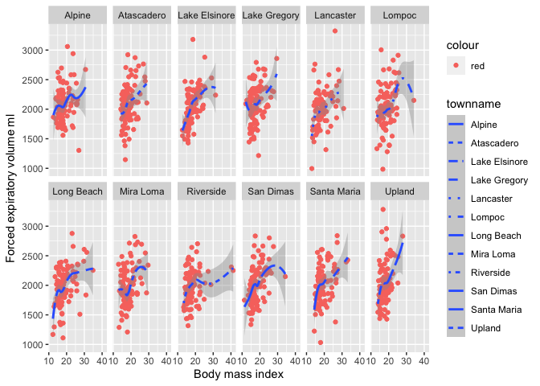
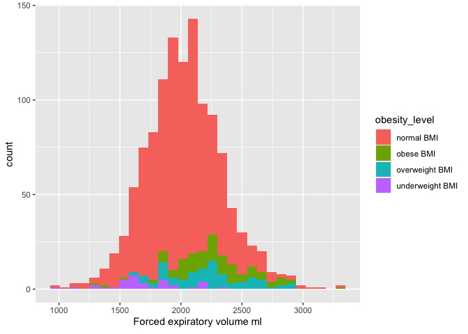
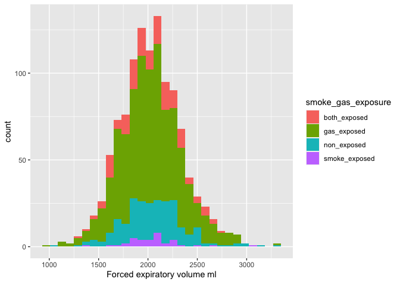
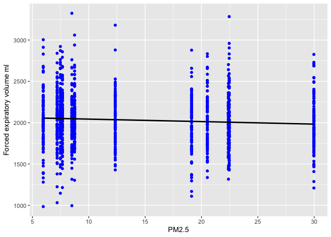

HW2
================

# Data Wrangling

``` r
# Get the data from individuals
fn1<- "chs_individual.csv"
if (!file.exists(fn1))
  download.file("https://raw.githubusercontent.com/USCbiostats/data-science-data/master/01_chs/chs_individual.csv",
  destfile = fn1
    )

individual<-read.csv(fn1)
individual<-as.tibble(individual)
```

    ## Warning: `as.tibble()` was deprecated in tibble 2.0.0.
    ## Please use `as_tibble()` instead.
    ## The signature and semantics have changed, see `?as_tibble`.

``` r
head(individual)
```

    ## # A tibble: 6 × 23
    ##     sid townname   male race  hispanic agepft height weight   bmi asthma
    ##   <int> <chr>     <int> <chr>    <int>  <dbl>  <int>  <int> <dbl>  <int>
    ## 1     1 Lancaster     1 W            0  10.2     123     54  16.2      0
    ## 2     2 Lancaster     1 W            0  10.5     145     77  16.6      0
    ## 3     6 Lancaster     0 B            0  10.1     145    143  30.9      0
    ## 4     7 Lancaster     0 O            0  10.7     156     72  13.4      0
    ## 5     8 Lancaster     0 W            1   9.78    132     61  15.9      0
    ## 6    10 Lancaster     1 O            1  NA        NA     NA  NA        0
    ## # … with 13 more variables: active_asthma <int>, father_asthma <int>,
    ## #   mother_asthma <int>, wheeze <int>, hayfever <int>, allergy <int>,
    ## #   educ_parent <int>, smoke <int>, pets <int>, gasstove <int>, fev <dbl>,
    ## #   fvc <dbl>, mmef <dbl>

``` r
# get the data from region
fn2<- "chs_region.csv"
if (!file.exists(fn2))
  download.file("https://raw.githubusercontent.com/USCbiostats/data-science-data/master/01_chs/chs_regional.csv",
  destfile = fn2
    )

region<-read.csv(fn2)
region<-as.tibble(region)
head(region)
```

    ## # A tibble: 6 × 27
    ##   townname  pm25_mass pm25_so4 pm25_no3 pm25_nh4 pm25_oc pm25_ec pm25_om pm10_oc
    ##   <chr>         <dbl>    <dbl>    <dbl>    <dbl>   <dbl>   <dbl>   <dbl>   <dbl>
    ## 1 Alpine         8.74     1.73     1.59     0.88    2.54    0.48    3.04    3.25
    ## 2 Lake Els…     12.4      1.9      2.98     1.36    3.64    0.62    4.36    4.66
    ## 3 Lake Gre…      7.66     1.07     2.07     0.91    2.46    0.4     2.96    3.16
    ## 4 Lancaster      8.5      0.91     1.87     0.78    4.43    0.55    5.32    5.68
    ## 5 Lompoc         5.96     1.08     0.73     0.41    1.45    0.13    1.74    1.86
    ## 6 Long Bea…     19.1      3.23     6.22     2.57    5.21    1.36    6.25    6.68
    ## # … with 18 more variables: pm10_ec <dbl>, pm10_tc <dbl>, formic <dbl>,
    ## #   acetic <dbl>, hcl <dbl>, hno3 <dbl>, o3_max <dbl>, o3106 <dbl>,
    ## #   o3_24 <dbl>, no2 <dbl>, pm10 <dbl>, no_24hr <dbl>, pm2_5_fr <dbl>,
    ## #   iacid <dbl>, oacid <dbl>, total_acids <dbl>, lon <dbl>, lat <dbl>

``` r
# Merge the individual and region
met <- merge(
  x = individual,
  y = region,
  all.x = TRUE, all.y = FALSE,
  by=("townname")
)
```

## Step 1:

``` r
# Check duplicate
N_rows_indivual<-length(individual$sid)
N_rows_met<-length(met$sid)
# The larger data set between individual and region has 1200 rows which matches the rows of merged data, so there is no duplicates in our merged data.

# Impute data using the average within the variables “male” and “hispanic” for missing values.
met<-data.table(met)

# Get the mean value for the continuous variables that grouped by male and hispanic.
met_missing<-met[ , .(
  agepftm      =mean(agepft, na.rm=TRUE),
  weightm      =mean(weight, na.rm=TRUE),
  heightm      =mean(height, na.rm=TRUE),
  bmim         =mean(bmi,    na.rm=TRUE),
  educ_parentm =mean(educ_parent, na.rm=TRUE),
  fevm         =mean(fev, na.rm=TRUE),
  fvcm         =mean(fvc, na.rm=TRUE),
  mmefm        =mean(mmef, na.rm=TRUE)
), by=.(male, hispanic)]


met1 <- merge(
  x = met,
  y = met_missing,
  all.x = TRUE, all.y = FALSE,
  by=c("male", "hispanic")
)

# Input for missing value
met1[, agepft:= fifelse(is.na(agepft), agepftm, agepft )]
met1[, weight:= fifelse(is.na(weight), weightm, weight)]
met1[, height:= fifelse(is.na(height), heightm, height )]
met1[, bmi:= fifelse(is.na(bmi), bmim, bmi )]
met1[, educ_parent:= fifelse(is.na(educ_parent), educ_parentm, educ_parent )]
met1[, fev:= fifelse(is.na(fev), fevm, fev )]
met1[, fvc:= fifelse(is.na(fvc), fvcm, fvc )]
met1[, mmef:= fifelse(is.na(mmef), mmefm, mmef )]
summary(met1)
```

    ##       male           hispanic        townname              sid        
    ##  Min.   :0.0000   Min.   :0.0000   Length:1200        Min.   :   1.0  
    ##  1st Qu.:0.0000   1st Qu.:0.0000   Class :character   1st Qu.: 528.8  
    ##  Median :0.0000   Median :0.0000   Mode  :character   Median :1041.5  
    ##  Mean   :0.4917   Mean   :0.4342                      Mean   :1037.5  
    ##  3rd Qu.:1.0000   3rd Qu.:1.0000                      3rd Qu.:1554.2  
    ##  Max.   :1.0000   Max.   :1.0000                      Max.   :2053.0  
    ##                                                                       
    ##      race               agepft           height        weight      
    ##  Length:1200        Min.   : 8.961   Min.   :114   Min.   : 42.00  
    ##  Class :character   1st Qu.: 9.632   1st Qu.:135   1st Qu.: 66.00  
    ##  Mode  :character   Median : 9.907   Median :139   Median : 76.00  
    ##                     Mean   : 9.923   Mean   :139   Mean   : 79.31  
    ##                     3rd Qu.:10.155   3rd Qu.:143   3rd Qu.: 87.00  
    ##                     Max.   :12.731   Max.   :165   Max.   :207.00  
    ##                                                                    
    ##       bmi            asthma       active_asthma  father_asthma    
    ##  Min.   :11.30   Min.   :0.0000   Min.   :0.00   Min.   :0.00000  
    ##  1st Qu.:15.96   1st Qu.:0.0000   1st Qu.:0.00   1st Qu.:0.00000  
    ##  Median :17.81   Median :0.0000   Median :0.00   Median :0.00000  
    ##  Mean   :18.50   Mean   :0.1463   Mean   :0.19   Mean   :0.08318  
    ##  3rd Qu.:19.99   3rd Qu.:0.0000   3rd Qu.:0.00   3rd Qu.:0.00000  
    ##  Max.   :41.27   Max.   :1.0000   Max.   :1.00   Max.   :1.00000  
    ##                  NA's   :31                      NA's   :106      
    ##  mother_asthma        wheeze          hayfever         allergy      
    ##  Min.   :0.0000   Min.   :0.0000   Min.   :0.0000   Min.   :0.0000  
    ##  1st Qu.:0.0000   1st Qu.:0.0000   1st Qu.:0.0000   1st Qu.:0.0000  
    ##  Median :0.0000   Median :0.0000   Median :0.0000   Median :0.0000  
    ##  Mean   :0.1023   Mean   :0.3313   Mean   :0.1747   Mean   :0.2929  
    ##  3rd Qu.:0.0000   3rd Qu.:1.0000   3rd Qu.:0.0000   3rd Qu.:1.0000  
    ##  Max.   :1.0000   Max.   :1.0000   Max.   :1.0000   Max.   :1.0000  
    ##  NA's   :56       NA's   :71       NA's   :118      NA's   :63      
    ##   educ_parent        smoke             pets           gasstove     
    ##  Min.   :1.000   Min.   :0.0000   Min.   :0.0000   Min.   :0.0000  
    ##  1st Qu.:2.000   1st Qu.:0.0000   1st Qu.:1.0000   1st Qu.:1.0000  
    ##  Median :3.000   Median :0.0000   Median :1.0000   Median :1.0000  
    ##  Mean   :2.786   Mean   :0.1638   Mean   :0.7667   Mean   :0.7815  
    ##  3rd Qu.:3.000   3rd Qu.:0.0000   3rd Qu.:1.0000   3rd Qu.:1.0000  
    ##  Max.   :5.000   Max.   :1.0000   Max.   :1.0000   Max.   :1.0000  
    ##                  NA's   :40                        NA's   :33      
    ##       fev              fvc            mmef          pm25_mass     
    ##  Min.   : 984.8   Min.   : 895   Min.   : 757.6   Min.   : 5.960  
    ##  1st Qu.:1827.6   1st Qu.:2065   1st Qu.:2043.7   1st Qu.: 7.615  
    ##  Median :2016.4   Median :2282   Median :2392.1   Median :10.545  
    ##  Mean   :2030.1   Mean   :2322   Mean   :2398.6   Mean   :14.362  
    ##  3rd Qu.:2223.6   3rd Qu.:2551   3rd Qu.:2737.1   3rd Qu.:20.988  
    ##  Max.   :3323.7   Max.   :3698   Max.   :4935.9   Max.   :29.970  
    ##                                                                   
    ##     pm25_so4        pm25_no3         pm25_nh4         pm25_oc      
    ##  Min.   :0.790   Min.   : 0.730   Min.   :0.4100   Min.   : 1.450  
    ##  1st Qu.:1.077   1st Qu.: 1.538   1st Qu.:0.7375   1st Qu.: 2.520  
    ##  Median :1.815   Median : 2.525   Median :1.1350   Median : 4.035  
    ##  Mean   :1.876   Mean   : 4.488   Mean   :1.7642   Mean   : 4.551  
    ##  3rd Qu.:2.605   3rd Qu.: 7.338   3rd Qu.:2.7725   3rd Qu.: 5.350  
    ##  Max.   :3.230   Max.   :12.200   Max.   :4.2500   Max.   :11.830  
    ##                                                                    
    ##     pm25_ec          pm25_om          pm10_oc          pm10_ec      
    ##  Min.   :0.1300   Min.   : 1.740   Min.   : 1.860   Min.   :0.1400  
    ##  1st Qu.:0.4000   1st Qu.: 3.020   1st Qu.: 3.228   1st Qu.:0.4100  
    ##  Median :0.5850   Median : 4.840   Median : 5.170   Median :0.5950  
    ##  Mean   :0.7358   Mean   : 5.460   Mean   : 5.832   Mean   :0.7525  
    ##  3rd Qu.:1.1750   3rd Qu.: 6.418   3rd Qu.: 6.855   3rd Qu.:1.1975  
    ##  Max.   :1.3600   Max.   :14.200   Max.   :15.160   Max.   :1.3900  
    ##                                                                     
    ##     pm10_tc           formic          acetic           hcl        
    ##  Min.   : 1.990   Min.   :0.340   Min.   :0.750   Min.   :0.2200  
    ##  1st Qu.: 3.705   1st Qu.:0.720   1st Qu.:2.297   1st Qu.:0.3250  
    ##  Median : 6.505   Median :1.105   Median :2.910   Median :0.4350  
    ##  Mean   : 6.784   Mean   :1.332   Mean   :3.010   Mean   :0.4208  
    ##  3rd Qu.: 8.430   3rd Qu.:1.765   3rd Qu.:4.000   3rd Qu.:0.4625  
    ##  Max.   :16.440   Max.   :2.770   Max.   :5.140   Max.   :0.7300  
    ##                                                                   
    ##       hno3           o3_max          o3106           o3_24      
    ##  Min.   :0.430   Min.   :38.27   Min.   :28.22   Min.   :18.22  
    ##  1st Qu.:1.593   1st Qu.:49.93   1st Qu.:41.90   1st Qu.:23.31  
    ##  Median :2.455   Median :64.05   Median :46.74   Median :27.59  
    ##  Mean   :2.367   Mean   :60.16   Mean   :47.76   Mean   :30.23  
    ##  3rd Qu.:3.355   3rd Qu.:67.69   3rd Qu.:55.24   3rd Qu.:32.39  
    ##  Max.   :4.070   Max.   :84.44   Max.   :67.01   Max.   :57.76  
    ##                                                                 
    ##       no2             pm10          no_24hr         pm2_5_fr    
    ##  Min.   : 4.60   Min.   :18.40   Min.   : 2.05   Min.   : 9.01  
    ##  1st Qu.:12.12   1st Qu.:20.71   1st Qu.: 4.74   1st Qu.:10.28  
    ##  Median :16.40   Median :29.64   Median :12.68   Median :22.23  
    ##  Mean   :18.99   Mean   :32.64   Mean   :16.21   Mean   :19.79  
    ##  3rd Qu.:23.24   3rd Qu.:39.16   3rd Qu.:26.90   3rd Qu.:27.73  
    ##  Max.   :37.97   Max.   :70.39   Max.   :42.95   Max.   :31.55  
    ##                                  NA's   :100     NA's   :300    
    ##      iacid           oacid        total_acids          lon        
    ##  Min.   :0.760   Min.   :1.090   Min.   : 1.520   Min.   :-120.7  
    ##  1st Qu.:1.835   1st Qu.:2.978   1st Qu.: 4.930   1st Qu.:-118.8  
    ##  Median :2.825   Median :4.135   Median : 6.370   Median :-117.7  
    ##  Mean   :2.788   Mean   :4.342   Mean   : 6.708   Mean   :-118.3  
    ##  3rd Qu.:3.817   3rd Qu.:5.982   3rd Qu.: 9.395   3rd Qu.:-117.4  
    ##  Max.   :4.620   Max.   :7.400   Max.   :11.430   Max.   :-116.8  
    ##                                                                   
    ##       lat           agepftm         weightm         heightm     
    ##  Min.   :32.84   Min.   :9.850   Min.   :77.40   Min.   :138.2  
    ##  1st Qu.:33.93   1st Qu.:9.850   1st Qu.:77.40   1st Qu.:138.6  
    ##  Median :34.10   Median :9.907   Median :78.78   Median :139.0  
    ##  Mean   :34.20   Mean   :9.923   Mean   :79.31   Mean   :139.0  
    ##  3rd Qu.:34.65   3rd Qu.:9.979   3rd Qu.:79.05   3rd Qu.:139.8  
    ##  Max.   :35.49   Max.   :9.979   Max.   :82.77   Max.   :139.8  
    ##                                                                 
    ##       bmim        educ_parentm        fevm           fvcm          mmefm     
    ##  Min.   :18.05   Min.   :2.398   Min.   :1946   Min.   :2199   Min.   :2356  
    ##  1st Qu.:18.05   1st Qu.:2.424   1st Qu.:1946   1st Qu.:2199   1st Qu.:2356  
    ##  Median :18.14   Median :3.046   Median :1977   Median :2229   Median :2366  
    ##  Mean   :18.50   Mean   :2.786   Mean   :2030   Mean   :2322   Mean   :2399  
    ##  3rd Qu.:18.63   3rd Qu.:3.102   3rd Qu.:2090   3rd Qu.:2431   3rd Qu.:2447  
    ##  Max.   :19.41   Max.   :3.102   Max.   :2120   Max.   :2444   Max.   :2448  
    ## 

After doing step1, We create a data set which has no duplicates and no
missing values for the continuous variables.

## Step 2: Create a new categorical variable named “obesity\_level” using the BMI measurement (underweight BMI&lt;14; normal BMI 14-22; overweight BMI 22-24; obese BMI&gt;24)

``` r
met1<-data.table(met1)
met1[, obesity_level := fifelse(
    bmi < 14, "underweight BMI", 
    fifelse(bmi<22, "normal BMI",
    fifelse(bmi<24, "overweight BMI", "obese BMI")))]

tab <- met1[, .(
  min_bmi         =min(bmi),
  max_bmi         =max(bmi),
  N_obs           =length(bmi)
  ),
  by=obesity_level]
knitr::kable(tab)
```

| obesity\_level  | min\_bmi | max\_bmi | N\_obs |
|:----------------|---------:|---------:|-------:|
| normal BMI      | 14.00380 | 21.96387 |    975 |
| obese BMI       | 24.00647 | 41.26613 |    103 |
| overweight BMI  | 22.02353 | 23.99650 |     87 |
| underweight BMI | 11.29640 | 13.98601 |     35 |

## Step 3:Create another categorical variable named “smoke\_gas\_exposure” that summarizes “Second Hand Smoke” and “Gas Stove.” The variable should have four categories in total.

``` r
met1[, smoke_gas_exposure:= as.factor(fifelse(
    smoke==1 & gasstove==1, "both_exposed", 
    fifelse(smoke==1 & gasstove==0, "smoke_exposed",
    fifelse(smoke==0 & gasstove==1, "gas_exposed", "non_exposed"))))]

summary(met1$smoke_gas_exposure)
```

    ##  both_exposed   gas_exposed   non_exposed smoke_exposed          NA's 
    ##           151           739           214            36            60

For new variable smoke\_gas\_exposure we generated, we noticed that
there are 151 people both exposed to second hand smoke and gas stove,
739 people are only gas exposed, 36 people are only second hand smoke
exposed and 214 people are not exposed to second hand smoke and gas
stove. Also, there are 60 missing values for our new variable.

## Step 4:Create four summary tables showing the average (or proportion, if binary) and sd of “Forced expiratory volume in 1 second (ml)” and asthma indicator by town, sex, obesity level, and “smoke\_gas\_exposure.”

``` r
town_mean_sd<-met1[ , .(
  fev_mean   =mean(fev, na.rm=TRUE),
  fev_sd     =sd(fev, na.rm=TRUE),
  asthma_sd  =sd(asthma, na.rm=TRUE),
  asthma_proportion = length(asthma[asthma==1 & is.na(asthma)==FALSE]) /length(asthma[is.na(asthma)==FALSE])
), by="townname"]
knitr::kable(town_mean_sd)
```

| townname      | fev\_mean |  fev\_sd | asthma\_sd | asthma\_proportion |
|:--------------|----------:|---------:|-----------:|-------------------:|
| Alpine        |  2087.101 | 291.1768 |  0.3187308 |          0.1134021 |
| Atascadero    |  2075.897 | 324.0935 |  0.4381598 |          0.2551020 |
| Lake Elsinore |  2038.849 | 303.6956 |  0.3339673 |          0.1263158 |
| Lake Gregory  |  2084.700 | 319.9593 |  0.3603750 |          0.1515152 |
| Lancaster     |  2003.044 | 317.1298 |  0.3730620 |          0.1649485 |
| Lompoc        |  2034.354 | 351.0454 |  0.3187308 |          0.1134021 |
| Long Beach    |  1985.861 | 319.4625 |  0.3439642 |          0.1354167 |
| Mira Loma     |  1985.202 | 324.9634 |  0.3665767 |          0.1578947 |
| Riverside     |  1989.881 | 277.5065 |  0.3144660 |          0.1100000 |
| San Dimas     |  2026.794 | 318.7845 |  0.3790537 |          0.1717172 |
| Santa Maria   |  2025.750 | 312.1725 |  0.3424442 |          0.1340206 |
| Upland        |  2024.266 | 343.1637 |  0.3280346 |          0.1212121 |

``` r
sex_mean_sd<-met1[ , .(
  fev_mean   =mean(fev, na.rm=TRUE),
  fev_sd     =sd(fev, na.rm=TRUE),
  asthma_sd  =sd(asthma, na.rm=TRUE),
  asthma_proportion = length(asthma[asthma==1 & is.na(asthma)==FALSE]) /length(asthma[is.na(asthma)==FALSE])
), by="male"]
knitr::kable(sex_mean_sd)
```

| male | fev\_mean |  fev\_sd | asthma\_sd | asthma\_proportion |
|-----:|----------:|---------:|-----------:|-------------------:|
|    0 |  1958.911 | 311.9181 |  0.3261747 |          0.1208054 |
|    1 |  2103.787 | 307.5123 |  0.3783828 |          0.1727749 |

``` r
obesity_mean_sd<-met1[ , .(
  fev_mean   =mean(fev, na.rm=TRUE),
  fev_sd     =sd(fev, na.rm=TRUE),
  asthma_sd  =sd(asthma, na.rm=TRUE),
  asthma_proportion = length(asthma[asthma==1 & is.na(asthma)==FALSE]) /length(asthma[is.na(asthma)==FALSE])
), by="obesity_level"]
knitr::kable(obesity_mean_sd)
```

| obesity\_level  | fev\_mean |  fev\_sd | asthma\_sd | asthma\_proportion |
|:----------------|----------:|---------:|-----------:|-------------------:|
| normal BMI      |  1999.794 | 295.1964 |  0.3473231 |          0.1401475 |
| obese BMI       |  2266.154 | 325.4710 |  0.4093602 |          0.2100000 |
| overweight BMI  |  2224.322 | 317.4261 |  0.3731162 |          0.1647059 |
| underweight BMI |  1698.327 | 303.3983 |  0.2840286 |          0.0857143 |

``` r
smoke_gas_mean_sd<-met1[ , .(
  fev_mean   =mean(fev, na.rm=TRUE),
  fev_sd     =sd(fev, na.rm=TRUE),
  asthma_sd  =sd(asthma, na.rm=TRUE),
  asthma_proportion = length(asthma[asthma==1 & is.na(asthma)==FALSE]) /length(asthma[is.na(asthma)==FALSE])
), by="smoke_gas_exposure"]
knitr::kable(smoke_gas_mean_sd)
```

| smoke\_gas\_exposure | fev\_mean |  fev\_sd | asthma\_sd | asthma\_proportion |
|:---------------------|----------:|---------:|-----------:|-------------------:|
| non\_exposed         |  2055.356 | 330.4169 |  0.3555696 |          0.1476190 |
| NA                   |  2001.878 | 340.2592 |  0.3598746 |          0.1489362 |
| gas\_exposed         |  2025.989 | 317.6305 |  0.3550878 |          0.1477428 |
| smoke\_exposed       |  2055.714 | 295.6475 |  0.3823853 |          0.1714286 |
| both\_exposed        |  2019.867 | 298.9728 |  0.3376123 |          0.1301370 |

Conclusion: For the indicator town, we notice that the mean and standard
deviation of “Forced expiratory volume in 1 second (ml)” are very
similar between 12 towns and people live in Alpine has the highest mean
which is equal to 2087.1ml. Also, the proportion of getting asthma is
relatively high for people live in Atascadero(25.52%) and San
Dimas(17.17%).

For the indicator sex, we noticed that mean “Forced expiratory volume in
1 second (ml)” for male is 2103.79 ml which much higher than female’s
(1958.91 ml). Also, the proportion of getting asthma is higher for
male(17.28%) than female(12.08%).

For the indicator obesity, we noticed that mean “Forced expiratory
volume in 1 second (ml)” is relatively high for people who are
obese(2266.15ml) and overweight(2224.32ml). Also, the proportion of
asthma is higher for people who are obese(21%) and overweight(16.47%)
compared to people who are underweight(8.6%) and with normal
BMI(14.01%).

For the indicator smoke and gas stove exposure, we noticed that mean and
standard deviation of “Forced expiratory volume in 1 second (ml)” look
similar between each situation. For for proportion of getting asthma, we
find that the proportion of having asthma is highest for people who are
second hand smoke exposure which equals to 17.14%。

# Looking at the data(EDA)

Primary Question: 1. What is the association between BMI and FEV (forced
expiratory volume)? 2. What is the association between smoke and gas
exposure and FEV? 3. What is the association between PM2.5 exposure and
FEV?

``` r
dim(met1)
```

    ## [1] 1200   59

``` r
nrow(met1)
```

    ## [1] 1200

``` r
ncol(met1)
```

    ## [1] 59

``` r
head(met1)
```

    ##    male hispanic townname sid race    agepft height weight      bmi asthma
    ## 1:    0        0   Alpine 835    W 10.099932    143     69 15.33749      0
    ## 2:    0        0   Alpine 840    W  9.965777    146     78 16.63283      0
    ## 3:    0        0   Alpine 865    W 10.039699    162    140 24.24797      1
    ## 4:    0        0   Alpine 860    W  9.946612    142     64 14.42715      0
    ## 5:    0        0   Alpine 894    W  9.295003    150     89 17.97980      0
    ## 6:    0        0   Alpine 901    W  9.311431    132     67 17.47850      0
    ##    active_asthma father_asthma mother_asthma wheeze hayfever allergy
    ## 1:             0             0             0      0        0       1
    ## 2:             0             0             0      0        0       0
    ## 3:             1             0             0      1        0       1
    ## 4:             0             0             0      0        0       0
    ## 5:             0             0             0     NA        1       1
    ## 6:             0             0             0     NA        1       0
    ##    educ_parent smoke pets gasstove      fev      fvc     mmef pm25_mass
    ## 1:    3.000000     0    1        0 2529.276 2826.316 3406.579      8.74
    ## 2:    3.045977    NA    0       NA 2466.791 2638.221 3466.464      8.74
    ## 3:    3.000000     0    1        1 2583.934 3567.541 2071.475      8.74
    ## 4:    2.000000     0    0        1 1759.866 2194.314 1695.652      8.74
    ## 5:    2.000000     0    1        1 2448.837 2763.787 3041.860      8.74
    ## 6:    2.000000     0    1        0 1992.359 2185.714 2481.728      8.74
    ##    pm25_so4 pm25_no3 pm25_nh4 pm25_oc pm25_ec pm25_om pm10_oc pm10_ec pm10_tc
    ## 1:     1.73     1.59     0.88    2.54    0.48    3.04    3.25    0.49    3.75
    ## 2:     1.73     1.59     0.88    2.54    0.48    3.04    3.25    0.49    3.75
    ## 3:     1.73     1.59     0.88    2.54    0.48    3.04    3.25    0.49    3.75
    ## 4:     1.73     1.59     0.88    2.54    0.48    3.04    3.25    0.49    3.75
    ## 5:     1.73     1.59     0.88    2.54    0.48    3.04    3.25    0.49    3.75
    ## 6:     1.73     1.59     0.88    2.54    0.48    3.04    3.25    0.49    3.75
    ##    formic acetic  hcl hno3 o3_max o3106 o3_24   no2  pm10 no_24hr pm2_5_fr
    ## 1:   1.03   2.49 0.41 1.98  65.82 55.05 41.23 12.18 24.73    2.48    10.28
    ## 2:   1.03   2.49 0.41 1.98  65.82 55.05 41.23 12.18 24.73    2.48    10.28
    ## 3:   1.03   2.49 0.41 1.98  65.82 55.05 41.23 12.18 24.73    2.48    10.28
    ## 4:   1.03   2.49 0.41 1.98  65.82 55.05 41.23 12.18 24.73    2.48    10.28
    ## 5:   1.03   2.49 0.41 1.98  65.82 55.05 41.23 12.18 24.73    2.48    10.28
    ## 6:   1.03   2.49 0.41 1.98  65.82 55.05 41.23 12.18 24.73    2.48    10.28
    ##    iacid oacid total_acids       lon      lat  agepftm  weightm heightm
    ## 1:  2.39  3.52         5.5 -116.7664 32.83505 9.849789 77.39564 138.972
    ## 2:  2.39  3.52         5.5 -116.7664 32.83505 9.849789 77.39564 138.972
    ## 3:  2.39  3.52         5.5 -116.7664 32.83505 9.849789 77.39564 138.972
    ## 4:  2.39  3.52         5.5 -116.7664 32.83505 9.849789 77.39564 138.972
    ## 5:  2.39  3.52         5.5 -116.7664 32.83505 9.849789 77.39564 138.972
    ## 6:  2.39  3.52         5.5 -116.7664 32.83505 9.849789 77.39564 138.972
    ##        bmim educ_parentm     fevm     fvcm    mmefm obesity_level
    ## 1: 18.05281     3.045977 1945.743 2198.915 2365.589    normal BMI
    ## 2: 18.05281     3.045977 1945.743 2198.915 2365.589    normal BMI
    ## 3: 18.05281     3.045977 1945.743 2198.915 2365.589     obese BMI
    ## 4: 18.05281     3.045977 1945.743 2198.915 2365.589    normal BMI
    ## 5: 18.05281     3.045977 1945.743 2198.915 2365.589    normal BMI
    ## 6: 18.05281     3.045977 1945.743 2198.915 2365.589    normal BMI
    ##    smoke_gas_exposure
    ## 1:        non_exposed
    ## 2:               <NA>
    ## 3:        gas_exposed
    ## 4:        gas_exposed
    ## 5:        gas_exposed
    ## 6:        non_exposed

``` r
str(met1)
```

    ## Classes 'data.table' and 'data.frame':   1200 obs. of  59 variables:
    ##  $ male              : int  0 0 0 0 0 0 0 0 0 0 ...
    ##  $ hispanic          : int  0 0 0 0 0 0 0 0 0 0 ...
    ##  $ townname          : chr  "Alpine" "Alpine" "Alpine" "Alpine" ...
    ##  $ sid               : int  835 840 865 860 894 901 905 906 909 917 ...
    ##  $ race              : chr  "W" "W" "W" "W" ...
    ##  $ agepft            : num  10.1 9.97 10.04 9.95 9.3 ...
    ##  $ height            : num  143 146 162 142 150 132 142 126 141 137 ...
    ##  $ weight            : num  69 78 140 64 89 67 94 57 68 75 ...
    ##  $ bmi               : num  15.3 16.6 24.2 14.4 18 ...
    ##  $ asthma            : int  0 0 1 0 0 0 1 0 0 1 ...
    ##  $ active_asthma     : int  0 0 1 0 0 0 1 0 0 1 ...
    ##  $ father_asthma     : int  0 0 0 0 0 0 0 0 0 0 ...
    ##  $ mother_asthma     : int  0 0 0 0 0 0 1 1 0 0 ...
    ##  $ wheeze            : int  0 0 1 0 NA NA 1 0 0 1 ...
    ##  $ hayfever          : int  0 0 0 0 1 1 0 0 1 0 ...
    ##  $ allergy           : int  1 0 1 0 1 0 0 0 1 0 ...
    ##  $ educ_parent       : num  3 3.05 3 2 2 ...
    ##  $ smoke             : int  0 NA 0 0 0 0 1 1 0 0 ...
    ##  $ pets              : int  1 0 1 0 1 1 1 1 1 1 ...
    ##  $ gasstove          : int  0 NA 1 1 1 0 0 1 1 1 ...
    ##  $ fev               : num  2529 2467 2584 1760 2449 ...
    ##  $ fvc               : num  2826 2638 3568 2194 2764 ...
    ##  $ mmef              : num  3407 3466 2071 1696 3042 ...
    ##  $ pm25_mass         : num  8.74 8.74 8.74 8.74 8.74 8.74 8.74 8.74 8.74 8.74 ...
    ##  $ pm25_so4          : num  1.73 1.73 1.73 1.73 1.73 1.73 1.73 1.73 1.73 1.73 ...
    ##  $ pm25_no3          : num  1.59 1.59 1.59 1.59 1.59 1.59 1.59 1.59 1.59 1.59 ...
    ##  $ pm25_nh4          : num  0.88 0.88 0.88 0.88 0.88 0.88 0.88 0.88 0.88 0.88 ...
    ##  $ pm25_oc           : num  2.54 2.54 2.54 2.54 2.54 2.54 2.54 2.54 2.54 2.54 ...
    ##  $ pm25_ec           : num  0.48 0.48 0.48 0.48 0.48 0.48 0.48 0.48 0.48 0.48 ...
    ##  $ pm25_om           : num  3.04 3.04 3.04 3.04 3.04 3.04 3.04 3.04 3.04 3.04 ...
    ##  $ pm10_oc           : num  3.25 3.25 3.25 3.25 3.25 3.25 3.25 3.25 3.25 3.25 ...
    ##  $ pm10_ec           : num  0.49 0.49 0.49 0.49 0.49 0.49 0.49 0.49 0.49 0.49 ...
    ##  $ pm10_tc           : num  3.75 3.75 3.75 3.75 3.75 3.75 3.75 3.75 3.75 3.75 ...
    ##  $ formic            : num  1.03 1.03 1.03 1.03 1.03 1.03 1.03 1.03 1.03 1.03 ...
    ##  $ acetic            : num  2.49 2.49 2.49 2.49 2.49 2.49 2.49 2.49 2.49 2.49 ...
    ##  $ hcl               : num  0.41 0.41 0.41 0.41 0.41 0.41 0.41 0.41 0.41 0.41 ...
    ##  $ hno3              : num  1.98 1.98 1.98 1.98 1.98 1.98 1.98 1.98 1.98 1.98 ...
    ##  $ o3_max            : num  65.8 65.8 65.8 65.8 65.8 ...
    ##  $ o3106             : num  55 55 55 55 55 ...
    ##  $ o3_24             : num  41.2 41.2 41.2 41.2 41.2 ...
    ##  $ no2               : num  12.2 12.2 12.2 12.2 12.2 ...
    ##  $ pm10              : num  24.7 24.7 24.7 24.7 24.7 ...
    ##  $ no_24hr           : num  2.48 2.48 2.48 2.48 2.48 2.48 2.48 2.48 2.48 2.48 ...
    ##  $ pm2_5_fr          : num  10.3 10.3 10.3 10.3 10.3 ...
    ##  $ iacid             : num  2.39 2.39 2.39 2.39 2.39 2.39 2.39 2.39 2.39 2.39 ...
    ##  $ oacid             : num  3.52 3.52 3.52 3.52 3.52 3.52 3.52 3.52 3.52 3.52 ...
    ##  $ total_acids       : num  5.5 5.5 5.5 5.5 5.5 5.5 5.5 5.5 5.5 5.5 ...
    ##  $ lon               : num  -117 -117 -117 -117 -117 ...
    ##  $ lat               : num  32.8 32.8 32.8 32.8 32.8 ...
    ##  $ agepftm           : num  9.85 9.85 9.85 9.85 9.85 ...
    ##  $ weightm           : num  77.4 77.4 77.4 77.4 77.4 ...
    ##  $ heightm           : num  139 139 139 139 139 ...
    ##  $ bmim              : num  18.1 18.1 18.1 18.1 18.1 ...
    ##  $ educ_parentm      : num  3.05 3.05 3.05 3.05 3.05 ...
    ##  $ fevm              : num  1946 1946 1946 1946 1946 ...
    ##  $ fvcm              : num  2199 2199 2199 2199 2199 ...
    ##  $ mmefm             : num  2366 2366 2366 2366 2366 ...
    ##  $ obesity_level     : chr  "normal BMI" "normal BMI" "obese BMI" "normal BMI" ...
    ##  $ smoke_gas_exposure: Factor w/ 4 levels "both_exposed",..: 3 NA 2 2 2 3 4 1 2 2 ...
    ##  - attr(*, ".internal.selfref")=<externalptr> 
    ##  - attr(*, "sorted")= chr [1:2] "male" "hispanic"

``` r
# Get summary statistics for our key variables
summary(met1[, 9])
```

    ##       bmi       
    ##  Min.   :11.30  
    ##  1st Qu.:15.96  
    ##  Median :17.81  
    ##  Mean   :18.50  
    ##  3rd Qu.:19.99  
    ##  Max.   :41.27

``` r
summary(met1[,21])
```

    ##       fev        
    ##  Min.   : 984.8  
    ##  1st Qu.:1827.6  
    ##  Median :2016.4  
    ##  Mean   :2030.1  
    ##  3rd Qu.:2223.6  
    ##  Max.   :3323.7

``` r
summary(met1[,24])
```

    ##    pm25_mass     
    ##  Min.   : 5.960  
    ##  1st Qu.: 7.615  
    ##  Median :10.545  
    ##  Mean   :14.362  
    ##  3rd Qu.:20.988  
    ##  Max.   :29.970

``` r
summary(met1[,59])
```

    ##      smoke_gas_exposure
    ##  both_exposed :151     
    ##  gas_exposed  :739     
    ##  non_exposed  :214     
    ##  smoke_exposed: 36     
    ##  NA's         : 60

``` r
# Check missing value for FEV which is our most important variabel
mean(is.na(met1$fev))
```

    ## [1] 0

``` r
mean(is.na(met1$bmi))
```

    ## [1] 0

``` r
mean(is.na(met1$smoke_gas_exposure))
```

    ## [1] 0.05

``` r
mean(is.na(met1$pm25_mass))
```

    ## [1] 0

After checking dimension, summary statistic and missing value for our
key variable, we would conclude the dataset we got is good enough for us
to do further analysis.

## Step 1:Facet plot showing scatterplots with regression lines of BMI vs FEV by “townname”.

``` r
met1[!is.na(townname)] %>% 
  ggplot() + 
  geom_point(mapping = aes(x = bmi, y = fev, color="red")) + 
  geom_smooth(mapping = aes(x = bmi, y = fev, linetype = townname))+
  facet_wrap(~ townname, nrow = 2)+
  labs(x="Body mass index",y = expression("Forced expiratory volume" *~ ml))
```

    ## `geom_smooth()` using method = 'loess' and formula 'y ~ x'

<!-- --> After we plotting
the scatter plot of BMI and FEV grouped by town, we noticed that only 3
out of 12 towns have clear pattern of the positive linear association
between BMI and FEV. Those three towns are “Atascadero”,“Lake Elsinore”
and “Upland”. For other towns, we didn’t detect any clear association
between BMI and FEV.

## Step 2: Stacked histograms of FEV by BMI category and FEV by smoke/gas exposure. Use different color schemes than the ggplot default

``` r
library(ggplot2)
met1[!is.na(obesity_level)&!is.na(fev)]%>%
  ggplot() + 
  geom_histogram(mapping = aes(x = fev,fill=obesity_level)) +
  labs(x = expression("Forced expiratory volume" *~ ml))
```

    ## `stat_bin()` using `bins = 30`. Pick better value with `binwidth`.

<!-- -->

``` r
met1[!is.na(smoke_gas_exposure)& !is.na(fev)]%>%
  ggplot() + 
  geom_histogram(mapping = aes(x = fev,fill=smoke_gas_exposure))+
  labs(x = expression("Forced expiratory volume" *~ ml))
```

    ## `stat_bin()` using `bins = 30`. Pick better value with `binwidth`.

<!-- --> The histograms for
distribution of FEV by BMI category, we detected that only for the group
with normal BMI, the distribution of FEV is relatively normal with mean
around 2000 ml. The distribution of FEV is relatively left skewed for
people who are overweight and obese. The distribution of FEV looks right
skewed for people who are underweight. For histograms for distribution
of FEV by smoke and gas exposure, we noticed that the distribution of
FEV in each category of smoke and gas exposure looks like normal
distribution.

## Step 3:Barchart of BMI by smoke/gas exposure

``` r
# Method 1:
met1[!is.na(bmi)& !is.na(smoke_gas_exposure)] %>%
  ggplot() + 
  geom_bar(mapping = aes(x = obesity_level, color=obesity_level,fill=obesity_level))+
  facet_wrap(~ smoke_gas_exposure, nrow = 4)
```

<!-- -->

``` r
# Method 2
met1[!is.na(smoke_gas_exposure)& !is.na(fev)]%>%
  ggplot() + 
  geom_bar(mapping = aes(x = smoke_gas_exposure,fill=obesity_level), position="dodge")
```

<!-- --> From the bar chart
plotted, we find that the category which is gas-exposed contains most
number of people(nearly 600) with normal BMI. For each situation of
smoke and gas exposure, the number of people with normal BMI is larger
than the number of people are obese; the number of people who are obese
is larger than the number of people who are overweight; the number of
people who are overweight is larger than the number of people who are
underweight.

## Step 4: Statistical summary graphs of FEV by BMI and FEV by smoke/gas exposure category.

``` r
#Statistical summary graphs of FEV by BMI
met1[!is.na(fev) & !is.na(obesity_level)] %>%
    ggplot() + 
    stat_summary(mapping = aes(x = obesity_level, y = fev),
    fun.min = min,
    fun.max = max,
    fun = median)+
    labs(y = expression("Forced expiratory volume" *~ ml))
```

<!-- -->

``` r
#Statistical summary graphs of FEV by smoke/gas exposure category
met1[!is.na(fev) & !is.na(smoke_gas_exposure)] %>%
    ggplot() + 
    stat_summary(mapping = aes(x = smoke_gas_exposure, y = fev),
    fun.min = min,
    fun.max = max,
    fun = median)+
    labs(y = expression("Forced expiratory volume" *~ ml))
```

<!-- -->
People who are obese have the highest mean of Forced expiratory volume
which are around 2250 ml. People who are underweight have the lowest
mean of Forced expiratory volume which are around 1680 ml. Also, the
mean of Forced expiratory volume looks relatively same for each
situation of smoke/gas exposure which is around 2000 ml, but the range
of Forced expiratory volume is wilder for people who are only
gas-exposed and non exposed.

## Step 5: A leaflet map showing the concentrations of PM2.5 mass in each of the CHS communities.

``` r
temp.pal <- colorNumeric(c('darkgreen','goldenrod','brown'), domain=met1$pm25_mass)

leaflet(met1) %>%
   addProviderTiles('CartoDB.Positron') %>%
   addCircles(
   lat = ~lat, lng=~lon,
   label = ~paste0(round(pm25_mass,2), 'PM2.5'), color = ~ temp.pal(pm25_mass),
   opacity = 1, fillOpacity = 1, radius = 500
     ) %>%
   addLegend('bottomleft', pal=temp.pal, values=met1$pm25_mass,
           title='PM2.5, ug/m^3', opacity=1)
```

<div id="htmlwidget-413e294fa2f4cd686140" style="width:672px;height:480px;" class="leaflet html-widget"></div>
<script type="application/json" data-for="htmlwidget-413e294fa2f4cd686140">{"x":{"options":{"crs":{"crsClass":"L.CRS.EPSG3857","code":null,"proj4def":null,"projectedBounds":null,"options":{}}},"calls":[{"method":"addProviderTiles","args":["CartoDB.Positron",null,null,{"errorTileUrl":"","noWrap":false,"detectRetina":false}]},{"method":"addCircles","args":[[32.8350521,32.8350521,32.8350521,32.8350521,32.8350521,32.8350521,32.8350521,32.8350521,32.8350521,32.8350521,32.8350521,32.8350521,32.8350521,32.8350521,32.8350521,32.8350521,32.8350521,32.8350521,32.8350521,32.8350521,32.8350521,32.8350521,32.8350521,32.8350521,32.8350521,32.8350521,32.8350521,32.8350521,32.8350521,32.8350521,32.8350521,32.8350521,35.4894169,35.4894169,35.4894169,35.4894169,35.4894169,35.4894169,35.4894169,35.4894169,35.4894169,35.4894169,35.4894169,35.4894169,35.4894169,35.4894169,35.4894169,35.4894169,35.4894169,35.4894169,35.4894169,35.4894169,35.4894169,35.4894169,35.4894169,35.4894169,35.4894169,35.4894169,35.4894169,35.4894169,35.4894169,35.4894169,35.4894169,35.4894169,35.4894169,35.4894169,35.4894169,35.4894169,35.4894169,33.6680772,33.6680772,33.6680772,33.6680772,33.6680772,33.6680772,33.6680772,33.6680772,33.6680772,33.6680772,33.6680772,33.6680772,33.6680772,33.6680772,33.6680772,33.6680772,33.6680772,33.6680772,33.6680772,33.6680772,33.6680772,33.6680772,33.6680772,33.6680772,33.6680772,34.242901,34.242901,34.242901,34.242901,34.242901,34.242901,34.242901,34.242901,34.242901,34.242901,34.242901,34.242901,34.242901,34.242901,34.242901,34.242901,34.242901,34.242901,34.242901,34.242901,34.242901,34.242901,34.242901,34.242901,34.242901,34.6867846,34.6867846,34.6867846,34.6867846,34.6867846,34.6867846,34.6867846,34.6867846,34.6867846,34.6867846,34.6867846,34.6867846,34.6867846,34.6867846,34.6867846,34.6867846,34.6867846,34.6867846,34.6867846,34.6867846,34.6867846,34.6867846,34.6867846,34.6867846,34.6867846,34.6867846,34.6867846,34.6867846,34.6867846,34.6867846,34.6867846,34.6391501,34.6391501,34.6391501,34.6391501,34.6391501,34.6391501,34.6391501,34.6391501,34.6391501,34.6391501,34.6391501,34.6391501,34.6391501,34.6391501,34.6391501,34.6391501,34.6391501,34.6391501,34.6391501,34.6391501,34.6391501,34.6391501,34.6391501,34.6391501,34.6391501,34.6391501,34.6391501,34.6391501,34.6391501,34.6391501,33.7700504,33.7700504,33.7700504,33.7700504,33.7700504,33.7700504,33.7700504,33.7700504,33.7700504,33.7700504,33.7700504,33.7700504,33.7700504,33.7700504,33.7700504,33.7700504,33.7700504,33.7700504,33.7700504,33.7700504,33.7700504,33.7700504,33.7700504,33.7700504,33.7700504,33.7700504,33.7700504,33.7700504,33.9845417,33.9845417,33.9845417,33.9845417,33.9845417,33.9845417,33.9845417,33.9845417,33.9845417,33.9845417,33.9845417,33.9845417,33.9845417,33.9845417,33.9845417,33.9845417,33.9845417,33.9845417,33.9845417,33.9845417,33.9845417,33.9845417,33.9845417,33.9845417,33.9845417,33.9845417,33.9845417,33.9845417,33.9806005,33.9806005,33.9806005,33.9806005,33.9806005,33.9806005,33.9806005,33.9806005,33.9806005,33.9806005,33.9806005,33.9806005,33.9806005,33.9806005,33.9806005,33.9806005,33.9806005,33.9806005,33.9806005,33.9806005,33.9806005,33.9806005,33.9806005,33.9806005,33.9806005,33.9806005,33.9806005,33.9806005,33.9806005,33.9806005,33.9806005,33.9806005,33.9806005,34.1066756,34.1066756,34.1066756,34.1066756,34.1066756,34.1066756,34.1066756,34.1066756,34.1066756,34.1066756,34.1066756,34.1066756,34.1066756,34.1066756,34.1066756,34.1066756,34.1066756,34.1066756,34.1066756,34.1066756,34.1066756,34.9530337,34.9530337,34.9530337,34.9530337,34.9530337,34.9530337,34.9530337,34.9530337,34.9530337,34.9530337,34.9530337,34.9530337,34.9530337,34.9530337,34.9530337,34.9530337,34.9530337,34.9530337,34.9530337,34.9530337,34.9530337,34.9530337,34.09751,34.09751,34.09751,34.09751,34.09751,34.09751,34.09751,34.09751,34.09751,34.09751,34.09751,34.09751,34.09751,34.09751,34.09751,34.09751,34.09751,34.09751,34.09751,34.09751,34.09751,34.09751,34.09751,34.09751,34.09751,34.09751,34.09751,34.09751,34.09751,34.09751,34.09751,34.09751,34.09751,34.09751,34.09751,34.09751,34.09751,34.09751,34.09751,34.09751,34.09751,34.09751,34.09751,32.8350521,32.8350521,32.8350521,32.8350521,32.8350521,32.8350521,32.8350521,32.8350521,32.8350521,32.8350521,32.8350521,32.8350521,32.8350521,32.8350521,32.8350521,35.4894169,35.4894169,35.4894169,35.4894169,35.4894169,35.4894169,35.4894169,35.4894169,35.4894169,35.4894169,35.4894169,33.6680772,33.6680772,33.6680772,33.6680772,33.6680772,33.6680772,33.6680772,33.6680772,33.6680772,33.6680772,33.6680772,33.6680772,33.6680772,33.6680772,33.6680772,33.6680772,33.6680772,33.6680772,33.6680772,33.6680772,33.6680772,33.6680772,33.6680772,33.6680772,33.6680772,33.6680772,33.6680772,34.242901,34.242901,34.242901,34.242901,34.242901,34.242901,34.242901,34.242901,34.242901,34.242901,34.242901,34.242901,34.242901,34.242901,34.242901,34.242901,34.242901,34.242901,34.242901,34.242901,34.242901,34.242901,34.6867846,34.6867846,34.6867846,34.6867846,34.6867846,34.6867846,34.6867846,34.6867846,34.6867846,34.6867846,34.6867846,34.6867846,34.6867846,34.6867846,34.6867846,34.6867846,34.6867846,34.6867846,34.6867846,34.6867846,34.6867846,34.6867846,34.6867846,34.6867846,34.6867846,34.6867846,34.6867846,34.6867846,34.6391501,34.6391501,34.6391501,34.6391501,34.6391501,34.6391501,34.6391501,34.6391501,34.6391501,34.6391501,34.6391501,34.6391501,34.6391501,34.6391501,34.6391501,34.6391501,34.6391501,34.6391501,34.6391501,34.6391501,34.6391501,34.6391501,34.6391501,34.6391501,34.6391501,34.6391501,34.6391501,34.6391501,34.6391501,33.7700504,33.7700504,33.7700504,33.7700504,33.7700504,33.7700504,33.7700504,33.7700504,33.7700504,33.7700504,33.7700504,33.7700504,33.7700504,33.7700504,33.7700504,33.7700504,33.7700504,33.7700504,33.7700504,33.7700504,33.7700504,33.9845417,33.9845417,33.9845417,33.9845417,33.9845417,33.9845417,33.9845417,33.9845417,33.9845417,33.9845417,33.9845417,33.9845417,33.9845417,33.9845417,33.9845417,33.9845417,33.9845417,33.9845417,33.9845417,33.9845417,33.9845417,33.9806005,33.9806005,33.9806005,33.9806005,33.9806005,33.9806005,33.9806005,33.9806005,33.9806005,33.9806005,33.9806005,33.9806005,33.9806005,33.9806005,33.9806005,33.9806005,33.9806005,33.9806005,33.9806005,33.9806005,34.1066756,34.1066756,34.1066756,34.1066756,34.1066756,34.1066756,34.1066756,34.1066756,34.1066756,34.1066756,34.1066756,34.1066756,34.1066756,34.1066756,34.1066756,34.1066756,34.1066756,34.1066756,34.1066756,34.1066756,34.1066756,34.1066756,34.1066756,34.1066756,34.1066756,34.1066756,34.1066756,34.1066756,34.9530337,34.9530337,34.9530337,34.9530337,34.9530337,34.9530337,34.9530337,34.9530337,34.9530337,34.9530337,34.9530337,34.9530337,34.9530337,34.9530337,34.9530337,34.9530337,34.9530337,34.9530337,34.9530337,34.9530337,34.9530337,34.9530337,34.09751,34.09751,34.09751,34.09751,34.09751,34.09751,34.09751,34.09751,34.09751,34.09751,34.09751,32.8350521,32.8350521,32.8350521,32.8350521,32.8350521,32.8350521,32.8350521,32.8350521,32.8350521,32.8350521,32.8350521,32.8350521,32.8350521,32.8350521,32.8350521,32.8350521,32.8350521,32.8350521,32.8350521,32.8350521,32.8350521,32.8350521,32.8350521,32.8350521,32.8350521,32.8350521,32.8350521,32.8350521,32.8350521,35.4894169,35.4894169,35.4894169,35.4894169,35.4894169,35.4894169,35.4894169,35.4894169,35.4894169,35.4894169,35.4894169,35.4894169,35.4894169,35.4894169,35.4894169,35.4894169,35.4894169,35.4894169,35.4894169,35.4894169,35.4894169,35.4894169,35.4894169,35.4894169,35.4894169,35.4894169,35.4894169,35.4894169,35.4894169,35.4894169,35.4894169,35.4894169,35.4894169,35.4894169,35.4894169,33.6680772,33.6680772,33.6680772,33.6680772,33.6680772,33.6680772,33.6680772,33.6680772,33.6680772,33.6680772,33.6680772,33.6680772,33.6680772,33.6680772,33.6680772,33.6680772,33.6680772,33.6680772,33.6680772,33.6680772,33.6680772,33.6680772,33.6680772,33.6680772,33.6680772,34.242901,34.242901,34.242901,34.242901,34.242901,34.242901,34.242901,34.242901,34.242901,34.242901,34.242901,34.242901,34.242901,34.242901,34.242901,34.242901,34.242901,34.242901,34.242901,34.242901,34.242901,34.242901,34.242901,34.242901,34.242901,34.242901,34.242901,34.242901,34.242901,34.242901,34.242901,34.242901,34.242901,34.242901,34.242901,34.6867846,34.6867846,34.6867846,34.6867846,34.6867846,34.6867846,34.6867846,34.6867846,34.6867846,34.6867846,34.6867846,34.6867846,34.6867846,34.6867846,34.6867846,34.6867846,34.6867846,34.6867846,34.6867846,34.6391501,34.6391501,34.6391501,34.6391501,34.6391501,34.6391501,34.6391501,34.6391501,34.6391501,34.6391501,34.6391501,34.6391501,34.6391501,34.6391501,34.6391501,34.6391501,34.6391501,34.6391501,34.6391501,34.6391501,33.7700504,33.7700504,33.7700504,33.7700504,33.7700504,33.7700504,33.7700504,33.7700504,33.7700504,33.7700504,33.7700504,33.7700504,33.7700504,33.7700504,33.7700504,33.7700504,33.7700504,33.7700504,33.7700504,33.7700504,33.7700504,33.7700504,33.7700504,33.7700504,33.7700504,33.7700504,33.7700504,33.7700504,33.7700504,33.7700504,33.7700504,33.7700504,33.7700504,33.9845417,33.9845417,33.9845417,33.9845417,33.9845417,33.9845417,33.9845417,33.9845417,33.9845417,33.9845417,33.9845417,33.9845417,33.9845417,33.9845417,33.9845417,33.9845417,33.9845417,33.9845417,33.9845417,33.9845417,33.9845417,33.9845417,33.9806005,33.9806005,33.9806005,33.9806005,33.9806005,33.9806005,33.9806005,33.9806005,33.9806005,33.9806005,33.9806005,33.9806005,33.9806005,33.9806005,33.9806005,33.9806005,33.9806005,34.1066756,34.1066756,34.1066756,34.1066756,34.1066756,34.1066756,34.1066756,34.1066756,34.1066756,34.1066756,34.1066756,34.1066756,34.1066756,34.1066756,34.1066756,34.1066756,34.1066756,34.1066756,34.1066756,34.1066756,34.1066756,34.1066756,34.1066756,34.1066756,34.1066756,34.1066756,34.1066756,34.1066756,34.1066756,34.9530337,34.9530337,34.9530337,34.9530337,34.9530337,34.9530337,34.9530337,34.9530337,34.9530337,34.9530337,34.9530337,34.9530337,34.9530337,34.9530337,34.9530337,34.9530337,34.9530337,34.9530337,34.9530337,34.9530337,34.9530337,34.9530337,34.9530337,34.9530337,34.9530337,34.9530337,34.9530337,34.9530337,34.09751,34.09751,34.09751,34.09751,34.09751,34.09751,34.09751,34.09751,34.09751,34.09751,34.09751,34.09751,34.09751,34.09751,34.09751,34.09751,34.09751,34.09751,34.09751,34.09751,34.09751,34.09751,34.09751,34.09751,34.09751,34.09751,34.09751,34.09751,34.09751,34.09751,34.09751,34.09751,32.8350521,32.8350521,32.8350521,32.8350521,32.8350521,32.8350521,32.8350521,32.8350521,32.8350521,32.8350521,32.8350521,32.8350521,32.8350521,32.8350521,32.8350521,32.8350521,32.8350521,32.8350521,32.8350521,32.8350521,32.8350521,32.8350521,32.8350521,32.8350521,35.4894169,35.4894169,35.4894169,35.4894169,35.4894169,35.4894169,35.4894169,35.4894169,35.4894169,35.4894169,35.4894169,35.4894169,35.4894169,35.4894169,35.4894169,35.4894169,35.4894169,33.6680772,33.6680772,33.6680772,33.6680772,33.6680772,33.6680772,33.6680772,33.6680772,33.6680772,33.6680772,33.6680772,33.6680772,33.6680772,33.6680772,33.6680772,33.6680772,33.6680772,33.6680772,33.6680772,33.6680772,33.6680772,33.6680772,33.6680772,34.242901,34.242901,34.242901,34.242901,34.242901,34.242901,34.242901,34.242901,34.242901,34.242901,34.242901,34.242901,34.242901,34.242901,34.242901,34.242901,34.242901,34.242901,34.6867846,34.6867846,34.6867846,34.6867846,34.6867846,34.6867846,34.6867846,34.6867846,34.6867846,34.6867846,34.6867846,34.6867846,34.6867846,34.6867846,34.6867846,34.6867846,34.6867846,34.6867846,34.6867846,34.6867846,34.6867846,34.6867846,34.6391501,34.6391501,34.6391501,34.6391501,34.6391501,34.6391501,34.6391501,34.6391501,34.6391501,34.6391501,34.6391501,34.6391501,34.6391501,34.6391501,34.6391501,34.6391501,34.6391501,34.6391501,34.6391501,34.6391501,34.6391501,33.7700504,33.7700504,33.7700504,33.7700504,33.7700504,33.7700504,33.7700504,33.7700504,33.7700504,33.7700504,33.7700504,33.7700504,33.7700504,33.7700504,33.7700504,33.7700504,33.7700504,33.7700504,33.9845417,33.9845417,33.9845417,33.9845417,33.9845417,33.9845417,33.9845417,33.9845417,33.9845417,33.9845417,33.9845417,33.9845417,33.9845417,33.9845417,33.9845417,33.9845417,33.9845417,33.9845417,33.9845417,33.9845417,33.9845417,33.9845417,33.9845417,33.9845417,33.9845417,33.9845417,33.9845417,33.9845417,33.9845417,33.9806005,33.9806005,33.9806005,33.9806005,33.9806005,33.9806005,33.9806005,33.9806005,33.9806005,33.9806005,33.9806005,33.9806005,33.9806005,33.9806005,33.9806005,33.9806005,33.9806005,33.9806005,33.9806005,33.9806005,33.9806005,33.9806005,33.9806005,33.9806005,33.9806005,33.9806005,33.9806005,33.9806005,33.9806005,33.9806005,34.1066756,34.1066756,34.1066756,34.1066756,34.1066756,34.1066756,34.1066756,34.1066756,34.1066756,34.1066756,34.1066756,34.1066756,34.1066756,34.1066756,34.1066756,34.1066756,34.1066756,34.1066756,34.1066756,34.1066756,34.1066756,34.1066756,34.9530337,34.9530337,34.9530337,34.9530337,34.9530337,34.9530337,34.9530337,34.9530337,34.9530337,34.9530337,34.9530337,34.9530337,34.9530337,34.9530337,34.9530337,34.9530337,34.9530337,34.9530337,34.9530337,34.9530337,34.9530337,34.9530337,34.9530337,34.9530337,34.9530337,34.9530337,34.9530337,34.9530337,34.09751,34.09751,34.09751,34.09751,34.09751,34.09751,34.09751,34.09751,34.09751,34.09751,34.09751,34.09751,34.09751,34.09751],[-116.7664109,-116.7664109,-116.7664109,-116.7664109,-116.7664109,-116.7664109,-116.7664109,-116.7664109,-116.7664109,-116.7664109,-116.7664109,-116.7664109,-116.7664109,-116.7664109,-116.7664109,-116.7664109,-116.7664109,-116.7664109,-116.7664109,-116.7664109,-116.7664109,-116.7664109,-116.7664109,-116.7664109,-116.7664109,-116.7664109,-116.7664109,-116.7664109,-116.7664109,-116.7664109,-116.7664109,-116.7664109,-120.6707255,-120.6707255,-120.6707255,-120.6707255,-120.6707255,-120.6707255,-120.6707255,-120.6707255,-120.6707255,-120.6707255,-120.6707255,-120.6707255,-120.6707255,-120.6707255,-120.6707255,-120.6707255,-120.6707255,-120.6707255,-120.6707255,-120.6707255,-120.6707255,-120.6707255,-120.6707255,-120.6707255,-120.6707255,-120.6707255,-120.6707255,-120.6707255,-120.6707255,-120.6707255,-120.6707255,-120.6707255,-120.6707255,-120.6707255,-120.6707255,-120.6707255,-120.6707255,-117.3272615,-117.3272615,-117.3272615,-117.3272615,-117.3272615,-117.3272615,-117.3272615,-117.3272615,-117.3272615,-117.3272615,-117.3272615,-117.3272615,-117.3272615,-117.3272615,-117.3272615,-117.3272615,-117.3272615,-117.3272615,-117.3272615,-117.3272615,-117.3272615,-117.3272615,-117.3272615,-117.3272615,-117.3272615,-117.275233,-117.275233,-117.275233,-117.275233,-117.275233,-117.275233,-117.275233,-117.275233,-117.275233,-117.275233,-117.275233,-117.275233,-117.275233,-117.275233,-117.275233,-117.275233,-117.275233,-117.275233,-117.275233,-117.275233,-117.275233,-117.275233,-117.275233,-117.275233,-117.275233,-118.1541632,-118.1541632,-118.1541632,-118.1541632,-118.1541632,-118.1541632,-118.1541632,-118.1541632,-118.1541632,-118.1541632,-118.1541632,-118.1541632,-118.1541632,-118.1541632,-118.1541632,-118.1541632,-118.1541632,-118.1541632,-118.1541632,-118.1541632,-118.1541632,-118.1541632,-118.1541632,-118.1541632,-118.1541632,-118.1541632,-118.1541632,-118.1541632,-118.1541632,-118.1541632,-118.1541632,-120.4579409,-120.4579409,-120.4579409,-120.4579409,-120.4579409,-120.4579409,-120.4579409,-120.4579409,-120.4579409,-120.4579409,-120.4579409,-120.4579409,-120.4579409,-120.4579409,-120.4579409,-120.4579409,-120.4579409,-120.4579409,-120.4579409,-120.4579409,-120.4579409,-120.4579409,-120.4579409,-120.4579409,-120.4579409,-120.4579409,-120.4579409,-120.4579409,-120.4579409,-120.4579409,-118.1937395,-118.1937395,-118.1937395,-118.1937395,-118.1937395,-118.1937395,-118.1937395,-118.1937395,-118.1937395,-118.1937395,-118.1937395,-118.1937395,-118.1937395,-118.1937395,-118.1937395,-118.1937395,-118.1937395,-118.1937395,-118.1937395,-118.1937395,-118.1937395,-118.1937395,-118.1937395,-118.1937395,-118.1937395,-118.1937395,-118.1937395,-118.1937395,-117.5159449,-117.5159449,-117.5159449,-117.5159449,-117.5159449,-117.5159449,-117.5159449,-117.5159449,-117.5159449,-117.5159449,-117.5159449,-117.5159449,-117.5159449,-117.5159449,-117.5159449,-117.5159449,-117.5159449,-117.5159449,-117.5159449,-117.5159449,-117.5159449,-117.5159449,-117.5159449,-117.5159449,-117.5159449,-117.5159449,-117.5159449,-117.5159449,-117.3754942,-117.3754942,-117.3754942,-117.3754942,-117.3754942,-117.3754942,-117.3754942,-117.3754942,-117.3754942,-117.3754942,-117.3754942,-117.3754942,-117.3754942,-117.3754942,-117.3754942,-117.3754942,-117.3754942,-117.3754942,-117.3754942,-117.3754942,-117.3754942,-117.3754942,-117.3754942,-117.3754942,-117.3754942,-117.3754942,-117.3754942,-117.3754942,-117.3754942,-117.3754942,-117.3754942,-117.3754942,-117.3754942,-117.8067257,-117.8067257,-117.8067257,-117.8067257,-117.8067257,-117.8067257,-117.8067257,-117.8067257,-117.8067257,-117.8067257,-117.8067257,-117.8067257,-117.8067257,-117.8067257,-117.8067257,-117.8067257,-117.8067257,-117.8067257,-117.8067257,-117.8067257,-117.8067257,-120.4357191,-120.4357191,-120.4357191,-120.4357191,-120.4357191,-120.4357191,-120.4357191,-120.4357191,-120.4357191,-120.4357191,-120.4357191,-120.4357191,-120.4357191,-120.4357191,-120.4357191,-120.4357191,-120.4357191,-120.4357191,-120.4357191,-120.4357191,-120.4357191,-120.4357191,-117.6483876,-117.6483876,-117.6483876,-117.6483876,-117.6483876,-117.6483876,-117.6483876,-117.6483876,-117.6483876,-117.6483876,-117.6483876,-117.6483876,-117.6483876,-117.6483876,-117.6483876,-117.6483876,-117.6483876,-117.6483876,-117.6483876,-117.6483876,-117.6483876,-117.6483876,-117.6483876,-117.6483876,-117.6483876,-117.6483876,-117.6483876,-117.6483876,-117.6483876,-117.6483876,-117.6483876,-117.6483876,-117.6483876,-117.6483876,-117.6483876,-117.6483876,-117.6483876,-117.6483876,-117.6483876,-117.6483876,-117.6483876,-117.6483876,-117.6483876,-116.7664109,-116.7664109,-116.7664109,-116.7664109,-116.7664109,-116.7664109,-116.7664109,-116.7664109,-116.7664109,-116.7664109,-116.7664109,-116.7664109,-116.7664109,-116.7664109,-116.7664109,-120.6707255,-120.6707255,-120.6707255,-120.6707255,-120.6707255,-120.6707255,-120.6707255,-120.6707255,-120.6707255,-120.6707255,-120.6707255,-117.3272615,-117.3272615,-117.3272615,-117.3272615,-117.3272615,-117.3272615,-117.3272615,-117.3272615,-117.3272615,-117.3272615,-117.3272615,-117.3272615,-117.3272615,-117.3272615,-117.3272615,-117.3272615,-117.3272615,-117.3272615,-117.3272615,-117.3272615,-117.3272615,-117.3272615,-117.3272615,-117.3272615,-117.3272615,-117.3272615,-117.3272615,-117.275233,-117.275233,-117.275233,-117.275233,-117.275233,-117.275233,-117.275233,-117.275233,-117.275233,-117.275233,-117.275233,-117.275233,-117.275233,-117.275233,-117.275233,-117.275233,-117.275233,-117.275233,-117.275233,-117.275233,-117.275233,-117.275233,-118.1541632,-118.1541632,-118.1541632,-118.1541632,-118.1541632,-118.1541632,-118.1541632,-118.1541632,-118.1541632,-118.1541632,-118.1541632,-118.1541632,-118.1541632,-118.1541632,-118.1541632,-118.1541632,-118.1541632,-118.1541632,-118.1541632,-118.1541632,-118.1541632,-118.1541632,-118.1541632,-118.1541632,-118.1541632,-118.1541632,-118.1541632,-118.1541632,-120.4579409,-120.4579409,-120.4579409,-120.4579409,-120.4579409,-120.4579409,-120.4579409,-120.4579409,-120.4579409,-120.4579409,-120.4579409,-120.4579409,-120.4579409,-120.4579409,-120.4579409,-120.4579409,-120.4579409,-120.4579409,-120.4579409,-120.4579409,-120.4579409,-120.4579409,-120.4579409,-120.4579409,-120.4579409,-120.4579409,-120.4579409,-120.4579409,-120.4579409,-118.1937395,-118.1937395,-118.1937395,-118.1937395,-118.1937395,-118.1937395,-118.1937395,-118.1937395,-118.1937395,-118.1937395,-118.1937395,-118.1937395,-118.1937395,-118.1937395,-118.1937395,-118.1937395,-118.1937395,-118.1937395,-118.1937395,-118.1937395,-118.1937395,-117.5159449,-117.5159449,-117.5159449,-117.5159449,-117.5159449,-117.5159449,-117.5159449,-117.5159449,-117.5159449,-117.5159449,-117.5159449,-117.5159449,-117.5159449,-117.5159449,-117.5159449,-117.5159449,-117.5159449,-117.5159449,-117.5159449,-117.5159449,-117.5159449,-117.3754942,-117.3754942,-117.3754942,-117.3754942,-117.3754942,-117.3754942,-117.3754942,-117.3754942,-117.3754942,-117.3754942,-117.3754942,-117.3754942,-117.3754942,-117.3754942,-117.3754942,-117.3754942,-117.3754942,-117.3754942,-117.3754942,-117.3754942,-117.8067257,-117.8067257,-117.8067257,-117.8067257,-117.8067257,-117.8067257,-117.8067257,-117.8067257,-117.8067257,-117.8067257,-117.8067257,-117.8067257,-117.8067257,-117.8067257,-117.8067257,-117.8067257,-117.8067257,-117.8067257,-117.8067257,-117.8067257,-117.8067257,-117.8067257,-117.8067257,-117.8067257,-117.8067257,-117.8067257,-117.8067257,-117.8067257,-120.4357191,-120.4357191,-120.4357191,-120.4357191,-120.4357191,-120.4357191,-120.4357191,-120.4357191,-120.4357191,-120.4357191,-120.4357191,-120.4357191,-120.4357191,-120.4357191,-120.4357191,-120.4357191,-120.4357191,-120.4357191,-120.4357191,-120.4357191,-120.4357191,-120.4357191,-117.6483876,-117.6483876,-117.6483876,-117.6483876,-117.6483876,-117.6483876,-117.6483876,-117.6483876,-117.6483876,-117.6483876,-117.6483876,-116.7664109,-116.7664109,-116.7664109,-116.7664109,-116.7664109,-116.7664109,-116.7664109,-116.7664109,-116.7664109,-116.7664109,-116.7664109,-116.7664109,-116.7664109,-116.7664109,-116.7664109,-116.7664109,-116.7664109,-116.7664109,-116.7664109,-116.7664109,-116.7664109,-116.7664109,-116.7664109,-116.7664109,-116.7664109,-116.7664109,-116.7664109,-116.7664109,-116.7664109,-120.6707255,-120.6707255,-120.6707255,-120.6707255,-120.6707255,-120.6707255,-120.6707255,-120.6707255,-120.6707255,-120.6707255,-120.6707255,-120.6707255,-120.6707255,-120.6707255,-120.6707255,-120.6707255,-120.6707255,-120.6707255,-120.6707255,-120.6707255,-120.6707255,-120.6707255,-120.6707255,-120.6707255,-120.6707255,-120.6707255,-120.6707255,-120.6707255,-120.6707255,-120.6707255,-120.6707255,-120.6707255,-120.6707255,-120.6707255,-120.6707255,-117.3272615,-117.3272615,-117.3272615,-117.3272615,-117.3272615,-117.3272615,-117.3272615,-117.3272615,-117.3272615,-117.3272615,-117.3272615,-117.3272615,-117.3272615,-117.3272615,-117.3272615,-117.3272615,-117.3272615,-117.3272615,-117.3272615,-117.3272615,-117.3272615,-117.3272615,-117.3272615,-117.3272615,-117.3272615,-117.275233,-117.275233,-117.275233,-117.275233,-117.275233,-117.275233,-117.275233,-117.275233,-117.275233,-117.275233,-117.275233,-117.275233,-117.275233,-117.275233,-117.275233,-117.275233,-117.275233,-117.275233,-117.275233,-117.275233,-117.275233,-117.275233,-117.275233,-117.275233,-117.275233,-117.275233,-117.275233,-117.275233,-117.275233,-117.275233,-117.275233,-117.275233,-117.275233,-117.275233,-117.275233,-118.1541632,-118.1541632,-118.1541632,-118.1541632,-118.1541632,-118.1541632,-118.1541632,-118.1541632,-118.1541632,-118.1541632,-118.1541632,-118.1541632,-118.1541632,-118.1541632,-118.1541632,-118.1541632,-118.1541632,-118.1541632,-118.1541632,-120.4579409,-120.4579409,-120.4579409,-120.4579409,-120.4579409,-120.4579409,-120.4579409,-120.4579409,-120.4579409,-120.4579409,-120.4579409,-120.4579409,-120.4579409,-120.4579409,-120.4579409,-120.4579409,-120.4579409,-120.4579409,-120.4579409,-120.4579409,-118.1937395,-118.1937395,-118.1937395,-118.1937395,-118.1937395,-118.1937395,-118.1937395,-118.1937395,-118.1937395,-118.1937395,-118.1937395,-118.1937395,-118.1937395,-118.1937395,-118.1937395,-118.1937395,-118.1937395,-118.1937395,-118.1937395,-118.1937395,-118.1937395,-118.1937395,-118.1937395,-118.1937395,-118.1937395,-118.1937395,-118.1937395,-118.1937395,-118.1937395,-118.1937395,-118.1937395,-118.1937395,-118.1937395,-117.5159449,-117.5159449,-117.5159449,-117.5159449,-117.5159449,-117.5159449,-117.5159449,-117.5159449,-117.5159449,-117.5159449,-117.5159449,-117.5159449,-117.5159449,-117.5159449,-117.5159449,-117.5159449,-117.5159449,-117.5159449,-117.5159449,-117.5159449,-117.5159449,-117.5159449,-117.3754942,-117.3754942,-117.3754942,-117.3754942,-117.3754942,-117.3754942,-117.3754942,-117.3754942,-117.3754942,-117.3754942,-117.3754942,-117.3754942,-117.3754942,-117.3754942,-117.3754942,-117.3754942,-117.3754942,-117.8067257,-117.8067257,-117.8067257,-117.8067257,-117.8067257,-117.8067257,-117.8067257,-117.8067257,-117.8067257,-117.8067257,-117.8067257,-117.8067257,-117.8067257,-117.8067257,-117.8067257,-117.8067257,-117.8067257,-117.8067257,-117.8067257,-117.8067257,-117.8067257,-117.8067257,-117.8067257,-117.8067257,-117.8067257,-117.8067257,-117.8067257,-117.8067257,-117.8067257,-120.4357191,-120.4357191,-120.4357191,-120.4357191,-120.4357191,-120.4357191,-120.4357191,-120.4357191,-120.4357191,-120.4357191,-120.4357191,-120.4357191,-120.4357191,-120.4357191,-120.4357191,-120.4357191,-120.4357191,-120.4357191,-120.4357191,-120.4357191,-120.4357191,-120.4357191,-120.4357191,-120.4357191,-120.4357191,-120.4357191,-120.4357191,-120.4357191,-117.6483876,-117.6483876,-117.6483876,-117.6483876,-117.6483876,-117.6483876,-117.6483876,-117.6483876,-117.6483876,-117.6483876,-117.6483876,-117.6483876,-117.6483876,-117.6483876,-117.6483876,-117.6483876,-117.6483876,-117.6483876,-117.6483876,-117.6483876,-117.6483876,-117.6483876,-117.6483876,-117.6483876,-117.6483876,-117.6483876,-117.6483876,-117.6483876,-117.6483876,-117.6483876,-117.6483876,-117.6483876,-116.7664109,-116.7664109,-116.7664109,-116.7664109,-116.7664109,-116.7664109,-116.7664109,-116.7664109,-116.7664109,-116.7664109,-116.7664109,-116.7664109,-116.7664109,-116.7664109,-116.7664109,-116.7664109,-116.7664109,-116.7664109,-116.7664109,-116.7664109,-116.7664109,-116.7664109,-116.7664109,-116.7664109,-120.6707255,-120.6707255,-120.6707255,-120.6707255,-120.6707255,-120.6707255,-120.6707255,-120.6707255,-120.6707255,-120.6707255,-120.6707255,-120.6707255,-120.6707255,-120.6707255,-120.6707255,-120.6707255,-120.6707255,-117.3272615,-117.3272615,-117.3272615,-117.3272615,-117.3272615,-117.3272615,-117.3272615,-117.3272615,-117.3272615,-117.3272615,-117.3272615,-117.3272615,-117.3272615,-117.3272615,-117.3272615,-117.3272615,-117.3272615,-117.3272615,-117.3272615,-117.3272615,-117.3272615,-117.3272615,-117.3272615,-117.275233,-117.275233,-117.275233,-117.275233,-117.275233,-117.275233,-117.275233,-117.275233,-117.275233,-117.275233,-117.275233,-117.275233,-117.275233,-117.275233,-117.275233,-117.275233,-117.275233,-117.275233,-118.1541632,-118.1541632,-118.1541632,-118.1541632,-118.1541632,-118.1541632,-118.1541632,-118.1541632,-118.1541632,-118.1541632,-118.1541632,-118.1541632,-118.1541632,-118.1541632,-118.1541632,-118.1541632,-118.1541632,-118.1541632,-118.1541632,-118.1541632,-118.1541632,-118.1541632,-120.4579409,-120.4579409,-120.4579409,-120.4579409,-120.4579409,-120.4579409,-120.4579409,-120.4579409,-120.4579409,-120.4579409,-120.4579409,-120.4579409,-120.4579409,-120.4579409,-120.4579409,-120.4579409,-120.4579409,-120.4579409,-120.4579409,-120.4579409,-120.4579409,-118.1937395,-118.1937395,-118.1937395,-118.1937395,-118.1937395,-118.1937395,-118.1937395,-118.1937395,-118.1937395,-118.1937395,-118.1937395,-118.1937395,-118.1937395,-118.1937395,-118.1937395,-118.1937395,-118.1937395,-118.1937395,-117.5159449,-117.5159449,-117.5159449,-117.5159449,-117.5159449,-117.5159449,-117.5159449,-117.5159449,-117.5159449,-117.5159449,-117.5159449,-117.5159449,-117.5159449,-117.5159449,-117.5159449,-117.5159449,-117.5159449,-117.5159449,-117.5159449,-117.5159449,-117.5159449,-117.5159449,-117.5159449,-117.5159449,-117.5159449,-117.5159449,-117.5159449,-117.5159449,-117.5159449,-117.3754942,-117.3754942,-117.3754942,-117.3754942,-117.3754942,-117.3754942,-117.3754942,-117.3754942,-117.3754942,-117.3754942,-117.3754942,-117.3754942,-117.3754942,-117.3754942,-117.3754942,-117.3754942,-117.3754942,-117.3754942,-117.3754942,-117.3754942,-117.3754942,-117.3754942,-117.3754942,-117.3754942,-117.3754942,-117.3754942,-117.3754942,-117.3754942,-117.3754942,-117.3754942,-117.8067257,-117.8067257,-117.8067257,-117.8067257,-117.8067257,-117.8067257,-117.8067257,-117.8067257,-117.8067257,-117.8067257,-117.8067257,-117.8067257,-117.8067257,-117.8067257,-117.8067257,-117.8067257,-117.8067257,-117.8067257,-117.8067257,-117.8067257,-117.8067257,-117.8067257,-120.4357191,-120.4357191,-120.4357191,-120.4357191,-120.4357191,-120.4357191,-120.4357191,-120.4357191,-120.4357191,-120.4357191,-120.4357191,-120.4357191,-120.4357191,-120.4357191,-120.4357191,-120.4357191,-120.4357191,-120.4357191,-120.4357191,-120.4357191,-120.4357191,-120.4357191,-120.4357191,-120.4357191,-120.4357191,-120.4357191,-120.4357191,-120.4357191,-117.6483876,-117.6483876,-117.6483876,-117.6483876,-117.6483876,-117.6483876,-117.6483876,-117.6483876,-117.6483876,-117.6483876,-117.6483876,-117.6483876,-117.6483876,-117.6483876],500,null,null,{"interactive":true,"className":"","stroke":true,"color":["#497405","#497405","#497405","#497405","#497405","#497405","#497405","#497405","#497405","#497405","#497405","#497405","#497405","#497405","#497405","#497405","#497405","#497405","#497405","#497405","#497405","#497405","#497405","#497405","#497405","#497405","#497405","#497405","#497405","#497405","#497405","#497405","#316D02","#316D02","#316D02","#316D02","#316D02","#316D02","#316D02","#316D02","#316D02","#316D02","#316D02","#316D02","#316D02","#316D02","#316D02","#316D02","#316D02","#316D02","#316D02","#316D02","#316D02","#316D02","#316D02","#316D02","#316D02","#316D02","#316D02","#316D02","#316D02","#316D02","#316D02","#316D02","#316D02","#316D02","#316D02","#316D02","#316D02","#83880F","#83880F","#83880F","#83880F","#83880F","#83880F","#83880F","#83880F","#83880F","#83880F","#83880F","#83880F","#83880F","#83880F","#83880F","#83880F","#83880F","#83880F","#83880F","#83880F","#83880F","#83880F","#83880F","#83880F","#83880F","#356E02","#356E02","#356E02","#356E02","#356E02","#356E02","#356E02","#356E02","#356E02","#356E02","#356E02","#356E02","#356E02","#356E02","#356E02","#356E02","#356E02","#356E02","#356E02","#356E02","#356E02","#356E02","#356E02","#356E02","#356E02","#447304","#447304","#447304","#447304","#447304","#447304","#447304","#447304","#447304","#447304","#447304","#447304","#447304","#447304","#447304","#447304","#447304","#447304","#447304","#447304","#447304","#447304","#447304","#447304","#447304","#447304","#447304","#447304","#447304","#447304","#447304","#006400","#006400","#006400","#006400","#006400","#006400","#006400","#006400","#006400","#006400","#006400","#006400","#006400","#006400","#006400","#006400","#006400","#006400","#006400","#006400","#006400","#006400","#006400","#006400","#006400","#006400","#006400","#006400","#006400","#006400","#D59A23","#D59A23","#D59A23","#D59A23","#D59A23","#D59A23","#D59A23","#D59A23","#D59A23","#D59A23","#D59A23","#D59A23","#D59A23","#D59A23","#D59A23","#D59A23","#D59A23","#D59A23","#D59A23","#D59A23","#D59A23","#D59A23","#D59A23","#D59A23","#D59A23","#D59A23","#D59A23","#D59A23","#A52A2A","#A52A2A","#A52A2A","#A52A2A","#A52A2A","#A52A2A","#A52A2A","#A52A2A","#A52A2A","#A52A2A","#A52A2A","#A52A2A","#A52A2A","#A52A2A","#A52A2A","#A52A2A","#A52A2A","#A52A2A","#A52A2A","#A52A2A","#A52A2A","#A52A2A","#A52A2A","#A52A2A","#A52A2A","#A52A2A","#A52A2A","#A52A2A","#C87B28","#C87B28","#C87B28","#C87B28","#C87B28","#C87B28","#C87B28","#C87B28","#C87B28","#C87B28","#C87B28","#C87B28","#C87B28","#C87B28","#C87B28","#C87B28","#C87B28","#C87B28","#C87B28","#C87B28","#C87B28","#C87B28","#C87B28","#C87B28","#C87B28","#C87B28","#C87B28","#C87B28","#C87B28","#C87B28","#C87B28","#C87B28","#C87B28","#D08D25","#D08D25","#D08D25","#D08D25","#D08D25","#D08D25","#D08D25","#D08D25","#D08D25","#D08D25","#D08D25","#D08D25","#D08D25","#D08D25","#D08D25","#D08D25","#D08D25","#D08D25","#D08D25","#D08D25","#D08D25","#2B6B02","#2B6B02","#2B6B02","#2B6B02","#2B6B02","#2B6B02","#2B6B02","#2B6B02","#2B6B02","#2B6B02","#2B6B02","#2B6B02","#2B6B02","#2B6B02","#2B6B02","#2B6B02","#2B6B02","#2B6B02","#2B6B02","#2B6B02","#2B6B02","#2B6B02","#C87A28","#C87A28","#C87A28","#C87A28","#C87A28","#C87A28","#C87A28","#C87A28","#C87A28","#C87A28","#C87A28","#C87A28","#C87A28","#C87A28","#C87A28","#C87A28","#C87A28","#C87A28","#C87A28","#C87A28","#C87A28","#C87A28","#C87A28","#C87A28","#C87A28","#C87A28","#C87A28","#C87A28","#C87A28","#C87A28","#C87A28","#C87A28","#C87A28","#C87A28","#C87A28","#C87A28","#C87A28","#C87A28","#C87A28","#C87A28","#C87A28","#C87A28","#C87A28","#497405","#497405","#497405","#497405","#497405","#497405","#497405","#497405","#497405","#497405","#497405","#497405","#497405","#497405","#497405","#316D02","#316D02","#316D02","#316D02","#316D02","#316D02","#316D02","#316D02","#316D02","#316D02","#316D02","#83880F","#83880F","#83880F","#83880F","#83880F","#83880F","#83880F","#83880F","#83880F","#83880F","#83880F","#83880F","#83880F","#83880F","#83880F","#83880F","#83880F","#83880F","#83880F","#83880F","#83880F","#83880F","#83880F","#83880F","#83880F","#83880F","#83880F","#356E02","#356E02","#356E02","#356E02","#356E02","#356E02","#356E02","#356E02","#356E02","#356E02","#356E02","#356E02","#356E02","#356E02","#356E02","#356E02","#356E02","#356E02","#356E02","#356E02","#356E02","#356E02","#447304","#447304","#447304","#447304","#447304","#447304","#447304","#447304","#447304","#447304","#447304","#447304","#447304","#447304","#447304","#447304","#447304","#447304","#447304","#447304","#447304","#447304","#447304","#447304","#447304","#447304","#447304","#447304","#006400","#006400","#006400","#006400","#006400","#006400","#006400","#006400","#006400","#006400","#006400","#006400","#006400","#006400","#006400","#006400","#006400","#006400","#006400","#006400","#006400","#006400","#006400","#006400","#006400","#006400","#006400","#006400","#006400","#D59A23","#D59A23","#D59A23","#D59A23","#D59A23","#D59A23","#D59A23","#D59A23","#D59A23","#D59A23","#D59A23","#D59A23","#D59A23","#D59A23","#D59A23","#D59A23","#D59A23","#D59A23","#D59A23","#D59A23","#D59A23","#A52A2A","#A52A2A","#A52A2A","#A52A2A","#A52A2A","#A52A2A","#A52A2A","#A52A2A","#A52A2A","#A52A2A","#A52A2A","#A52A2A","#A52A2A","#A52A2A","#A52A2A","#A52A2A","#A52A2A","#A52A2A","#A52A2A","#A52A2A","#A52A2A","#C87B28","#C87B28","#C87B28","#C87B28","#C87B28","#C87B28","#C87B28","#C87B28","#C87B28","#C87B28","#C87B28","#C87B28","#C87B28","#C87B28","#C87B28","#C87B28","#C87B28","#C87B28","#C87B28","#C87B28","#D08D25","#D08D25","#D08D25","#D08D25","#D08D25","#D08D25","#D08D25","#D08D25","#D08D25","#D08D25","#D08D25","#D08D25","#D08D25","#D08D25","#D08D25","#D08D25","#D08D25","#D08D25","#D08D25","#D08D25","#D08D25","#D08D25","#D08D25","#D08D25","#D08D25","#D08D25","#D08D25","#D08D25","#2B6B02","#2B6B02","#2B6B02","#2B6B02","#2B6B02","#2B6B02","#2B6B02","#2B6B02","#2B6B02","#2B6B02","#2B6B02","#2B6B02","#2B6B02","#2B6B02","#2B6B02","#2B6B02","#2B6B02","#2B6B02","#2B6B02","#2B6B02","#2B6B02","#2B6B02","#C87A28","#C87A28","#C87A28","#C87A28","#C87A28","#C87A28","#C87A28","#C87A28","#C87A28","#C87A28","#C87A28","#497405","#497405","#497405","#497405","#497405","#497405","#497405","#497405","#497405","#497405","#497405","#497405","#497405","#497405","#497405","#497405","#497405","#497405","#497405","#497405","#497405","#497405","#497405","#497405","#497405","#497405","#497405","#497405","#497405","#316D02","#316D02","#316D02","#316D02","#316D02","#316D02","#316D02","#316D02","#316D02","#316D02","#316D02","#316D02","#316D02","#316D02","#316D02","#316D02","#316D02","#316D02","#316D02","#316D02","#316D02","#316D02","#316D02","#316D02","#316D02","#316D02","#316D02","#316D02","#316D02","#316D02","#316D02","#316D02","#316D02","#316D02","#316D02","#83880F","#83880F","#83880F","#83880F","#83880F","#83880F","#83880F","#83880F","#83880F","#83880F","#83880F","#83880F","#83880F","#83880F","#83880F","#83880F","#83880F","#83880F","#83880F","#83880F","#83880F","#83880F","#83880F","#83880F","#83880F","#356E02","#356E02","#356E02","#356E02","#356E02","#356E02","#356E02","#356E02","#356E02","#356E02","#356E02","#356E02","#356E02","#356E02","#356E02","#356E02","#356E02","#356E02","#356E02","#356E02","#356E02","#356E02","#356E02","#356E02","#356E02","#356E02","#356E02","#356E02","#356E02","#356E02","#356E02","#356E02","#356E02","#356E02","#356E02","#447304","#447304","#447304","#447304","#447304","#447304","#447304","#447304","#447304","#447304","#447304","#447304","#447304","#447304","#447304","#447304","#447304","#447304","#447304","#006400","#006400","#006400","#006400","#006400","#006400","#006400","#006400","#006400","#006400","#006400","#006400","#006400","#006400","#006400","#006400","#006400","#006400","#006400","#006400","#D59A23","#D59A23","#D59A23","#D59A23","#D59A23","#D59A23","#D59A23","#D59A23","#D59A23","#D59A23","#D59A23","#D59A23","#D59A23","#D59A23","#D59A23","#D59A23","#D59A23","#D59A23","#D59A23","#D59A23","#D59A23","#D59A23","#D59A23","#D59A23","#D59A23","#D59A23","#D59A23","#D59A23","#D59A23","#D59A23","#D59A23","#D59A23","#D59A23","#A52A2A","#A52A2A","#A52A2A","#A52A2A","#A52A2A","#A52A2A","#A52A2A","#A52A2A","#A52A2A","#A52A2A","#A52A2A","#A52A2A","#A52A2A","#A52A2A","#A52A2A","#A52A2A","#A52A2A","#A52A2A","#A52A2A","#A52A2A","#A52A2A","#A52A2A","#C87B28","#C87B28","#C87B28","#C87B28","#C87B28","#C87B28","#C87B28","#C87B28","#C87B28","#C87B28","#C87B28","#C87B28","#C87B28","#C87B28","#C87B28","#C87B28","#C87B28","#D08D25","#D08D25","#D08D25","#D08D25","#D08D25","#D08D25","#D08D25","#D08D25","#D08D25","#D08D25","#D08D25","#D08D25","#D08D25","#D08D25","#D08D25","#D08D25","#D08D25","#D08D25","#D08D25","#D08D25","#D08D25","#D08D25","#D08D25","#D08D25","#D08D25","#D08D25","#D08D25","#D08D25","#D08D25","#2B6B02","#2B6B02","#2B6B02","#2B6B02","#2B6B02","#2B6B02","#2B6B02","#2B6B02","#2B6B02","#2B6B02","#2B6B02","#2B6B02","#2B6B02","#2B6B02","#2B6B02","#2B6B02","#2B6B02","#2B6B02","#2B6B02","#2B6B02","#2B6B02","#2B6B02","#2B6B02","#2B6B02","#2B6B02","#2B6B02","#2B6B02","#2B6B02","#C87A28","#C87A28","#C87A28","#C87A28","#C87A28","#C87A28","#C87A28","#C87A28","#C87A28","#C87A28","#C87A28","#C87A28","#C87A28","#C87A28","#C87A28","#C87A28","#C87A28","#C87A28","#C87A28","#C87A28","#C87A28","#C87A28","#C87A28","#C87A28","#C87A28","#C87A28","#C87A28","#C87A28","#C87A28","#C87A28","#C87A28","#C87A28","#497405","#497405","#497405","#497405","#497405","#497405","#497405","#497405","#497405","#497405","#497405","#497405","#497405","#497405","#497405","#497405","#497405","#497405","#497405","#497405","#497405","#497405","#497405","#497405","#316D02","#316D02","#316D02","#316D02","#316D02","#316D02","#316D02","#316D02","#316D02","#316D02","#316D02","#316D02","#316D02","#316D02","#316D02","#316D02","#316D02","#83880F","#83880F","#83880F","#83880F","#83880F","#83880F","#83880F","#83880F","#83880F","#83880F","#83880F","#83880F","#83880F","#83880F","#83880F","#83880F","#83880F","#83880F","#83880F","#83880F","#83880F","#83880F","#83880F","#356E02","#356E02","#356E02","#356E02","#356E02","#356E02","#356E02","#356E02","#356E02","#356E02","#356E02","#356E02","#356E02","#356E02","#356E02","#356E02","#356E02","#356E02","#447304","#447304","#447304","#447304","#447304","#447304","#447304","#447304","#447304","#447304","#447304","#447304","#447304","#447304","#447304","#447304","#447304","#447304","#447304","#447304","#447304","#447304","#006400","#006400","#006400","#006400","#006400","#006400","#006400","#006400","#006400","#006400","#006400","#006400","#006400","#006400","#006400","#006400","#006400","#006400","#006400","#006400","#006400","#D59A23","#D59A23","#D59A23","#D59A23","#D59A23","#D59A23","#D59A23","#D59A23","#D59A23","#D59A23","#D59A23","#D59A23","#D59A23","#D59A23","#D59A23","#D59A23","#D59A23","#D59A23","#A52A2A","#A52A2A","#A52A2A","#A52A2A","#A52A2A","#A52A2A","#A52A2A","#A52A2A","#A52A2A","#A52A2A","#A52A2A","#A52A2A","#A52A2A","#A52A2A","#A52A2A","#A52A2A","#A52A2A","#A52A2A","#A52A2A","#A52A2A","#A52A2A","#A52A2A","#A52A2A","#A52A2A","#A52A2A","#A52A2A","#A52A2A","#A52A2A","#A52A2A","#C87B28","#C87B28","#C87B28","#C87B28","#C87B28","#C87B28","#C87B28","#C87B28","#C87B28","#C87B28","#C87B28","#C87B28","#C87B28","#C87B28","#C87B28","#C87B28","#C87B28","#C87B28","#C87B28","#C87B28","#C87B28","#C87B28","#C87B28","#C87B28","#C87B28","#C87B28","#C87B28","#C87B28","#C87B28","#C87B28","#D08D25","#D08D25","#D08D25","#D08D25","#D08D25","#D08D25","#D08D25","#D08D25","#D08D25","#D08D25","#D08D25","#D08D25","#D08D25","#D08D25","#D08D25","#D08D25","#D08D25","#D08D25","#D08D25","#D08D25","#D08D25","#D08D25","#2B6B02","#2B6B02","#2B6B02","#2B6B02","#2B6B02","#2B6B02","#2B6B02","#2B6B02","#2B6B02","#2B6B02","#2B6B02","#2B6B02","#2B6B02","#2B6B02","#2B6B02","#2B6B02","#2B6B02","#2B6B02","#2B6B02","#2B6B02","#2B6B02","#2B6B02","#2B6B02","#2B6B02","#2B6B02","#2B6B02","#2B6B02","#2B6B02","#C87A28","#C87A28","#C87A28","#C87A28","#C87A28","#C87A28","#C87A28","#C87A28","#C87A28","#C87A28","#C87A28","#C87A28","#C87A28","#C87A28"],"weight":5,"opacity":1,"fill":true,"fillColor":["#497405","#497405","#497405","#497405","#497405","#497405","#497405","#497405","#497405","#497405","#497405","#497405","#497405","#497405","#497405","#497405","#497405","#497405","#497405","#497405","#497405","#497405","#497405","#497405","#497405","#497405","#497405","#497405","#497405","#497405","#497405","#497405","#316D02","#316D02","#316D02","#316D02","#316D02","#316D02","#316D02","#316D02","#316D02","#316D02","#316D02","#316D02","#316D02","#316D02","#316D02","#316D02","#316D02","#316D02","#316D02","#316D02","#316D02","#316D02","#316D02","#316D02","#316D02","#316D02","#316D02","#316D02","#316D02","#316D02","#316D02","#316D02","#316D02","#316D02","#316D02","#316D02","#316D02","#83880F","#83880F","#83880F","#83880F","#83880F","#83880F","#83880F","#83880F","#83880F","#83880F","#83880F","#83880F","#83880F","#83880F","#83880F","#83880F","#83880F","#83880F","#83880F","#83880F","#83880F","#83880F","#83880F","#83880F","#83880F","#356E02","#356E02","#356E02","#356E02","#356E02","#356E02","#356E02","#356E02","#356E02","#356E02","#356E02","#356E02","#356E02","#356E02","#356E02","#356E02","#356E02","#356E02","#356E02","#356E02","#356E02","#356E02","#356E02","#356E02","#356E02","#447304","#447304","#447304","#447304","#447304","#447304","#447304","#447304","#447304","#447304","#447304","#447304","#447304","#447304","#447304","#447304","#447304","#447304","#447304","#447304","#447304","#447304","#447304","#447304","#447304","#447304","#447304","#447304","#447304","#447304","#447304","#006400","#006400","#006400","#006400","#006400","#006400","#006400","#006400","#006400","#006400","#006400","#006400","#006400","#006400","#006400","#006400","#006400","#006400","#006400","#006400","#006400","#006400","#006400","#006400","#006400","#006400","#006400","#006400","#006400","#006400","#D59A23","#D59A23","#D59A23","#D59A23","#D59A23","#D59A23","#D59A23","#D59A23","#D59A23","#D59A23","#D59A23","#D59A23","#D59A23","#D59A23","#D59A23","#D59A23","#D59A23","#D59A23","#D59A23","#D59A23","#D59A23","#D59A23","#D59A23","#D59A23","#D59A23","#D59A23","#D59A23","#D59A23","#A52A2A","#A52A2A","#A52A2A","#A52A2A","#A52A2A","#A52A2A","#A52A2A","#A52A2A","#A52A2A","#A52A2A","#A52A2A","#A52A2A","#A52A2A","#A52A2A","#A52A2A","#A52A2A","#A52A2A","#A52A2A","#A52A2A","#A52A2A","#A52A2A","#A52A2A","#A52A2A","#A52A2A","#A52A2A","#A52A2A","#A52A2A","#A52A2A","#C87B28","#C87B28","#C87B28","#C87B28","#C87B28","#C87B28","#C87B28","#C87B28","#C87B28","#C87B28","#C87B28","#C87B28","#C87B28","#C87B28","#C87B28","#C87B28","#C87B28","#C87B28","#C87B28","#C87B28","#C87B28","#C87B28","#C87B28","#C87B28","#C87B28","#C87B28","#C87B28","#C87B28","#C87B28","#C87B28","#C87B28","#C87B28","#C87B28","#D08D25","#D08D25","#D08D25","#D08D25","#D08D25","#D08D25","#D08D25","#D08D25","#D08D25","#D08D25","#D08D25","#D08D25","#D08D25","#D08D25","#D08D25","#D08D25","#D08D25","#D08D25","#D08D25","#D08D25","#D08D25","#2B6B02","#2B6B02","#2B6B02","#2B6B02","#2B6B02","#2B6B02","#2B6B02","#2B6B02","#2B6B02","#2B6B02","#2B6B02","#2B6B02","#2B6B02","#2B6B02","#2B6B02","#2B6B02","#2B6B02","#2B6B02","#2B6B02","#2B6B02","#2B6B02","#2B6B02","#C87A28","#C87A28","#C87A28","#C87A28","#C87A28","#C87A28","#C87A28","#C87A28","#C87A28","#C87A28","#C87A28","#C87A28","#C87A28","#C87A28","#C87A28","#C87A28","#C87A28","#C87A28","#C87A28","#C87A28","#C87A28","#C87A28","#C87A28","#C87A28","#C87A28","#C87A28","#C87A28","#C87A28","#C87A28","#C87A28","#C87A28","#C87A28","#C87A28","#C87A28","#C87A28","#C87A28","#C87A28","#C87A28","#C87A28","#C87A28","#C87A28","#C87A28","#C87A28","#497405","#497405","#497405","#497405","#497405","#497405","#497405","#497405","#497405","#497405","#497405","#497405","#497405","#497405","#497405","#316D02","#316D02","#316D02","#316D02","#316D02","#316D02","#316D02","#316D02","#316D02","#316D02","#316D02","#83880F","#83880F","#83880F","#83880F","#83880F","#83880F","#83880F","#83880F","#83880F","#83880F","#83880F","#83880F","#83880F","#83880F","#83880F","#83880F","#83880F","#83880F","#83880F","#83880F","#83880F","#83880F","#83880F","#83880F","#83880F","#83880F","#83880F","#356E02","#356E02","#356E02","#356E02","#356E02","#356E02","#356E02","#356E02","#356E02","#356E02","#356E02","#356E02","#356E02","#356E02","#356E02","#356E02","#356E02","#356E02","#356E02","#356E02","#356E02","#356E02","#447304","#447304","#447304","#447304","#447304","#447304","#447304","#447304","#447304","#447304","#447304","#447304","#447304","#447304","#447304","#447304","#447304","#447304","#447304","#447304","#447304","#447304","#447304","#447304","#447304","#447304","#447304","#447304","#006400","#006400","#006400","#006400","#006400","#006400","#006400","#006400","#006400","#006400","#006400","#006400","#006400","#006400","#006400","#006400","#006400","#006400","#006400","#006400","#006400","#006400","#006400","#006400","#006400","#006400","#006400","#006400","#006400","#D59A23","#D59A23","#D59A23","#D59A23","#D59A23","#D59A23","#D59A23","#D59A23","#D59A23","#D59A23","#D59A23","#D59A23","#D59A23","#D59A23","#D59A23","#D59A23","#D59A23","#D59A23","#D59A23","#D59A23","#D59A23","#A52A2A","#A52A2A","#A52A2A","#A52A2A","#A52A2A","#A52A2A","#A52A2A","#A52A2A","#A52A2A","#A52A2A","#A52A2A","#A52A2A","#A52A2A","#A52A2A","#A52A2A","#A52A2A","#A52A2A","#A52A2A","#A52A2A","#A52A2A","#A52A2A","#C87B28","#C87B28","#C87B28","#C87B28","#C87B28","#C87B28","#C87B28","#C87B28","#C87B28","#C87B28","#C87B28","#C87B28","#C87B28","#C87B28","#C87B28","#C87B28","#C87B28","#C87B28","#C87B28","#C87B28","#D08D25","#D08D25","#D08D25","#D08D25","#D08D25","#D08D25","#D08D25","#D08D25","#D08D25","#D08D25","#D08D25","#D08D25","#D08D25","#D08D25","#D08D25","#D08D25","#D08D25","#D08D25","#D08D25","#D08D25","#D08D25","#D08D25","#D08D25","#D08D25","#D08D25","#D08D25","#D08D25","#D08D25","#2B6B02","#2B6B02","#2B6B02","#2B6B02","#2B6B02","#2B6B02","#2B6B02","#2B6B02","#2B6B02","#2B6B02","#2B6B02","#2B6B02","#2B6B02","#2B6B02","#2B6B02","#2B6B02","#2B6B02","#2B6B02","#2B6B02","#2B6B02","#2B6B02","#2B6B02","#C87A28","#C87A28","#C87A28","#C87A28","#C87A28","#C87A28","#C87A28","#C87A28","#C87A28","#C87A28","#C87A28","#497405","#497405","#497405","#497405","#497405","#497405","#497405","#497405","#497405","#497405","#497405","#497405","#497405","#497405","#497405","#497405","#497405","#497405","#497405","#497405","#497405","#497405","#497405","#497405","#497405","#497405","#497405","#497405","#497405","#316D02","#316D02","#316D02","#316D02","#316D02","#316D02","#316D02","#316D02","#316D02","#316D02","#316D02","#316D02","#316D02","#316D02","#316D02","#316D02","#316D02","#316D02","#316D02","#316D02","#316D02","#316D02","#316D02","#316D02","#316D02","#316D02","#316D02","#316D02","#316D02","#316D02","#316D02","#316D02","#316D02","#316D02","#316D02","#83880F","#83880F","#83880F","#83880F","#83880F","#83880F","#83880F","#83880F","#83880F","#83880F","#83880F","#83880F","#83880F","#83880F","#83880F","#83880F","#83880F","#83880F","#83880F","#83880F","#83880F","#83880F","#83880F","#83880F","#83880F","#356E02","#356E02","#356E02","#356E02","#356E02","#356E02","#356E02","#356E02","#356E02","#356E02","#356E02","#356E02","#356E02","#356E02","#356E02","#356E02","#356E02","#356E02","#356E02","#356E02","#356E02","#356E02","#356E02","#356E02","#356E02","#356E02","#356E02","#356E02","#356E02","#356E02","#356E02","#356E02","#356E02","#356E02","#356E02","#447304","#447304","#447304","#447304","#447304","#447304","#447304","#447304","#447304","#447304","#447304","#447304","#447304","#447304","#447304","#447304","#447304","#447304","#447304","#006400","#006400","#006400","#006400","#006400","#006400","#006400","#006400","#006400","#006400","#006400","#006400","#006400","#006400","#006400","#006400","#006400","#006400","#006400","#006400","#D59A23","#D59A23","#D59A23","#D59A23","#D59A23","#D59A23","#D59A23","#D59A23","#D59A23","#D59A23","#D59A23","#D59A23","#D59A23","#D59A23","#D59A23","#D59A23","#D59A23","#D59A23","#D59A23","#D59A23","#D59A23","#D59A23","#D59A23","#D59A23","#D59A23","#D59A23","#D59A23","#D59A23","#D59A23","#D59A23","#D59A23","#D59A23","#D59A23","#A52A2A","#A52A2A","#A52A2A","#A52A2A","#A52A2A","#A52A2A","#A52A2A","#A52A2A","#A52A2A","#A52A2A","#A52A2A","#A52A2A","#A52A2A","#A52A2A","#A52A2A","#A52A2A","#A52A2A","#A52A2A","#A52A2A","#A52A2A","#A52A2A","#A52A2A","#C87B28","#C87B28","#C87B28","#C87B28","#C87B28","#C87B28","#C87B28","#C87B28","#C87B28","#C87B28","#C87B28","#C87B28","#C87B28","#C87B28","#C87B28","#C87B28","#C87B28","#D08D25","#D08D25","#D08D25","#D08D25","#D08D25","#D08D25","#D08D25","#D08D25","#D08D25","#D08D25","#D08D25","#D08D25","#D08D25","#D08D25","#D08D25","#D08D25","#D08D25","#D08D25","#D08D25","#D08D25","#D08D25","#D08D25","#D08D25","#D08D25","#D08D25","#D08D25","#D08D25","#D08D25","#D08D25","#2B6B02","#2B6B02","#2B6B02","#2B6B02","#2B6B02","#2B6B02","#2B6B02","#2B6B02","#2B6B02","#2B6B02","#2B6B02","#2B6B02","#2B6B02","#2B6B02","#2B6B02","#2B6B02","#2B6B02","#2B6B02","#2B6B02","#2B6B02","#2B6B02","#2B6B02","#2B6B02","#2B6B02","#2B6B02","#2B6B02","#2B6B02","#2B6B02","#C87A28","#C87A28","#C87A28","#C87A28","#C87A28","#C87A28","#C87A28","#C87A28","#C87A28","#C87A28","#C87A28","#C87A28","#C87A28","#C87A28","#C87A28","#C87A28","#C87A28","#C87A28","#C87A28","#C87A28","#C87A28","#C87A28","#C87A28","#C87A28","#C87A28","#C87A28","#C87A28","#C87A28","#C87A28","#C87A28","#C87A28","#C87A28","#497405","#497405","#497405","#497405","#497405","#497405","#497405","#497405","#497405","#497405","#497405","#497405","#497405","#497405","#497405","#497405","#497405","#497405","#497405","#497405","#497405","#497405","#497405","#497405","#316D02","#316D02","#316D02","#316D02","#316D02","#316D02","#316D02","#316D02","#316D02","#316D02","#316D02","#316D02","#316D02","#316D02","#316D02","#316D02","#316D02","#83880F","#83880F","#83880F","#83880F","#83880F","#83880F","#83880F","#83880F","#83880F","#83880F","#83880F","#83880F","#83880F","#83880F","#83880F","#83880F","#83880F","#83880F","#83880F","#83880F","#83880F","#83880F","#83880F","#356E02","#356E02","#356E02","#356E02","#356E02","#356E02","#356E02","#356E02","#356E02","#356E02","#356E02","#356E02","#356E02","#356E02","#356E02","#356E02","#356E02","#356E02","#447304","#447304","#447304","#447304","#447304","#447304","#447304","#447304","#447304","#447304","#447304","#447304","#447304","#447304","#447304","#447304","#447304","#447304","#447304","#447304","#447304","#447304","#006400","#006400","#006400","#006400","#006400","#006400","#006400","#006400","#006400","#006400","#006400","#006400","#006400","#006400","#006400","#006400","#006400","#006400","#006400","#006400","#006400","#D59A23","#D59A23","#D59A23","#D59A23","#D59A23","#D59A23","#D59A23","#D59A23","#D59A23","#D59A23","#D59A23","#D59A23","#D59A23","#D59A23","#D59A23","#D59A23","#D59A23","#D59A23","#A52A2A","#A52A2A","#A52A2A","#A52A2A","#A52A2A","#A52A2A","#A52A2A","#A52A2A","#A52A2A","#A52A2A","#A52A2A","#A52A2A","#A52A2A","#A52A2A","#A52A2A","#A52A2A","#A52A2A","#A52A2A","#A52A2A","#A52A2A","#A52A2A","#A52A2A","#A52A2A","#A52A2A","#A52A2A","#A52A2A","#A52A2A","#A52A2A","#A52A2A","#C87B28","#C87B28","#C87B28","#C87B28","#C87B28","#C87B28","#C87B28","#C87B28","#C87B28","#C87B28","#C87B28","#C87B28","#C87B28","#C87B28","#C87B28","#C87B28","#C87B28","#C87B28","#C87B28","#C87B28","#C87B28","#C87B28","#C87B28","#C87B28","#C87B28","#C87B28","#C87B28","#C87B28","#C87B28","#C87B28","#D08D25","#D08D25","#D08D25","#D08D25","#D08D25","#D08D25","#D08D25","#D08D25","#D08D25","#D08D25","#D08D25","#D08D25","#D08D25","#D08D25","#D08D25","#D08D25","#D08D25","#D08D25","#D08D25","#D08D25","#D08D25","#D08D25","#2B6B02","#2B6B02","#2B6B02","#2B6B02","#2B6B02","#2B6B02","#2B6B02","#2B6B02","#2B6B02","#2B6B02","#2B6B02","#2B6B02","#2B6B02","#2B6B02","#2B6B02","#2B6B02","#2B6B02","#2B6B02","#2B6B02","#2B6B02","#2B6B02","#2B6B02","#2B6B02","#2B6B02","#2B6B02","#2B6B02","#2B6B02","#2B6B02","#C87A28","#C87A28","#C87A28","#C87A28","#C87A28","#C87A28","#C87A28","#C87A28","#C87A28","#C87A28","#C87A28","#C87A28","#C87A28","#C87A28"],"fillOpacity":1},null,null,["8.74PM2.5","8.74PM2.5","8.74PM2.5","8.74PM2.5","8.74PM2.5","8.74PM2.5","8.74PM2.5","8.74PM2.5","8.74PM2.5","8.74PM2.5","8.74PM2.5","8.74PM2.5","8.74PM2.5","8.74PM2.5","8.74PM2.5","8.74PM2.5","8.74PM2.5","8.74PM2.5","8.74PM2.5","8.74PM2.5","8.74PM2.5","8.74PM2.5","8.74PM2.5","8.74PM2.5","8.74PM2.5","8.74PM2.5","8.74PM2.5","8.74PM2.5","8.74PM2.5","8.74PM2.5","8.74PM2.5","8.74PM2.5","7.48PM2.5","7.48PM2.5","7.48PM2.5","7.48PM2.5","7.48PM2.5","7.48PM2.5","7.48PM2.5","7.48PM2.5","7.48PM2.5","7.48PM2.5","7.48PM2.5","7.48PM2.5","7.48PM2.5","7.48PM2.5","7.48PM2.5","7.48PM2.5","7.48PM2.5","7.48PM2.5","7.48PM2.5","7.48PM2.5","7.48PM2.5","7.48PM2.5","7.48PM2.5","7.48PM2.5","7.48PM2.5","7.48PM2.5","7.48PM2.5","7.48PM2.5","7.48PM2.5","7.48PM2.5","7.48PM2.5","7.48PM2.5","7.48PM2.5","7.48PM2.5","7.48PM2.5","7.48PM2.5","7.48PM2.5","12.35PM2.5","12.35PM2.5","12.35PM2.5","12.35PM2.5","12.35PM2.5","12.35PM2.5","12.35PM2.5","12.35PM2.5","12.35PM2.5","12.35PM2.5","12.35PM2.5","12.35PM2.5","12.35PM2.5","12.35PM2.5","12.35PM2.5","12.35PM2.5","12.35PM2.5","12.35PM2.5","12.35PM2.5","12.35PM2.5","12.35PM2.5","12.35PM2.5","12.35PM2.5","12.35PM2.5","12.35PM2.5","7.66PM2.5","7.66PM2.5","7.66PM2.5","7.66PM2.5","7.66PM2.5","7.66PM2.5","7.66PM2.5","7.66PM2.5","7.66PM2.5","7.66PM2.5","7.66PM2.5","7.66PM2.5","7.66PM2.5","7.66PM2.5","7.66PM2.5","7.66PM2.5","7.66PM2.5","7.66PM2.5","7.66PM2.5","7.66PM2.5","7.66PM2.5","7.66PM2.5","7.66PM2.5","7.66PM2.5","7.66PM2.5","8.5PM2.5","8.5PM2.5","8.5PM2.5","8.5PM2.5","8.5PM2.5","8.5PM2.5","8.5PM2.5","8.5PM2.5","8.5PM2.5","8.5PM2.5","8.5PM2.5","8.5PM2.5","8.5PM2.5","8.5PM2.5","8.5PM2.5","8.5PM2.5","8.5PM2.5","8.5PM2.5","8.5PM2.5","8.5PM2.5","8.5PM2.5","8.5PM2.5","8.5PM2.5","8.5PM2.5","8.5PM2.5","8.5PM2.5","8.5PM2.5","8.5PM2.5","8.5PM2.5","8.5PM2.5","8.5PM2.5","5.96PM2.5","5.96PM2.5","5.96PM2.5","5.96PM2.5","5.96PM2.5","5.96PM2.5","5.96PM2.5","5.96PM2.5","5.96PM2.5","5.96PM2.5","5.96PM2.5","5.96PM2.5","5.96PM2.5","5.96PM2.5","5.96PM2.5","5.96PM2.5","5.96PM2.5","5.96PM2.5","5.96PM2.5","5.96PM2.5","5.96PM2.5","5.96PM2.5","5.96PM2.5","5.96PM2.5","5.96PM2.5","5.96PM2.5","5.96PM2.5","5.96PM2.5","5.96PM2.5","5.96PM2.5","19.12PM2.5","19.12PM2.5","19.12PM2.5","19.12PM2.5","19.12PM2.5","19.12PM2.5","19.12PM2.5","19.12PM2.5","19.12PM2.5","19.12PM2.5","19.12PM2.5","19.12PM2.5","19.12PM2.5","19.12PM2.5","19.12PM2.5","19.12PM2.5","19.12PM2.5","19.12PM2.5","19.12PM2.5","19.12PM2.5","19.12PM2.5","19.12PM2.5","19.12PM2.5","19.12PM2.5","19.12PM2.5","19.12PM2.5","19.12PM2.5","19.12PM2.5","29.97PM2.5","29.97PM2.5","29.97PM2.5","29.97PM2.5","29.97PM2.5","29.97PM2.5","29.97PM2.5","29.97PM2.5","29.97PM2.5","29.97PM2.5","29.97PM2.5","29.97PM2.5","29.97PM2.5","29.97PM2.5","29.97PM2.5","29.97PM2.5","29.97PM2.5","29.97PM2.5","29.97PM2.5","29.97PM2.5","29.97PM2.5","29.97PM2.5","29.97PM2.5","29.97PM2.5","29.97PM2.5","29.97PM2.5","29.97PM2.5","29.97PM2.5","22.39PM2.5","22.39PM2.5","22.39PM2.5","22.39PM2.5","22.39PM2.5","22.39PM2.5","22.39PM2.5","22.39PM2.5","22.39PM2.5","22.39PM2.5","22.39PM2.5","22.39PM2.5","22.39PM2.5","22.39PM2.5","22.39PM2.5","22.39PM2.5","22.39PM2.5","22.39PM2.5","22.39PM2.5","22.39PM2.5","22.39PM2.5","22.39PM2.5","22.39PM2.5","22.39PM2.5","22.39PM2.5","22.39PM2.5","22.39PM2.5","22.39PM2.5","22.39PM2.5","22.39PM2.5","22.39PM2.5","22.39PM2.5","22.39PM2.5","20.52PM2.5","20.52PM2.5","20.52PM2.5","20.52PM2.5","20.52PM2.5","20.52PM2.5","20.52PM2.5","20.52PM2.5","20.52PM2.5","20.52PM2.5","20.52PM2.5","20.52PM2.5","20.52PM2.5","20.52PM2.5","20.52PM2.5","20.52PM2.5","20.52PM2.5","20.52PM2.5","20.52PM2.5","20.52PM2.5","20.52PM2.5","7.19PM2.5","7.19PM2.5","7.19PM2.5","7.19PM2.5","7.19PM2.5","7.19PM2.5","7.19PM2.5","7.19PM2.5","7.19PM2.5","7.19PM2.5","7.19PM2.5","7.19PM2.5","7.19PM2.5","7.19PM2.5","7.19PM2.5","7.19PM2.5","7.19PM2.5","7.19PM2.5","7.19PM2.5","7.19PM2.5","7.19PM2.5","7.19PM2.5","22.46PM2.5","22.46PM2.5","22.46PM2.5","22.46PM2.5","22.46PM2.5","22.46PM2.5","22.46PM2.5","22.46PM2.5","22.46PM2.5","22.46PM2.5","22.46PM2.5","22.46PM2.5","22.46PM2.5","22.46PM2.5","22.46PM2.5","22.46PM2.5","22.46PM2.5","22.46PM2.5","22.46PM2.5","22.46PM2.5","22.46PM2.5","22.46PM2.5","22.46PM2.5","22.46PM2.5","22.46PM2.5","22.46PM2.5","22.46PM2.5","22.46PM2.5","22.46PM2.5","22.46PM2.5","22.46PM2.5","22.46PM2.5","22.46PM2.5","22.46PM2.5","22.46PM2.5","22.46PM2.5","22.46PM2.5","22.46PM2.5","22.46PM2.5","22.46PM2.5","22.46PM2.5","22.46PM2.5","22.46PM2.5","8.74PM2.5","8.74PM2.5","8.74PM2.5","8.74PM2.5","8.74PM2.5","8.74PM2.5","8.74PM2.5","8.74PM2.5","8.74PM2.5","8.74PM2.5","8.74PM2.5","8.74PM2.5","8.74PM2.5","8.74PM2.5","8.74PM2.5","7.48PM2.5","7.48PM2.5","7.48PM2.5","7.48PM2.5","7.48PM2.5","7.48PM2.5","7.48PM2.5","7.48PM2.5","7.48PM2.5","7.48PM2.5","7.48PM2.5","12.35PM2.5","12.35PM2.5","12.35PM2.5","12.35PM2.5","12.35PM2.5","12.35PM2.5","12.35PM2.5","12.35PM2.5","12.35PM2.5","12.35PM2.5","12.35PM2.5","12.35PM2.5","12.35PM2.5","12.35PM2.5","12.35PM2.5","12.35PM2.5","12.35PM2.5","12.35PM2.5","12.35PM2.5","12.35PM2.5","12.35PM2.5","12.35PM2.5","12.35PM2.5","12.35PM2.5","12.35PM2.5","12.35PM2.5","12.35PM2.5","7.66PM2.5","7.66PM2.5","7.66PM2.5","7.66PM2.5","7.66PM2.5","7.66PM2.5","7.66PM2.5","7.66PM2.5","7.66PM2.5","7.66PM2.5","7.66PM2.5","7.66PM2.5","7.66PM2.5","7.66PM2.5","7.66PM2.5","7.66PM2.5","7.66PM2.5","7.66PM2.5","7.66PM2.5","7.66PM2.5","7.66PM2.5","7.66PM2.5","8.5PM2.5","8.5PM2.5","8.5PM2.5","8.5PM2.5","8.5PM2.5","8.5PM2.5","8.5PM2.5","8.5PM2.5","8.5PM2.5","8.5PM2.5","8.5PM2.5","8.5PM2.5","8.5PM2.5","8.5PM2.5","8.5PM2.5","8.5PM2.5","8.5PM2.5","8.5PM2.5","8.5PM2.5","8.5PM2.5","8.5PM2.5","8.5PM2.5","8.5PM2.5","8.5PM2.5","8.5PM2.5","8.5PM2.5","8.5PM2.5","8.5PM2.5","5.96PM2.5","5.96PM2.5","5.96PM2.5","5.96PM2.5","5.96PM2.5","5.96PM2.5","5.96PM2.5","5.96PM2.5","5.96PM2.5","5.96PM2.5","5.96PM2.5","5.96PM2.5","5.96PM2.5","5.96PM2.5","5.96PM2.5","5.96PM2.5","5.96PM2.5","5.96PM2.5","5.96PM2.5","5.96PM2.5","5.96PM2.5","5.96PM2.5","5.96PM2.5","5.96PM2.5","5.96PM2.5","5.96PM2.5","5.96PM2.5","5.96PM2.5","5.96PM2.5","19.12PM2.5","19.12PM2.5","19.12PM2.5","19.12PM2.5","19.12PM2.5","19.12PM2.5","19.12PM2.5","19.12PM2.5","19.12PM2.5","19.12PM2.5","19.12PM2.5","19.12PM2.5","19.12PM2.5","19.12PM2.5","19.12PM2.5","19.12PM2.5","19.12PM2.5","19.12PM2.5","19.12PM2.5","19.12PM2.5","19.12PM2.5","29.97PM2.5","29.97PM2.5","29.97PM2.5","29.97PM2.5","29.97PM2.5","29.97PM2.5","29.97PM2.5","29.97PM2.5","29.97PM2.5","29.97PM2.5","29.97PM2.5","29.97PM2.5","29.97PM2.5","29.97PM2.5","29.97PM2.5","29.97PM2.5","29.97PM2.5","29.97PM2.5","29.97PM2.5","29.97PM2.5","29.97PM2.5","22.39PM2.5","22.39PM2.5","22.39PM2.5","22.39PM2.5","22.39PM2.5","22.39PM2.5","22.39PM2.5","22.39PM2.5","22.39PM2.5","22.39PM2.5","22.39PM2.5","22.39PM2.5","22.39PM2.5","22.39PM2.5","22.39PM2.5","22.39PM2.5","22.39PM2.5","22.39PM2.5","22.39PM2.5","22.39PM2.5","20.52PM2.5","20.52PM2.5","20.52PM2.5","20.52PM2.5","20.52PM2.5","20.52PM2.5","20.52PM2.5","20.52PM2.5","20.52PM2.5","20.52PM2.5","20.52PM2.5","20.52PM2.5","20.52PM2.5","20.52PM2.5","20.52PM2.5","20.52PM2.5","20.52PM2.5","20.52PM2.5","20.52PM2.5","20.52PM2.5","20.52PM2.5","20.52PM2.5","20.52PM2.5","20.52PM2.5","20.52PM2.5","20.52PM2.5","20.52PM2.5","20.52PM2.5","7.19PM2.5","7.19PM2.5","7.19PM2.5","7.19PM2.5","7.19PM2.5","7.19PM2.5","7.19PM2.5","7.19PM2.5","7.19PM2.5","7.19PM2.5","7.19PM2.5","7.19PM2.5","7.19PM2.5","7.19PM2.5","7.19PM2.5","7.19PM2.5","7.19PM2.5","7.19PM2.5","7.19PM2.5","7.19PM2.5","7.19PM2.5","7.19PM2.5","22.46PM2.5","22.46PM2.5","22.46PM2.5","22.46PM2.5","22.46PM2.5","22.46PM2.5","22.46PM2.5","22.46PM2.5","22.46PM2.5","22.46PM2.5","22.46PM2.5","8.74PM2.5","8.74PM2.5","8.74PM2.5","8.74PM2.5","8.74PM2.5","8.74PM2.5","8.74PM2.5","8.74PM2.5","8.74PM2.5","8.74PM2.5","8.74PM2.5","8.74PM2.5","8.74PM2.5","8.74PM2.5","8.74PM2.5","8.74PM2.5","8.74PM2.5","8.74PM2.5","8.74PM2.5","8.74PM2.5","8.74PM2.5","8.74PM2.5","8.74PM2.5","8.74PM2.5","8.74PM2.5","8.74PM2.5","8.74PM2.5","8.74PM2.5","8.74PM2.5","7.48PM2.5","7.48PM2.5","7.48PM2.5","7.48PM2.5","7.48PM2.5","7.48PM2.5","7.48PM2.5","7.48PM2.5","7.48PM2.5","7.48PM2.5","7.48PM2.5","7.48PM2.5","7.48PM2.5","7.48PM2.5","7.48PM2.5","7.48PM2.5","7.48PM2.5","7.48PM2.5","7.48PM2.5","7.48PM2.5","7.48PM2.5","7.48PM2.5","7.48PM2.5","7.48PM2.5","7.48PM2.5","7.48PM2.5","7.48PM2.5","7.48PM2.5","7.48PM2.5","7.48PM2.5","7.48PM2.5","7.48PM2.5","7.48PM2.5","7.48PM2.5","7.48PM2.5","12.35PM2.5","12.35PM2.5","12.35PM2.5","12.35PM2.5","12.35PM2.5","12.35PM2.5","12.35PM2.5","12.35PM2.5","12.35PM2.5","12.35PM2.5","12.35PM2.5","12.35PM2.5","12.35PM2.5","12.35PM2.5","12.35PM2.5","12.35PM2.5","12.35PM2.5","12.35PM2.5","12.35PM2.5","12.35PM2.5","12.35PM2.5","12.35PM2.5","12.35PM2.5","12.35PM2.5","12.35PM2.5","7.66PM2.5","7.66PM2.5","7.66PM2.5","7.66PM2.5","7.66PM2.5","7.66PM2.5","7.66PM2.5","7.66PM2.5","7.66PM2.5","7.66PM2.5","7.66PM2.5","7.66PM2.5","7.66PM2.5","7.66PM2.5","7.66PM2.5","7.66PM2.5","7.66PM2.5","7.66PM2.5","7.66PM2.5","7.66PM2.5","7.66PM2.5","7.66PM2.5","7.66PM2.5","7.66PM2.5","7.66PM2.5","7.66PM2.5","7.66PM2.5","7.66PM2.5","7.66PM2.5","7.66PM2.5","7.66PM2.5","7.66PM2.5","7.66PM2.5","7.66PM2.5","7.66PM2.5","8.5PM2.5","8.5PM2.5","8.5PM2.5","8.5PM2.5","8.5PM2.5","8.5PM2.5","8.5PM2.5","8.5PM2.5","8.5PM2.5","8.5PM2.5","8.5PM2.5","8.5PM2.5","8.5PM2.5","8.5PM2.5","8.5PM2.5","8.5PM2.5","8.5PM2.5","8.5PM2.5","8.5PM2.5","5.96PM2.5","5.96PM2.5","5.96PM2.5","5.96PM2.5","5.96PM2.5","5.96PM2.5","5.96PM2.5","5.96PM2.5","5.96PM2.5","5.96PM2.5","5.96PM2.5","5.96PM2.5","5.96PM2.5","5.96PM2.5","5.96PM2.5","5.96PM2.5","5.96PM2.5","5.96PM2.5","5.96PM2.5","5.96PM2.5","19.12PM2.5","19.12PM2.5","19.12PM2.5","19.12PM2.5","19.12PM2.5","19.12PM2.5","19.12PM2.5","19.12PM2.5","19.12PM2.5","19.12PM2.5","19.12PM2.5","19.12PM2.5","19.12PM2.5","19.12PM2.5","19.12PM2.5","19.12PM2.5","19.12PM2.5","19.12PM2.5","19.12PM2.5","19.12PM2.5","19.12PM2.5","19.12PM2.5","19.12PM2.5","19.12PM2.5","19.12PM2.5","19.12PM2.5","19.12PM2.5","19.12PM2.5","19.12PM2.5","19.12PM2.5","19.12PM2.5","19.12PM2.5","19.12PM2.5","29.97PM2.5","29.97PM2.5","29.97PM2.5","29.97PM2.5","29.97PM2.5","29.97PM2.5","29.97PM2.5","29.97PM2.5","29.97PM2.5","29.97PM2.5","29.97PM2.5","29.97PM2.5","29.97PM2.5","29.97PM2.5","29.97PM2.5","29.97PM2.5","29.97PM2.5","29.97PM2.5","29.97PM2.5","29.97PM2.5","29.97PM2.5","29.97PM2.5","22.39PM2.5","22.39PM2.5","22.39PM2.5","22.39PM2.5","22.39PM2.5","22.39PM2.5","22.39PM2.5","22.39PM2.5","22.39PM2.5","22.39PM2.5","22.39PM2.5","22.39PM2.5","22.39PM2.5","22.39PM2.5","22.39PM2.5","22.39PM2.5","22.39PM2.5","20.52PM2.5","20.52PM2.5","20.52PM2.5","20.52PM2.5","20.52PM2.5","20.52PM2.5","20.52PM2.5","20.52PM2.5","20.52PM2.5","20.52PM2.5","20.52PM2.5","20.52PM2.5","20.52PM2.5","20.52PM2.5","20.52PM2.5","20.52PM2.5","20.52PM2.5","20.52PM2.5","20.52PM2.5","20.52PM2.5","20.52PM2.5","20.52PM2.5","20.52PM2.5","20.52PM2.5","20.52PM2.5","20.52PM2.5","20.52PM2.5","20.52PM2.5","20.52PM2.5","7.19PM2.5","7.19PM2.5","7.19PM2.5","7.19PM2.5","7.19PM2.5","7.19PM2.5","7.19PM2.5","7.19PM2.5","7.19PM2.5","7.19PM2.5","7.19PM2.5","7.19PM2.5","7.19PM2.5","7.19PM2.5","7.19PM2.5","7.19PM2.5","7.19PM2.5","7.19PM2.5","7.19PM2.5","7.19PM2.5","7.19PM2.5","7.19PM2.5","7.19PM2.5","7.19PM2.5","7.19PM2.5","7.19PM2.5","7.19PM2.5","7.19PM2.5","22.46PM2.5","22.46PM2.5","22.46PM2.5","22.46PM2.5","22.46PM2.5","22.46PM2.5","22.46PM2.5","22.46PM2.5","22.46PM2.5","22.46PM2.5","22.46PM2.5","22.46PM2.5","22.46PM2.5","22.46PM2.5","22.46PM2.5","22.46PM2.5","22.46PM2.5","22.46PM2.5","22.46PM2.5","22.46PM2.5","22.46PM2.5","22.46PM2.5","22.46PM2.5","22.46PM2.5","22.46PM2.5","22.46PM2.5","22.46PM2.5","22.46PM2.5","22.46PM2.5","22.46PM2.5","22.46PM2.5","22.46PM2.5","8.74PM2.5","8.74PM2.5","8.74PM2.5","8.74PM2.5","8.74PM2.5","8.74PM2.5","8.74PM2.5","8.74PM2.5","8.74PM2.5","8.74PM2.5","8.74PM2.5","8.74PM2.5","8.74PM2.5","8.74PM2.5","8.74PM2.5","8.74PM2.5","8.74PM2.5","8.74PM2.5","8.74PM2.5","8.74PM2.5","8.74PM2.5","8.74PM2.5","8.74PM2.5","8.74PM2.5","7.48PM2.5","7.48PM2.5","7.48PM2.5","7.48PM2.5","7.48PM2.5","7.48PM2.5","7.48PM2.5","7.48PM2.5","7.48PM2.5","7.48PM2.5","7.48PM2.5","7.48PM2.5","7.48PM2.5","7.48PM2.5","7.48PM2.5","7.48PM2.5","7.48PM2.5","12.35PM2.5","12.35PM2.5","12.35PM2.5","12.35PM2.5","12.35PM2.5","12.35PM2.5","12.35PM2.5","12.35PM2.5","12.35PM2.5","12.35PM2.5","12.35PM2.5","12.35PM2.5","12.35PM2.5","12.35PM2.5","12.35PM2.5","12.35PM2.5","12.35PM2.5","12.35PM2.5","12.35PM2.5","12.35PM2.5","12.35PM2.5","12.35PM2.5","12.35PM2.5","7.66PM2.5","7.66PM2.5","7.66PM2.5","7.66PM2.5","7.66PM2.5","7.66PM2.5","7.66PM2.5","7.66PM2.5","7.66PM2.5","7.66PM2.5","7.66PM2.5","7.66PM2.5","7.66PM2.5","7.66PM2.5","7.66PM2.5","7.66PM2.5","7.66PM2.5","7.66PM2.5","8.5PM2.5","8.5PM2.5","8.5PM2.5","8.5PM2.5","8.5PM2.5","8.5PM2.5","8.5PM2.5","8.5PM2.5","8.5PM2.5","8.5PM2.5","8.5PM2.5","8.5PM2.5","8.5PM2.5","8.5PM2.5","8.5PM2.5","8.5PM2.5","8.5PM2.5","8.5PM2.5","8.5PM2.5","8.5PM2.5","8.5PM2.5","8.5PM2.5","5.96PM2.5","5.96PM2.5","5.96PM2.5","5.96PM2.5","5.96PM2.5","5.96PM2.5","5.96PM2.5","5.96PM2.5","5.96PM2.5","5.96PM2.5","5.96PM2.5","5.96PM2.5","5.96PM2.5","5.96PM2.5","5.96PM2.5","5.96PM2.5","5.96PM2.5","5.96PM2.5","5.96PM2.5","5.96PM2.5","5.96PM2.5","19.12PM2.5","19.12PM2.5","19.12PM2.5","19.12PM2.5","19.12PM2.5","19.12PM2.5","19.12PM2.5","19.12PM2.5","19.12PM2.5","19.12PM2.5","19.12PM2.5","19.12PM2.5","19.12PM2.5","19.12PM2.5","19.12PM2.5","19.12PM2.5","19.12PM2.5","19.12PM2.5","29.97PM2.5","29.97PM2.5","29.97PM2.5","29.97PM2.5","29.97PM2.5","29.97PM2.5","29.97PM2.5","29.97PM2.5","29.97PM2.5","29.97PM2.5","29.97PM2.5","29.97PM2.5","29.97PM2.5","29.97PM2.5","29.97PM2.5","29.97PM2.5","29.97PM2.5","29.97PM2.5","29.97PM2.5","29.97PM2.5","29.97PM2.5","29.97PM2.5","29.97PM2.5","29.97PM2.5","29.97PM2.5","29.97PM2.5","29.97PM2.5","29.97PM2.5","29.97PM2.5","22.39PM2.5","22.39PM2.5","22.39PM2.5","22.39PM2.5","22.39PM2.5","22.39PM2.5","22.39PM2.5","22.39PM2.5","22.39PM2.5","22.39PM2.5","22.39PM2.5","22.39PM2.5","22.39PM2.5","22.39PM2.5","22.39PM2.5","22.39PM2.5","22.39PM2.5","22.39PM2.5","22.39PM2.5","22.39PM2.5","22.39PM2.5","22.39PM2.5","22.39PM2.5","22.39PM2.5","22.39PM2.5","22.39PM2.5","22.39PM2.5","22.39PM2.5","22.39PM2.5","22.39PM2.5","20.52PM2.5","20.52PM2.5","20.52PM2.5","20.52PM2.5","20.52PM2.5","20.52PM2.5","20.52PM2.5","20.52PM2.5","20.52PM2.5","20.52PM2.5","20.52PM2.5","20.52PM2.5","20.52PM2.5","20.52PM2.5","20.52PM2.5","20.52PM2.5","20.52PM2.5","20.52PM2.5","20.52PM2.5","20.52PM2.5","20.52PM2.5","20.52PM2.5","7.19PM2.5","7.19PM2.5","7.19PM2.5","7.19PM2.5","7.19PM2.5","7.19PM2.5","7.19PM2.5","7.19PM2.5","7.19PM2.5","7.19PM2.5","7.19PM2.5","7.19PM2.5","7.19PM2.5","7.19PM2.5","7.19PM2.5","7.19PM2.5","7.19PM2.5","7.19PM2.5","7.19PM2.5","7.19PM2.5","7.19PM2.5","7.19PM2.5","7.19PM2.5","7.19PM2.5","7.19PM2.5","7.19PM2.5","7.19PM2.5","7.19PM2.5","22.46PM2.5","22.46PM2.5","22.46PM2.5","22.46PM2.5","22.46PM2.5","22.46PM2.5","22.46PM2.5","22.46PM2.5","22.46PM2.5","22.46PM2.5","22.46PM2.5","22.46PM2.5","22.46PM2.5","22.46PM2.5"],{"interactive":false,"permanent":false,"direction":"auto","opacity":1,"offset":[0,0],"textsize":"10px","textOnly":false,"className":"","sticky":true},null,null]},{"method":"addLegend","args":[{"colors":["#006400 , #5E7C08 16.826322365681%, #AC9617 37.6509787588505%, #D29225 58.47563515202%, #BC612A 79.3002915451895%, #A52A2A "],"labels":["10","15","20","25"],"na_color":null,"na_label":"NA","opacity":1,"position":"bottomleft","type":"numeric","title":"PM2.5, ug/m^3","extra":{"p_1":0.16826322365681,"p_n":0.793002915451895},"layerId":null,"className":"info legend","group":null}]}],"limits":{"lat":[32.8350521,35.4894169],"lng":[-120.6707255,-116.7664109]}},"evals":[],"jsHooks":[]}</script>

From the leaflet map, we noticed that the PM2.5 are at high level in the
communities in Los Angeles.

## Step 6: Choose a visualization to examine whether PM2.5 mass is associated with FEV.

``` r
met1[!is.na(pm25_mass)&!is.na(fev)] %>% 
  ggplot(mapping = aes(x = pm25_mass, y = fev)) + 
  geom_point(color="blue") + 
  geom_smooth(method = lm, se = FALSE, col = "black")+
  labs(x="PM2.5",y = expression("Forced expiratory volume" *~ ml))
```

    ## `geom_smooth()` using formula 'y ~ x'

<!-- --> I choose to use
scatter plot to show the association between FEV and PM2.5 mass. From
the graph above, it’s hard to see a clear association between FEV and
PM2.5 mass. From the line we plotted in our graph, it has negative but
close to zero value for the slope, so there may be negative association
between FEV and PM2.5 mass.
